:_chapter:

[[introduction]]
= Introduction
:_author: Bauer Baptiste
:_version_number: 1.0.0
:_version_date: 17/11/2024
include::../../../run_app.adoc[]

== Préambule

Le cours que vous allez lire va aborder deux technologies qui facilitent le déploiement et le développement d'applications complexes :

* Docker
* Kubernetes

Certainement, qu'en ce moment même, vous n'avez absolument aucune idée de ce qu'est Docker et à quoi cela sert concrètement.

Docker est lié à ce que l'on appelle des `containers`.

Tout au long de ce cours, vous recevrez des commandes à tester avec leur explication.

Ainsi, vous saurez comment :

* Installer et utiliser Docker localement sur votre machine.
* Utiliser Docker dans votre projet simple comme dans les plus complexes.
* Déployez ces projets et des applications.
* Apprendre ce qu'est Kubernetes et son lien avec Docker.

Vous rencontrerez beaucoup de petits exemples pour vous plonger dans des cas pratiques et concrets.

Nous allons commencer de zéro.

[IMPORTANT]
.Pré-requis pour suivre ce cours
====

* Aucune connaissance préalable de `Docker` n'est requise.

* Aucune connaissance préalable de `Kubernetes` n'est requise non plus !
====

[[docker_kezako]]
== Docker? C'est quoi ?

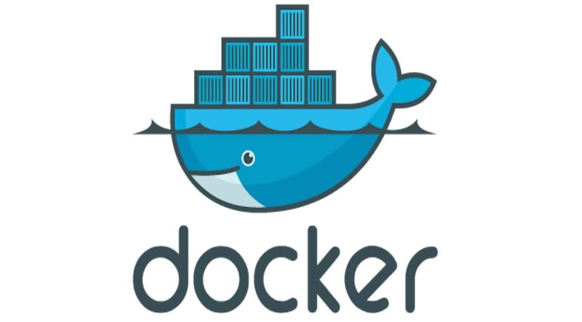

Voici une définition académique de Docker :

 Docker est une technologie de conteneurisation : un outil pour créer et gérer des conteneurs.

Mais finalement, nous ne sommes pas plus avancés !

Qu'est-ce qu'un *conteneur* ? et pourquoi aurions-nous besoin, à notre niveau, de les utiliser, puisque jusqu'à présent, nous vivions très bien sans ?

Vous étudiez le développement d'applications n'est-ce pas ?
Dans ce cas, vous connaissez au moins les bases d'un langage de développement comme le *Javascript*, le *PHP*, *Java* ou *C#*.

Donc, vous n'êtes pas sans savoir qu'une application est le produit d'un long processus d'écriture de lignes de codes, sur une machine de développement fonctionnant avec des librairies.
L'ensemble tournant dans un environnement particulier.

Par exemple, imaginons que nous développons une application de gestion pour le football. Cette application permet d'ajouter des joueurs et leur palmarès dans des équipes et de télécharger la composition de ces équipes en format PDF.

Au lieu de programmer de zéro comment convertir nos données en PDF, nous allons utiliser des morceaux de code déjà écrits par d'autres développeurs. Ces morceaux de code sont regroupés dans ce qu'on appelle une 'librairie'. En utilisant une librairie, nous gagnons du temps et nous assurons que la fonctionnalité est déjà bien testée et fonctionnelle.

Attention toutefois, notre application est développée en PHP 7.2, une version un peu ancienne. Il faudra donc choisir une librairie qui est compatible avec cette version de PHP. Si nous ne faisons pas attention à cette compatibilité, nous risquons de rencontrer des problèmes ou des 'bugs' lors de l'utilisation de notre application. C'est un peu comme s'assurer que les pièces d'un puzzle s'emboîtent bien ensemble.

Jusqu'à maintenant, nous ne voyons pas vraiment de problèmes !

Sur notre machine de développement, nous devrons seulement installer PHP 7.2 et la librairie compatible.
Idem sur le serveur de production.

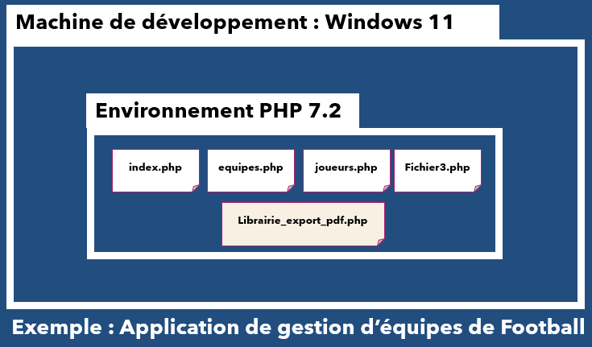

Maintenant, imaginons qu'une autre mission consistera à développer une nouvelle application sous PHP 8.2, et qui aura besoin entre autres, d'une librairie d'encryptage de mot de passe par exemple.

Sur votre machine de développement, vous utilisez surement *WampServer* qui permet en quelques clics de changer de version de PHP en cours :

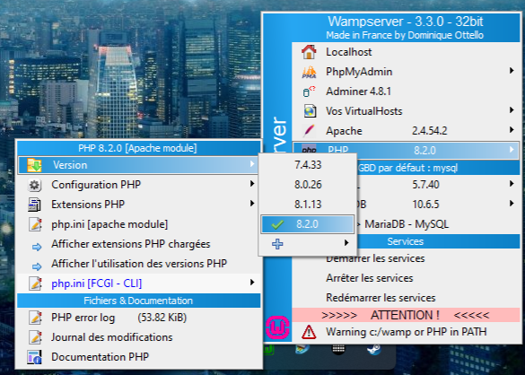

Les choses se compliqueront durant la mise en *production* :

Comment faire tourner sur votre serveur les deux applications en même temps ?

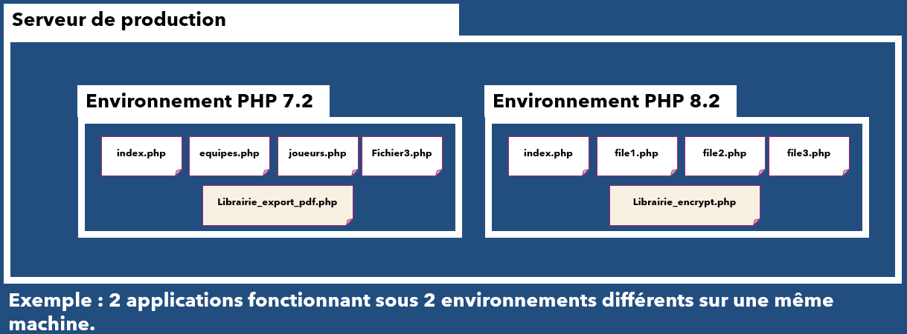

La première solution qui nous vient à l'esprit est aussi la plus coûteuse :

* Créer et maintenir 2 serveurs différents pour faire tourner nos applications.

On pourrait imaginer tout un tas de solutions, mais qui demanderaient de gros efforts de configuration rendant la maintenance des systèmes difficiles et surement instables !

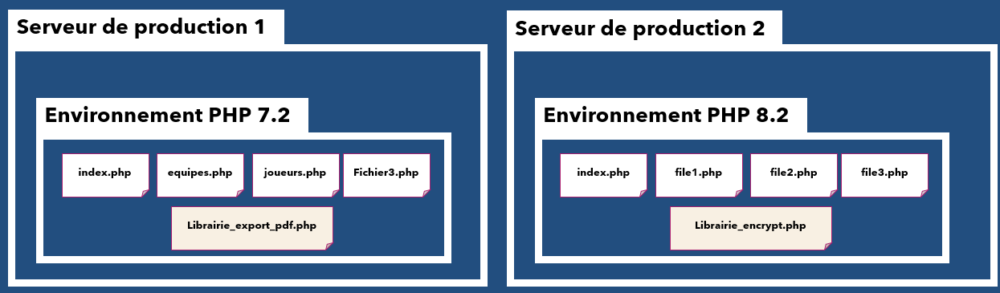

Fermez les yeux, imaginez maintenant un outil miraculeux, qui, en quelques clics, vous permettrait de créer autant d'environnement que nécessaire ! indépendants les uns des autres, isolés, mais ouverts au dialogue , c'est là que *Docker* entre en scène !

Vous ne voyez toujours pas l'intérêt ?

Partons faire un pique-nique avec notre beau panier en osier !

Dans ce panier, il y a des couverts, du pain, de la nourriture, une nappe ! tout ce qui est nécessaire pour faire un pique-nique.

Chaque fois que vous prenez ce panier, vous retrouverez à chaque fois : les mêmes couverts, la même nappe, la même vaisselle. (_Surement pas la même nourriture, surtout si le panier n'a pas servi depuis longtemps, mais vous comprenez l'idée !_ ).

Sachez alors qu'un *conteneur*, est comme ce panier, chaque fois que vous en aurez besoin, vous pourrez le prendre partout où vous le désirez, et vous aurez la certitude d'avoir exactement les mêmes outils !

De plus un *conteneur* peut se répliquer à l'infini ou presque.

Le mot *conteneur*, évoque surement dans votre esprit cette image :

image::images/7.png[width=300, align="center"]

Et vous aurez raison !

Car un conteneur est une boite, dans laquelle sont stockées des marchandises isolées du reste du monde.
Les marchandises d'un conteneur ne sont pas mélangées avec celles d'un autre conteneur.

De plus, prenons l'exemple d'une marchandise qui nécessite d'être conservée au frais. Dans ce cas, le conteneur doit être équipé d'un système de refroidissement autonome. Pour éviter que la marchandise ne se renverse durant le transport, il est aussi essentiel de prévoir des systèmes de fixation à l'intérieur du conteneur. Grâce à ces équipements, le conteneur peut être chargé sur n'importe quel navire, stocké dans n'importe quel entrepôt ou port, tout en assurant que les marchandises sont maintenues à la bonne température et bien fixées.

Les conteneurs Docker suivent cette même philosophie. À l'intérieur d'un conteneur Docker, nous pouvons intégrer tout ce qui est nécessaire pour faire fonctionner notre application :

* Un environnement spécifique pour des applications web, comme PHP entre autres.
* Des librairies dans les versions requises.
* La version spécifique de notre application.
* Tous les services essentiels, qu'il s'agisse de la gestion des e-mails, de la persistance des données, et plus encore.

Tant qu'une machine est équipée de Docker, nous pourrons y exécuter notre conteneur et utiliser notre application sans nous préoccuper des prérequis nécessaires à son fonctionnement. En effet, tout ce dont nous avons besoin se trouve déjà à l'intérieur du conteneur !

Docker n'est qu'un outil qui sert à construire des conteneurs !

[IMPORTANT]
.A retenir
====

* Un même conteneur, s'il est dupliqué contiendra la même application et le même contexte d'exécution, peu importe la machine qui l'exécute, tant qu'elle contient Docker !

* Docker est utilisable sur tous les systèmes d'exploitations modernes.

* Docker simplifie la création et la gestion des conteneurs.
====

[[pourquoi_docker_et_conteneurs]]
== Pourquoi Docker et les conteneurs ?

Dans le chapitre précédent, au travers d'illustrations telles que le panier de pique-nique et le conteneur de marchandises, nous avons illustré le concept de conteneur.

Vous avez certainement compris que cette technologie facilite la création d'environnements distincts pour l'exécution d'applications.

Toutefois, Est-ce qu'utiliser des conteneurs est aussi utile qu'important ? Quels sont les avantages de l'utilisation de conteneurs ?

Pourquoi voudrions-nous des "boites" indépendantes et standardisées pour exécuter nos applications ?

Explorons les raisons pour lesquelles un développeur pourrait choisir d'utiliser des conteneurs dans le développement et le déploiement d'applications.

Bien que nous ayons déjà pris l'exemple d'une application de gestion d'équipe de football, approfondissons la question avec un cas d'utilisation légèrement plus technique.

[[env_dev_prod_identiques]]
== Des environnements de développement et de production identiques

*Lorsque nous développons une application*, nous avons besoin d'un environnement de développement pour exécuter notre code et tester notre application. Ensuite, lorsque le moment est venu de déployer notre application, nous avons besoin d'un environnement de production pour exécuter notre application.

Dans un monde idéal, ces environnements *devraient être identiques*.
Cependant, dans la réalité, il est difficile de garantir que les environnements de développement et de production sont strictement identiques.

Par exemple, les développeurs peuvent utiliser des versions différentes de logiciels, des configurations différentes, des systèmes d'exploitation différents, etc.

Cela peut entraîner des problèmes de compatibilité et des bugs qui ne sont pas détectés avant le déploiement de l'application.

Les conteneurs peuvent nous aider à résoudre ce problème en nous permettant de créer des environnements de développement et de production identiques.

Nous pouvons créer un conteneur pour notre environnement de développement et un autre pour notre environnement de production.

Ces conteneurs peuvent être créés à partir de la même image de conteneur, ce qui garantit que les environnements sont identiques.

[[exemple_nodejs_app]]
=== Exemple : une application NodeJs

Prenons l'exemple d'une application NodeJs. Vous ne connaissez pas NodeJs ? Pas de panique !
Pour résumer, NodeJs est un environnement d'exécution JavaScript côté serveur qui permet d'exécuter du code JavaScript en dehors d'un navigateur.

Car à l'origine, JavaScript était un langage de programmation utilisé uniquement dans les navigateurs web.

Aujourd'hui, NodeJs est utilisé pour créer des applications web, des applications mobiles, des applications de bureau, des outils de ligne de commande, etc.

Pour exécuter une application NodeJs, nous avons besoin d'un environnement NodeJs.

Cet environnement est composé de NodeJs, de notre code source et de toutes les dépendances de notre application.

Pour créer un environnement de développement, nous pouvons installer NodeJs sur notre ordinateur et y placer notre code source.

Le langage de programmation JavaScript est évolue rapidement et de nouvelles versions sont publiées régulièrement. Par conséquent, NodeJs est également mis à jour régulièrement pour prendre en compte les nouvelles fonctionnalités Javascript.

Voici un exemple de code source d'une application NodeJs simple:

[%linenums,js, highlight=3]
----
include::./code/nodejs-express-axios.mjs[]
----

Il s'agit d'une application NodeJs simple qui utilise la librairie Axios pour interroger une adresse web distante, un service, qui renvoie en réponse une liste d'utilisateurs sous forme d'un tableau.
On appelle ce genre de service Web une *API* (Application Programming Interface).

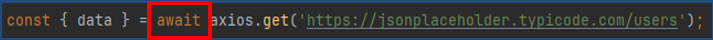

Et ce que j'ai encadré en rouge, c'est un mot clé spécifique au langage JavaScript `await`. Utilisable de la sorte, c'est-à-dire à l'extérieur d'une fonction `async` dans un module,   depuis la version *14.3* de *NodeJs*.

En d'autres mots si vous voulez exécuter ce code, il vous faudra une version de *NodeJs* supérieure ou égale à la *14.3*.

Nous pourrions avoir cette version installée sur notre machine locale, dans notre environnement de développement.
Si nous souhaitons que notre application soit déployée sur un serveur distant afin qu'elle soit accessible à tous, nous devons également installer NodeJs sur ce serveur.
Mais comment pouvons-nous nous assurer que la version de NodeJs installée sur notre serveur est la même que celle installée sur notre machine locale ( version >= 14.3) ?

Si le serveur distant utilise une version plus ancienne de NodeJs, notre application ne fonctionnera pas tout simplement pas !

Nous aurons le message d'erreur suivant :

----
(node:3936) ExperimentalWarning: The ESM module loader is experimental.
file://app.mjs:4
  await axios.get('https://jsonplaceholder.typicode.com/users')
^^^^^

SyntaxError: await is only valid in async function

----

Nous ne pourrons jamais avoir la certitude absolue que les environnements de développement et de production sont identiques.

JAMAIS ! C'est impossible.

Un *environnement de développement* est toujours différent d'un environnement de production.
L'environnement est constitué de plusieurs composants, tels que le système d'exploitation, les versions des logiciels, les configurations, etc.

Cependant, nous pouvons essayer de rendre ces environnements aussi similaires que possible.

Et c'est là que les conteneurs entrent en jeu.

Nous pouvons créer un conteneur pour notre environnement de développement et un autre pour notre environnement de production.

*Ces conteneurs peuvent être créés à partir de la même image de conteneur, ce qui garantit que les environnements sont identiques.*

[[poenvironnements_identiques]]

== Des environnements identiques

De la même manière que nous voulons que nos environnements de développement et de production soient identiques, nous voulons également que les environnements de développement de notre équipe ou de notre organisation soient identiques.

Cela permet de s'assurer que tous les développeurs travaillent dans le même environnement sur le même code source.

Cela permet également de s'assurer que les problèmes de compatibilité et les bugs sont détectés le plus tôt possible.

Si l'on reprend l'exemple de notre application NodeJs précédente. Imaginez que vous n'avez pas utilisé NodeJs depuis très longtemps et que vous avez une version 10 sur votre machine locale.
Vous ne pourrez pas modifier le code source de l'application et l'exécuter sur votre machine sans quelques difficultés.

Encore une fois, vous vous dites que cela n'est pas un problème, vous pouvez mettre à jour NodeJs facilement. Et vous avez raison. Mais cela n'est qu'un exemple pédagogique, la réalité est bien plus complexe.
Et ce n'est pas une ou deux librairies dont vous aurez à gérer les versions, mais des dizaines, voir des centaines.

Et si vous travaillez en équipe, vous voulez que chaque membre de l'équipe utilise la même version de NodeJs, la même version des librairies, la même version des outils de développement, etc. Mais, vous ne pouvez pas vous permettre de perdre du temps à mettre à jour les versions des librairies de chacun des membres de l'équipe.

Et c'est là que les conteneurs entrent en jeu ...

[[envionnements_conflictuels]]
== Des environnements conflictuels entre différents projets

Lorsque nous travaillons sur plusieurs projets, nous pouvons avoir des environnements conflictuels entre eux.

Par exemple, nous pouvons avoir un projet qui utilise une version spécifique d'une librairie, tandis qu'un autre projet utilise une version différente de la même librairie.

Parfois même certaines versions récentes de librairies ne sont pas compatibles avec d'autres entrainant des erreurs qui pourraient être difficiles à traiter.

Entre deux projets, il faudra alors reparamétrer les versions des librairies, des outils de développement, etc.

Cela peut être très chronophage, source d'erreurs et absolument pas passionnant.

Et c'est là que les conteneurs entrent en jeu ...

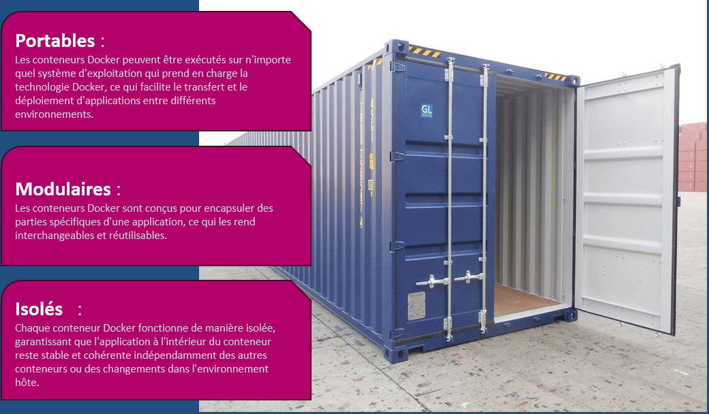

Avec Docker, nous pouvons créer un conteneur pour chaque projet. Nous n'avons plus besoin d'installer les librairies, les outils de développement, etc. sur notre machine locale à chaque fois que nous travaillons sur un nouveau projet, car tout est déjà installé dans le conteneur et pas sur notre machine locale.

Changer de projet devient aussi simple que de changer de conteneur.

Durant la suite de ce cours, vous allez apprendre tout ce qu'il y a de nécessaire pour créer vos propres conteneurs et résoudre les problèmes que nous venons d'évoquer.

Vous êtes maintenant déterminé à apprendre Docker ? Alors, allons-y !

[[vm_vs_conteneurs]]
== Machines Virtuelles vs Conteneurs Docker

Nous savons maintenant ce que sont Docker et les conteneurs et pourquoi les utiliser.

Les problèmes résolus par *Docker* et les *conteneurs* ont du sens et nous les avons vus précédemment.

*Nous comprenons alors facilement pourquoi Docker est si populaire !!*

Mais si vous avez aussi compris les principes de la virtualisation, vous n'êtes pas sans savoir que nous pouvons installer tous les environnements dont nous avons besoin sur une machine virtuelle et les utiliser comme nous le souhaitons :

* Nous pouvons installer un système d’exploitation sur une machine virtuelle et l’utiliser comme un ordinateur normal.
* Nous avons des terminaux indépendants de la machine hôte et exécuter les commandes que nous voulons pour installer ou configurer des logiciels.

Nous pouvons même créer des machines virtuelles à la volée et les détruire quand nous n’en avons plus besoin.

Dans ce cas, vous vous demandez peut-être pourquoi utiliser Docker alors que nous avons déjà des machines virtuelles qui peuvent faire la même chose.

C’est une question légitime et nous allons y répondre dans cette section.

[[ordinateur_dans_ordinateur]]
== Un ordinateur dans l'ordinateur

Pour virtualiser un système d’exploitation, nous avons besoin d’un logiciel nommé l'*hyperviseur* qui va créer une *machine virtuelle* et émuler le matériel pour que le système d’exploitation puisse s’exécuter.

Autrement dit : nous créons un ordinateur dans l’ordinateur.

Il existe plusieurs hyperviseurs, mais les plus connus sont *VirtualBox*,*VMWare* ou *HyperV*.
Ce logiciel s'installe sur une première machine physique que l'on appelle *la machine hôte*, car c'est lui l'hôte, celui qui accueille *les machines virtuelles*.

**La machine hôte **possède son propre système d'exploitation et ses propres ressources matérielles (mémoire, processeur, disque dur…) Elle va donc partager ses ressources avec les *machines virtuelles* qu'elle va créer.

Donnant ainsi *aux machines virtuelles* une *totale indépendances*.
Elles possèdent leur propre système d'exploitation et leurs propres ressources matérielles. Elles peuvent donc être utilisées comme un ordinateur normal.

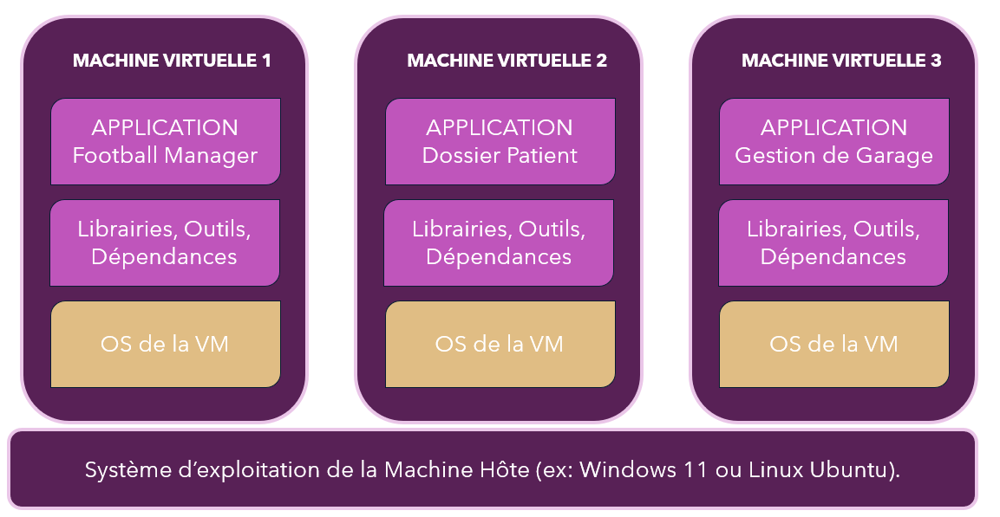

Comme le représente le schéma ci-dessus, vous voyons que les machines virtuelles sont complètement autonomes les unes des autres, isolées dans leur propre coquille bien qu'elles soient toutes sur la même machine hôte.

[[vm_lourdes]]
== Les machines virtuelles sont lourdes.

Les avantages que nous avons étudiés précédemment sur *Docker*, sont aussi valables pour les machines virtuelles.

* Mais alors pourquoi ne pas utiliser les machines virtuelles et devoir apprendre une nouvelle technologie ?

Pour répondre à la question, je vous propose le petit exercice de calcul suivant : calculons les ressources systèmes restant sur une machine hôte après la réaction d'une VM et menons une réflexion.

[[calcul_ressources]]
=== Calcul des ressources restantes

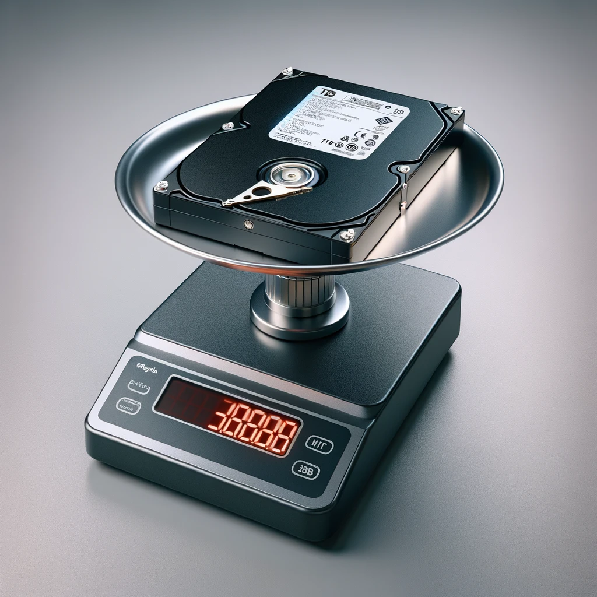

Voici les caractéristiques d'une machine hôte et d'une machine virtuelle installée :

[WARNING]
.Rappels
====
* Les ressources d'une machine virtuelle sont définies lors de son installation.
* Les ressources attribuées à une machine virtuelle ne peuvent plus être attribuées à une autre machine virtuelle ou à la machine hôte.

Retenez bien que : si vous allouez 1To de disque dur à une machine virtuelle, alors 1To de disque dur ne pourra plus être utilisé par une autre machine virtuelle ou par la machine hôte, et cela, *même si la machine virtuelle n'utilise pas tout le disque dur alloué*.

====

|===
|Machine | RAM | CPU | Disque dur

|Machine hôte | 8 Go | 4 cœurs | 1 To

|Machine virtuelle | 2 Go | 2 cœurs | 20 Go

|===

==== Calcul des ressources restantes

*Question 1 : Combien reste-t-il de ressources sur la machine hôte ?*

Lors de la création d'une VM, les ressources allouées à la VM sont déduites des ressources de la machine hôte.

Pour calculer les ressources restantes, il faut soustraire les ressources de la VM aux ressources de la machine hôte.

* RAM : 8 Go - 2 Go = 6 Go
* CPU : 4 coeurs - 2 coeurs = 2 coeurs
* Disque dur : 1 To - 20 Go = 980 Go

*Question 2 : Combien de machines virtuelles de ce type peut-on installer sur la machine hôte ?*

Pour répondre à cette question, il suffit de diviser les ressources restantes par les ressources de la VM.

*Question 3 : Puis-je installer une troisième machine virtuelle de ce type sur la machine hôte, et ne la démarrer que si les deux autres machines virtuelles sont arrêtées ?*

Non, car les ressources allouées à une machine virtuelle ne peuvent pas être utilisées par une autre machine virtuelle ou par la machine hôte.

Nous sommes donc limités à deux machines virtuelles de ce type sur la machine hôte.

==== Réflexion

Voici quelques remarques qui vont nourrir notre réflexion :

* Sur 2 VMs, nous sommes obligés d'installer deux systèmes d'exploitation.

Par exemple : si ma machine hôte est sous Windows et que je veux installer une VM sous Windows, alors je dois installer intégralement Windows sur la nouvelle VM.
De même, si je veux installer une VM sous Linux, je dois installer intégralement Linux sur la VM.

Cela prend beaucoup de place sur le disque dur de la machine hôte et beaucoup de ressources systèmes pour installer au final 2, 3 ou 4 fois les fichiers systèmes de Windows ou de Linux.

Plus il y a de VMs, plus la machine est ralentie, car ses ressources sont consommées.

==== Conclusion

Les machines virtuelles sont lourdes ! Mais toujours utiles et indispensables dans certains cas.

Vous ne pourrez jamais mettre par exemple Windows Server 2022 dans un conteneur, mais vous pourrez le faire sur une VM par exemple.

Voici un tableau illustrant les points positifs :

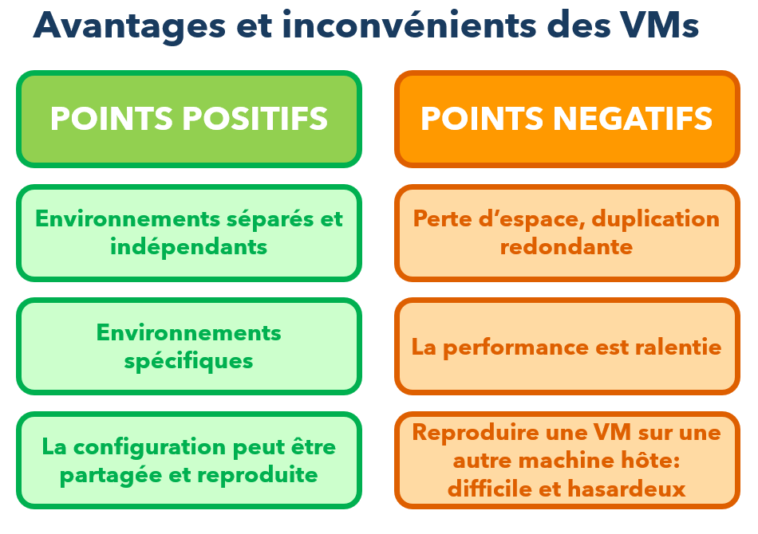

Notez le point négatif suivant :

"Reproduire une VM sur une autre machine hôte est parfois difficile et hasardeux".

Cela est dû au fait que les VMS installent des pilotes spécifiques à la configuration de la machine hôte.

* La carte réseau de la VM dépendra de la carte réseau de la machine hôte.
* La carte graphique de la VM dépendra de la carte graphique de la machine hôte.
* Le gestionnaire des processus qui tourne sur votre machine virtuelle dépendra de son OS bien entendu, mais aussi du processeur de la machine hôte.

Si vous changez de machine hôte, vous devrez réinstaller les pilotes de la VM pour qu'elle fonctionne correctement.

Cela peut être très chronophage et source d'erreurs.

Alors, toujours partant de créer une VM pour seulement avoir un environnement de développement en PYTHON ?

Je crois que vous avez compris l'idée !

Nous allons donc appelez sur le ring le prochain challenger : Docker !

[[conteneurs_legers]]
== Les conteneurs sont légers.

Sur une machine hôte sur laquelle nous voulons installer des conteneurs, il nous faudra toujours un système d'exploitation : Windows, Linux ou MacOs.

Mais nous n'installerons pas un ensemble de "machines dans la machine" via un hyperviseur.

À la place, nous allons avoir besoin d'un support de conteneur intégré (ou _**built-in container support**_ en anglais) au système d'exploitation de la machine hôte ou une émulation de ce support.

Et c'est là que Docker entre en jeu !
Lors de son installation, Docker fournit un tout *petit* *outil* et *lèger* nommé : "*Docker Engine*".

Cet outil va nous permettre de créer des conteneurs et de les exécuter sur notre machine hôte !!

Voyons un schéma qui illustre la place des conteneurs dans l'architecture de votre ordinateur :

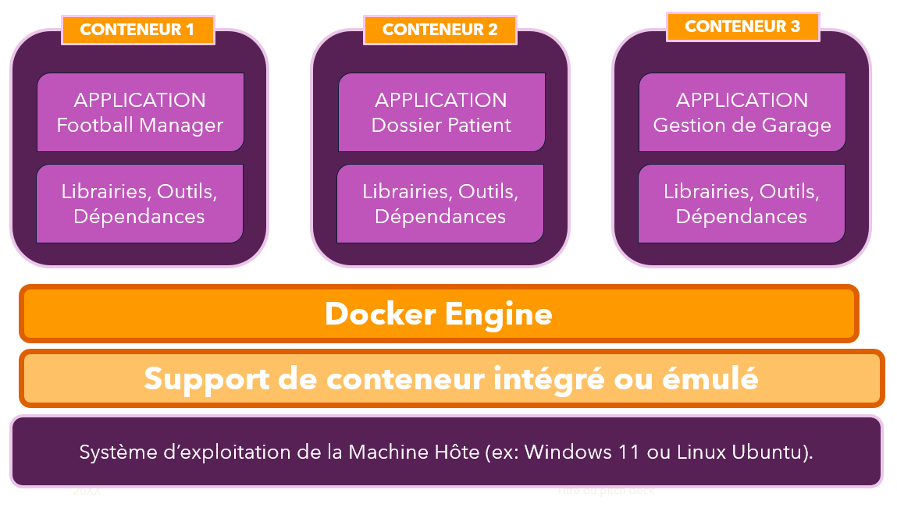

Et regardez les conteneurs :

*Ils sont beaucoup moins lourd que les VMs car il n'y a pas de système d'exploitation.*

Nos applications seront donc plus rapides à démarrer et à exécuter.
Sur le conteneur 1, il y a seulement notre application de Football ainsi que les librairies nécessaires à son exécution. Rien de plus !!

Vraiment? bon ... j'ai menti ... il y a bien un système d'exploitation dans le conteneur, mais vraiment très léger !!

La machine hôte va seulement partager *son noyau* avec les conteneurs MAIS pas l'intégralité de son système d'exploitation.
C'est pour cela que le conteneur doit embarquer des petits bouts de système d'exploitation qui lui sont nécessaires pour fonctionner et rien de plus.

J'imagine que vous avez bloqué sur le mot "*noyau*" ?

Le noyau est un terme que l'on rencontre souvent en informatique, son nom est "kernel" en anglais. C'est le cœur du système d'exploitation.
C'est la partie qui permet au monde matériel de votre machine : carte graphique, carte réseau, processeur, mémoire, disque dur, etc. de communiquer avec le monde logiciel : les applications, les librairies, les services, etc.

Le noyau est donc la partie la plus importante du système d'exploitation.

A contrario des VMs, les conteneurs n'ont donc pas à se soucier de la compatibilité avec le matériel de la machine hôte, car ils partagent le même noyau.

Ainsi, les conteneurs peuvent se partager d'une machine à une autre, et sont beaucoup plus légers et rapide à mettre en place !

Un autre point non négligeable : La gestion des ressources systèmes est beaucoup plus fine avec les conteneurs qu'avec les VMs.

Un conteneur ne consomme que ce qu'il a besoin, et pas plus !
Si pendant 10 min, il a besoin de 4 Giga de Ram ... il va les prendre, mais les rendra aussitôt après !

L'usage de l'espace disque est dynamique : il augmente ou diminue en fonction des besoins du conteneur.

Même principe avec les cœurs du processeur.

Que dire de plus ....

Fin du match !

*Docker* a gagné sur le Ring : "Déploiement d'environnement spécifique pour vos applications" .... mais n'enterrez pas les VMs trop vite, elles ont encore de beaux jours devant elles !

