:_chapter:

[[Installation]]
= Installation de Docker
:_author: Bauer Baptiste
:_version_number: 1.0.0
:_version_date: 17/11/2024
include::../../../run_app.adoc[]

== Vue d'ensemble

Nous avons maintenant une bonne idée de ce que sont Docker et les Conteneurs. Nous allons maintenant passer à l'installation de Docker sur notre machine.

Les étapes d'installation de Docker dépendent du système d'exploitation que vous utilisez.

Allez sur le site officiel de Docker pour télécharger la version de Docker qui correspond à votre système d'exploitation.

* En cliquant sur le lien suivant :
http://www.docker.com[]

Puis cliquez sur le menu "_Developpers_" et sélectionnez "_Documentation_".

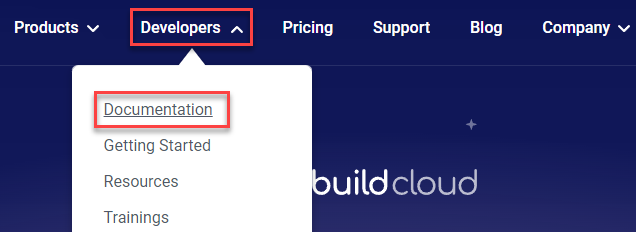

Ensuite, cliquez sur "Get Docker" :

Et sur la page, vous trouverez les instructions pour installer Docker sur votre système d'exploitation.

Comme ici, nous voyons le lien pour installer Docker sur Windows :

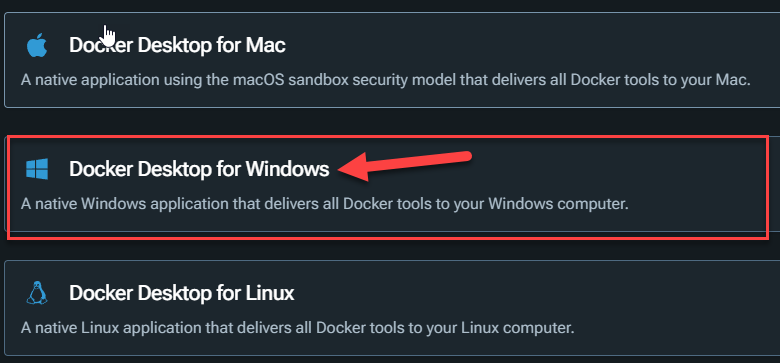

Sur la page, vous trouverez les prérequis pour installer Docker sur Windows, Mac ou Linux.

Sur votre Système d'exploitation Windows ou Mac, vous pouvez installer *Docker Desktop* ou *Docker Toolbox*.

*Docker Desktop* et *Docker Toolbox* sont des outils qui donnent vie à Docker sur les systèmes d'exploitation Windows et Mac.

Si vous avez une machine sous Linux, vous pouvez installer `Docker Engine` directement sans avoir besoin de `Docker Desktop` ou `Docker Toolbox`.
Car les *OS Linux* prennent en charge nativement les conteneurs et la technologie que Docker utilise.

== Installation de Docker sur Windows

=== Le nouveau Terminal pour Windows

Durant tout ce cours, nous allons utiliser de nombreuses lignes de commande. Pour cela, nous vous recommandons d'utiliser le nouveau terminal de Windows. Qui est un outil très puissant, personnalisable, qui supporte les onglets, les thèmes, les raccourcis clavier, et bien plus encore.

Pour installer le nouveau terminal de Windows, vous pouvez le télécharger depuis le *Microsoft Store*.

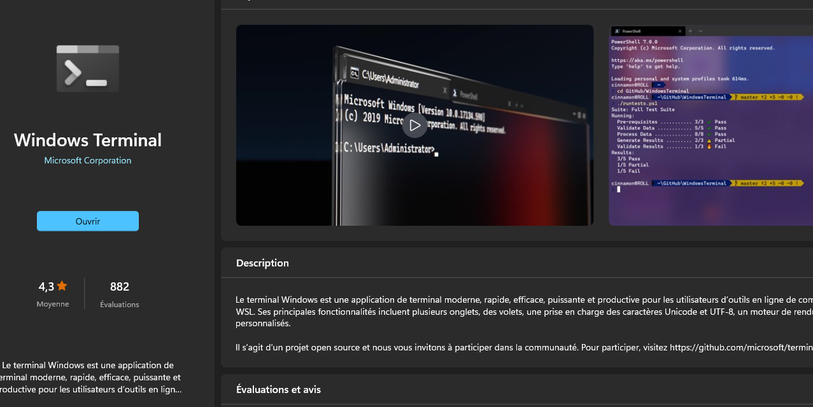

Une fois installé, vous pouvez l'ouvrir en tapant `Windows Terminal` dans la barre de recherche de Windows.

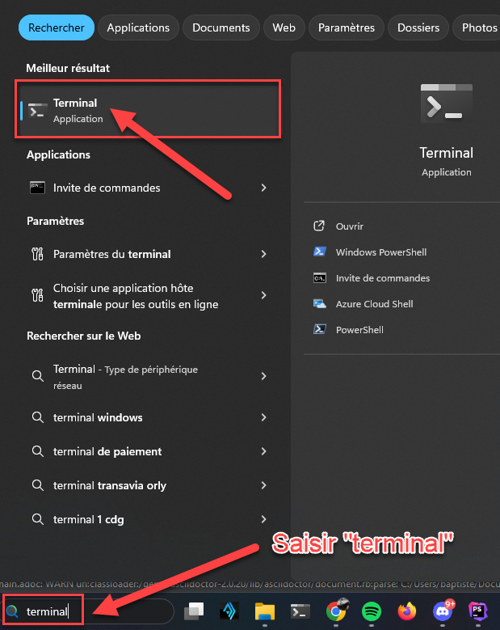

Vous aurez alors accès à un nouveau terminal moderne personnalisable comme le mien :

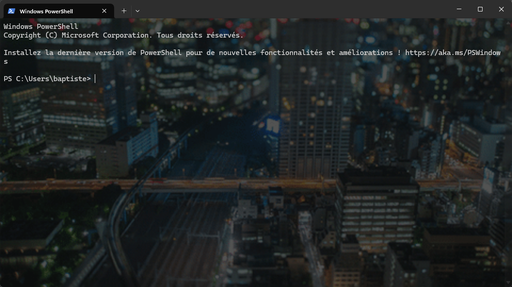

=== Téléchargement

https://docs.docker.com/desktop/install/windows-install/[Téléchargez Docker Desktop pour Windows]

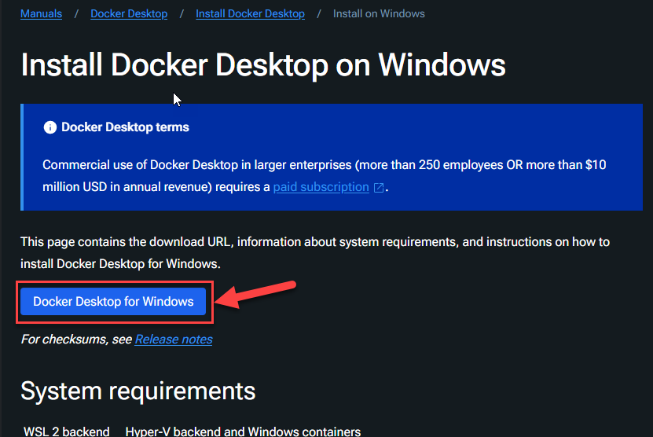

[IMPORTANT]
====
Lisez la suite de ce document avant d'installer `Docker Desktop`.
====

=== Virtualisation d'un noyau Linux

Comme nous l'avons vu, Docker utilise un noyau Linux pour fonctionner.
Dans le cas de Windows, Docker Desktop utilise une machine virtuelle pour exécuter un noyau Linux.
Il existe deux options pour exécuter Docker Desktop sur Windows :

* *WSL 2* (Windows Subsystem for Linux) : C'est une fonctionnalité de Windows 10 qui permet d'exécuter un noyau Linux sur Windows.
* *Hyper-V* : C'est une technologie de virtualisation de Windows.

[NOTE]
====
*Dois-je utiliser WSL 2 ou Hyper-V ?*

*Docker Desktop* utilise `WSL 2` par défaut. Si vous avez déjà installé `WSL 2`, *Docker Desktop* l'utilisera.
Toutefois, il est possible de basculer entre `WSL 2` et `Hyper-V`. Il n'y a pas de différences majeures entre les deux.

`WSL 2` est recommandé, car il est plus rapide et plus léger qu'`Hyper-V`.
Mais les deux possèdent des avantages et des inconvénients.

Par exemple, les conteneurs et les images créés avec *Docker Desktop* sont partagés entre tous les utilisateurs de la machine où *Docker Desktop* est installé.
Cela est possible, parce que tous les comptes utilisateurs de la machine ont accès à la même machine virtuelle de *Docker Desktop*.
Cependant, notez qu'il n'est pas possible de partager des *conteneurs* et des *images* entre plusieurs comptes utilisateurs quand vous utilisez *Docker Desktop* avec`` WSL 2``.
====

==== Avec WSL

===== Prérequis : version du système d'exploitation

Il faut une machine avec :

* *Windows 11 64-bit*: *Home* ou *Pro* version 21H2 or higher, or Enterprise or Education version 21H2 or higher.
* *Windows 10 64-bit*:
** Il est recommandé *Home* or *Pro 22H2 (build 19045)* or *higher*, or *Enterprise* or *Education 22H2 (build 19045)* or *higher*.

Si votre version de *Windows* n'est pas compatible, vous pouvez utiliser `Docker Toolbox`.

Pour vérifier la version de votre système d'exploitation, tapez `winver` dans la barre de recherche de Windows.

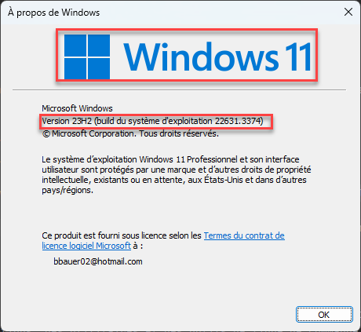

===== Prérequis : Configuration matérielle

Il faut que votre machine ait :

* Un processeur 64-bit avec prise en charge de la technologie SLAT (Second Level Address Translation).
* Au moins 4 Go de RAM.
* La virtualisation activée dans le BIOS/UEFI.

===== Prérequis : Activer WSL

*WSL* est une fonctionnalité de Windows qui permet de d'installer une distribution Linux sur Windows et d'utiliser des applications, des utilitaires et des outils de ligne de commande Bash directement sous Windows, sans modification et sans le surcoût d'une machine virtuelle traditionnelle ou d'une configuration en double démarrage.

Vérifiez si `wsl` est installé en tapant la commande suivante :

[source,shell]
----
wsl --version
----

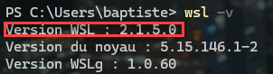

* Il faut que WSL soit à la version 1.1.3.0 ou supérieure pour pouvoir utiliser Docker Desktop.

[WARNING]
====
Si vous obtenez une erreur, cela signifie que `WSL` n'est pas installé sur votre machine.
====

===== Mise à jour de WSL
Si WSL est déjà installé, vous pouvez le mettre à jour en tapant la commande suivante :

[source,shell]
----
wsl --update
----

===== Installation

Vous pouvez désormais installer tout le nécessaire pour exécuter `WSL` avec une seule commande. Ouvrez `PowerShell` ou l'`invite de commande Windows` en mode *administrateur*.

Ou bien, utilisez le nouveau terminal de Windows.

Pour cela, faites un clic droit sur l'application "*Terminal*" et sélectionnez "*Exécuter en tant qu'administrateur*". Ensuite, tapez la commande wsl --install et redémarrez votre machine.
Par défaut, le nouveau terminal de Windows lance un *PowerShell*.

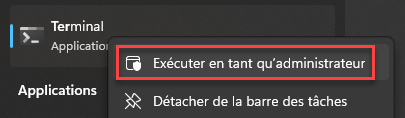

Saisissez la commande suivante :

[source,shell]
----
wsl --install
----

Cette commande va installer les outils nécessaires pour lancer `WSL` sur votre machine ainsi qu'une distribution '*Ubuntu*' par défaut.

Vous pouvez changer de distribution en utilisant la commande suivante :

[source,shell]
----
wsl --install -d <distribution>
----

En remplaçant `<distribution>` par le nom de la distribution que vous souhaitez installer.

Pour plus d'informations, vous pouvez consulter la documentation officielle de Microsoft sur WSL :

===== Vérification de la version de WSL

Sur Windows nous avons deux versions de `WSL` : WSL 1 et WSL 2.
DOCKER Desktop a besoin de `WSL 2`.

Pour vérifier la version de `WSL` utilisée par votre machine, tapez la commande suivante :

[source,shell]
----
wsl -l -v
----
Vous obtiendrez une liste des distributions installées sur votre machine avec leur version.

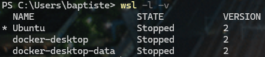

Tapez la commande suivante pour définir `WSL 2` comme version par défaut de `WSL` :

[source,shell]
----
wsl --set-default-version 2
----

Il faut également vérifier que Docker Desktop est configuré pour utiliser `WSL 2` comme backend.

Ouvrez Docker Desktop et allez dans les paramètres en cliquant sur le petit engrenage en haut à droite de la fenêtre.

Dans l'onglet "*General*", assurez-vous que "*Use the WSL 2 based engine*" est coché.

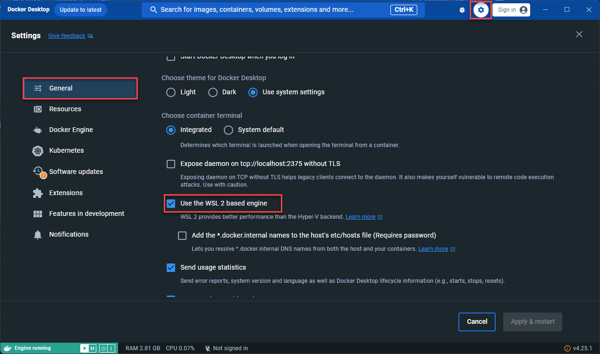

[NOTE]
====
Votre machine est maintenant prête à utiliser Docker Desktop !
====

==== Avec Hyper-V

=== Installation de Docker Desktop

Après s'être assuré d'avoir tous les prérequis nécessaires, vous pouvez installer `Docker Desktop` en double-cliquant sur le fichier d'installation pour lancer l'installation.

