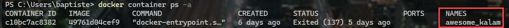
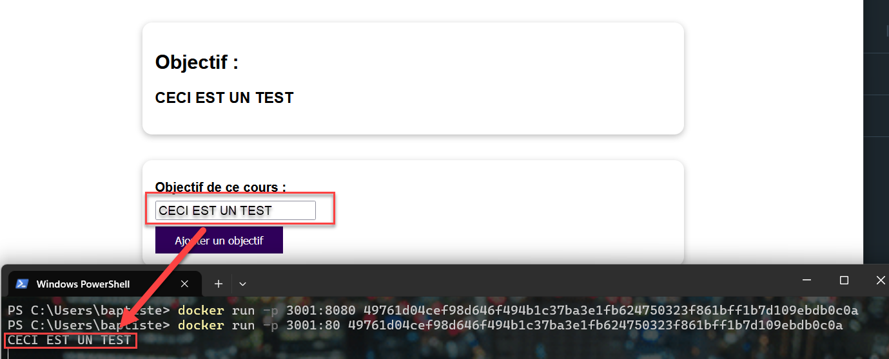
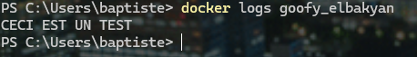

:_chapter:
[[core_concepts]]
= Gestion des images et des conteneurs
:_author: Bauer Baptiste
:_version_number: 1.0.0
:_version_date: 17/11/2024
include::../../../run_app.adoc[]

Jusqu'à présent, nous avons vu comment créer une image et comment exécuter/arrêter un conteneur. Mais il y a beaucoup plus à faire, alors nous allons prendre un peu de temps pour comprendre comment configurer et gérer nos images et nos conteneurs.

Vous pouvez avoir un aperçu ce qui est possible de faire en saisissant l'option de commande --help. Par exemple, pour obtenir de l'aide sur la commande `docker image`, vous pouvez saisir :

```
$ docker image --help
```

Pour obtenir de l'aide sur la commande `docker container`, vous pouvez saisir :

```
$ docker container --help
```


À notre niveau nous n'aurons pas besoin de toutes les options disponibles, mais il est bon de savoir qu'elles existent.

== Lister les conteneurs

Afficher les conteneurs en cours d'exécution, vous pouvez saisir :

```
docker container ps
docker ps
```

Afficher tous les conteneurs, y compris ceux qui ne sont pas en cours d'exécution, vous pouvez saisir :

```
docker container ps -a
```

Il existe des filtres et des options de formatage du résultat obtenu.
Regardez la liste des options disponibles pour la commande `docker container ps` :


```
docker container ps --help
```

|===
| Option             | Description

| -a, --all          | Montre tous les conteneurs (même ceux qui ne sont pas en cours d'exécution)

| -f, --filter       | Filtre le résultat de la commande en fonction des conditions fournies

| --format string    | Formater la sortie en utilisant un modèle.
| 'table':  Forme de tableau (default)
| 'table TEMPLATE': Imprimer la sortie au format tableau en utilisant le modèle Go spécifié.
| 'json': Format JSON
| 'TEMPLATE': Imprimer la sortie au format tableau en utilisant le modèle Go spécifié.. voir https://docs.docker.com/go/formatting/ pour plus d'informations sur les templates Go.

| -n, --last int     | Afficher les n derniers conteneurs créés (incluant tous les états) (par défaut, -1)

| -l, --latest       | Afficher le dernier conteneur créé (incluant tous les états)

| --no-trunc         | Ne pas tronquer la sortie

| -q, --quiet        | Afficher uniquement les IDs des conteneurs

| -s, --size         | Afficher les tailles totales des fichiers
|===


== Démarrer, arrêter et redémarrer un conteneur

Pour manipuler un conteneur, il faut connaitre soit son nom, soit son ID.
Afin de récupérer le nom du conteneur à démarrer par exemple, vous pouvez saisir :

```
docker container ps -a
```


Nous y voyons le nom du conteneur, son ID, l'image utilisée, la commande qui a été exécutée pour le démarrer, l'état du conteneur, les ports mappés, le nom du conteneur et la date de création.

Puis *démarrer* le conteneur à partir de son nom :

```
docker container start <nom du conteneur>
```

La commande `start` démarre un conteneur, mais ne le crée pas. Si le conteneur n'existe pas, vous devez le créer en utilisant la commande `run`.
De plus, la configuration du conteneur ne peut pas être modifiée avec la commande `start`. Le conteneur est démarré avec la configuration existante.


Voici une liste de commandes pour :

* *Arrêter* un conteneur

```
docker container stop <nom du conteneur>
```

* *Redémarrer* un conteneur

```
docker container restart <nom du conteneur>
```

==  Comprendre le mode détaché et le mode attaché

Lorsque vous exécutez un conteneur, vous pouvez le faire en mode *attaché* ou en mode *détaché*.
Il est important de comprendre la différence entre ces deux modes.
Pour cela, recréons un conteneur basé sur l'image de notre application *NodeJs*, mappé sur un port différent de celui que nous avons utilisé précédemment :

```
docker run -p 3001:80 <ID DE L'IMAGE>
```

Que constatez-vous ?
Le terminal est bloqué, vous ne pouvez pas saisir de nouvelles commandes. C'est parce que le conteneur est en mode *attaché*.

Le mode *attaché* est le mode par défaut. Il permet de voir les informations retournées par le conteneur s'il y en a.

Dans notre application *NodeJs*, nous avons mis une ligne de script qui affiche un message dans la console. C'est pourquoi vous devriez voir ce message dans le terminal.

Voici le script JS :

[source,javascript]
.Fichier : server.js
----
app.post('/store-goal', (req, res) => {
  const enteredGoal = req.body.goal;
  console.log(enteredGoal);
  userGoal = enteredGoal;
  res.redirect('/');
});
----

L'instruction `console.log(enteredGoal);` affiche le message saisi dans le terminal. Testons cela !

Ouvrez un navigateur et rendez-vous sur `http://localhost:3001`.
Remplissez le champ de texte et cliquez sur le bouton `Ajouter un objectif`.



Retournez dans le terminal où le conteneur est en cours d'exécution. Vous devriez voir le message que vous avez saisi dans le champ de texte.

Si nous voulons exécuter un conteneur en mode *détaché*, nous devons ajouter l'option `-d` ou `--detach` à la commande `run`.

```
docker run -d -p 3001:80 <ID DE L'IMAGE>
```

Nous constatons que le conteneur s'exécute en arrière-plan et que nous pouvons saisir de nouvelles commandes dans le terminal.

[TIP]
====
Vous pouvez vous attacher à un conteneur détaché en utilisant la commande `docker attach <nom du conteneur>`.
====


Il est possible de voir les logs d'un conteneur en utilisant la commande `docker logs <nom du conteneur>`.

```
docker logs <nom du conteneur>
```



Et si vous ne souhaitez pas être en mode attaché mais que vous souhaitez suivre les logs en temps réel, vous pouvez utiliser l'option `-f` ou `--follow`.

```
docker logs -f <nom du conteneur>
```


[IMPORTANT]
====
Peu importe le mode dans lequel vous exécutez un *conteneur*, il est toujours *opérationnel*.
Mais si vous avez besoin *d'informations à l'intérieur du conteneur*, vous pouvez utiliser les journaux/logs ou vous attacher à lui.

====

== Le mode intéractif

Docker ne se limite pas à la conteneurisation de services web comme nous l'avons vu jusqu'à présent. Vous pouvez également utiliser Docker pour exécuter des applications interactives.

Nous allons illustrer cela en utilisant une application *Python* simple construite pour la version 3 et qui ne crée aucun serveur Web.

Voici le script Python :

[source,python]
.Fichier : code/rng.py
----
include::code/rng.py[]
----

Cette application récupérera un nombre minimum et un nombre maximum de l'utilisateur, puis générera un nombre aléatoire entre ces deux nombres qui sera affiché dans le terminal.

Nous pouvons installer Python sur notre système et exécuter ce script, mais nous allons plutôt utiliser Docker pour le faire.

Cela va mettre en évidence que Docker n'est pas utilisable uniquement pour des applications NodeJs ou des applications Web.

Et nous allons directement voir l'utilité des modes attachés et détachés.

Dans cette application Python, l'utilisateur doit réellement intéragir avec l'application. Lancer le conteneur en arrière-plan n'aurait pas de sens.


== Supprimer des images et des conteneurs

== Supprimer automatiquement des conteneurs arrêtés

== Inspecter des images

== Copier des fichiers vers/depuis un conteneur

== Nommer & Tagger des images et des conteneurs

== Partager des images

== Pusher des images vers un registre


