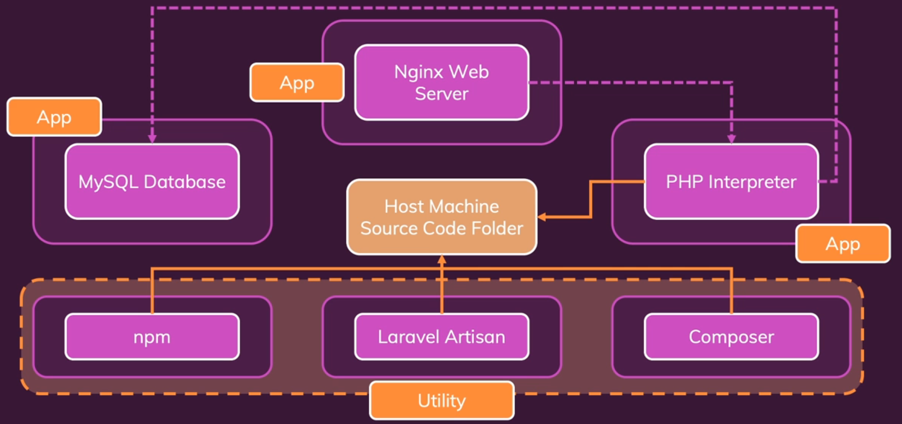

= TP : Mise en place d'un projet Laravel avec Docker

== Objectif

Configurer un environnement de développement *Laravel PHP* complet en utilisant *Docker* et *Docker Compose*, sans installer PHP ni MySQL localement.

== Prérequis

* Cours Docker et Docker Compose de la session précédente
 * Revoir le Concept de ENTRYPOINT et CMD dans Docker pour créer les conteneurs utilitaires

* Il n'est pas nécessaire de connaitre le framework Laravel
* Documentation en ligne de Laravel

== Étape 1 : Configuration initiale du projet

Créez un répertoire de travail vide pour le projet.

Ajoutez un fichier `docker-compose.yaml` pour définir plusieurs services Docker nécessaires au projet Laravel :

Il y aura 6 services dans le fichier `docker-compose.yaml` :

* Un serveur web Nginx,
* Un interpréteur PHP
* Une base de données MySQL.
* Composer
* npm
* Artisan

*Artisan* est un outil en ligne de commande fourni avec Laravel pour effectuer des tâches telles que la génération de code, la migration de base de données, etc.

Configurez les conteneurs utilitaires nécessaires pour Laravel, comme `Composer` et `npm`, afin de pouvoir installer les dépendances du projet.

Créez un fichier *Dockerfile* pour personnaliser l'image PHP avec les extensions requises pour Laravel, telles que `pdo` et `pdo_mysql`.

== Étape 2 : Mise en place du serveur web Nginx

1. Ajoutez un service Nginx dans le fichier `docker-compose.yaml`, basé sur l'image officielle Nginx.
2. Montez un fichier de configuration Nginx personnalisé pour gérer les requêtes PHP avec FastCGI, et configurez-le pour rediriger vers l’interpréteur PHP.
3. Configurez le montage des volumes pour lier votre code source local au répertoire web dans le conteneur Nginx.

== Étape 3 : Configuration du conteneur PHP

1. Définissez un service PHP dans le fichier `docker-compose.yaml`, en utilisant l'image PHP FPM (FastCGI Process Manager).
2. Montez le répertoire de code source pour qu’il soit accessible au conteneur PHP.
3. Configurez les ports pour permettre à Nginx de communiquer avec PHP à travers Docker.

== Étape 4 : Configuration de la base de données MySQL

1. Ajoutez un service MySQL dans le fichier `docker-compose.yaml`, en utilisant l'image officielle MySQL.
2. Créez un fichier `.env` pour stocker les variables d'environnement nécessaires à la configuration de MySQL (nom de la base de données, utilisateur, mot de passe, etc.).
3. Montez le fichier `.env` dans le conteneur MySQL pour qu'il prenne en compte les variables d'environnement.

== Étape 5 : Installation de Laravel avec Composer

1. Configurez un conteneur utilitaire **Composer** dans `docker-compose.yaml` pour installer et gérer les dépendances Laravel.
2. Utilisez ce conteneur pour exécuter la commande `composer create-project` et générer le projet Laravel dans le répertoire source du projet.
3. Assurez-vous que le montage du volume reflète les modifications faites par Composer dans le répertoire source.

== Étape 6 : Configuration de l'environnement Laravel

1. Ouvrez le fichier `.env` généré par Laravel et configurez les paramètres de connexion à la base de données (nom de la base, utilisateur, mot de passe, etc.).

2. Mettez à jour l'hôte de la base de données pour qu'il corresponde au nom du service MySQL défini dans Docker Compose.

== Étape 7 : Lancement des conteneurs

1. Démarrez uniquement les services nécessaires (Nginx, PHP, MySQL) avec Docker Compose.
2. Vérifiez si le projet Laravel est accessible via le navigateur en visitant `localhost:8000`.

== Étape 8 : Tests et ajustements

1. Si des erreurs surviennent, vérifiez la configuration des montages et la résolution des noms de services Docker.
2. Corrigez les erreurs éventuelles, comme les chemins de volumes ou les configurations Nginx.
3. Vérifier si les droits d'accès aux fichiers sont corrects.

== Étape 9 : Gestion des services additionnels

1. Ajoutez des conteneurs pour **npm** et **Artisan**, et configurez-les pour gérer les tâches spécifiques de Laravel, comme les migrations de base de données et le traitement du JavaScript côté client.
2. Testez les migrations de base de données et les fonctionnalités du frontend.

== Résultats attendus
À la fin du TP, vous aurez un projet Laravel entièrement fonctionnel, déployé à l’aide de Docker, avec un environnement Nginx, PHP, et MySQL, ainsi que les outils utilitaires comme Composer, npm et Artisan.