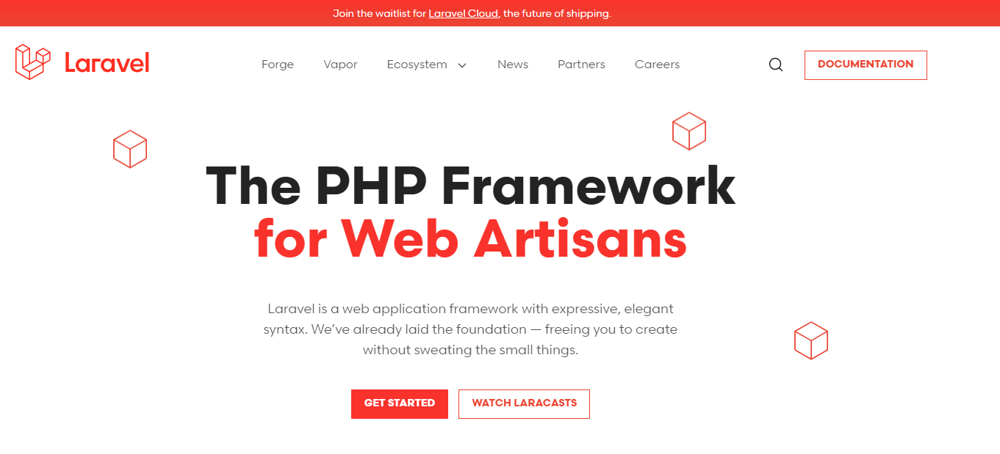
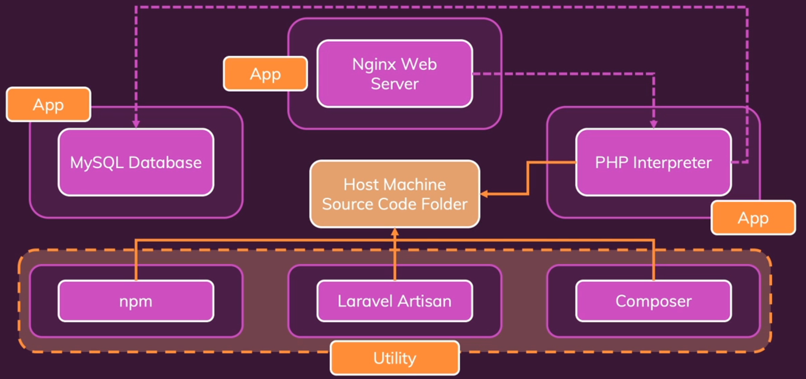
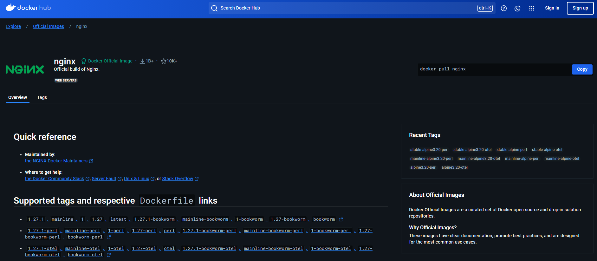
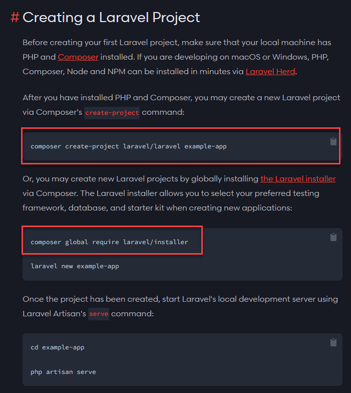
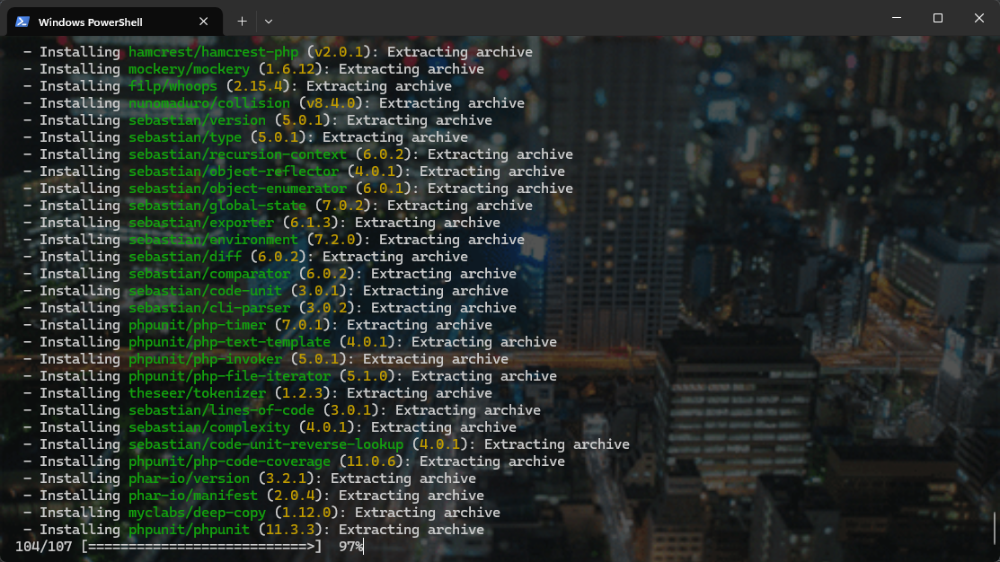
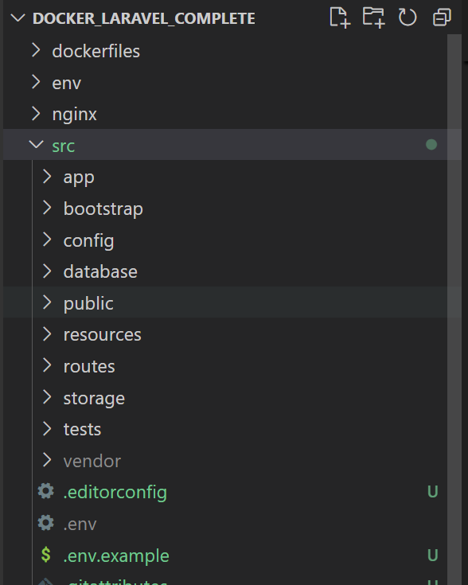
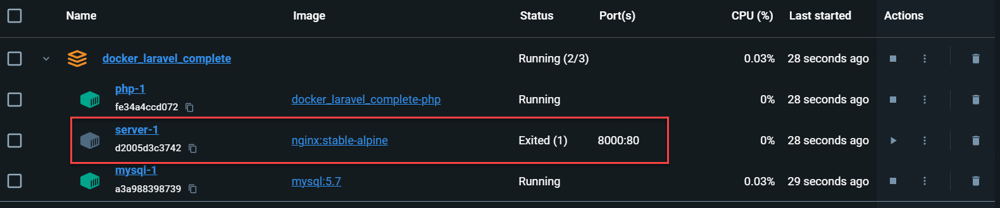

:_chapter:
[[laravel_docker]]

= Projet Laravel complexe et Docker
include::../../../run_app.adoc[]

== Introduction

Dans le chapitre précédent, nous avons appris à utiliser des conteneurs utilitaires, et plus généralement, tout au long de ce cours, nous avons exploré *Docker*, les conteneurs *Docker*, ainsi que *Docker Compose*. Nous avons également examiné comment construire des applications composées de plusieurs conteneurs.

Dans ce chapitre, nous allons approfondir ces concepts et apprendre quelques nouveaux aspects et façons d'utiliser *Docker Compose*. Nous allons pratiquer cela avec un projet *Laravel PHP*, en configurant un projet *Laravel PHP* sur notre machine locale avec *Docker*, de manière à ne pas avoir besoin d'installer d'autres outils sur notre machine, à part *Docker*, pour créer des applications fiables.

En faisant cela, nous allons appliquer ce que nous avons appris sur les *images*, les *conteneurs*, *Docker Compose*, les conteneurs utilitaires, et bien plus encore, sur un exemple concret.

Vous n'aurez pas besoin de connaissances en *Laravel* ou en *PHP* pour ce module. Nous n'écrirons pas de code *Laravel* ou *PHP*, et c'est pourquoi je recommande également de ne pas passer ce module, même si *Laravel* ne vous intéresse pas. Nous allons découvrir de nouvelles fonctionnalités tout au long de ce module.

Nous allons apprendre de nouvelles manières d'utiliser *Docker Compose*, d'interagir avec plusieurs fichiers *Docker*, de connecter des *images*, et bien plus encore. J'ai choisi *Laravel* et *PHP* comme exemple car :

- Premièrement, nous avons déjà travaillé avec beaucoup d'exemples basés sur *Node.js*, et je souhaite vraiment souligner que *Docker* peut être utilisé pour n'importe quelle technologie, et surtout pour n'importe quelle technologie web.
- Deuxièmement, *Laravel* et *PHP* nécessitent une configuration plus complexe sur votre machine. Alors que pour *Node.js*, il vous suffit de télécharger et d'installer un seul outil, pour *Laravel* et *PHP*, cela demande bien plus de configuration, comme nous le verrons dans la prochaine section.

C'est pourquoi nous allons maintenant explorer cette configuration et voir comment nous pouvons construire un environnement de développement pour une application *Laravel PHP* à partir de zéro avec *Docker*. En cours de route, comme mentionné, nous allons également découvrir de nombreux nouveaux aspects intéressants et importants.

== La configuration cible

Qu'est-ce qui rend *Laravel* et *PHP* si spéciaux ?

*Laravel* est le framework *PHP* le plus populaire. Il est très agréable à utiliser. Cependant, configurer notre machine locale pour le développement avec *Laravel* peut être assez fastidieux. Ce n'est pas vraiment la faute de *Laravel*, mais plutôt à cause de la configuration de *PHP*, qui peut être un peu compliquée.

Si nous consultons la documentation de *Laravel*, nous découvrirons les exigences du serveur et les différents éléments à installer sur notre système. Il y a pas mal de choses à installer, à commencer par *PHP*, ce qui peut déjà poser un problème.

Installer *PHP* est faisable, mais contrairement à *NodeJS*, cela ne suffit pas. Le grand avantage de *NodeJS* est qu'il ne s'agit pas seulement du langage dans lequel nous écrivons notre code (le langage est *JavaScript*), mais aussi d'un environnement d'exécution *JavaScript*. Avec *NodeJS*, nous pouvons écrire à la fois le code de l'application et la logique du serveur en une seule pièce, tout est géré par *NodeJS*.

Pour *Laravel* et *PHP*, c'est différent. Installer *PHP* ne suffit pas, car en plus de *PHP*, nous avons besoin d'un serveur pour traiter les requêtes entrantes et déclencher l'interpréteur *PHP* pour exécuter notre code. Configurer tout cela sur une machine locale, en plus d'une base de données *MySQL* ou *MongoDB*, peut devenir assez fastidieux.

C'est pourquoi cet exemple est parfait pour utiliser *Docker*, car vous verrez à quel point il est facile de gérer une configuration complexe sans avoir à installer quoi que ce soit sur notre machine locale, à part *Docker*. En utilisant *Docker*, nous pourrons écrire du code *Laravel PHP* et créer des applications sans avoir besoin d'installer d'autres outils.

Voici l'objectif de cette configuration que nous allons atteindre dans ce module. Nous allons construire un environnement de développement *Laravel* sans avoir à installer quoi que ce soit sur notre machine hôte, à part *Docker*.

L'idée est d'avoir un dossier sur notre machine hôte qui contiendra le code source de cette application *Laravel PHP*. Ce dossier pourra être ouvert avec l'éditeur de notre choix, et nous pourrons y écrire du code *Laravel*.

Ce dossier de code source sera ensuite exposé à un conteneur, le **conteneur de l'interpréteur PHP**. Il s'agit d'un conteneur qui a *PHP* installé à l'intérieur. Ce conteneur aura accès à notre code source, pourra interpréter ce code et générer une réponse pour les requêtes entrantes.

En plus de cet interpréteur *PHP*, nous avons besoin d'un serveur. Contrairement à *Node*, nous ne construisons pas ce serveur avec *PHP*. Nous allons donc utiliser un second conteneur, qui contiendra *Nginx*, un serveur web. Ce conteneur prendra en charge les requêtes entrantes, les enverra à l'interpréteur *PHP*, et renverra la réponse au client.

Pour stocker les données, nous allons également ajouter une base de données *MySQL*. *Laravel* peut également fonctionner avec des bases de données *MongoDB*, mais la plupart du temps, on utilise des bases de données SQL. Ainsi, notre application *Laravel* pourra communiquer avec cette base de données.

Ces trois conteneurs (*PHP*, *Nginx*, *MySQL*) sont des **conteneurs d'application**, c'est-à-dire qu'ils resteront actifs tant que notre application sera en cours d'exécution.

En plus de ces conteneurs d'application, notre configuration nécessitera quelques **conteneurs utilitaires**. En effet, les applications *Laravel* utilisent des outils spécifiques comme *Composer*, qui est l'équivalent de *NPM* pour *PHP*. *Composer* est un gestionnaire de paquets que nous utiliserons pour créer une application *Laravel* et installer les dépendances dont elle a besoin.

*Laravel* dispose également de son propre outil appelé *Artisan*. Cet outil permet d'exécuter des migrations de base de données, d'ajouter des données initiales, et bien plus encore.

Enfin, nous utiliserons également *NPM*, car *Laravel* peut inclure du code *JavaScript* dans ses vues, et je souhaite présenter une configuration complète que vous pourriez utiliser pour développer des applications *Laravel*.

Au total, nous aurons donc six conteneurs qui interagiront avec notre code source. C'est la configuration que nous allons mettre en place dans ce module.

== Un conteneur Nginx(Serveur Web)

Commençons à écrire un peu de code ici.

Dans un dossier vide et je tiens à souligner que je n’ai pas installé *Composer* ni les autres outils nécessaires. Si j’essaie de l’exécuter, je reçois une erreur *command not found*. Donc ici, il me manque réellement certains outils nécessaires pour créer une application *Laravel*.

C’est pourquoi nous allons utiliser *Docker* pour cela. Je vais commencer par ajouter un fichier `docker-compose.yaml`, car nous allons créer plusieurs conteneurs et ces conteneurs devront interagir. Même s’il n’y avait qu’un seul conteneur, j’aime avoir cette configuration dans un fichier texte, facile à lire et à modifier.

Nous utiliserons donc *Docker Compose* pour configurer l'intégralité de cette application, ce projet. Ce fichier contiendra à la fois les conteneurs d'application et les conteneurs utilitaires. Je vous montrerai également comment exécuter tous ces conteneurs ou juste certains d'entre eux tout au long de ce module.

Commençons donc par ajouter une version, et encore une fois, je vais choisir la *version 3.8* ici. Ensuite, nous spécifierons nos services, c'est-à-dire les conteneurs que nous souhaitons configurer.

[source, yaml]
.Fichier : code/01-added-nginx/docker-compose.yaml
----
include::./code/docker_laravel_complete/docker-compose.yaml[lines=1]
----

Je vous ai montré que nous aurons six services différents. Nous aurons notre service serveur, le serveur *nginx*, qui prendra en charge toutes les requêtes entrantes et déclenchera l’interpréteur *PHP*. Ensuite, nous aurons le conteneur *PHP*, responsable de l’exécution de notre code *PHP*, et donc aussi du code *Laravel*, car *Laravel* n’est qu’un framework *PHP*.

Nous aurons également le conteneur *MySQL*, qui contiendra la base de données *MySQL*, ainsi que les conteneurs utilitaires. Nous aurons un conteneur *Composer*, un conteneur *npm* et, peut-être avant cela, mais l'ordre n’a pas d’importance, le conteneur *Artisan*.

[source, yaml]
.Fichier : code/docker_laravel_complete/docker-compose.yaml
----
version: "3.8"
services:
    server:
    php:
    mysql:
    composer:
    artisan:
    npm:
----

Ce sont les six conteneurs dont nous aurons besoin ici, et je vais bien sûr les ajouter étape par étape. Commençons par le serveur.

[source, yaml]
.Fichier : code/docker_laravel_complete/docker-compose.yaml
----
version: "3.8"
services:
    server:

   # php:
   # mysql:
   # composer:
   # artisan:
   # npm:
----

Le serveur, comme je l'ai mentionné, utilisera *nginx*, un serveur web très populaire, puissant et efficace. L’avantage est que si vous recherchez *docker nginx*, vous trouverez une image officielle *nginx* que vous pouvez utiliser. Tout comme avec *MongoDB* ou *Node*, nous avons également une image officielle pour cela.

.https://hub.docker.com/_/nginx[Page officielle de Nginx sur DockerHub]

Nous pouvons simplement utiliser cette image pour configurer un serveur *nginx*. Vous trouverez également de la documentation expliquant comment utiliser cette image sur la page *Docker Hub*. Mais bien sûr, nous allons la configurer ensemble.

Dans le fichier *docker-compose*, nous pouvons maintenant spécifier une image pour le serveur et utiliser une image officielle, l'image *nginx*. Il existe plusieurs tags, plusieurs versions de cette image que nous pourrions utiliser. Je vais utiliser le tag *stable-alpine* ici pour obtenir une image basée sur une couche système d’exploitation *Linux* très légère, et une version stable de cette image *nginx*.

[source, yaml]
.Fichier : code/docker_laravel_complete/docker-compose.yaml
----
version: "3.8"
services:
    server:
      image: 'nginx:stable-alpine'

   # php:
   # mysql:
   # composer:
   # artisan:
   # npm:
----

Ce serveur expose également un port, et comment le savoir ? Eh bien, la documentation officielle nous le dit. Elle nous indique que nous pouvons exposer le port *80*, qui est le port interne exposé par cette image. Nous allons donc lier ce port avec l’option *ports* à un port de notre machine hôte, ici le port *8000*, que nous lierons au port *80* exposé par cette image et donc par le conteneur en cours d'exécution.

[source, yaml]
.Fichier : code/docker_laravel_complete/docker-compose.yaml
----
version: "3.8"
services:
    server:
      image: 'nginx:stable-alpine'
      ports:
        - 8000:80

   # php:
   # mysql:
   # composer:
   # artisan:
   # npm:
----

Nous pourrons alors exécuter un conteneur avec un serveur à l'intérieur. Mais ce serveur ne sera pas très utile par défaut, car il ne saura pas quoi faire. Ce qu’il devrait faire ici, c'est traiter les requêtes entrantes et les rediriger vers notre conteneur *PHP*, que nous ajouterons plus tard, pour que ce conteneur exécute notre code *PHP*.

Pour fournir notre propre configuration, nous ajouterons un montage (*bind mount*) avec la clé *volumes*. Ici, nous allons lier un dossier local, disons un dossier *nginx* (que nous devons encore ajouter), et y mettre un fichier *nginx.conf*. Dans le conteneur, nous le lierons à un chemin absolu : `/etc/nginx/nginx.conf`.

Et comment connaitre ce chemin dans le conteneur ? Eh bien, encore une fois, la documentation officielle de l'image nous l’indique. Nous apprenons que nous pouvons passer notre propre configuration en la liant avec `/etc/nginx/`.

Nous pouvons également définir cela en lecture seule (*read-only*), car le conteneur ne devrait jamais modifier cette configuration. Cela nous permettra de transmettre notre fichier de configuration personnalisé pour ce serveur web dans le conteneur.

[source, yaml]
.Fichier : code/docker_laravel_complete/docker-compose.yaml
----

      volumes:
        - ./nginx/nginx.conf:/etc/nginx/nginx.conf:ro
----

Nous devons maintenant créer ce dossier *nginx* sur notre machine hôte, ainsi qu'un fichier *nginx.conf*. Vous trouverez le fichier de configuration prêt dans cette section, car je l'ai déjà préparé pour vous. Vous pouvez donc simplement utiliser ce fichier.

Ce fichier contient une configuration *nginx* qui écoute sur le port *80* et gère les requêtes, puis redirige celles-ci vers des fichiers *index.php*, ou vers notre interpréteur *PHP* pour traiter les requêtes entrantes.

[source, ]
.Fichier : code/01-added-nginx/nginx/nginx.conf
----
include::./code/docker_laravel_complete/nginx/nginx.conf[]
----

Enfin, revenons au fichier *docker-compose.yaml*. Nous avons ajouté notre configuration en tant que volume, et c'est tout pour le conteneur serveur.

[source, yaml]
.Fichier : code/docker_laravel_complete/docker-compose.yaml
----
version: "3.8"
services:
    server:
      image: 'nginx:stable-alpine'
      ports:
        - 8000:80
      volumes:
        - ./nginx/nginx.conf:/etc/nginx/nginx.conf

   # php:
   # mysql:
   # composer:
   # artisan:
   # npm:
----

Je suis conscient que cela était nouveau et peut-être pas quelque chose que vous vous sentez à l'aise de construire vous-même, mais c’est pourquoi nous parcourons cela ensemble. Nous avons maintenant construit ce conteneur *nginx*, et dans la prochaine section, nous passerons au conteneur *PHP*.

== Un conteneur PHP

Passons maintenant au conteneur *PHP*, après avoir configuré le conteneur *nginx*. Le conteneur *PHP* sera relativement simple. Cependant, je vais utiliser un fichier *Dockerfile* personnalisé, car il n'existe pas d'image prête à l'emploi avec tout ce dont j'ai besoin.

Pour clarifier, si vous recherchez *PHP* sur *Docker Hub*, vous trouverez une image officielle que nous allons utiliser. Cependant, je souhaite construire une image personnalisée à partir de cette image, car je vais ajouter des extensions supplémentaires nécessaires pour *Laravel*.

Je vais donc ajouter un nouveau dossier à côté du dossier *nginx*, que je nommerai *dockerfiles*. À l'intérieur, j'ajouterai un fichier `php.dockerfile`. Vous pouvez choisir le nom que vous voulez, mais en utilisant cette convention de nommage, cela permet à certains éditeurs comme *Visual Studio Code* de reconnaître le fichier comme un *Dockerfile*, ce qui aide pour l'auto-complétion.

Je vais commencer avec l'image de base *PHP*, que je viens de mentionner. En regardant les tags, je vais utiliser l'image `7.4-fpm-alpine`, qui est une image *PHP* légère et stable, avec tout ce dont nous avons besoin pour fonctionner avec notre configuration de *Nginx*.

[source, ]
.Fichier : code/docker_laravel_complete/dockerfiles/php.dockerfile
----
FROM php:fpm-alpine3.20
----

Ensuite, je vais exécuter une commande. C'est là la raison pour laquelle je construis cette image personnalisée : je vais installer des dépendances supplémentaires nécessaires pour *Laravel*. Heureusement, cette image de base inclut un outil pratique : `docker-php-ext-install`. Cet outil me permet d'installer les extensions *PDO* et *pdo_mysql*, qui sont essentielles pour *Laravel*.

[source, ]
.Fichier : code/docker_laravel_complete/dockerfiles/php.dockerfile
----
FROM php:fpm-alpine3.20

RUN  docker-php-ext-install pdo pdo_mysql
----

Nous devons nous assurer que cette commande est exécutée dans le bon dossier. Nous allons donc définir un *working directory* à `/var/www/html`. Ce chemin est assez standard sur les serveurs web pour servir les sites web. Nous allons utiliser ce dossier pour toutes les étapes de ce module, car il sera utilisé dans les conteneurs pour héberger notre application *Laravel PHP*.

[source, ]
.Fichier : code/docker_laravel_complete/dockerfiles/php.dockerfile
----
FROM php:fpm-alpine3.20

WORKDIR /var/www/html

RUN  docker-php-ext-install pdo pdo_mysql
----

Maintenant, ce fichier *Dockerfile* ne contient pas de commande ou de point d'entrée (*entry point*). Si vous n'ajoutez pas de commande dans un *Dockerfile*, celle de l'image de base est utilisée, et dans notre cas, l'image de base *PHP* a une commande par défaut qui invoque l'interpréteur *PHP*. Ainsi, notre image personnalisée utilisera cette commande pour traiter les fichiers *PHP*.

Dans le fichier *docker-compose.yaml*, nous pouvons maintenant référencer ce *Dockerfile*. Nous allons configurer la section *build* et spécifier le *context* (le dossier contenant notre *Dockerfile*), qui est `dockerfiles`, puis nous indiquerons le nom du fichier *Dockerfile*, ici `php.dockerfile`.

[source, yaml]
.Fichier : code/docker_laravel_complete/docker-compose.yaml
----
version: "3.8"
services:
    server:
      image: 'nginx:stable-alpine'
      ports:
        - 8000:80
      volumes:
        - ./nginx/nginx.conf:/etc/nginx/nginx.conf

    php:
      build:
        context: ./dockerfiles
        dockerfile: php.dockerfile
   # mysql:
   # composer:
   # artisan:
   # npm:
----

Ensuite, il nous reste deux points importants à aborder. Le premier est de s'assurer que l'interpréteur *PHP* puisse accéder à notre code source. Même si nous n'avons pas encore de code source, nous aurons une application *Laravel PHP*, et ce code doit être accessible dans le dossier `/var/www/html` à l'intérieur du conteneur. Nous allons donc créer un montage (*bind mount*), pour monter notre dossier de projet local (par exemple, un dossier *src*) dans ce dossier à l'intérieur du conteneur.

Je vais créer un dossier `src` dans notre projet local. Ensuite, dans *docker-compose.yaml*, nous ajoutons la section *volumes* pour le conteneur *PHP*. Nous allons monter le dossier local *src* dans `/var/www/html` dans le conteneur. Nous pouvons aussi améliorer la performance en ajoutant `:delegated` à la fin du chemin. Cela optimise les performances en décalant les écritures vers le dossier monté.

Quand vous montez un dossier de votre machine hôte à l'intérieur d'un conteneur Docker, les modifications faites sur le contenu de ce dossier doivent être synchronisées entre le conteneur et l'hôte. Par défaut, chaque lecture ou écriture dans le conteneur est immédiatement répercutée sur votre machine locale, ce qui peut parfois ralentir les performances.

L'option delegated permet de décaler cette synchronisation pour améliorer les performances. En d'autres termes, le conteneur peut faire des modifications dans le dossier monté, mais ces changements ne seront pas immédiatement répercutés sur la machine hôte. Le conteneur aura une certaine priorité sur l'accès à ces fichiers, et les mises à jour sur la machine hôte seront effectuées après un léger délai.

Cela est utile dans des cas où les données modifiées à l'intérieur du conteneur n'ont pas besoin d'être immédiatement accessibles sur la machine hôte. Par exemple, si le conteneur écrit des fichiers de cache ou des fichiers temporaires qui n'ont pas besoin d'être visibles instantanément sur votre ordinateur.

[source, yaml]
.Fichier : code/docker_laravel_complete/docker-compose.yaml
----
version: "3.8"
services:
    server:
      image: 'nginx:stable-alpine'
      ports:
        - 8000:80
      volumes:
        - ./nginx/nginx.conf:/etc/nginx/nginx.conf

    php:
      build:
        context: ./dockerfiles
        dockerfile: php.dockerfile
      volumes:
        - ./src:/var/www/html:delegated
   # mysql:
   # composer:
   # artisan:
   # npm:
----

Le second point important concerne le port sur lequel l’interpréteur *PHP* écoute les requêtes. Dans la configuration *nginx* (nginx.conf), nous avons défini un port 3000 pour les requêtes PHP.

[source, yaml]
.Fichier : code/docker_laravel_complete/nginx/nginx.conf
----
[...]

fastcgi_pass php:3000;

[...]
----

Cependant, l'image *PHP* expose par défaut le port 9000, comme indiqué dans le fichier *Dockerfile* officiel. Nous devons donc mapper le port 3000 de *nginx* au port 9000 du conteneur *PHP*.

[source, yaml]
.Fichier : code/docker_laravel_complete/docker-compose.yaml
----
version: "3.8"
services:
    server:
      image: 'nginx:stable-alpine'
      ports:
        - 8000:80
      volumes:
        - ./nginx/nginx.conf:/etc/nginx/nginx.conf

    php:
      build:
        context: ./dockerfiles
        dockerfile: php.dockerfile
      volumes:
        - ./src:/var/www/html:delegated
      ports:
        - 3000:9000
   # mysql:
   # composer:
   # artisan:
   # npm:
----

Cela dit, nous devons nous rappeler que *nginx* communiquera directement avec le conteneur *PHP* via le réseau Docker, sans passer par la machine hôte, sans passer par une URL : localhost, le mapping est alors inutile. Par conséquent, nous allons simplement changer la configuration *nginx* pour qu'elle utilise le port 9000, car le trafic entre les conteneurs se fait directement via leurs noms de service.

[source, yaml]
.Fichier : code/docker_laravel_complete/nginx/nginx.conf
----
[...]

fastcgi_pass php:9000;

[...]
----

Avec ce changement, nous avons terminé la configuration du conteneur *PHP*. Passons maintenant à la configuration du conteneur *MySQL*.

[source, yaml]
.Fichier : code/docker_laravel_complete/docker-compose.yaml
----
version: "3.8"
services:
    server:
      image: 'nginx:stable-alpine'
      ports:
        - 8000:80
      volumes:
        - ./nginx/nginx.conf:/etc/nginx/nginx.conf

    php:
      build:
        context: ./dockerfiles
        dockerfile: php.dockerfile
      volumes:
        - ./src:/var/www/html:delegated
   # mysql:
   # composer:
   # artisan:
   # npm:
----

== Un conteneur MySQL

Passons maintenant à la configuration du conteneur *MySQL*.

Il n'est pas surprenant que nous ayons également une image *MySQL* officielle que nous pouvons utiliser. Nous allons l'utiliser pour lancer une base de données dans un conteneur *MySQL*. C'est très similaire à l'image *MongoDB* que nous avons utilisée précédemment dans le cours.

Dans le fichier *docker-compose.yaml*, nous allons ajouter une image. L'image que nous voulons utiliser ici est l'image *MySQL*, et nous allons spécifier la version 5.7 avec le tag `5.7`. Cela téléchargera cette image, et lorsqu'elle sera démarrée en tant que conteneur, une base de données *MySQL* sera lancée.

Cette base de données sera accessible par notre code *PHP* dans le conteneur *PHP*. Comme tous ces services font partie du même réseau, nous pourrons communiquer avec cette base de données sans problème, simplement en utilisant le nom du conteneur.

[source, yaml]
.Fichier : code/docker_laravel_complete/docker-compose.yaml
----
version: "3.8"
services:
    server:
      image: 'nginx:stable-alpine'
      ports:
        - 8000:80
      volumes:
        - ./nginx/nginx.conf:/etc/nginx/nginx.conf

    php:
      build:
        context: ./dockerfiles
        dockerfile: php.dockerfile
      volumes:
        - ./src:/var/www/html:delegated

   mysql:
      image: mysql:5.7

   # composer:
   # artisan:
   # npm:
----

Il n'est donc pas nécessaire de configurer le réseau ici, mais il y a un autre aspect que nous devons configurer : les variables d'environnement. Nous devons fournir des variables d'environnement qui seront utilisées par cette image pour configurer une base de données, un utilisateur, un mot de passe, etc.

Nous trouvons la description détaillée de ces variables sur la page *Docker Hub* de l'image *MySQL*. Vous pouvez y voir quelles variables d'environnement peuvent être définies et ce qu'elles font.

Je vais définir plusieurs de ces variables, mais au lieu de les ajouter directement dans le fichier *docker-compose*, je vais les mettre dans un fichier `.env`. Je vais donc créer un dossier *env* et y ajouter un fichier `mysql.env`.

Dans ce fichier `mysql.env`, je vais ajouter la variable `MYSQL_DATABASE`, qui définit le nom de la base de données initiale qui sera créée lors du démarrage du conteneur. Je vais définir cette variable à `homestead`, ce qui correspond à la configuration par défaut dans la documentation *Laravel*.

Ensuite, je vais définir un utilisateur par défaut avec la variable `MYSQL_USER`, et je vais également l'appeler `HOMESTEAD`, toujours en utilisant les valeurs par défaut de *Laravel*. Puis, je vais ajouter la variable `MYSQL_PASSWORD` pour définir le mot de passe de cet utilisateur initial, et je vais définir ce mot de passe à `secret`.

Enfin, je vais ajouter la variable `MYSQL_ROOT_PASSWORD` pour définir le mot de passe de l'utilisateur *root* de la base de données, et je vais également le définir à `secret`.

[source, yaml]
.Fichier : code/docker_laravel_complete/env/mysql.env
----
MYSQL_DATABASE=homestead
MYSQL_USER=homestead
MYSQL_PASSWORD=secret
MYSQL_ROOT_PASSWORD=secret
----

Cela fait, nous retournons au fichier *docker-compose.yaml* pour ajouter l'option `env_file` sous le conteneur *MySQL*, et nous pointons vers le dossier *env* et le fichier `mysql.env`. Cela permettra d'utiliser les variables d'environnement définies dans ce fichier pour configurer le conteneur *MySQL*.

[source, yaml]
.Fichier : code/docker_laravel_complete/docker-compose.yaml
----
version: "3.8"
services:
  server:
    image: 'nginx:stable-alpine'
    ports:
      - 8000:80
    volumes:
      - ./nginx/nginx.conf:/etc/nginx/nginx.conf

  php:
    build:
      context: ./dockerfiles
      dockerfile: php.dockerfile
    volumes:
      - ./src:/var/www/html:delegated

  mysql:
    image: mysql:5.7
    env_file:
      - ./env/mysql.env
  # composer:
  # artisan:
  # npm:
----

C'est tout pour nos trois conteneurs d'application.

Pour tester si tout fonctionne correctement ou si nous avons fait une erreur, nous aurons besoin d'une application *Laravel*. Nous allons la créer à l'aide de l'outil *Composer*. Passons donc à la configuration du conteneur *Composer*.

== Un conteneur Composer

Ajoutons maintenant le service *Composer*.

Nous allons configurer ce conteneur, qui sera un conteneur utilitaire. Ce conteneur ne sera pas seulement utilisé en interne par *Laravel*, mais surtout par nous pour configurer l'application *Laravel* au départ.

Pour cela, je vais ajouter un autre *Dockerfile*, un fichier personnalisé, car je vais avoir besoin d'une image de base avec quelques ajustements. Je vais donc ajouter un fichier `composer.dockerfile`.

Je vais commencer par une image de base, l'image *Composer*. C'est vraiment pratique. Si vous cherchez sur *Docker Hub*, il existe une image de base *Composer*, qui inclut déjà l'outil *Composer*, ce qui est bien sûr génial. Nous pouvons donc partir de cette image *Composer* et utiliser par exemple le tag `latest` pour obtenir la dernière version de l'image.

Voici pourquoi j'ai besoin de mon propre *Dockerfile* personnalisé : je veux spécifier un point d'entrée (*entry point*). Petite parenthèse, il est aussi possible de faire cela directement dans le fichier *docker-compose*, mais je reviendrai sur ce point plus tard. J'aime cette approche, car elle est claire et facile à comprendre.

[source, ]
.Fichier : code/docker_laravel_complete/dockerfiles/composer.dockerfile
----
FROM composer:latest

WORKDIR /var/www/html

ENTRYPOINT [ "composer", "--ignore-platform-reqs" ]
----

Dans mon fichier *Dockerfile*, le point d'entrée sera l'exécutable *composer* qui existe dans l'image *Composer* et dans le conteneur, contrairement à ma machine locale où il n'est pas installé (comme je l'ai montré précédemment). J'ajouterai également un flag `--ignore-platform-reqs` à chaque commande exécutée par *Composer*. Ce flag permet d'exécuter *Composer* sans avertissements ou erreurs, même si certaines dépendances manquent.

Il est très important de définir le bon répertoire de travail avec la commande `WORKDIR`, et je le fixe à `/var/www/html`. C'est là que notre code sera placé plus tard.

Enregistrez ce fichier et revenons au fichier *docker-compose.yaml*.

Maintenant que nous avons notre *Dockerfile*, nous pouvons ajouter la configuration *build* pour le service *Composer* et définir le contexte avec `context: ./dockerfiles`. Nous définissons ensuite l'option `dockerfile` à `composer.dockerfile`, car c'est le fichier que nous souhaitons utiliser pour construire cette image.

Nous devons maintenant nous assurer d'exposer notre répertoire de code source à cette image, afin que le conteneur puisse travailler sur ce répertoire lorsque nous utiliserons *Composer* pour installer *Laravel* et configurer le projet *Laravel*. Il doit bien sûr le faire dans le dossier `/var/www/html` à l'intérieur du conteneur.

Nous ajoutons donc un volume et lions notre dossier source local à ce répertoire `/var/www/html` dans le conteneur. Ainsi, si nous utilisons *Composer* pour créer une application *Laravel* dans ce dossier à l'intérieur du conteneur, cela sera reflété dans notre dossier source sur notre machine locale.

[source, yaml]
.Fichier : code/docker_laravel_complete/docker-compose.yaml
----
version: "3.8"
services:
  server:
    image: 'nginx:stable-alpine'
    ports:
      - 8000:80
    volumes:
      - ./nginx/nginx.conf:/etc/nginx/nginx.conf

  php:
    build:
      context: ./dockerfiles
      dockerfile: php.dockerfile
    volumes:
      - ./src:/var/www/html:delegated

  mysql:
    image: mysql:5.7
    env_file:
      - ./env/mysql.env
  composer:
    build:
      context: ./dockerfiles
      dockerfile: composer.dockerfile
    volumes:
      - ./src:/var/www/html
  # artisan:
  # npm:
----

C'est essentiellement ce que je vous ai déjà montré dans la dernière section du cours avec *NPM* et *Node*.

Avec cela en place, nous avons désormais trois conteneurs d'application nécessaires pour exécuter l'application *Laravel*, et nous avons ce conteneur utilitaire pour la créer. Nous aurons besoin des deux autres conteneurs utilitaires pour certaines fonctionnalités spécifiques de *Laravel*, mais pour l'instant, nous pouvons les ignorer.

Nous pouvons maintenant commencer à utiliser le conteneur utilitaire *Composer* pour créer une application *Laravel*. Ensuite, nous vérifierons si nous pouvons lancer cette application avec l'aide de nos trois conteneurs d'application.

Comment procéder ?

== Créer une application Laravel avec le conteneur utilitaire

Pour créer une application *Laravel*, nous pouvons consulter la documentation officielle de *Laravel*. Sous la section *Get Started*, nous voyons les prérequis. Si nous descendons un peu pour atteindre la section *Installing Laravel*, nous voyons cette commande que vous pouvez exécuter pour installer *Laravel*. Nous allons utiliser cette commande ici, car elle utilise uniquement *Composer* pour configurer un projet *Laravel*. Nous allons légèrement ajuster la commande concernant le dossier dans lequel nous voulons installer ce projet, mais c'est essentiellement la commande que nous allons utiliser.

Nous pouvons donc déjà copier cette commande, puis revenir à notre terminal. Maintenant, je veux exécuter uniquement le conteneur *Composer*. C'est quelque chose que je vous ai montré dans la dernière section : vous pouvez exécuter des conteneurs individuels dans votre fichier *docker-compose.yaml* avec la commande `docker-compose run`. Vous n'avez pas besoin de démarrer l'ensemble du système de conteneurs, vous pouvez simplement exécuter des conteneurs individuels, ce qui est généralement le cas avec ces conteneurs utilitaires.

Ici, je veux exécuter le conteneur *Composer*. Donc je vais utiliser la commande `docker-compose run composer`, et j'ajouterai `--rm` pour m'assurer que tout ce qui est lié au conteneur est supprimé lorsqu'il est arrêté, afin que nous n'ayons pas une accumulation de conteneurs inutilisés après avoir exécuté cette commande plusieurs fois.

Ensuite, nous pouvons coller la commande que nous avons copiée du site *Laravel*. Toutefois, nous n'avons pas besoin de spécifier `composer` deux fois, car notre point d'entrée dans le *Dockerfile* *Composer* est déjà l'exécutable *composer*. Nous allons donc appeler la commande `create-project` directement sur cet exécutable.

Enfin, nous devons spécifier le dossier dans lequel ce projet doit être créé, et ce sera simplement `.` (le répertoire courant). Rappelez-vous que grâce à notre *Dockerfile*, tout cela s'exécute dans ce dossier à l'intérieur du conteneur, et ce sera donc le dossier racine où le projet *Laravel* sera créé.

[source,bash]
----
docker-compose run --rm composer create-project --prefer-dist laravel/laravel .
----

Grâce à notre montage (*bind mount*), cela sera ensuite reflété dans le dossier *src* sur notre machine hôte.

Essayons maintenant cela en appuyant sur *Entrée*. Cela semble bien démarrer, l'image est en cours de construction, donc cela fonctionne. Voyons ce qu'il fait une fois terminé.

Cela semble également prometteur : le projet *Laravel* est en train d'être créé dans le dossier racine du conteneur, qui est `/var/www/html`. Attendez-vous à ce que cela prenne quelques minutes.

Voilà, cela avance bien, et c'est normal que cela prenne du temps. Voyons si tout se termine correctement.

Et nous y sommes. Cela semble bon.

Si nous regardons maintenant dans le dossier *src*, nous y voyons notre application *Laravel*. Et, si vous connaissez *Laravel*, c'est ici que vous pourriez commencer à écrire du code *Laravel*.

Cependant, nous n'allons pas faire cela ensemble ici, car ce n'est pas un cours sur *Laravel*. Je voulais simplement vous montrer comment vous pouvez configurer une application *Laravel*.

Cela dit, nous n'avons pas encore terminé. Nous voulons maintenant voir si nous pouvons exécuter cette application avec nos trois conteneurs d'application.

== A lire en cas d'erreurs ...

Vous pouvez ignorer ce sous-titre si vous ne rencontrez pas d'erreurs dans le prochain sous-titre. Cependant, si vous faites face à des erreurs, consultez à nouveau cette partie.

Lorsque vous utilisez *Docker* sur *Linux*, vous pourriez rencontrer des erreurs de permission lors de l'ajout d'un montage (*bind mount*), comme montré dans la prochaine leçon. Si c'est le cas, essayez les étapes suivantes :

Modifiez le fichier `php.dockerfile` pour qu'il ressemble à ceci :

[source,bash]
.php.dockerfile
----
FROM php:8.2.4-fpm-alpine

WORKDIR /var/www/html

COPY ../src .

RUN docker-php-ext-install pdo pdo_mysql

RUN addgroup -g 1000 laravel && adduser -G laravel -g laravel -s /bin/sh -D laravel

USER laravel
----

Et changer dans `docker-compose.yaml` le contexte de build de PHP :

[source,bash]
.docker-compose.yaml
----
[..]
 php:
    build:
      context: ./
      dockerfile: ./dockerfiles/php.dockerfile
    volumes:
      - ./src:/var/www/html:delegated
[..]
----

Notez que l'instruction `RUN chown` a été supprimée ici. À la place, nous créons un utilisateur nommé "laravel", que nous utilisons (avec l'instruction `USER`) pour exécuter des commandes à l'intérieur de cette image/conteneur.

Modifiez également le fichier `composer.dockerfile` pour qu'il ressemble à ceci :

[source,bash]
.composer.dockerfile
----
FROM composer:2.5.7

RUN addgroup -g 1000 laravel && adduser -G laravel -g laravel -s /bin/sh -D laravel

USER laravel

WORKDIR /var/www/html

ENTRYPOINT [ "composer", "--ignore-platform-reqs" ]
----

Ici, nous ajoutons également l'utilisateur "laravel" et l'utilisons pour créer le projet.

Ces étapes devraient garantir que tous les fichiers créés par le conteneur *Composer* sont assignés à un utilisateur nommé "laravel", qui existe dans tous les conteneurs devant travailler sur ces fichiers.

== Lancer des services Docker Compose à la carte

Pour commencer, à l'intérieur du dossier *source*, dans cette nouvelle application *Laravel*, je vais ouvrir le fichier `.env`. Ce fichier a été généré par *Laravel* et contient certaines configurations spécifiques à *Laravel*.

L'élément le plus important pour nous est ce bloc qui contient les informations de connexion que *Laravel* utilisera pour se connecter à une base de données *MySQL*. Nous devons ajuster ces paramètres pour permettre à *Laravel* de se connecter à la base de données.

Pour cela, nous devons d'abord modifier le nom de la base de données, le nom d'utilisateur et le mot de passe. Ici, nous devrions bien sûr utiliser les valeurs que nous avons définies lors de la configuration de notre serveur *MySQL*. Par exemple, j'ai choisi un nom d'utilisateur `homestead` et un mot de passe `secret`. Dans le fichier `.env`, nous allons donc utiliser `homestead` comme nom de base de données et utilisateur, et définir `secret` comme mot de passe.

Un point très important : l'hôte (`host`) n'est pas cette adresse IP, mais plutôt le nom de notre service *MySQL*. Dans ce cas, c'est `mysql`, car la requête sera envoyée à partir de l'application *PHP Laravel* à l'intérieur du conteneur, et *Docker* pourra résoudre ce nom de conteneur en adresse IP, étant donné que ces serveurs d'application fonctionneront dans le même réseau.

Avec ces ajustements, nous n'avons pas besoin de modifier autre chose pour le moment. Enregistrez le fichier `.env` et nous allons essayer de lancer cette application.

[source,bash]
.src/.env
----
[...]
DB_CONNECTION=mysql
DB_HOST=mysql
DB_PORT=3306
DB_DATABASE=homestead
DB_USERNAME=homestead
DB_PASSWORD=secret
[...]
----

Pour ce faire, nous devons utiliser la commande `docker-compose up` afin de démarrer les services que nous souhaitons. Mais avant cela, prenons un instant pour évaluer quels services seront démarrés. Ce seront le serveur (*nginx*), *PHP* et *MySQL*. Le serveur est notre point d'entrée principal, qui va servir l'application et rediriger les requêtes vers l'interpréteur *PHP*. L'interpréteur *PHP* communiquera indirectement avec la base de données *MySQL* via notre code, car nous allons nous connecter à celle-ci.

Cependant, nous avons un problème ici. Notre serveur (*nginx*) ne connaît actuellement rien de notre code source. L'interpréteur *PHP* le sait, mais ce n'est pas suffisant. La requête entrante atteint d'abord notre serveur, qui redirige ensuite les requêtes *PHP* vers l'interpréteur *PHP*. Cela signifie que les fichiers *PHP* doivent être accessibles au serveur, ce qui nécessite l'ajout d'un volume supplémentaire.

Ce volume supplémentaire sera un *bind mount* qui lie notre dossier source au dossier `/var/www/html` à l'intérieur du conteneur. Je choisis ce dossier car, dans la configuration *nginx*, c'est ce dossier qui est utilisé pour servir notre contenu, et c'est là que nous recherchons les fichiers. Bien sûr, nous cherchons principalement dans le dossier *public*, qui se trouve dans le dossier *source*.

[source, yaml]
.docker-compose.yaml
----
version: "3.8"
services:
  server:
    image: 'nginx:stable-alpine'
    ports:
      - 8000:80
    volumes:
      - ./src:/var/www/html
      - ./nginx/nginx.conf:/etc/nginx/nginx.conf

  php:
    build:
      context: ./dockerfiles
      dockerfile: php.dockerfile
    volumes:
      - ./src:/var/www/html:delegated

  mysql:
    image: mysql:5.7
    env_file:
      - ./env/mysql.env
  composer:
    build:
      context: ./dockerfiles
      dockerfile: composer.dockerfile
    volumes:
      - ./src:/var/www/html
  # artisan:
  # npm:
----

Une fois ce volume ajouté, nous pouvons démarrer nos services. Pour cela, nous utilisons `docker-compose up` à nouveau.

Jusqu'à présent, nous avons toujours utilisé cette commande de manière simple. Cependant, cette fois-ci, nous ne voulons pas démarrer tous les services, comme *composer*. Nous voulons seulement démarrer trois services : *server*, *PHP* et *MySQL*.

La commande `docker-compose up` dispose d'une fonctionnalité spéciale pour cela. Si nous entrons `--help`, nous pouvons voir que nous avons la possibilité de cibler des services spécifiques. Par défaut, si nous exécutons `docker-compose up` sans spécifier de services, tous les services définis dans le fichier *docker-compose* seront démarrés. Mais ici, nous allons spécifier les services *server*, *PHP* et *MySQL*, et seuls ces trois services seront démarrés.

[source,bash]
----
docker-compose up -d server php mysql
----

Faisons cela en mode détaché (`--detach`) et voyons si cela fonctionne. En tapant *Entrée*, le processus démarre, mais il semble que le conteneur *nginx* ne soit pas lancé correctement. Si nous inspectons les conteneurs en cours d'exécution, nous voyons que deux conteneurs fonctionnent, mais *nginx* semble avoir échoué.

Le problème vient d'une petite erreur de ma part. Le fichier de configuration *nginx* que je lie via le volume est lié à un mauvais chemin. Nous ne devrions pas lier ce fichier à `nginx.conf`, mais plutôt au dossier `conf.d` dans `/etc/nginx`, et ensuite à `default.conf`. Ce fichier sera ensuite fusionné avec une configuration *nginx* plus large dans l'image *nginx*.

[source,bash]
.Extrait du : docker-compose.sh
----
  server:
    image: 'nginx:stable-alpine'
    ports:
      - 8000:80
    volumes:
      - ./src:/var/www/html
      - ./nginx/nginx.conf:/etc/nginx/conf.d/default.conf:ro

----

Après cette correction, nous utilisons `docker-compose down` pour arrêter tous les services, puis nous relançons `docker-compose up` avec *server*, *PHP* et *MySQL*. Cela semble maintenant fonctionner correctement. Si nous visitons `localhost:8000` et rechargeons la page, nous devrions voir l'écran de démarrage de *Laravel*.

Bien que cette méthode fonctionne, taper chaque service individuellement peut être fastidieux. Il serait préférable de spécifier que le service *server* dépend de *PHP* et *MySQL*, de sorte que *docker-compose* démarre automatiquement ces services. Nous pouvons ajouter cette configuration en utilisant `depends_on` dans le service *server*.

En ajoutant cette dépendance, *docker-compose* s'assurera que lorsque nous démarrons le service *server*, les services *PHP* et *MySQL* seront également démarrés. Nous pouvons maintenant lancer tous les services dépendants en une seule commande.

Un dernier ajustement concerne les images personnalisées comme l'image *PHP*. Par défaut, *docker-compose* ne reconstruit pas les images, même si vous avez fait des modifications. Pour forcer la reconstruction, nous pouvons ajouter l'option `--build` à la commande *up*, ce qui permet à *docker-compose* de vérifier les *Dockerfile* et de reconstruire les images si nécessaire.

En utilisant `--build`, nous nous assurons que toute modification dans les *Dockerfile* sera prise en compte. Avec cela, nous avons notre application *Laravel* qui fonctionne et nous pouvons maintenant modifier le code dans le dossier *source*. Par exemple, nous pouvons aller dans `resources/views` et modifier le fichier `welcome.blade.php` pour ajouter une balise `<h1>`. Après avoir sauvegardé et rechargé la page, nous voyons le changement.

Nous pouvons maintenant travailler sur cette application *Laravel* avec cette configuration.

Il ne nous reste plus qu'à configurer les deux autres conteneurs utilitaires, dont nous n'avons pas besoin pour démarrer l'application, mais qui sont nécessaires pour exécuter des migrations ou gérer le code *JavaScript* côté client. Passons maintenant à ces deux conteneurs.
