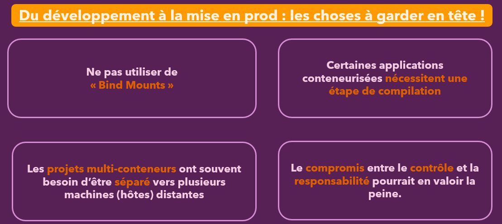

:_chapter:
[[deploying]]
= Déploiement de conteneurs Docker
:_author: Bauer Baptiste
:_version_number: 1.0.0
:_version_date: 17/11/2024
include::../../../run_app.adoc[]

== Introduction

Dans ce module, nous allons aborder un sujet très vaste et détaillé : le déploiement de conteneurs Docker. Contrairement aux chapitres précédents où nous nous sommes limités à travailler sur notre machine locale, nous allons maintenant exploiter ce que vous avez appris pour exécuter des conteneurs sur des machines distantes, que ce soit dans le *cloud* ou sur le *web*. Cela signifie que nos applications seront accessibles par les utilisateurs que nous souhaitons atteindre.

=== Objectif du chapitre

L'*objectif principal* de ce chapitre est de se concentrer sur le déploiement d'applications web. Bien que Docker puisse être utilisé pour bien d'autres types d'applications, nous avons choisi de nous concentrer sur les applications web pour plusieurs raisons. Notamment, Docker offre de nombreux avantages en développement web et permet de créer des applications accessibles via un navigateur, facilitant ainsi les tests et la démonstration des concepts abordés dans ce cours.

* *Passer du Développement Local à la Production*

Dans ce chapitre, vous apprendrez à passer du *développement local* à la *production*. Cela implique de *déplacer vos conteneurs sur une machine hôte distante* et de les exécuter depuis cet emplacement. Nous couvrirons les aspects généraux de ce processus de déploiement, les éléments à garder à l'esprit, les problèmes courants auxquels vous pourriez être confrontés, et les modifications nécessaires pour que vos conteneurs soient prêts pour un environnement de *production*.

Je vous fournirai également de nombreux scénarios concrets, des exemples pratiques et des problématiques que vous pourrez rencontrer en réalité. Vous apprendrez à déployer des applications comprenant un seul conteneur ou plusieurs conteneurs, et ce, sur une ou plusieurs machines hôtes.

* *Approches de Déploiement*

Nous examinerons deux approches principales pour le déploiement :

*Approche auto-gérée* : Dans cette méthode, vous serez responsable d'une machine distante, sur laquelle vous installerez Docker et exécuterez vos conteneurs. Cela vous donne un contrôle total, mais nécessite une gestion et une maintenance continues.

**Approche gérée **: Ici, nous utiliserons un service géré pour le déploiement de conteneurs. Cette méthode offre certains avantages, notamment en termes de simplicité et de gestion allégée, au détriment d'une flexibilité réduite.

Nous explorerons ces deux méthodes en détail, afin de vous donner une compréhension complète des options disponibles.

*Utilisation d’AWS comme Exemple*

Pour illustrer ces concepts, nous utiliserons *AWS (Amazon Web Services)* comme exemple de fournisseur d'hébergement. *AWS* étant l'un des plus grands fournisseurs de services cloud, il sert d'excellent point de référence.

[NOTE]
====
Les principes et concepts que vous apprendrez resteront applicables même si vous choisissez un autre fournisseur.
====

Bien que certains exemples soient spécifiquement conçus pour *AWS*, les leçons générales, les points sensibles à surveiller et les aspects importants pour la préparation de vos conteneurs pour la production sont pertinents, quel que soit l'environnement de déploiement choisi.

=== Conclusion
Ce chapitre est très riche en contenu et en exemples pratiques. À la fin de cette section, vous aurez une compréhension claire de ce que signifie déployer des conteneurs, des éléments à garder à l'esprit, et des étapes à suivre pour déployer vos applications conteneurisées avec succès.

== Du Développement au Déploiement

Jusqu'à présent, nous avons appris que les conteneurs sont des outils formidables qui simplifient considérablement le développement. Nous nous sommes principalement concentrés sur l'utilisation des conteneurs en phase de développement. Cependant, il est essentiel de comprendre que les conteneurs sont des paquets indépendants et isolés, contenant le code de l'application ainsi que son environnement d'exécution, ce qui nous permet de les déployer partout où *Docker est installé*. Grâce à leur standardisation, les conteneurs créés avec Docker peuvent être exécutés de manière cohérente sur n'importe quelle machine dotée de *Docker*.

=== Les Conteneurs : Une Solution aux Problèmes de Déploiement

Dans la première section de ce cours, nous avons évoqué comment les conteneurs peuvent résoudre les problèmes courants liés au déploiement des applications. Sans conteneurs, les différences entre les environnements de développement et de production peuvent souvent entraîner des dysfonctionnements lorsque l'application est déployée sur un serveur distant. Docker et les conteneurs permettent d'unifier ces environnements, en garantissant que le même environnement utilisé lors du développement local est également disponible lors de l'exécution de l'application sur un hôte distant. 

[NOTE]
====
Cela élimine le besoin de configurer manuellement la machine elle-même ou d'installer des outils comme `Node.js`, que ce soit en *local* ou sur un serveur de *production*.
====

Les Avantages des Conteneurs en Développement et en Production
Les conteneurs offrent un environnement isolé et autonome, aussi bien en développement qu'en production. C'est pourquoi nous avons consacré de nombreuses sections à l'environnement de développement local : ce que vous apprenez à ce stade vous sera également utile en production. Vous serez en mesure de déployer les mêmes conteneurs sur lesquels vous avez travaillé localement sur des machines distantes, ce qui est précisément l'objectif de ce chapitre.

Nous verrons comment ces environnements *reproductibles*, *facilement partageables* et *utilisables*, facilitent le déplacement de l'application depuis la machine locale (où elle est encapsulée dans une image Docker) vers une machine distante, prête à servir les utilisateurs finaux de l'application. 

[IMPORTANT]
====
En utilisant Docker et les conteneurs, nous minimisons les surprises indésirables : ce qui fonctionne localement dans un conteneur fonctionnera également après le déploiement sur une machine distante.
====

=== Déploiement de Conteneurs : Points Clés à Considérer

Le déploiement des conteneurs implique de les transférer sur des machines distantes. Il y a plusieurs aspects importants à prendre en compte :

. *Utilisation des "Bind Mounts"* : Pendant le développement, nous utilisons fréquemment les bind mounts. Cependant, *il est déconseillé de les utiliser en production*. Nous reviendrons sur les raisons de cette différence un peu plus loin dans le module.

. *Différences de Configuration* : Les applications conteneurisées peuvent nécessiter des configurations différentes pour le développement et la production. Bien que le concept des conteneurs repose sur un environnement identique, certaines applications, comme celles utilisant React, nécessitent une étape de compilation où le code est converti et optimisé avant le déploiement. Ce processus de construction se déroule après le développement et avant le déploiement. Ce chapitre vous montrera comment garantir des environnements reproductibles malgré ces différences nécessaires.

. *Projets Multi-Conteneurs* : Dans des projets utilisant plusieurs conteneurs, il peut être pertinent de distribuer ces conteneurs sur plusieurs hôtes, c'est-à-dire plusieurs machines distantes. Bien que le test en local puisse être effectué avec *Docker Compose* sur une seule machine, le déploiement pourrait bénéficier d'une répartition sur plusieurs serveurs.

. *Compromis de Contrôle et de Responsabilité* : Tout au long de ce module, nous aborderons des situations où il peut être avantageux de choisir des solutions offrant moins de contrôle sur la plateforme de déploiement, mais aussi moins de responsabilités. Par exemple, la gestion d'un hôte distant complet entraîne une charge de travail supplémentaire pour assurer la sécurité et la maintenance de cette machine. Opter pour des solutions avec moins de contrôle, mais aussi moins de responsabilité peut parfois être plus avantageux et rendre la tâche du développeur plus aisée.

En résumé, ce chapitre vous guidera à travers le processus de déploiement de conteneurs sur des machines distantes, en tenant compte des différences entre développement et production, et en abordant les stratégies pour les projets multi-conteneurs. Vous découvrirez comment gérer les compromis entre contrôle et responsabilité, tout en maintenant des environnements cohérents et reproductibles. À la fin de ce chapitre, vous serez capable de déplacer vos conteneurs depuis une machine locale vers un environnement de production sécurisé et efficace, que ce soit sur le cloud ou ailleurs.

== Processus de déploiement et fournisseurs

Dans cette partie, nous allons explorer différents types de projets utilisant Docker, que ce soit pour déployer un ou plusieurs conteneurs sur un ou plusieurs serveurs cibles. Nous allons examiner ces différents scénarios de manière progressive, en commençant par des exemples simples et en construisant sur cette base pour aller vers des situations plus complexes.

=== Introduction avec un Exemple Simple

Pour débuter, nous allons nous concentrer sur un exemple de base afin de comprendre les fondamentaux avant de plonger dans des cas plus complexes. Nous utiliserons une simple application `Node.js` sans base de données ni autres composants. Ce scénario de départ impliquera *une seule image Docker*, un seul conteneur, et une seule application contenue dans cette image et ce conteneur.

Voici les étapes de base que nous suivrons pour ce déploiement :

. Configuration d'un **Serveur Distant **:
Nous commencerons par configurer un serveur distant, en installant Docker sur cet hôte via une connexion SSH, par exemple.
. *Transfert de l'Image Docker* : Nous transférerons notre image Docker depuis notre machine locale, où nous avons développé l'application, vers un registre Docker comme Docker Hub. Ensuite, nous tirerons cette image depuis le registre vers notre serveur distant.
. *Exécution du Conteneur* : Une fois l'image sur le serveur distant, nous exécuterons le conteneur et exposerons les ports nécessaires pour que les utilisateurs puissent accéder à notre application via le Web.

Cette approche nous permettra de comprendre les bases du déploiement de conteneurs *Docker* sur un serveur distant, y compris la configuration, le transfert et la mise en *ligne d'une application*.

==== Choix d'un Fournisseur de Serveurs Distants

Pour démarrer, nous aurons besoin d'un *serveur distant*, et il existe de nombreux fournisseurs d'hébergement prenant en charge Docker.

Une recherche rapide sur Google pour "*fournisseur d'hébergement Docker*" vous donnera une liste d'options, ainsi que des articles comparatifs sur les meilleures solutions disponibles. Il est important de consulter la documentation spécifique du fournisseur choisi, car les étapes pour connecter votre machine distante et déployer des conteneurs peuvent varier.

Les trois grands fournisseurs de services de *cloud computing* que nous considérons sont :

. AWS (Amazon Web Services)
. Microsoft Azure
. Google Cloud Platform

Ces plateformes ne se limitent pas à l'hébergement web; elles proposent une large gamme de services cloud, allant du développement web au "*deep learning*". Dans cette section, nous utiliserons l'une de ces plateformes, *AWS*, pour nos démonstrations de déploiement d'applications web.

*Pourquoi Choisir AWS pour ce Module?*

Nous utiliserons *AWS* dans ce cours, car c'est le plus grand fournisseur de services cloud. *AWS* propose plusieurs services qui peuvent être utilisés avec des conteneurs Docker, et nous examinerons certains des plus importants pour les déploiements d'applications.

Bien que ce cours ne soit pas *un cours complet sur l'hébergement cloud*, il vous donnera une bonne compréhension des différentes options disponibles pour déployer des conteneurs *Docker sur AWS*.

==== Conditions Préalables et Options Gratuites

[WARNING]
====
Pour suivre ce cours, il vous faudra une carte de crédit, une condition requise par la plupart des principaux fournisseurs d'hébergement.
Si vous n'en avez pas, vous pouvez lire le cours et passer à la pratique une fois que vous aurez *un projet concret à déployer*.
====

* Allez sur : https://aws.amazon.com/
* Placez le curseur  sur : Tarification puis cliquez sur Offre gratuite d'AWS

Il est également utile de consulter la page de tarification d'AWS, qui propose une offre gratuite (free tier) pour de nombreux services, y compris EC2, qui est leur service de machine distante.

Par exemple, *AWS offre 750 heures d'instance gratuites par mois* pour les 12 premiers mois, ce qui vous permet de faire fonctionner un serveur distant gratuitement pendant cette période.

==== Lancement d'une Instance EC2

Pour commencer, nous lancerons une instance EC2 (_un serveur distant hébergé par AWS_). Je vous montrerai comment utiliser cette instance pour installer Docker, lancer un conteneur Docker sur cette machine distante, et enfin tester notre application dans un navigateur.

Cette section vous guidera à travers le processus complet de configuration d'un serveur distant, de l'installation de Docker, du transfert d'images Docker, de l'exécution des conteneurs et de la mise en ligne de votre application. Vous serez ainsi bien équipé pour déployer vos propres projets Docker en production sur des serveurs distants.

== Déploiement d'une Application Node Basique sur AWS EC2

Téléchargez le fichier ressource contenant l'application NodeJs qui servira de fil conducteur pour cette section :

* Fichier ressource : `deployment-01-starting-setup.zip`

Dans cet exemple, nous allons déployer une application Node.js simple, sans base de données ni autres composants, sur une instance *EC2 d'AWS*. Comme expliqué dans la leçon précédente, *EC2 (Elastic Compute Cloud)* est un service proposé par *AWS* qui vous permet de créer vos propres machines d'hébergement distantes, autrement dit, vos propres ordinateurs dans le cloud.

Vous pouvez vous connecter à ces ordinateurs pour installer le logiciel de votre choix. Dans notre cas, nous allons y installer Docker et l'utiliser pour exécuter nos applications conteneurisées.

=== Étapes Principales pour Déployer une Application conteneurisée sur EC2

Pour mettre en ligne notre application conteneurisée sur une instance EC2, nous allons suivre trois étapes principales :

. Créer et Lancer une *Instance EC2* : La première étape consiste à créer et démarrer une instance *EC2*, c'est-à-dire un ordinateur distant. Nous devrons également créer un *VPC (Virtual Private Cloud)* et un groupe de sécurité, afin de contrôler l'accès à cette instance. Je vous montrerai comment configurer tout cela.

. Configurer le *Groupe de Sécurité* : Nous devrons ajuster les paramètres du groupe de sécurité pour ouvrir les ports nécessaires et permettre le trafic entrant vers notre instance *EC2*. Cela permettra aux utilisateurs d'accéder à notre application via Internet.

. Se Connecter à *l'Instance via SSH* : Enfin, nous nous connecterons à l'instance *EC2 en utilisant SSH (Secure Shell)*, un protocole de connexion sécurisé basé sur le terminal. Une fois connectés, nous pourrons exécuter des commandes sur cette machine distante, notamment pour installer Docker, puis tirer et exécuter notre conteneur.

[NOTE]
====
Ces étapes permettront de faire fonctionner notre application conteneurisée avec l'aide d'AWS.
====

=== Préparation de l'Application conteneurisée

Avant de commencer, il nous faut une application conteneurisée. À cet effet, je vous ai fourni une simple application de démonstration, qui est une application `Node.js` servant un fichier HTML de bienvenue, le fichier `welcome.html`, en réponse aux requêtes entrantes sur le `port 80`.

J'ai déjà créé un fichier Docker pour cette application. Il s'agit d'un `Dockerfile` standard, sans complexité particulière.

Voici comment procéder :

. *Construire l'Image Docker* : Sur votre machine locale, naviguez dans le dossier du projet où se trouve le *Dockerfile*, puis utilisez la commande suivante pour construire l'image Docker :
+
[source,bash]
----
docker build -t node-dep-example .

----
+
(Ici, _node-dep-example_ est le nom donné à l'image, indiquant qu'il s'agit d'un exemple de déploiement Node.)
+
[NOTE]
====
Nous utilisons la version *Alpine* de l'image Node, car elle est plus légère, ce qui accélère le processus de construction et de déploiement.
====

. *Exécuter le Conteneur* : Une fois l'image construite, vous pouvez exécuter un conteneur basé sur cette image :
+
[source,bash]
----
docker run -d --rm --name node-dep -p 80:80 node-dep-example
----
+
* `-d` exécute le conteneur en mode détaché.
* `--rm` le supprime automatiquement s'il est arrêté.
* `--name node-dep` donne un nom au conteneur.
* `-p 80:80` expose le *port 80* de l'hôte au port *80* du conteneur.

. Tester l'Application : Une fois le conteneur démarré, ouvrez un navigateur et accédez à http://localhost.
+
Vous devriez voir la page de bienvenue de cette application de démonstration.
+

== Différence entre le Développement et la Production avec Docker

Nous allons aborder une distinction importante entre l'utilisation de Docker en mode *développement* et en mode *production*, en particulier en ce qui concerne l'utilisation des volumes et des bind mounts.

=== Mode Développement

Lorsque nous travaillons sur une application en mode développement, le conteneur doit encapsuler l'environnement d'exécution nécessaire (runtime), mais pas nécessairement le code source de l'application. L'idée est que le conteneur contienne tous les outils requis pour exécuter l'application, mais le code source lui-même peut provenir de l'extérieur du conteneur. 

[NOTE]
====
Cela permet au conteneur de récupérer les dernières modifications du code sans nécessiter de *reconstruire l'image ou de redémarrer le conteneur*.
====

Pour faciliter cela, nous utilisons des *bind mounts* pendant le développement. Un bind mount permet de *lier un dossier de projet sur la machine locale à un dossier à l'intérieur du conteneur en cours d'exécution*. De cette manière, le conteneur a toujours accès à la version la plus récente du code du projet, et toute modification apportée au code est immédiatement reflétée dans le conteneur sans besoin de redémarrage. Cette fonctionnalité est très pratique en développement, car elle permet des mises à jour instantanées et améliore l'efficacité du processus de développement.

=== Mode Production

En production, les choses sont différentes. Une fois que nous déplaçons notre image et notre conteneur sur une machine distante pour rendre l'application accessible aux utilisateurs du monde entier, le conteneur doit fonctionner de manière autonome et ne doit dépendre d'aucune configuration externe sur la machine hôte distante. L'*image Docker*, et donc le *conteneur* basé sur cette image, doit être la source unique de vérité.

Cela signifie que le conteneur doit contenir tout ce dont l'application a besoin pour fonctionner, y compris le code source. Il ne doit pas être nécessaire de déplacer des fichiers de code source dans des dossiers spécifiques sur la machine distante. Faire cela irait à l'encontre du principe des conteneurs, qui vise à éviter toute dépendance envers la configuration de la machine hôte.

Pour cette raison, lors de la création d'images pour la production, nous utilisons la commande `COPY` au lieu des *bind mounts*. En utilisant `COPY`, nous intégrons le code source directement dans l'image Docker lors de sa construction. Ainsi, l'image construite contient à la fois le code source et l'environnement nécessaire pour exécuter l'application. Cela garantit que l'image possède tout ce qu'il faut pour faire fonctionner l'application, indépendamment de l'environnement d'hébergement.

=== Flexibilité entre Développement et Production

Il est également important de noter que nous pouvons toujours utiliser des *bind mounts* pendant le développement, même si le code source est copié dans l'image pour la production.

Les *bind mounts* ne sont pas configurés dans le *Dockerfile*, mais via la commande docker run avec l'option `-v`. Cela nous permet de différencier facilement les environnements de développement et de production en utilisant simplement des commandes différentes pour exécuter le conteneur, sans avoir à modifier le *Dockerfile*.

Cela nous offre une flexibilité accrue en développement tout en maintenant une cohérence entre les environnements.

=== Conclusion

En résumé, pour les projets utilisant un seul conteneur et une seule image, la commande `COPY` est cruciale pour s'assurer que le code et l'environnement sont correctement encapsulés dans l'image. Cela garantit que chaque image peut s'exécuter sans configuration ou code supplémentaire, quel que soit l'endroit où elle est déployée. Ce principe est essentiel pour maintenir la portabilité et la fiabilité des applications conteneurisées.

== Déploiement d'une Application de Démonstration sur un Serveur Web avec AWS EC2

=== Mise en place
Dans cette section, nous allons voir comment prendre une application de démonstration que nous avons développée localement et la déployer sur un serveur web afin qu'elle soit accessible par n'importe quel utilisateur, et pas seulement depuis notre machine de développement locale.

* *Étape 1 : Construire l'Image Docker*
+
Jusqu'à présent, nous avons simplement construit une image Docker pour notre application, ce que nous avons fait à plusieurs reprises tout au long de ce cours. La construction de l'image est une étape essentielle, surtout lorsque nous apportons des modifications à notre code source. Chaque fois que nous modifions le code, nous devons reconstruire l'image pour inclure ces changements.

* *Étape 2 : Exécuter le Conteneur sur une Machine Distante*
+
Une fois que nous avons l'image prête, l'objectif est de ne pas exécuter le conteneur sur notre machine locale, mais plutôt sur un serveur distant. Cela permet à l'application d'être accessible par tous les utilisateurs sur Internet. Pour ce faire, nous allons utiliser *AWS (Amazon Web Services)* pour créer cette machine distante, sur laquelle nous pourrons exécuter notre conteneur.

*Création de la Machine Distante sur AWS:*

. **Créer un Compte AWS **: Pour commencer, vous devrez créer un compte AWS et vous y connecter._Vous aurez besoin d'une carte de crédit pour configurer votre compte, même si ce que nous allons faire ici est couvert par l'offre gratuite d'AWS (Free Tier)_, donc normalement cela ne devrait pas générer de coûts.
+

. *Accéder à la Console de Gestion AWS* : Une fois connecté à votre compte AWS, vous accéderez à la console de gestion AWS (AWS Management Console). L'interface peut légèrement varier au fil du temps, mais vous devriez voir une *barre de recherche* où vous pouvez rechercher des services AWS spécifiques.
+

. *Recherche du Service EC2* : AWS propose une multitude de services et de produits, il est donc courant d'utiliser la barre de recherche pour trouver le service que vous souhaitez utiliser. Dans notre cas, recherchez EC2, qui est le service permettant de créer des serveurs virtuels dans le cloud (c'est-à-dire, nos propres ordinateurs dans le cloud).
+
image::images/014.png[]

. *Lancer une Nouvelle Instance EC2* : Une fois que vous êtes sur la page *EC2*, vous verrez une option pour lancer une nouvelle instance. Cliquez sur le bouton « Lancer une instance », ce qui signifie essentiellement démarrer un nouvel ordinateur basé sur le cloud. Cela vous permettra de configurer un nouveau serveur où vous pourrez ensuite déployer votre application Docker.
+

En suivant ces étapes, vous serez en mesure de configurer une machine distante via AWS, d'y installer Docker, et d'exécuter votre conteneur d'application, rendant ainsi votre application accessible sur le web.

=== Lancement d'une Instance EC2 et Connexion via SSH

Lorsque vous lancez une nouvelle instance *EC2* sur *AWS*, un assistant de configuration s'ouvre pour vous guider dans la création de votre serveur cloud.

Voici les étapes pour configurer et se connecter à *votre instance EC2* :

*Images d'applications et de systèmes d'exploitation (Amazon Machine Image) :*

. Sélectionnez l'*AMI d'Amazon Linux* : L'AMI (Amazon Machine Image) est l'image du système d'exploitation qui sera installée sur votre serveur. Choisissez l'option** Amazon Linux AMI en version 64 bits (x86)**. Cliquez sur "Select" pour valider ce choix.

. Choisir une *Instance Éligible à l'Offre Gratuite* : Assurez-vous de sélectionner une option éligible à l'offre gratuite, comme l'instance `t3.micro` disponible au moment où je rédige ce cours. Cette option est idéale pour les tests et les démonstrations, car elle est gratuite pour commencer et offre suffisamment de ressources pour des tâches basiques.
+

*Type d'instance :*

. *Vérifier la Création d'un VPC par Défaut* : Un VPC (Virtual Private Cloud) par défaut doit être sélectionné. Si ce n'est pas le cas, créez un nouveau VPC. Laissez tous les autres paramètres par défaut à moins que vous ne sachiez ce que vous faites.
+

*Configurer les Détails de l'Instance et paramètres réseau :*

*Créer une Clé SSH pour la Connexion :*

Créer une Nouvelle Paire de Clés :

Une paire de clés *SSH* est nécessaire pour se connecter à votre instance *EC2* de manière sécurisée. Sélectionnez "*Créer une paire de clés*", donnez-lui un nom (par exemple, "_example-1_"),sélectionnez une paire de type *ED25519*  (plus sécure) au format `.ppk`, puisque nous utiliserons *PUTTY*. puis cliquez sur "_Créer une paire de clés_".

[IMPORTANT]
====
*Il est essentiel de télécharger cette clé*, car elle ne sera disponible qu'une seule fois.
Si vous perdez cette clé, *vous devrez arrêter votre instance et en créer une nouvelle, parce que vous ne pourrez plus vous y connecter*.

**Ne partagez pas cette clé **avec d'autres personnes, car quiconque possède ce fichier pourra se connecter à votre machine distante.
====

Cliquez sur "Lancer l'instance" pour démarrer votre instance virtuelle.

Ensuite, cliquez sur "View Instances" pour afficher l'état de vos instances. Le lancement de l'instance peut prendre quelques minutes.

Liste des instances lancées :

image::images/021.png[]

*Connexion à l'Instance via SSH*

. *Utiliser SSH pour se Connecter* : Une fois l'instance en cours d'exécution, vous utiliserez *SSH (Secure Shell)* pour vous connecter. SSH est un protocole qui vous permet de vous connecter à une machine distante depuis votre machine locale via la ligne de commande.
+
* *Sur Linux et macOS* : Vous pouvez utiliser le terminal intégré pour exécuter des commandes SSH.
* *Sur Windows* : Vous pouvez soit installer *WSL 2 (Windows Subsystem for Linux)* pour exécuter Linux sur Windows, soit utiliser un client SSH comme *PuTTY*. *PuTTY* est une application que vous pouvez télécharger et installer pour exécuter des commandes** SSH sur une machine Windows**.

. *Connexion à l'Instance* : Dans le *tableau de bord EC2 d'AWS*, cliquez sur "*Instance*", et sélectionnez l'instance que nous avons créé puis cliquez sur le bouton "*Se connecter*" ou *click droit + Se connecter*
+

+
Puis choisissez l'onglet "Client SSH". AWS vous fournira les étapes détaillées pour établir la connexion avec votre instance EC2.
+

+
Ouvrez maintenant Putty :
+

+
Une fois la session sauvegardée, sélectionnez-la, mais ne cliquez pas encore sur "OPEN" :
+

+
Il faut ajouter dans PUTTY la clé SSH reçue :
+

+
Cliquez sur "OPEN", et saisissez le nom d'utilisateur fourni par AWS, pour ma part, il s'agit de : `ec2-user`
+

+
Vous devriez avoir cette fenêtre dans PUTTY qui s'affiche une fois authentifié :
+

*Installer Docker sur l'Instance* :
+
Une fois connecté à votre instance *EC2 via SSH*, toutes les commandes que vous exécuterez le seront sur la machine distante. Vous pouvez maintenant procéder à l'installation de Docker, transférer votre image Docker sur l'instance et exécuter votre conteneur. Vous configurerez également les groupes de sécurité pour permettre l'accès approprié.

En suivant ces étapes, vous aurez configuré avec succès une instance EC2, créé une connexion sécurisée via SSH, et préparé votre environnement pour le déploiement d'applications conteneurisées.

=== Installation de Docker sur l'Instance EC2

Maintenant que nous sommes connectés à notre instance EC2 via SSH, nous allons procéder à l'installation de Docker. Voici les étapes à suivre pour configurer Docker sur votre machine distante :

* *Étape 1 : Mise à Jour des Paquets Essentiels*

Dans le terminal connecté PUTTY (qui exécute des commandes sur la machine distante), commencez par exécuter la commande suivante pour mettre à jour tous les paquets essentiels de la machine :

[source,bash]
----
sudo yum update -y
----

Cette commande garantit que tous les paquets essentiels de la machine distante sont mis à jour et utilisent leur version la plus récente.

* *Étape 2 : Installation de Docker*

Ensuite, exécutez la commande suivante pour installer *Docker* :

[source,bash]
----
sudo yum -y install docker
----

Cette commande installe Docker sur la machine distante. Bien que nous ayons installé Docker sur notre machine locale lors des premières sections du cours, cela ne nous aide pas si nous voulons exécuter un conteneur sur la machine distante. Il est donc nécessaire d'installer Docker sur l'instance EC2 également.

Confirmez l'installation en tapant y lorsque vous y êtes invité. Docker et tous les outils nécessaires à son fonctionnement seront installés sur la machine.

* *Étape 3 : Démarrer le Service Docker*

Une fois l'installation terminée, démarrez le service Docker en exécutant la commande suivante :

[source,bash]
----
sudo service docker start
----

Puis :

[source,bash]
----
sudo usermod -a -G docker ec2-user
----

Cette commande ajoute l'utilisateur `ec2-user` au groupe *docker*. Cela permet à l'utilisateur `ec2-user` d'exécuter des commandes Docker sans avoir besoin de préfixer chaque commande avec `sudo`. En d'autres termes, cela permet à `ec2-user` d'utiliser Docker avec des privilèges d'administration (root), mais sans avoir besoin d'accéder à root directement.

Il faut maintenant se déconnecter :

[source,bash]
----
logout
----

Puis se reconnecter avec PUTTY et saisir la commande :

[source,bash]
----
sudo systemctl enable docker
----

Vérifions si Docker est correctement lancé :

[source,bash]
----
docker version
----

Vous devriez avoir cette réponse du prompt :

image::images/029.png[]

=== Déploiement de l'Image Docker sur une Machine Distante

Maintenant que Docker est installé et fonctionne sur la machine distante, nous devons transférer notre image Docker locale vers cette machine. Pour ce faire, nous avons deux options principales :

1. *Option 1 : Déployer le Code Source* :
Cette approche consiste à copier notre code source complet (tout ce qui se trouve dans le dossier du projet, y compris le fichier Dockerfile) sur la machine distante et à y construire l'image Docker directement. Cela implique d'utiliser les commandes docker build pour créer l'image et docker run pour exécuter le conteneur sur la machine distante.

2. *Option 2 : Construire l'Image en Local et la Déployer* :
L'autre approche consiste à construire l'image Docker en local, sur notre propre machine, puis à déployer cette image pré-construite sur la machine distante. Cela simplifie le processus, car l'image est déjà prête et nous n'avons pas besoin de refaire tout le travail de construction sur la machine distante.

*Choisir la Meilleure Option*

La première option ajoute une complexité inutile, car elle nécessite de reconstruire l'image sur la machine distante sans réelle valeur ajoutée. Il est plus efficace de préparer l'image en local, puis de la transférer sur la machine distante. Nous pouvons utiliser *Docker Hub* pour cela : construire l'image en local, la pousser sur Docker Hub, ensuite la récupérer depuis le serveur distant pour l'exécuter.

*Étapes pour Déployer avec Docker Hub*

* *Créer un Compte sur Docker Hub*:
Connectez-vous à votre compte Docker Hub. Si vous avez suivi les étapes précédentes du cours, vous avez déjà configuré ce compte.

* *Créer un Nouveau dépôt *:
Sur *Docker Hub*, cliquez sur "_Create Repository_"

Et nommez votre nouveau dépôt (par exemple, _node-example-1_). Pour des raisons de coût et de simplicité, vous pouvez définir le dépôt comme *public*.

* *Construire l'Image en Local*

Ouvrez un terminal local (non connecté à votre serveur distant) et assurez-vous d'être dans le dossier de votre projet. Avant de construire l'image, créez un fichier `.dockerignore` pour exclure les fichiers et dossiers que vous ne voulez pas inclure dans l'image, tels que `node_modules`, `Dockerfile`, et toute clé`` .pem`` sensible.

Ensuite, utilisez la commande suivante pour construire l'image :

[source, bash]
----
docker build -t node-dep-example-1 .
----

* *Taguer et Pousser l'Image vers Docker Hub*

Une fois l'image construite, taguez-la avec le nom de votre dépôt sur *Docker Hub* :

[source,bash]
.Exemple avec l'utilisateur Docker Hub : bbauer02
----
docker tag node-dep-example-1 bbauer02/node-example-1
----

[NOTE]
====
Remplacez `bbauer02` par votre propre nom d'utilisateur *Docker Hub*.
====

Puis, connectez-vous à Docker Hub (si ce n'est pas déjà fait) :

[source,bash]
----
docker login
----

Poussez l'image vers Docker Hub :

[source,bash]
----
docker push bbauer02/node-example-1
----

[WARNING]
====
Assurez-vous d'utiliser votre nom de dépôt correct. Cela transférera l'image construite localement sur Docker Hub, où elle sera stockée.
====

* *Récupérer et Exécuter l'Image sur la Machine Distante*

Avec l'image maintenant stockée sur Docker Hub, vous pouvez vous connecter à votre machine distante via SSH et récupérer l'image depuis Docker Hub :

Une fois l'image téléchargée sur la machine distante, vous pouvez l'exécuter en tant que conteneur.

=== Conclusion

En suivant ces étapes, vous avez appris comment construire une image Docker localement, la déployer sur un serveur distant via Docker Hub, et l'exécuter sur cette machine distante. Cela simplifie le processus de déploiement et permet de s'assurer que l'image utilisée en production est exactement la même que celle testée localement.

== Exécution de l'Image Docker Poussée sur la Machine Distante (Instance EC2)

Maintenant que notre image Docker est poussée sur Docker Hub, il est temps de l'exécuter sur notre machine distante, c'est-à-dire notre instance EC2. Voici les étapes à suivre pour lancer l'image sur cette instance et tester l'application.

*Connexion à l'Instance EC2 et Exécution du Conteneur*

. *Reconnexion à l'Instance EC2* : Revenez à votre terminal connecté via SSH à l'instance EC2. Si votre connexion s'est interrompue, reconnectez-vous simplement en utilisant la même commande SSH.

. *Exécuter le Conteneur* : Une fois connecté, utilisez la commande suivante pour exécuter l'image Docker que vous avez poussée sur Docker Hub :
+
[source,bash]
----
docker run -d -p 80:80 bbauer02/node-example-1
----
+

+
* `-d` exécute le conteneur en mode détaché (en arrière-plan).
* `--rm` supprime automatiquement le conteneur lorsqu'il s'arrête.
* `-p 80:80` mappe le port 80 de l'instance EC2 au port `80` du conteneur, ce qui est essentiel pour permettre aux utilisateurs d'accéder à l'application via *HTTP*.
* Remplacez _bbauer02_ par votre propre nom d'utilisateur *Docker Hub*.

Cela téléchargera l'image depuis Docker Hub sur la machine distante et démarrera un conteneur basé sur cette image.

. *Vérifier que le Conteneur Fonctionne* : Pour vérifier que le conteneur fonctionne correctement, exécutez la commande suivante :
+
[source,bash]
----
sudo docker ps
----
+
Cette commande affichera une liste des conteneurs en cours d'exécution. Si votre conteneur apparaît dans la liste, cela signifie que votre application conteneurisée est en cours d'exécution sur l'instance distante.

*Tester l'Application*

. *Obtenir l'Adresse IP Publique* : Retournez à la console AWS, accédez à votre instance EC2 en cours d'exécution, et notez l'adresse *IP publique (IPv4) de l'instance*.
+

+
Toutefois l'application n'est pas encore disponible, car il faudra modifier les groupes de sécurité.

. *Configurer les Groupes de Sécurité* : Par défaut, votre instance EC2 bloque tout le trafic entrant, sauf les connexions SSH via le port 22.
+

+
Notre instance est associé à un groupe de sécurité nommé ici par défaut : `launch-wizard-1`.
+
Dans le menu de gauche, cherchez la catégorie : "*Réseau et sécurité*" et cliquez sur "*Groupes de sécurité*" :
+

+
Par défaut, votre instance EC2 bloque tout le trafic entrant, sauf les connexions SSH via le port 22.
+

+
Pour permettre le trafic HTTP (port 80), vous devez modifier les règles du groupe de sécurité :
+

+
Puis saisissez les paramètres comme ci-dessous sans oublier d'enregistrer les modifications :
+

+
. *Accéder à l'Application via le Navigateur* : Avec les règles de sécurité mises à jour, entrez l'adresse IP publique de votre instance EC2 dans votre navigateur web. Vous devriez voir un message indiquant :
+

+
Cela confirme que votre application Node.js conteneurisé fonctionne correctement sur une machine distante sans avoir besoin d'installer ou de configurer un environnement *Node.js* sur cette machine. Tout ce dont vous avez eu besoin était *Docker*.

[IMPORTANT]
====
*Contrôle Complet :* Vous avez maintenant un contrôle total sur cette instance EC2, ce qui signifie que vous pouvez exécuter n'importe quelle commande Docker, y compris celles pour les applications multi-conteneurs avec Docker Compose.

*Sécurité et Configuration :* Bien que cette démonstration soit une introduction de base, pour un projet réel, vous devez approfondir la documentation AWS *pour sécuriser votre instance EC2 et comprendre comment gérer les règles de sécurité et les configurations réseau*.

*Déploiement d'Applications Multi-conteneurs :* Vous pouvez également utiliser *Docker Compose* pour déployer des applications plus complexes sur des machines distantes, bien que cela puisse nécessiter des ajustements dans la manière dont vous gérez les images et les configurations.
====

En suivant ces étapes, vous avez réussi à déployer et exécuter une application conteneurisée sur une instance EC2, démontrant ainsi le pouvoir de Docker pour le déploiement d'applications dans le cloud.

== Gestion et mise à jour du conteneur/image

=== Mise à jour de l'image et de l'application

Nous venons de voir un premier exemple de déploiement d'une application avec Docker sur une instance EC2. Il est possible de faire bien plus, comme connecter un domaine personnalisé, mais pour cela, vous pouvez vous référer à la documentation officielle d'AWS. Cet exemple ne sera pas la méthode finale de déploiement que nous verrons dans ce module, car les applications plus complexes et les besoins spécifiques peuvent nécessiter des approches différentes. Néanmoins, ce premier exemple montre clairement pourquoi Docker est si utile, à la fois pour le développement et le déploiement.

*Mettre à Jour le Code de l'Application*

Pour terminer cet exemple, voyons comment mettre à jour le code sur le serveur distant et comment arrêter ou éteindre tout si nécessaire.

. *Modification du Code Localement* : Faites un changement simple dans votre fichier HTML, par exemple, ajoutez des points d'exclamation après "This works!" dans le fichier `welcome.html`. Ce changement n'est pas automatiquement reflété sur le serveur distant, car il n'a été fait que localement.
+
[source,bash]
.welcome.html
----
...
<h1>This works !!!!!!!</h1>
...
----

. *Reconstruction et "push" de l'Image* : Pour mettre à jour le serveur distant, il suffit de reconstruire l'image Docker localement, de la pousser à nouveau sur *Docker Hub*, puis d'utiliser cette image mise à jour sur le serveur distant.
+
Sur votre machine locale, ouvrez un terminal et reconstruisez l'image :
+
[source,bash]
----
docker build -t node-dep-example-1 .
----
+
Taggez l'image correctement et poussez-la sur Docker Hub :
+
[source,bash]
----
docker tag node-dep-example-1 bbauer02/node-example-1
docker push bbauer02/node-example-1
----
+
[IMPORTANT]
====
Seules les couches modifiées seront poussées, ce qui optimise le processus de mise à jour.
====

. *Arrêter et Redémarrer le Conteneur sur le Serveur Distant :*
+
* Revenez au terminal connecté à l'instance *EC2*.
* Listez tous les conteneurs en cours d'exécution et arrêtez le conteneur actuel :
+
[source,bash]
----
sudo docker ps
sudo docker stop <nom_du_conteneur>
----
+

+
* Pour utiliser la *version mise à jour*, monter l'image à nouveau vers *Docker Hub* :
+
[source,bash]
----
sudo docker pull bbauer02/node-example-1
----
+

+
* Ensuite, relancez le conteneur avec la commande :
+
[source,bash]
----
sudo docker run -d --rm -p 80:80 bbauer02/node-example-1
----

Si vous rechargez la page dans votre navigateur, vous verrez les changements (par exemple, les points d'exclamation ajoutés).

=== Arrêter et Supprimer l'Instance EC2

Si vous souhaitez arrêter temporairement l'application ou éteindre complètement l'instance EC2, voici comment procéder :

1. *Arrêter le Conteneur* : Utilisez `docker stop` pour arrêter le conteneur. Une fois le conteneur arrêté, *la page web ne sera plus accessible*, car il n'y aura plus de serveur web en cours d'exécution sur l'instance EC2.

[source,bash]
----
sudo docker stop <nom_du_conteneur>
----

image::images/046.png[]

2.** Terminer l'Instance EC2** : Si vous souhaitez arrêter définitivement l'*instance EC2*, retournez dans le tableau de bord *EC2*, sélectionnez votre instance, allez dans le menu "Actions", choisissez "Gérer l'état de l'instance".

Sélectionner "Terminate(Résilier)" et cliquez sur "Modifier l'état".

[CAUTION]
====
*Cette action est irréversible pour cette instance particulière.*
====

=== Conclusion

Cet exemple de déploiement simple montre comment utiliser Docker pour exécuter une application sur un serveur distant, ainsi que la facilité avec laquelle vous pouvez mettre à jour l'application et gérer son cycle de vie. Bien que cette méthode soit efficace pour des applications simples, elle présente quelques *inconvénients*, surtout pour **les applications plus complexe**s ou *lorsque des exigences spécifiques en matière de déploiement sont nécessaires*. C'est pourquoi nous examinerons d'autres méthodes de déploiement plus robustes et adaptées à des scénarios variés dans les prochaines sections de ce chapitre.

== Inconvénients de l'approche actuelle

Au cours des dernières leçons, je vous ai montré comment déployer une application conteneurisée sur une instance *AWS EC2* et comment exécuter votre application dans un conteneur sur un hôte distant sans installer d'autres environnements ou logiciels supplémentaires sur cet hôte, à part Docker.

C'est l'une des raisons pour lesquelles Docker est si puissant : une fois Docker installé, il n'y a besoin d'aucun autre outil. Comme vous l'avez vu, déployer notre code était très simple, car nous avons simplement tiré la dernière image, garantissant que l'application et l'environnement sur la machine locale étaient identiques à ceux de la machine distante. Tout est encapsulé dans le conteneur.

*Limites de l'Approche Manuelle*

Bien que cette méthode de déploiement présente des avantages, elle comporte aussi des inconvénients. Je l'appelle l'approche, "faites-le vous-même", car nous avons dû créer l'*instance manuellement*, la *configurer manuellement*, nous y *connecter manuellement*, *installer Docker manuellement*, et effectuer de nombreuses étapes par *nous-mêmes*, même si l'exécution réelle de l'application restait relativement simple.

La chose la plus importante à retenir si vous choisissez cette approche (_c’est-à-dire utiliser votre propre serveur distant créé via un fournisseur d'hébergement cloud comme une instance EC2_) est que vous êtes entièrement responsable de cette machine distante.

Cela inclut non seulement sa configuration, mais aussi sa sécurité. Vous devez vous assurer que la machine est suffisamment puissante pour gérer le trafic, la remplacer par une machine plus performante si nécessaire, et maintenir tous les logiciels système à jour. Même si vous n'avez pas besoin d'installer des logiciels spécifiques à l'application, vous devez maintenir le système d'exploitation à jour.

Vous êtes également responsable de la gestion du réseau, des groupes de sécurité et du pare-feu. Si vous ne savez pas ce que vous faites, il est facile de créer une instance EC2 non sécurisée, ce qui la rend vulnérable aux piratages ou à d'autres abus.

*Besoin d'une Approche Plus Gérée*

En plus des responsabilités de sécurité, la connexion à la machine via SSH et l'installation manuelle de Docker, bien que fonctionnelles, peuvent être fastidieuses. Vous pourriez préférer un flux de travail de déploiement où vous n'avez pas besoin de vous connecter manuellement à la machine distante.

Idéalement, vous pourriez simplement exécuter une ou plusieurs commandes depuis votre machine locale, ce qui déplacerait automatiquement votre image Docker vers un hôte distant. Cet hôte distant pourrait également être géré pour s'assurer que vous n'avez pas à vous soucier de la mise à jour du système d'exploitation ou d'autres tâches de maintenance.

Je recommande d'opter pour une approche plus gérée, car elle vous permet de vous concentrer sur l'écriture de votre code source et la création de votre application conteneurisée, sans avoir à gérer les serveurs, les pare-feu et les réseaux, ce qui *nécessite différentes compétences de celles d'un développeur web ou logiciel typique*.

*Conclusion et Prochaines Étapes*

L'utilisation d'une instance EC2 a été un bon premier exemple pour démontrer comment vous pouvez installer Docker sur une machine distante et utiliser vos conteneurs comme vous le feriez localement. Cependant, pour des applications réelles, plus grandes, ou utilisant plusieurs conteneurs, cette approche peut ne pas être idéale, à moins que vous ne maîtrisiez parfaitement la gestion des serveurs. Dans certains cas, avoir un contrôle total peut être un avantage, mais pour de nombreux projets, ce ne sera pas le cas.

Pour cette raison, dans le reste de ce chapitre, nous n'utiliserons pas *EC2*. Je vous montrerai plutôt d'autres services gérés qui simplifient le déploiement en prenant en charge une grande partie de la gestion, vous permettant de vous concentrer davantage sur le développement de votre application.

== Du déploiement manuel aux services managés

L'approche, "faites-le vous-même" ou "Do it Yourself en anglais" (DIY) présente certains inconvénients potentiels, comme mentionné plus tôt dans ce module lors de la discussion sur les compromis à faire. Parfois, vous devez choisir entre avoir un contrôle total, avec toutes les responsabilités qui en découlent, ou accepter de sacrifier un peu de contrôle pour bénéficier de moins de responsabilités.

*Passer d'un Service Autogéré à un Service Géré*

Dans ce contexte, cela peut signifier, passer d'un service entièrement autogéré, comme gérer soi-même des instances EC2, à une solution gérée par un tiers. En d'autres termes, au lieu d'exécuter nos propres machines et de les gérer de bout en bout, nous pourrions envisager d'utiliser un service géré.

Quand vous gérez vos propres machines ou hôtes distants, vous devez non seulement les créer et les maintenir vous-même, mais aussi vous assurer qu'ils sont à jour, surveillés, et capables de s'adapter à une augmentation du trafic. Si votre application croît et attire plus de trafic, *c'est à vous de vous assurer que le système peut supporter cette charge sans tomber en panne*.

Cela n'est pas forcément une mauvaise chose si vous avez les compétences nécessaires, surtout si vous êtes *un administrateur expérimenté ou un expert en cloud*. Cependant, sans cette expertise, il est facile de mettre en place *un système instable et potentiellement vulnérable*. C'est pourquoi utiliser un service géré pour les hôtes distants, comme *AWS ECS (Elastic Container Service)*, peut être avantageux.

[NOTE]
====
ECS est un service d'Amazon qui simplifie la gestion des conteneurs, leur déploiement, leur exécution, leur surveillance, et bien plus encore.
====

*Avantages des Services Gérés*

L'avantage d'un service géré comme ECS est que la création, la gestion, la mise à jour, la surveillance et la mise à l'échelle sont simplifiées. C'est le fournisseur de services, *comme AWS*, qui se charge de ces aspects techniques, vous laissant simplement la tâche de spécifier comment vous voulez que ces tâches soient gérées.

[NOTE]
====
Cela signifie moins de contrôle direct sur les détails, mais aussi *moins de responsabilité et moins de risques d'erreurs.*
====

Toutefois, il est important de noter qu'utiliser un service géré signifie que *vous ne vous contentez plus d'utiliser Docker*. Vous utilisez maintenant un service fourni par un fournisseur de cloud, et vous devez suivre les règles de ce service. 

[NOTE]
====
Cela signifie que le déploiement et l'exécution des conteneurs ne se feront plus via des commandes *Docker directes*, car vous ne gérez plus l'installation de Docker sur une machine.
====

Vous utiliserez plutôt les outils et interfaces fournis par *le service cloud spécifique*.

*Exemple de l'Elastic Container Service (ECS) d'AWS*

.Documentation du service : https://aws.amazon.com/fr/ecs/

Dans les prochaines leçons, je vais vous montrer comment utiliser *AWS ECS* comme exemple de service géré pour le déploiement de conteneurs. ECS est un exemple parmi d'autres, et les étapes que je vous montrerai fonctionneront *spécifiquement* pour ce service. 

Bien sûr, il existe de nombreux autres services gérés par d'autres fournisseurs de cloud comme *Microsoft Azure*, qui propose également des services pour la gestion des conteneurs.

[TIP]
====
Ce que vous *apprendrez dans ces leçons vous aidera* non seulement à travailler avec ce service spécifique, mais aussi avec tout autre service de tout autre fournisseur de cloud, car chacun aura sa propre documentation et ses propres règles à suivre. Il est essentiel de rester *flexible* et d'être capable de s'*adapter* à ces *différentes règles*.
====

*Conclusion*

Le compromis consiste donc à décider si vous souhaitez tout gérer vous-même—_installer et configurer Docker sur une machine distante, exécuter toutes les commandes Docker que vous connaissez déjà_—ou si vous préférez utiliser un service géré, comme vous le verrez dans les prochaines leçons, où vous devrez suivre les directives et les outils fournis par le fournisseur.

[TIP]
====
*Néanmoins, vous continuerez à travailler avec des conteneurs, et tout ce que vous avez appris jusqu'à présent s'appliquera encore, bien que certaines commandes soient différentes.*
====

== IMPORTANT : Avertissement concernant l'utilisation de AWS ECS (Elastic Container Service)

[CAUTION]
====
Dans les prochaines leçons, nous allons utiliser un service appelé *AWS ECS (Elastic Container Service)*. Contrairement à EC2, ECS n'est pas couvert par l'*offre gratuite d'AWS*.
====

Vous pouvez vérifier ce qui est inclus dans l'offre gratuite en consultant la page suivante : https://aws.amazon.com/free/?all-free-tier.sort-by=item.additionalFields.SortRank&all-free-tier.sort-order=asc[AWS Free Tier].

Par conséquent, vous ne devriez suivre activement ces leçons que si vous êtes d'accord p**our engager quelques coûts**. En suivant les instructions données, vous ne serez facturé que q**uelques dollars**, à condition de supprimer toutes les ressources une fois que vous avez terminé.

Pour en savoir plus sur les prix d'AWS, veuillez consulter leur page de tarification : https://aws.amazon.com/pricing/[AWS Pricing].

[IMPORTANT]
====
Important : Il est essentiel de vérifier et de supprimer toutes les ressources créées (par exemple, les équilibreurs de charge, les passerelles NAT, etc.) une fois que vous avez terminé, sinon les coûts mensuels pourraient être beaucoup plus élevés !
====

== Déploiement d'une Application avec AWS ECS

Dans cette section, nous allons répéter l'exemple de déploiement précédent, mais cette fois-ci en utilisant AWS ECS (*Elastic Container Service*) au lieu d'*AWS EC2*. L'approche avec *ECS* nous évite de gérer manuellement l'infrastructure, ce qui simplifie le déploiement de conteneurs.

=== Avertissement

Contrairement à EC2, les services ECS ne sont pas couverts par l'offre gratuite d'AWS.

[IMPORTANT]
====
*Pour éviter des frais imprévus*, il est recommandé de suivre passivement ces leçons si vous souhaitez éviter des coûts, ou de consulter les pages de tarification AWS pour connaître les coûts potentiels :

* https://aws.amazon.com/free/?all-free-tier.sort-by=item.additionalFields.SortRank&all-free-tier.sort-order=asc[Page de l'offre gratuite d'AWS]

* https://aws.amazon.com/pricing/[Page de tarification d'AWS]

*Notez que même en utilisant un ensemble minimal de fonctionnalités, des frais peuvent s'appliquer*.

Assurez-vous de supprimer toutes les ressources créées (comme les équilibreurs de charge et les passerelles NAT) pour éviter des coûts élevés.

====

=== Configuration de ECS

1. **Accès à ECS** : Accédez au service ECS en cliquant sur le menu des services d'AWS et en recherchant "ECS" (Elastic Container Service).

2. **Débuter avec ECS** : Vous verrez un écran de démarrage avec un bouton "Get Started". Cliquez dessus pour lancer l'assistant de création de conteneur avec ECS.

=== Déploiement de Conteneurs

==== Choix du Conteneur

- Le conteneur que nous allons déployer est celui nommé `node-example-1`, précédemment poussé sur Docker Hub. Si vous n'avez pas suivi les leçons précédentes, assurez-vous de construire une image à partir du projet d'exemple et de la pousser sur votre compte Docker Hub.

==== Configuration du Conteneur

1. **Nom du Conteneur** : Donnez un nom au conteneur, par exemple `node-demo`.
2. **Image du Conteneur** : Entrez le nom du référentiel Docker Hub, par exemple `votrenomutilisateur/node-example-1`. Si votre image est sur un autre registre de conteneurs, utilisez le domaine complet du registre suivi du nom du référentiel.
3. **Limites de Mémoire** : Laissez les paramètres par défaut.
4. **Mappage de Ports** : Exposez le port 80 pour que l'application soit accessible via HTTP.

==== Options Avancées

- Ignorer les paramètres de santé spécifiques pour l'instant. Ceux-ci permettent à AWS de vérifier l'état du conteneur.
- Les variables d'environnement et les points de montage peuvent être définis ici, de la même manière qu'avec la commande `docker run`.

==== Configuration des Tâches

Les tâches définissent le modèle pour votre application, spécifiant comment AWS doit exécuter vos conteneurs. Une tâche peut contenir un ou plusieurs conteneurs.

1. **Type de Lancement** : Utiliser FARGATE pour lancer le conteneur en mode "serverless". AWS gère l'infrastructure, démarrant le conteneur uniquement lorsque nécessaire.

=== Configuration du Service et du Cluster

1. **Service** : Définit comment la tâche doit être exécutée. Vous pouvez ajouter un équilibreur de charge, mais pour cet exemple, nous commencerons sans.
2. **Cluster** : Groupe de services où vos tâches s'exécutent. Un cluster peut regrouper plusieurs conteneurs logiquement.

=== Finaliser le Déploiement

1. **Création du Cluster** : Cliquez sur "Next" pour créer le cluster. AWS configurera toutes les ressources nécessaires pour exécuter le conteneur.
2. **Accès à l'Application** : Accédez à votre application en utilisant l'IP publique fournie par AWS sous la section "Tasks".

=== Mise à Jour des Conteneurs

Pour mettre à jour le conteneur ou l'image, reconstruisez l'image localement, poussez-la sur Docker Hub, et mettez à jour la configuration du conteneur dans ECS.

=== Conclusion

Avec AWS ECS, nous avons pu déployer une application sans gérer manuellement l'infrastructure sous-jacente. Ce processus simplifie le déploiement et la gestion des conteneurs en nous déchargeant des tâches de gestion des serveurs. Dans les prochaines leçons, nous explorerons comment gérer des applications multi-conteneurs avec ECS.