:_chapter:
[[data_volumes]]
= Data et Volumes
include::../../../run_app.adoc[]

== Introduction

Jusqu'à présent dans ce cours, nous avons beaucoup appris sur les images et les conteneurs Docker. Nous disposons maintenant d'une base solide pour aller plus loin et explorer ces concepts de manière plus approfondie.

Ce chapitre va se concentrer sur la gestion des données à l'intérieur des images et des conteneurs. Cela peut sembler étrange au début, car nous avions déjà des données dans ces éléments, n'est-ce pas ? Par exemple, notre code y était stocké.

En fait, il existe *différents types de données*. Jusqu'à présent, nous ne pouvions en gérer qu'un seul type dans nos images et conteneurs. Or, pour une utilisation courante, cela pose des problèmes.

Nous allons donc découvrir comment les images et les conteneurs peuvent gérer les données de différentes manières. Nous verrons comment se connecter à différents dossiers et bien plus encore. Nous nous pencherons plus particulièrement sur un concept clé de Docker : *les volumes*.

Enfin, vers la fin du chapitre, nous explorerons également une notion complémentaire : les *arguments* et *les variables d'environnement*. Nous verrons comment les utiliser dans les images et les conteneurs Docker, et pourquoi ces éléments sont utiles.

== Différents types de données

Comme je l'ai mentionné, il existe différents types de données. Afin de comprendre les problèmes que nous pourrions rencontrer et les solutions que nous aborderons dans ce chapitre, il est important de distinguer ces types.

* *Données de l'application (code source et environnements ):*

Ce sont les éléments dont nous avons le plus parlé dans les chapîtres précédents. Cela comprend notre code source et l'environnement d'exécution de l'application. Ce code peut inclure des paquets tiers, comme les dépendances d'une application `Node.js` spécifiées dans un fichier `package.json`.

Ces données sont ajoutées à l'image pendant *la phase de construction*.
Une fois l'image créée, le code est fixé et ne peut plus être modifié.

[IMPORTANT]
====
C'est pourquoi on les stocke dans une image : *le code source de l'application et son environnement doivent être en lecture seule.*
====

* *Données applicatives temporaires :*

Il s'agit des données générées pendant l'exécution de l'application.
Par exemple, pour un site web, les données saisies par un utilisateur dans un forum.

Ces données peuvent être stockées temporairement en mémoire, dans des variables ou dans un fichier/base de données.
Il est acceptable de perdre ces données à l'arrêt du conteneur, car elles ne sont pas critiques.

Ces données sont stockées en *lecture-écriture* dans les conteneurs (pas dans les images,) car les images sont en *lecture seule*.

Docker gère efficacement ces données en combinant le système de fichiers de l'image avec les modifications effectuées dans le conteneur (couche supplémentaire en lecture-écriture).

* *Données applicatives permanentes :*

Ces données doivent persister même après l'arrêt et le redémarrage du conteneur.

*Exemple* : comptes utilisateurs dans une application d'inscription.

On ne veut pas perdre les données applicatives lors de la mise à jour du code dans le conteneur.
Ces données sont en *lecture-écriture* et stockées dans des volumes, un concept clé que nous allons explorer en détail dans ce chapitre.

== Mise en pratique : Manipulation de données temporaires et permanentes
=== Analyse d'une application de démonstration

Voici une application de démonstration `Node.js` qui permettra d'étudier la manipulation de données temporaires et permanentes.

Ce projet nous servira à illustrer la gestion de différents types de données avec Docker.

Le code source de l'application Node.js est fourni dans les assets de ce chapitre sous le nom : `data-volumes-01-starting-setup.zip`.

L'application est simple et repose sur un serveur *Node.js* qui gère *plusieurs routes* et *requêtes*. Une fois lancée, elle présente un formulaire permettant la saisie de commentaires. Ces commentaires sont ensuite stockés dans un fichier.

Plus précisément, deux fichiers sont utilisés :

* Un fichier *temporaire*, stocké dans un emplacement temporaire.

* Un fichier *final*, destiné au stockage permanent des commentaires.

[source,javascript]
.Fichier server.js
----
// Extrait de code
//...
include::./code/data-volumes-01-starting-setup/server.js[lines=34..42]
//...
----

L'application vérifie d'abord si le fichier final existe déjà. Si ce n'est pas le cas, le fichier temporaire est copié vers l'emplacement final. Le fichier final contiendra uniquement le commentaire soumis.

En plus du fichier principal du serveur *Node.js* (`server.js`), l'application comprend plusieurs dossiers :

* `pages` : contient les pages HTML renvoyées par le serveur en réponse aux requêtes.
* `feedback` : stocke définitivement les fichiers de commentaires générés.
* `temp` : sert d'emplacement temporaire pour les fichiers de commentaires avant leur validation.
* `public` : héberge les fichiers de style de l'application.

Initialement, les dossiers `temp` et `feedback` sont vides. Le dossier temp sert à stocker temporairement les fichiers de commentaires, avant de vérifier leur existence dans le dossier feedback. Si le fichier n'existe pas encore, il est copié vers l'emplacement final.

Ce projet a été conçu pour mettre en évidence *la gestion de trois types de données* :

* *Code source* : l'application *Node.js* elle-même.
* **Données temporaires **: les fichiers stockés dans le dossier `temp`, pouvant être supprimés sans perte critique.
* *Stockage permanent* : les fichiers de commentaires définitifs stockés dans le dossier `feedback`.

Nous allons maintenant conteneuriser cette application pour découvrir les défis rencontrés et les résoudre à l'aide des outils Docker.

=== Comprendre la problématique

Nous allons maintenant conteneuriser l'application en créant à la racine du projet un fichier `Dockerfile`:

[source,bash]
----
FROM node:14 // <1>
WORKDIR /app // <2>
COPY package.json . // <3>
RUN npm install // <4>
COPY . . // <5>
EXPOSE 80 // <6>
CMD [ "node", "server.js" ] // <7>
----
<1> Nous créons une image basée sur Node version 14.
<2> Le répertoire de travail sera `/app`.
<3> On copie le fichier `package.json` dans le répertoire de travail.
<4> On lance la commande`` npm install`` afin de télécharger les packages de notre application dans l'image (Cela va créer une couche sur l'image spécialement pour les dépendances).
<5> On copie tous les fichiers du répertoire dans le répertoire de travail.
<6> On expose le port 80
<7> Lorsque le conteneur sera monté et lancé, on exécutera la commande `node server.js`.

Maintenant que nous avons notre `Dockerfile`, nous allons pouvoir créer l'image et démarrer le conteneur pour tester l'application.

[source,bash]
----

docker build -t feedback-node .
----

Puis démarrons un conteneur basé sur cette image :

[source,bash]
----

docker container run -p 3000:80 -d --name feedback-app --rm  feedback-node
----

* `--rm` : Quand le conteneur sera éteint, il sera supprimé automatiquement
*  `-d` : Mode détaché

Ouvrez un navigateur, et allez sur : http://localhost:3000

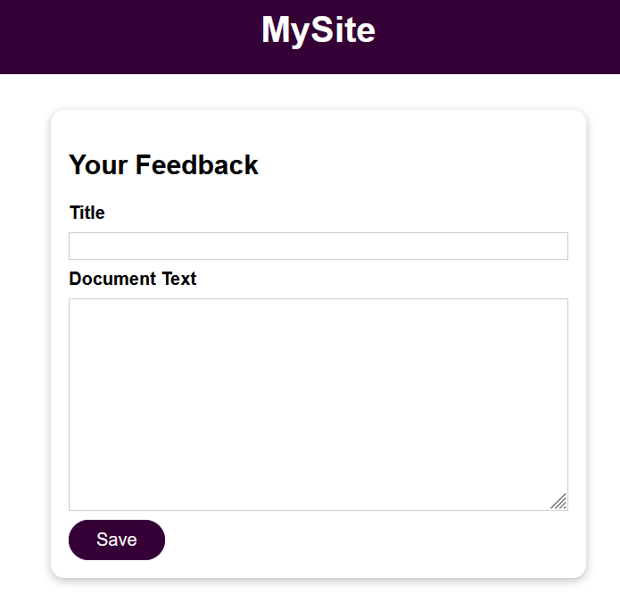

Écrivez du contenu et cliquez sur "save".

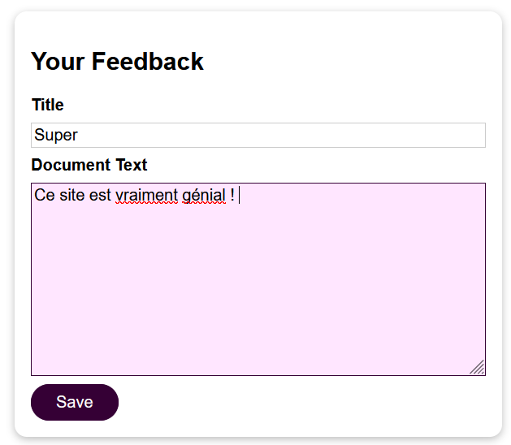

[TIP]
====
Si vous choisissez comme titre : "*Super*", un fichier nommé `super.txt` sera créé.

Nous pourrons consulter son contenu à l'adresse : http://localhost:3000//feedback/super.txt

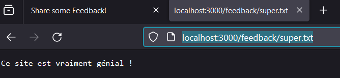

====

Ce fichier n'existe seulement que dans le conteneur, pas en local sur notre machine hôte.

*Pourquoi le fichier texte "awesome.txt" n'est-il pas visible dans le dossier "feedback" sur la machine locale ?*

Si vous consultez le dossier `feedback` sur votre machine locale, vous ne trouverez pas le fichier `awesome.txt`. Il n'existe qu'à l'intérieur du conteneur *Docker*, c'est pourquoi nous pouvons le voir là-bas, mais pas ici.

La raison en est que, dans le *Dockerfile*, nous copions notre dossier local dans l'image, et le conteneur est ensuite basé sur cette image. Cela signifie que l'image, et donc aussi le conteneur, possède son propre système de fichiers, basé sur notre dossier local ici, car nous le copions dedans.

[IMPORTANT]
====
Après cela, il n'y a plus de connexion entre notre dossier local et ce système de fichiers interne de l'image.
====

Les conteneurs** doivent être isolés**. Cela serait plutôt mal si des fichiers étaient créés à l'intérieur du conteneur et se retrouveraient soudainement quelque part sur notre disque dur, sur notre machine hôte. *Ce n'est pas du tout l'idée derrière Docker.*

Et c'est d'ailleurs la même chose qu'auparavant dans ce cours lorsque nous avons changé quelque chose dans notre code source localement sur notre machine hôte et que la modification n'a pas été reflétée dans le conteneur Docker en cours d'exécution.
Vous vous souvenez peut-être que nous avons dû : 

* Reconstruire l'image, copier le code modifié,
* Créer une nouvelle image basée sur celle-ci, et ensuite les conteneurs fonctionnant sur la base de cette image modifiée auraient nos changements de code.

Pour la même raison, nous copions du code dans une image, il se trouve alors dans un système de *fichiers spécial à l'intérieur de l'image*, il est verrouillé, il n'y a pas de *connexion au dossier hôte ou à la machine hôte et au conteneur*.

[IMPORTANT]
====
Il n'y a pas de connexion entre votre conteneur ou votre image et votre système de fichiers local.
====

Vous avez juste initialisé son image une fois, vous pouvez copier un instantané de vos dossiers et fichiers locaux, mais après cela, c'est tout. Il n'y a pas de connexion, et c'est pourquoi nous ne voyons pas le fichier texte dans le dossier "feedback" ici sur notre machine hôte, dans ce dossier. Nous ne l'avons disponible qu'à l'intérieur du conteneur Docker en cours d'exécution. Là, nous pouvons y accéder, il existe là.

En résumé :

* Les conteneurs Docker ont leur propre système de fichiers, isolé de votre système local.
* Les fichiers copiés dans une image Docker sont "gelés" et ne sont pas synchronisés avec les fichiers sur votre ordinateur local.
* C'est pourquoi vous ne pouvez pas voir le fichier "awesome.txt" du conteneur Docker dans le dossier "feedback" sur votre machine locale.
* Pour que les modifications apportées aux fichiers locaux soient reflétées dans les conteneurs, vous devez recréer les images Docker correspondantes.

[IMPORTANT]
====
L'isolation des conteneurs est un concept fondamental de Docker. En comprenant ce concept, vous serez en mesure d'utiliser Docker de manière plus efficace et sécurisée.
====

Poursuivons les essais et arrêtons le conteneur :

[source,bash]
----
docker container stop feedback-app
----

Puis, lançons un nouveau conteneur puisque le précédent a été supprimé, mais cette fois-ci sans le paramètre `--rm` :

[source,bash]
----
docker container run -p 3000:80 -d --name feedback-app feedback-node
----

Si nous essayons de consulter le fichier précédemment créé, nous obtenons une erreur, car *il n'existe plus* !

Dans ce cas, écrivez un nouveau feedback.

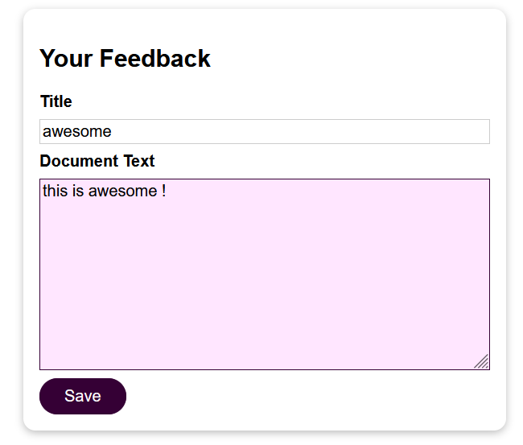

On retrouve le contenu du fichier `awesome.txt` créé :

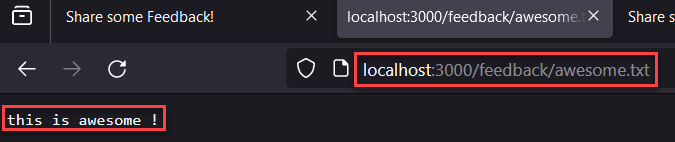

Maintenant, arrêtons le conteneur, et gardons à l'esprit que cette fois, **il ne sera pas supprimé ! **

[source,bash]
----
docker container stop feedback-app
----

Puis relançons-le :

[source,bash]
----
docker container start feedback-app
----

Nous constatons que le fichier est toujours présent !

[IMPORTANT]
====
Un conteneur qui est seulement stoppé, conserve les données qui sont stockées dans son système de fichier.

Chaque fichier créé, va rajouter une nouvelle couche (layer) dans le conteneur
====

Le système de fichiers d'un conteneur est situé à *l'intérieur de celui-ci*. Lorsque nous arrêtons et redémarrons un conteneur, le système de fichiers reste inchangé, car le conteneur lui-même n'est pas modifié. Cependant, lorsque nous supprimons un conteneur, toutes les données contenues dans celui-ci sont effacées, parce que le conteneur est supprimé dans son ensemble.

Si nous exécutons un nouveau conteneur basé sur la même image, toutes les données créées et stockées dans le conteneur précédent sont perdues, car l'image est en *lecture seule*. En effet, lorsqu'un fichier est généré dans un conteneur,** il n'est pas écrit dans l'image**, mais dans une couche en *lecture-écriture* qui est ajoutée par-dessus. Ainsi, *si le conteneur est supprimé*, nous ne disposons plus que de l'image originale, qui n'a jamais été modifiée. Lorsque nous démarrons un nouveau conteneur, celui-ci démarre avec le même système de fichiers de base, sans les modifications apportées par le conteneur précédent.

Cette isolation des conteneurs est *un concept fondamental de Docker*. Cependant, cela peut poser un problème dans certaines situations. En effet, lorsque nous supprimons un conteneur, nous perdons également toutes les données qui y étaient stockées. Dans de nombreuses applications, il est important de conserver ces données, même si le conteneur est supprimé. Par exemple, si nous gérons des comptes utilisateur ou des données produites soumises par les utilisateurs, nous ne voulons pas que ces données disparaissent soudainement.

*En pratique, il est courant de supprimer des conteneurs et d'en créer de nouveaux.*

Par exemple, si nous modifions notre code et créons une nouvelle image, nous n'allons pas redémarrer l'ancien conteneur, mais plutôt utiliser *le nouveau conteneur* qui utilise le dernier instantané de code. Dans ce cas, nous perdrions toutes les données stockées dans l'ancien conteneur.

Maintenant que nous avons compris le problème et que nous savons que les données stockées dans un conteneur sont perdues lorsque celui-ci est supprimé, il est important de trouver une solution pour conserver ces données importantes.

=== Introduction aux `Volumes`

Maintenant que nous connaissons le problème, quelle est la solution ?

Docker dispose d'une fonctionnalité intégrée appelée `volumes`, qui permet de résoudre le problème de perte de données que nous avons vu précédemment.
Mais comment utiliser les volumes dans notre application ?

Tout d'abord, il est important de comprendre ce que sont les *volumes* et comment ils fonctionnent. Les volumes sont des *dossiers* situés *sur la machine hôte*, et non dans le conteneur ou l'image. Ces dossiers sont *montés*, c'est-à-dire qu'ils sont *rendus disponibles ou mappés*, dans les conteneurs.

[NOTE]
====
Les volumes sont donc des dossiers sur la machine hôte, que Docker peut utiliser et qui sont ensuite mappés à des dossiers à l'intérieur d'un conteneur Docker.
====

Cela peut sembler similaire à l'instruction `COPY` du fichier *Dockerfile*, mais il est important de noter que cette instruction ne fait qu'une copie instantanée des fichiers et dossiers spécifiés, qui sont ensuite copiés dans l'image.
*Il n'y a pas de relation ou de connexion continue.*

Avec les `volumes`, c'est différent. Vous pouvez vraiment *connecter un dossier* à l'intérieur du conteneur à un dossier à l'extérieur du conteneur,** sur la machine hôte**.
Les modifications apportées à l'un des dossiers seront répercutées dans l'autre.

[NOTE]
====
Si vous ajoutez un *fichier sur la machine hôte*, il sera accessible à l'intérieur du conteneur, et si le conteneur ajoute un *fichier dans ce chemin mappé*, il sera disponible à l'extérieur du conteneur, sur la *machine hôte*.
====

Grâce à ce mécanisme, les volumes permettent de conserver les données. Les volumes continuent d'exister même si un conteneur est arrêté. 

[IMPORTANT]
====
C'est important. Si vous ajoutez un volume à un conteneur, le volume ne sera pas supprimé lorsque le conteneur sera supprimé, il survivra, et donc les données contenues dans le volume survivront également.
====

Les conteneurs peuvent lire et écrire des données à partir et vers un volume.
C'est une fonctionnalité puissante que nous pouvons utiliser pour les dossiers que nous
voulons accéder depuis l'extérieur de notre conteneur, et/ou simplement pour les données
qui doivent survivre à l'arrêt et à la suppression d'un conteneur.

Car si les données sont également enregistrées à l'extérieur du conteneur, elles survivront à la suppression du conteneur.

=== Un premier essai raté

Comment pouvons-nous maintenant ajouter un volume à notre conteneur ?

L'une des façons les plus simples d'ajouter un volume consiste à ajouter une instruction spéciale au `Dockerfile`. Nous pouvons ajouter l'instruction `VOLUME`.

[source,bash]
.Extrait du fichier Dockerfile
----

VOLUME [""]

----

Cette instruction attend un tableau où nous pouvons spécifier différents chemins dans le conteneur. Ceux-ci seront utilisés dans notre code d'application, que nous voulons conserver.

Dans notre application de démonstration, nous enregistrons les fichiers permanents dans le dossier `feedback`.

[source,javascript]
.Extrait du fichier server.js
----
// some code
const finalFilePath = path.join(__dirname, 'feedback', adjTitle + '.txt');
// some code
----

Je sauvegarde également des fichiers dans le dossier `temp`, mais comme le nom l'indique, ce dossier n'est que temporaire. *Il n'a pas besoin d'être sauvegardé.*

[source,javascript]
.Extrait du fichier server.js
----
// some code
const tempFilePath = path.join(__dirname, 'temp', adjTitle + '.txt');
// some code
----

Mais tout ce qui se trouve dans le dossier `feedback` doit être sauvegardé.

Dans mon code d'application, j'écris dans le dossier `feedback`, qui se trouve bien sûr à l'intérieur du dossier d'application défini par l'instruction `WORKDIR`, car c'est notre répertoire de travail général où nous avons copié l'ensemble de l'application.

Par conséquent, le volume que je souhaite enregistrer est `/app/feedback`.

[source,bash]
.Extrait du fichier Dockerfile
----
......
VOLUME ["/app/feedback"]
CMD [ "node", "server.js" ]
----

Il s'agit du chemin à l'intérieur de mon conteneur, ce qui est important, à l'intérieur de mon conteneur, qui doit être mappé à un dossier à l'extérieur du conteneur où les données doivent donc survivre.

[NOTE]
.Vous vous demandez peut-être comment définir le dossier de la machine hôte et le faire correspondre avec le volume dans le conteneur ?
====

Je reviendrai sur ce point plus tard. Pour l'instant, nous laissons Docker contrôler cela, et je reviendrai sur les raisons pour lesquelles cela a du sens.
====

Si j'enregistre le Dockerfile avec cette instruction ajoutée, nous pouvons reconstruire l'image.

[source,bash]
----
docker build -t feedback-node:volumes .
----
Nous ajoutons le tag `volume` à notre image `feedback-node` pour signifier que c'est la même image qu'auparavant, mais avec cette fonctionnalité de volume supplémentaire.

Supprimons l'ancien conteneur et créons un nouveau basé sur cette nouvelle image :
[source,bash]
----
docker stop feedback-app
docker rm feedback-app
docker container run -d -p 3000:80 --rm --name feedback-app feedback-node:volumes
----

Nous pouvons également ajouter le paramètre `--rm` pour supprimer ce conteneur s'il est arrêté, car grâce aux volumes, cela ne devrait plus poser de problème.

Lançons notre application et créons un nouveau feedback :

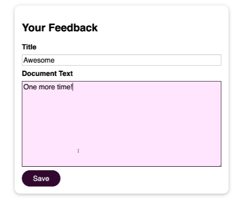

L'application "crash", semble chercher quelque chose à l'infini !
Il est donc clair que quelque chose s'est mal passé. Et pour voir ce qui s'est mal passé, j'exécuterai `docker logs feedback-app` pour examiner la sortie de ce conteneur.

[source,bash]
----
docker logs feedback-app
----

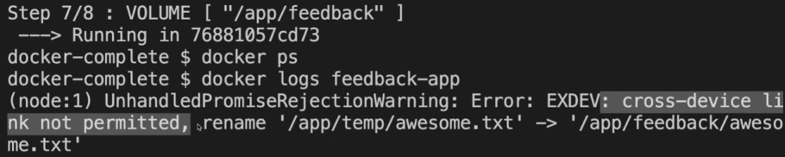

Il semblerait que l'erreur provienne du fait de vouloir déplacer le fichier `awesome.txt` du dossier `temp` vers le dossier `feedback`.

Et cela doit avoir quelque chose à voir avec notre volume récemment ajouté, car cela fonctionnait auparavant.

Cette erreur que nous rencontrons provient de la méthode de renommage `fs.rename` que j'utilise ici dans *Node* pour être précis.

[source,javascript]
----
include::./code/data-volumes-01-starting-setup/server.js[lines=39]
----

*Ce n'est pas un cours Node*, je ne vais donc pas vous ennuyer avec les détails. Mais en fin de compte, la méthode de renommage ne fonctionne pas si le fichier est déplacé sur plusieurs périphériques

Et grâce au volume que nous avons spécifié ici, c'est en quelque sorte ce qui se passe sous le capot.

Docker ne déplace pas simplement le fichier vers un autre dossier à l'intérieur du système de fichiers du conteneur, mais il le déplace hors du conteneur.

Et la méthode `fs.rename` ne tolère pas ce genre d'opération.

La solution de contournement est simple.

Vous pouvez remplacer la méthode `fs.rename` par la méthode `fs.copyFile` et ajouter ensuite simplement une nouvelle ligne où vous appelez `fs.unlink`

[source,javascript]
.Dans le fichier server.js : REMPLACEZ CECI
----
await fs.writeFile(tempFilePath, content);
  exists(finalFilePath, async (exists) => {
    if (exists) {
      res.redirect('/exists');
    } else {
      await fs.rename(tempFilePath, finalFilePath);
      res.redirect('/');
    }
  });
----

[source,javascript]
.Dans le fichier server.js : PAR CELA
----
await fs.writeFile(tempFilePath, content);
  exists(finalFilePath, async (exists) => {
    if (exists) {
      res.redirect('/exists');
    } else {
      await fs.copyFile(tempFilePath, finalFilePath);
      await fs.unlink(tempFilePath);
      res.redirect('/');
    }
  });
----

Bien sûr, nous devons maintenant reconstruire notre image, car nous avons modifié le code source et cela n'est toujours pas pris en compte automatiquement à ce stade.

Il faut arrêter le conteneur qui utilise l'image :
[source,bash]
----
docker stop feedback-app
----

Puis, nous supprimerons l'image `feedback-node:volumes`.

[source,bash]
----
docker rmi feedback-node:volumes
----

Et reconstruisons l'image et lançons un conteneur :

[source,bash]
----
docker build -t feedback-node:volumes .
docker container run -d -p 3000:80 --rm --name feedback-app feedback-node:volumes
----

Démarrons l'application et ajoutons un *feedback* nommé : *awesome* puis allez à l'URL : http://localhost:3000/feedback/awesome.txt

L'application fonctionne désormais correctement !

Faisons un autre test ...

Arrêtons le conteneur encore une fois, puis remontons un autre conteneur :

[source,bash]
----
docker stop feedback-app
docker container run -d -p 3000:80 --rm --name feedback-app feedback-node:volumes
----

Allons à l'adresse : http://localhost:3000/feedback/awesome.txt

Que se passe-t-il ? Nous avons un message d'erreur disant que le fichier n'existe pas !!

Le fichier n'est plus là !

Alors, qu'est-ce qui se passe avec cette affaire de volumes ? Pourquoi est-ce que je vous enseigne des choses qui ne fonctionne pas ou qui casse notre code ? Quelle est l'idée derrière cela ? Pourquoi cela ne fonctionne-t-il pas ?

=== Les volumes à la rescousse !

Dans Docker, nous disposons de plusieurs mécanismes de stockage de données externes, deux pour être précis : les `volumes` et les `bind mounts`. Nous verrons les `bind mounts` plus tard et pour l'instant, nous allons nous concentrer sur les volumes.

Il existe deux types de volumes, chacun ayant ses propres objectifs et cas d'utilisation.

Jusqu'à présent, nous utilisions des *volumes anonymes*. Plus précisément, avec l'instruction `VOLUME` dans le `Dockerfile`, nous ajoutons un volume anonyme à cette image et les données associées aux conteneurs basés sur cette image.

[source,bash]
.Extrait d'un .Dockerfile
----
VOLUME ["/app/feedback"]
----

Il existe également des volumes nommés, que nous n'avons pas encore utilisés.

Dans les deux cas, *anonyme* ou *nommé*, Docker crée un dossier et un chemin d'accès sur votre machine hôte.

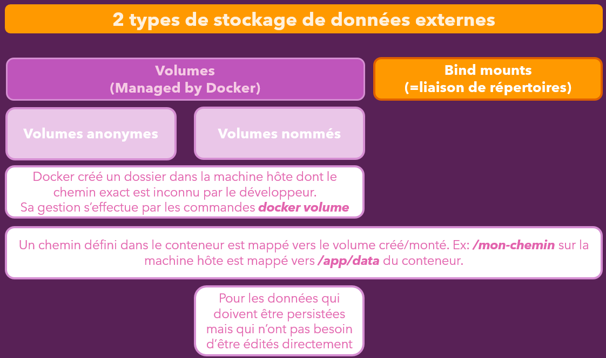

Cependant, vous ne savez pas où. En effet, dans le Dockerfile, nous n'avons spécifié qu'un chemin d'accès à l'intérieur du conteneur, et pas de chemin d'accès sur la machine hôte.

Le seul moyen d'accéder à ces volumes est d'utiliser la commande `docker volume`.

[source,bash]
----
docker volume --help
----

La commande `docker volume ls` permet de lister tous les volumes actuellement gérés par Docker.

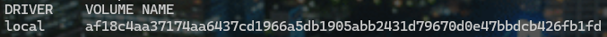

Vous remarquerez que le nom du volume est énigmatique, car il est généré automatiquement puisqu'il s'agit d'un volume anonyme.

Si nous arrêtons le conteneur de notre application `feedback`, ce volume anonyme disparaît. En effet, il n'est géré que tant que le conteneur existe.

[CAUTION]
====
 Cela ne résout pas le problème de la disparition des données à l'arrêt du conteneur.
====

Nous verrons plus tard dans quel cas les volumes anonymes peuvent être utiles, mais examinons maintenant les volumes nommés.

Le concept clé des *volumes nommés* (et des `bind mounts` que nous verrons plus tard) est le suivant :

* *Un chemin d'accès défini dans un conteneur* est mappé à un volume créé, c'est-à-dire à un *chemin d'accès créé sur la machine hôte*.

Cependant,** le chemin sur la machine hôte est inconnu**, car géré par Docker et caché quelque part sur votre ordinateur. Il n'est pas destiné à être accessible directement.

Heureusement, avec *les volumes nommés*, les volumes persistent au redémarrage du conteneur.

[IMPORTANT]
====
Les dossiers sur votre disque dur seront conservés.
====

Ainsi, si vous démarrez de nouveaux conteneurs par la suite, les volumes seront de nouveau disponibles, et toutes les données stockées dans ce dossier le seront également.

Les** volumes nommés** sont donc parfaits pour les données persistantes, celles que vous n'avez pas besoin de modifier ou de visualiser directement, car vous n'avez pas vraiment accès à ce dossier sur votre machine hôte.

Nous ne pouvons pas créer de *volumes nommés dans un Dockerfile*, nous devons donc supprimer cette instruction de notre `.Dockerfile` de l'application `Feedback`.

Supprimer dans le Dockerfile l'instruction :
`VOLUME`

Et reconstruire l'image  !

[source,bash]
----
docker rmi feedback-node:volumes
docker build -t feedback-node:volumes .
----

Nous devons créer un volume nommé lors du démarrage d'un conteneur.

L'option``-v`` de la commande docker run permet d'ajouter un volume à un conteneur.

Contrairement au *Dockerfile*, il s'agit ici d'un volume nommé.

Nous spécifions toujours *le chemin d'accès à l'intérieur du système de fichiers du conteneur que nous voulons enregistrer*.  Devant ce chemin, nous indiquons maintenant un nom de notre choix, par exemple *feedback* qui correspondra à un nom de volume.

[source,bash]
----
docker run -d -p 3000:80 --rm --name feedback-app -v feedback:/app/feedback feedback-node:volumes
----

Docker va alors créer un dossier sur la machine hôte qui sera nommé `feedback`.

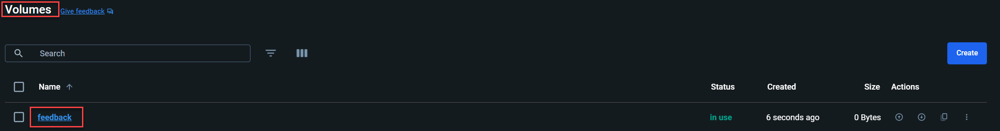

La différence principale avec les volumes anonymes est que les volumes nommés ne seront pas supprimés par Docker lorsque le conteneur s'arrête. Les volumes anonymes sont supprimés, car ils sont recréés chaque fois qu'un conteneur est créé.

Si nous arrêtons maintenant le conteneur avec `docker stop feedback-app`, le volume sera toujours là, même si le conteneur a été supprimé à cause de l'option `--rm`.

Par conséquent, si nous redémarrons un nouveau conteneur avec le même volume, nos données seront toujours présentes.

Vérifions d'abord le volume avec `docker volume ls`. Vous verrez que le nom que nous avons choisi est toujours là, même si le conteneur a été arrêté.

Enfin, si nous redémarrons le conteneur en utilisant docker run avec la même option `-v` et le même nom de volume, les données seront toujours là.

[IMPORTANT]
====
Nous avons donc finalement réussi à conserver les données à l'aide des volumes nommés.
====

[WARNING]
.Supprimer des volumes anonymes
====
Nous avons vu que les *volumes anonymes* sont supprimés automatiquement lorsqu'un conteneur est supprimé.

Cela se produit lorsque vous démarrez/exécutez un conteneur avec l'option `--rm`.

Toutefois, si vous démarrez un conteneur sans cette option, le **volume anonyme NE sera PAS supprimé**,
même si vous supprimez le conteneur (avec `docker rm` ...).

Cependant, si vous recréez et réexécutez le conteneur, (c'est-à-dire si vous exécutez à nouveau `docker run` ...),
un nouveau volume anonyme sera créé. Donc, même si le volume anonyme n'a pas été supprimé automatiquement, il ne sera pas non plus utile, car un autre volume anonyme sera attaché la prochaine fois que le conteneur démarrera (c'est-à-dire que vous avez supprimé l'ancien conteneur et en avez exécuté un nouveau).

Vous finirez par accumuler une pile de volumes anonymes non utilisés.

Vous pouvez les supprimer via :

* `docker volume rm <nom ou id du volume>`

ou

* `docker volume prune`
====

=== Les Liaisons de répertoires (bind mounts)

Nous allons aborder les *liaisons de répertoires* ("bind mounts") avant de revenir aux volumes anonymes.

Un problème récurrent en développement est que toute modification apportée au code source (par exemple dans le fichier `server.js` ou un fichier HTML) n'est pas immédiatement reflétée dans le conteneur en cours d'exécution, à moins de reconstruire l'image Docker.

Imaginons que nous ayons une application en cours d'exécution. Si nous ajoutons "s'il vous plaît" après "votre avis" dans le fichier `feedback.html` et que nous sauvegardons ce fichier, en rechargeant la page, nous ne verrons pas apparaître "s'il vous plaît". Cela se produit, car nous ne copions qu'un *instantané* du dossier dans l'image Docker lors de sa création. Les modifications ultérieures ne sont donc pas reflétées dans l'image, et par conséquent dans le conteneur.

En phase de développement, il est crucial que ces changements soient immédiatement pris en compte sans avoir à reconstruire l'image et redémarrer le conteneur à chaque modification.

Les liaisons de répertoires sont similaires aux volumes, mais avec une différence clé :

* *Les volumes*, eux, sont gérés par Docker et nous ne savons pas où ils se trouvent sur notre système hôte.
* Les *liaisons de répertoires* (_bind mount_) quant à eux,  nous permettent de définir le chemin exact sur notre machine hôte où le chemin interne du conteneur doit être mappé.

En utilisant une liaison de répertoires pour notre code source, nous assurons que le conteneur utilise le code le plus récent, plutôt que l'instantané initialement copié dans l'image. Cela est particulièrement utile pour les *données persistantes et modifiables*.

Les liaisons de répertoires ne peuvent pas être définies dans le `Dockerfile` car ils sont spécifiques *aux conteneurs* et *non à l'image*. Nous devons les configurer depuis *le terminal lors de l'exécution du conteneur.*

Tout d'abord, arrêtons le conteneur en cours d'exécution :

[source,bash]
----
docker stop feedback-app
----

Ensuite, créons un nouveau conteneur avec un montage de liaison qui va lier un répertoire de la machine hôte avec l'un de notre conteneur.

[source,bash]
----
docker container run -d -p 3000:80 --rm --name feedback-app -v /chemin/absolu/de/votre/projet:/app feedback-node:volumes
----

Remplacez : `/chemin/absolu/de/votre/projet` par le chemin du répertoire contenant vos codes sources.
Pour ma part le chemin sera :

`C:\Users\baptiste\Desktop\demo_docker\data-volumes-docker`

[source,bash]
----
docker container run -d -p 3000:80 --rm --name feedback-app -v C:\Users\baptiste\Desktop\demo_docker\data-volumes-docker:/app feedback-node:volumes
----

Nous pouvons aussi mettre le mapping entre des doubles quotes si les caractères spéciaux de votre chemin pose un problème :

[source,bash]
----
docker container run -d -p 3000:80 --rm --name feedback-app -v "C:\Users\baptiste\Desktop\demo_docker\data-volumes-docker:/app" feedback-node:volumes
----

Si vous exécutez la commande, tout semble fonctionner correctement, mais nous constatons que le conteneur a été supprimé !
Retirons alors le paramètre `--rm`

[source,bash]
----
docker container run -d -p 3000:80 --name feedback-app -v "C:\Users\baptiste\Desktop\demo_docker\data-volumes-docker:/app" feedback-node:volumes
----

[TIP]
====
Si vous ne voulez pas toujours copier et utiliser le chemin complet, vous pouvez utiliser ces raccourcis :

*macOS / Linux :* `-v $(pwd):/app`

*Windows :* `-v "%cd%":/app` ou
====

Et regardons maintenant les `logs` pour comprendre pourquoi l'application a le status `Exited`.

[source,bash]
----
docker logs feedback-app
----

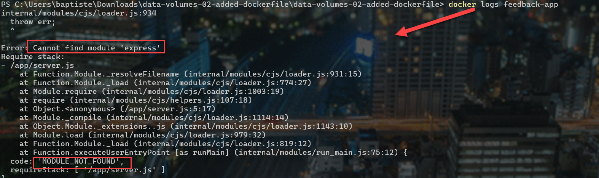

Le code de notre application ne s'est pas exécuté, car il manque le module Express ! Pourtant, si l'on regarde le fichier `Dockerfile` :

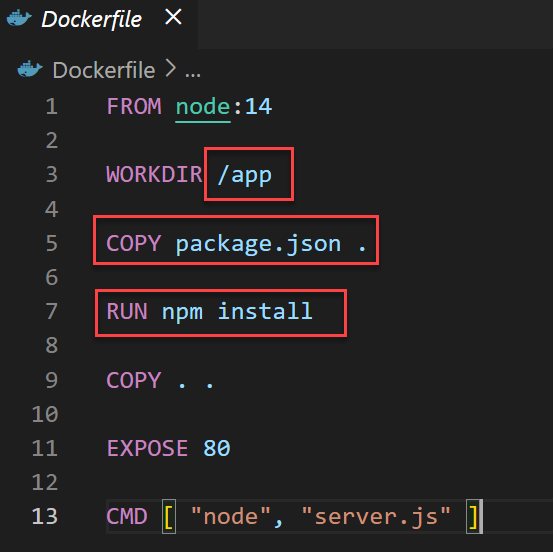

Nous constatons que l'image contient bien les instructions d'installation des dépendances de l'application. Express devrait en théorie être inclus !

[TIP]
====
Si vous ne voulez pas toujours utiliser le chemin complet d'un volume, vous pouvez utiliser ces raccourcis qui prendront pour valeur le chemin du répertoire dans lequel vous êtes avec la console :

*macOS / Linux :* `-v $(pwd):/app`

*Windows :* `-v "%cd%":/app` ou `-v $PWD/`

Je ne les utilise pas dans les cours, car je veux montrer une approche qui fonctionne pour tout le monde, mais vous pouvez utiliser ces raccourcis en fonction du système d'exploitation sur lequel vous travaillez pour économiser du temps de saisie.

====

=== Combiner et fusionner différents volumes

Considérons cette erreur générée précédemment, quel pourrait être exactement le problème avec ce volume nouvellement ajouté ici ?

Etudions le `.Dockerfile` :

[source,bash]
----
FROM node:14

WORKDIR /app

COPY package.json .

RUN npm install

COPY . .

EXPOSE 80

CMD [ "node", "server.js" ]
----

Dans le *Dockerfile*, nous copions `package.json` puis lançons un `npm install`.
Ensuite, tout le dossier de notre application est copié initialement lorsque l'image est créée,
 et nous installons toutes les dépendances.

Le fichier `server.js` a besoin du package `express` qui existe dans le conteneur, grâce à `npm install` réalisé lors de la création de l'image, mais qui n'existe pas dans ma configuration locale, car je n'ai jamais exécuté `npm install` là-bas.

Gardez à l'esprit que lorsque nous créons le conteneur avec l'option `-v` ,nous montons le contenu du dossier, dans `/app` du conteneur.

En fin de compte, cela signifie que nous** écrasons le dossier de l'application** à l'intérieur du conteneur avec notre dossier local !

Les étapes du Dockerfile deviennent alors inutiles, car en local nous n'avons pas le dossier `node_modules` avec toutes les dépendances nécessaires à cette application, et c'est la raison pour laquelle notre application génère l'erreur vue précédemment.

Alors, comment pouvons-nous résoudre ce problème ?

Comprenons d'abord comment les conteneurs interagissent avec les volumes et les répertoires liés.

Si nous avons un conteneur, et que nous n'avons pas de volume ni de répertoire lié, nous pouvons monter les deux dans le conteneur avec l'option -V, que je vous ai montrée il y a quelques minutes.

Cela signifie que certains dossiers à l'intérieur du conteneur sont montés, ou sont connectés, à des dossiers de la machine hôte.

.Volumes liés aux dossiers d'un conteneur.
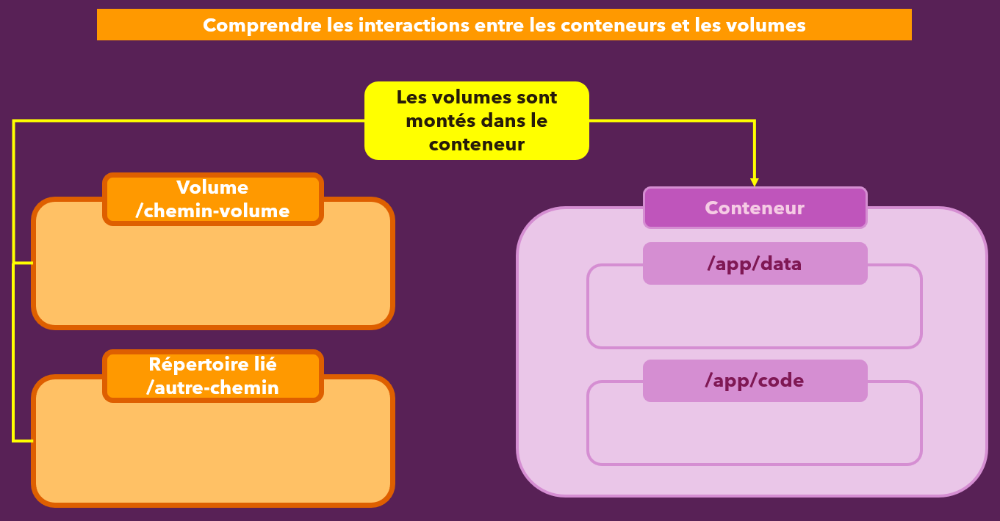

Maintenant, imaginons que nous avions déjà des fichiers à l'intérieur du conteneur au moment du montage.
Dans ce cas, ces fichiers existeront également dans le volume extérieur, et si vous créez un nouveau fichier dans le dossier `/app/data` du conteneur, il sera également ajouté dans le dossier de la machine hôte.

.Les données présentes initialement dans le conteneur apparaissent dans le volume local.
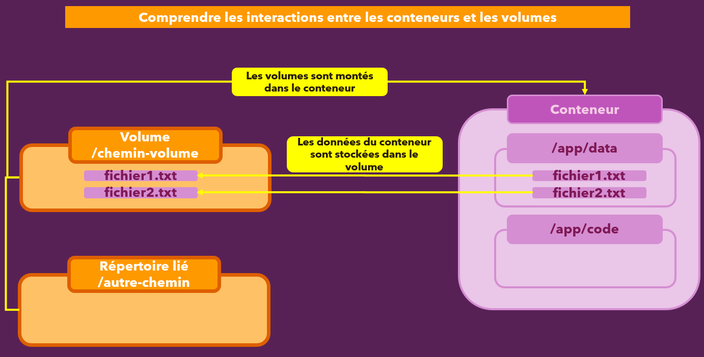

Prenons un autre cas de figure.

Si le conteneur se lance, et qu'il trouve des fichiers dans le volume, et qu'il n'a pas encore de fichiers en interne comme dans le répertoire `/app/code` associé, il charge alors les fichiers du volume. C'est ce que nous utilisons avec les répertoires liés (_Bind Mount_).

.Les données présentes initialement dans le volume apparaissent dans le conteneur.
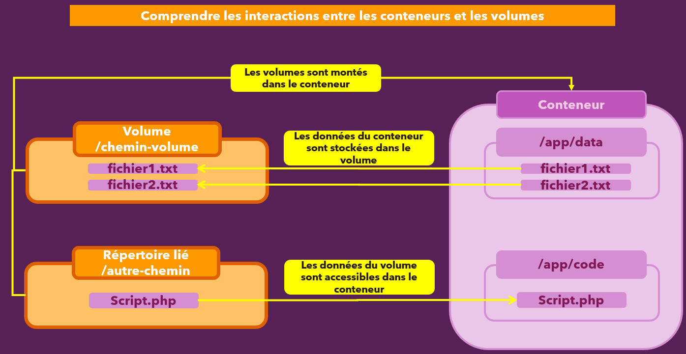

Revenons à l'étude de notre Dockerfile et de notre image générée :

Dans le conteneur, nous aurons des fichiers dans le dossier ``/app `` à cause des instructions suivantes :

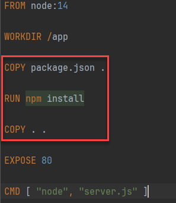

À l'intérieur du conteneur, nous avons des fichiers dans le dossier de l'application en raison des instructions spécifiées. De plus, nous avons des fichiers et des dossiers à l'extérieur du conteneur, dans le dossier correspondant sur notre machine hôte locale, grâce au paramètre -v.

Docker ne remplace pas les fichiers de notre machine hôte, car ce serait désastreux. Une telle action pourrait entraîner la perte de nombreuses données importantes sur notre ordinateur par inadvertance. Ainsi, ce n'est pas ce qui se passe ici.

Docker ne remplacera pas notre dossier local dans ce contexte. En revanche, ce sont les dossiers de la machine hôte et leur contenu qui écraseront ceux présents dans le conteneur Docker. C'est là que réside le problème, car cela entraîne la suppression de `node_modules` et d'autres éléments similaires.

Pour résoudre ce problème, il est nécessaire d'informer *Docker* que certaines parties de son système de fichiers interne ne doivent pas être écrasées par des fichiers externes en cas de conflit, comme c'est le cas ici. Cela peut être accompli *en ajoutant un autre volume au conteneur Docker, spécifiquement un volume anonyme*.
Un volume est considéré comme anonyme lorsqu'il n'a pas de nom explicite.
Ajoutons un volume anonyme supplémentaire avec `-v app/node_modules` lors de la création du conteneur.
Il aurait eu un nom si nous aurions ajouté un libellé devant avec les ``:`` comme : `-v nom_volume:app/node_modules`. En l'absence, c'est bien un volume anonyme.

[source,bash]
----
docker container run -d -p 3000:80 --name feedback-app -v "C:\Users\baptiste\Desktop\demo_docker\data-volumes-docker:/app" -v app/node_modules feedback-node:volumes
----

Nous aurions pu aussi ajouter dans le `.Dockerfile` une instruction équivalente :

[source,bash]
----
VOLUME ["app/node_modules"]
----

Ce qui nous obligerait ici à reconstruire notre image. Pour éviter cela, nous intégrerons ce volume via le paramètre `-v`.

Pourquoi ce volume est-il si utile ici ?

Docker évalue toujours tous les volumes définis sur un conteneur, et en cas de conflit, le chemin interne le plus long l'emporte. Par exemple, ici, nous avons un conflit : 

* Un volume `app` est lié à quelque chose, et un volume `app/node_modules` est également lié à quelque chose.

[NOTE]
====
Même si nous n'avons pas attribué de nom, gardez à l'esprit que même les volumes anonymes sont gérés par Docker, et il y a un dossier mappé quelque part sur la machine hôte. Ce dossier est simplement supprimé lorsque le conteneur est supprimé, mais il existe sur la machine hôte, même pour les volumes anonymes.
====

Ainsi, Docker voit qu'il y a *un volume mappé* au dossier `app` et un *volume mappé* au dossier `app/node_modules`. La *règle simple* de Docker est que le chemin le plus long et le plus spécifique l'emporte.

Cela signifie que nous pouvons toujours mapper un dossier de la machine hôte dans le dossier `app` du conteneur, mais le dossier `node_modules` à l'intérieur de `app`, qui est créé par la commande `npm install`, survivra et écrasera le dossier éventuel du même nom,  venant de l'extérieur. Dans notre exemple, puisque nous ne passons en fait aucun dossier `node_modules` de l'extérieur, le dossier `node_modules` créé pendant la création de l'image survivra et coexistera avec le mappage.

Après cette explication, si nous arrêtons et supprimons le conteneur en cours d'exécution, nous pouvons le relancer avec ce volume anonyme supplémentaire.

En ajoutant également l'option `--rm`, nous démarrons le conteneur et l'application fonctionne à nouveau.

Pour tester cela, nous voyons sous `feedback`, que le fichier `awesome.txt` est toujours présent.

Maintenant, nous avons un avantage supplémentaire :

Si nous modifions quelque chose dans notre fichier *HTML*, comme supprimer le texte "please" et sauvegarder, en rechargeant, nous voyons le changement instantanément sans avoir à reconstruire l'image. Cela est possible grâce à ce montage lié, qui fonctionne, car nous avons ajouté ce volume anonyme pour nous assurer que le dossier `node_modules` ne soit pas écrasé par le contenu de notre montage lié.

==== (NODEJS) Utiliser Nodemon dans un conteneur

Nous avons vu que nous pouvons éditer le fichier HTML et voir le rendu en rechargeant la page du navigateur !

Essayons maintenant de modifier le fichier `server.js` :

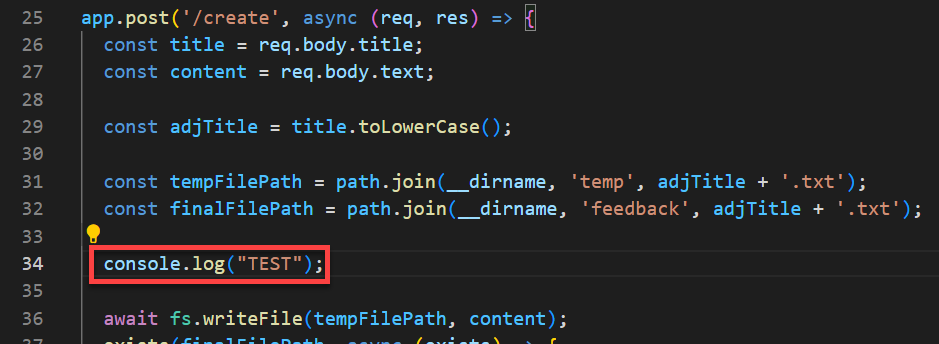

Même en rafraichissant le navigateur, la modification n'a pas été prise en compte.

( Ajoutez un Feedback et consultez les logs du conteneur : `docker logs feedback-app` ).

Le code Javascript est exécuté par NodeJs qui génère donc le rendu des pages et les renvoient au navigateur.

Nous devons donc redémarrer le serveur NodeJs qui se trouve dans le conteneur.

La solution la plus simple est d'arrêter le conteneur et de le relancer.

[source,bash]
----
docker container stop feedback-app
docker contaier start feedback-app
----

Si vous aviez mis l'option  `--rm` lors de la création du conteneur, alors créez de nouveau le conteneur avec la commande vue plus haut, car il aura été supprimé lors de son arrêt.

[source,bash]
----
docker container run -d -p 3000:80 --name feedback-app -v "C:\Users\baptiste\Desktop\demo_docker\data-volumes-docker:/app" -v app/node_modules feedback-node:volumes
----

Testez de nouveau l'application et consultez les `logs`.

Vous devriez être en mesure de créer un nouveau *Feedback* et de voir le message "TEST" dans les `logs` du conteneur.

Afin d'éviter de redémarrer le serveur NodeJs à chaque modification, nous allons installer un utilitaire qui se nomme `Nodemon` et qui a pour mission de détecter quand un fichier JS est modifié et de redémarrer notre serveur NOde automatiquement.

Ajoutons dans le fichier `package.json` de l'application, l'installation de `nodemon` ainsi que son utilisation via une commande `npm start`:

[source,bash]
----
{
  "name": "data-volume-example",
  "version": "1.0.0",
  "description": "",
  "main": "server.js",
  "author": "",
  "license": "ISC",
  "scripts":{
    "start" : "nodemon server.js"
  },
  "dependencies": {
    "body-parser": "^1.19.0",
    "express": "^4.17.1"
  },
  "devDependencies": {
    "nodemon": "3.1.4"
  }
}

----

Puis, nous modifierons l'instruction CMD du Dockerfile par:

[source,bash]
----

CMD ["npm", "start"]
----

Supprimons l'image courante et les conteneurs, puis reconstruisons une nouvelle image basée sur cette nouvelle configuration et recréons un conteneur.
  
Lorsque nous modifions nos scripts Javascript, maintenant, le serveur Nodejs se met à jour automatiquement. 

[IMPORTANT]
====
Si vous êtes sous Windows avec WSL 2 pour lancer Docker, vous constaterez que les changements ne sont pas détectés !!

Habituellement, les frameworks de notification de fichiers dépendent de inotify sur Linux, qui lui-même repose sur le système de fichiers du noyau. Si les fichiers sont modifiés sur l'hôte, le noyau de l'hôte enregistrera les événements du système de fichiers. Étant donné que Docker Desktop exécute toujours le moteur Docker dans une machine virtuelle utilitaire (utility vm), le conteneur utilisera le noyau de la machine virtuelle utilitaire et, par conséquent, ne pourra pas enregistrer les événements du système de fichiers de l'hôte.

Reportez-vous au sous-titre suivant pour résoudre ce problème :

====

==== (NODEJS) Windows, WSL2 et Bond Mounts

Lorsqu'on travaille avec Windows et WSL2, on peut rencontrer des problèmes liés à l'utilisation des "Bind Mounts". Veuillez noter que ces instructions ne s'appliquent que si vous utilisez Windows avec WSL2 et Docker. Elles ne s'appliquent pas si vous n'utilisez pas WSL2 !

En particulier, les événements de modification de fichiers pourraient ne pas être propagés au conteneur - c'est-à-dire que les processus s'exécutant à l'intérieur du conteneur (comme "nodemon") ne sont pas informés des modifications des fichiers.

Il existe trois principales solutions et contournements :

===== Solution efficace, simple, mais sale ...

Cette solution est « rapide et sale » mais elle fait le travail.

Pour Nodemon, vous pouvez passer du mode "notifie-moi" "je recherche moi-même les modifications" en modifiant le script de démarrage dans le fichier `package.json` comme ceci :

[source,bash]
----
 {
  "scripts": "nodemon -L server.js"
 }
----

Pour les applications *React* (où nous voulons également surveiller les modifications de fichiers), vous pouvez utiliser une astuce similaire.

Ajoutez simplement une variable d'environnement à votre commande docker run :

[source,bash]
----
docker run -e CHOKIDAR_USEPOLLING=true <options> <image>
----

