:_chapter:
[[images]]
= Les images Docker
include::../../../run_app.adoc[]

## Introduction aux images Docker

Dans ce chapitre, nous allons traiter deux concepts fondamentaux de Docker : les images et les conteneurs. Il est essentiel de connaître et de comprendre ces deux concepts pour utiliser Docker de manière efficace.

Dans la présentation de Docker, nous avons brièvement évoqué le concept de conteneurs. À présent, nous allons explorer la notion d'image Docker pour saisir le lien qui les unit aux conteneurs.

Nous allons apprendre comment utiliser des images existantes, ainsi que créer nos propres images personnalisées.

Plongeons maintenant dans ce nouveau concept pour travailler pleinement avec Docker.

## Images et Conteneurs : Quelle différence ?

Comme mentionné précédemment, lorsque nous utilisons `Docker`, nous ne disposons pas seulement de conteneurs, mais aussi d'images.

*Quelle est la différence entre ces deux concepts et pourquoi avons-nous besoin des deux ?*

Nous savons que les conteneurs, en fin de compte, sont de petits paquets qui contiennent tout ce dont nous avons besoin pour exécuter une application : l'application elle-même, ses dépendances, ses bibliothèques, ses variables d'environnement, ses serveurs, etc. En d'autres termes, c'est l'environnement complet nécessaire pour exécuter l'application.

[NOTE]
====
Un conteneur est donc un *processus*, car c'est finalement ce que nous exécutons sur notre machine.
====

D'autre part, une image est un fichier contenant tout ce dont nous avons besoin pour créer un conteneur. Une image est un modèle, une sorte de gabarit qui nous permet de créer un conteneur. Elle contient le code source et les outils nécessaires pour exécuter une application.

Le rôle du conteneur est de lancer et d'exécuter l'application.

[NOTE]
====
À partir d'une seule image, nous pouvons créer plusieurs *conteneurs* qui exécutent la même application dans le même environnement.
====

Prenons l'exemple d'une application web écrite en `Node.js`. Nous la définissons une seule fois dans une *image*, puis nous pouvons exécuter cette application plusieurs fois dans des conteneurs différents, sur différentes machines, sur différents serveurs.

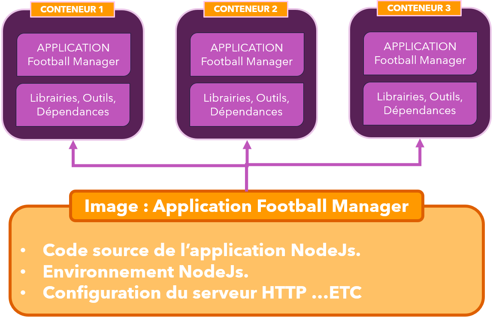

Cette image est un package partageable contenant toutes les instructions d'installation et de configuration de l'application. Le conteneur est une instance de cette image qui exécute l'ensemble des instructions.

[NOTE]
====
Nous lançons des conteneurs qui sont basés sur des images.
*C'est là le concept fondamental de Docker.*
====

Cela deviendra encore plus clair lorsque nous commencerons à manipuler les images et les conteneurs.

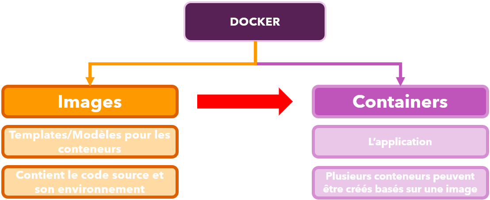

## Les images Docker pré-construites

### Préambule

Il y a deux façons de créer ou d'obtenir des images Docker :
Nous en étudierons une dans ce sous-titre, et l'autre dans le sous-titre suivant.

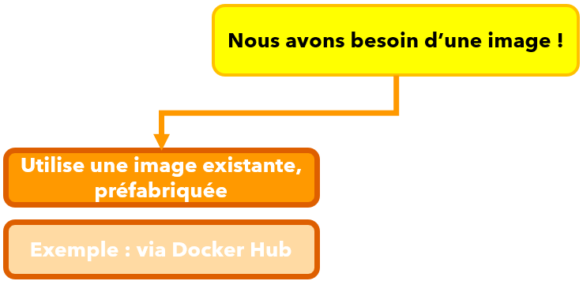

Utiliser des conteneurs existants :
Ceux-ci sont créés par la communauté, nos collègues ou officiellement par les éditeurs de logiciels.

Il existe un grand nombre d'images Docker disponibles sur le Docker Hub, le registre public de Docker. Vous pouvez y trouver des images pour des applications populaires telles que MySQL, Redis, Node.js, Python, etc.

https://hub.docker.com[Lien vers le Docker Hub]

Vous n'avez pas besoin de vous enregistrer ou de vous authentifier sur le site pour accéder aux images.

Par exemple, dans la barre de recherche, vous pouvez effectuer une recherche pour trouver l'image officielle de Node.js qui pourra être utilisée pour construire un conteneur avec Node.js.

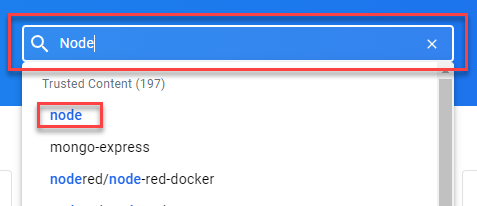

Nous utiliserons beaucoup d'images officielles dans ce cours, mais aussi généralement dans notre travail quotidien avec Docker.

Voici la réponse du moteur de recherche de Docker Hub :

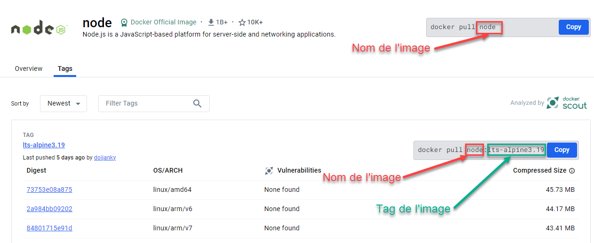

Pour installer l'image, on vous donne une commande :

[source,bash]
----
docker pull node
----

Cette commande télécharge l'image sur votre machine hôte.

Vous pouvez sélectionner une image particulière contenant une version spécifique du service ou du système Linux de base. Pour ce faire, consultez l'onglet `Tag` et récupérez le nom de tag correspondant à la version souhaitée.

Par exemple, si nous voulons utiliser *Node.js* basé sur une distribution *Alpine 3.19* :

[source,bash]
----
docker pull node:lts-alpine3.19
----

### Utiliser une image existante

Assurez-vous d'avoir Docker Engine de démarré sur votre machine.
( Ouvrez l'application Docker Desktop et vérifiez que le statut est "Engine Running" ou "Ressource Saver mode")

Ouvrez un terminal sur votre machine hôte *et* exécutez la commande suivante pour télécharger l'image officielle de NodeJs et monter un conteneur :

[source,bash]
----
docker container run node
----

[NOTE]
====
Les commandes`` docker container run`` et `docker run` ont le même effet.
Cependant, depuis la *_version 1.13_* de Docker, il est recommandé d'utiliser `docker container run`.

En effet, l'ensemble des commandes et sous-commandes ont été réorganisées pour suivre une structure de ce type : `docker <objet> <commande> <options>`.

Cette nouvelle structure offre une meilleure lisibilité de la commande et permet de connaître son champ d'action.

Ainsi, en tapant une commande de ce type : `docker container <commande>`, nous savons que nous allons manipuler des conteneurs.

Tandis que `docker image <commande>` concernera la manipulation d'une image.
====

Si vous n'avez pas exécuté la commande `docker pull node` précédemment, vous verrez alors apparaitre une erreur signalant que l'image `node` n'a pas pu être trouvé localement.
Ainsi, elle sera automatiquement téléchargé depuis le terminal sur les serveurs du *Docker Hub*.

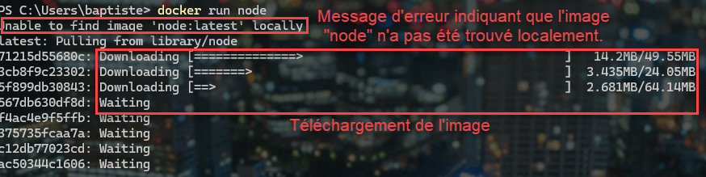

Maintenant que l'image est présente sur notre machine, la même commande procède à la création d'un conteneur basé sur cette image et le lance. Cependant, sur le terminal, l'action semble se terminer sans que rien se produise.

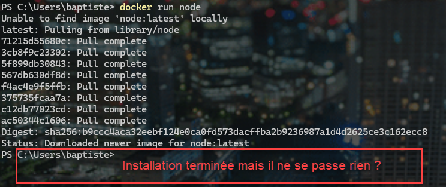

Pourquoi ?

[WARNING]
====
Il est essentiel de noter que par *défaut*, un conteneur est isolé de son environnement immédiat. Cependant, il est possible d'interagir avec lui via un *shell interactif*. Lorsqu'il est créé, le conteneur est initialement lancé *en mode détaché*, ce qui signifie qu'il s'exécute en arrière-plan sans offrir de terminal pour interagir directement avec lui.
====

Donc, même si sur le terminal, il ne semble ne rien se passer, le conteneur  a bien été créé.

Vérifions cela en exécutant la commande suivante :

[source,bash]
----
docker ps -a
----

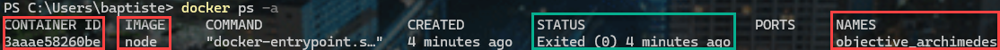

Lors de la création du conteneur, nous voyons qu'il a reçu un identifiant unique : `CONTAINER ID`, et un nom en caractère alphanumérique généré aléatoirement : `NAMES`.
Nous verrons plus en détail comment configurer le conteneur un peu plus tard.

Attardons-nous sur le `STATUS` qui est `Exited`. Qui signifie que le conteneur a bien démarré une fois, puis s'est éteint.

Cela est normal !

Actuellement, le conteneur n'effectue aucune tâche particulière ; il s'agit simplement d'un environnement dans lequel Node.js est installé. Par défaut, le shell interactif ne nous est pas accessible. Ainsi, plutôt que de rester en fonctionnement sans rien faire, le conteneur s'arrête automatiquement.

Pour modifier ce comportement, nous pouvons créer un nouveau conteneur en utilisant la même commande, mais en ajoutant un nouveau paramètre : `-it`. Ce paramètre indique que nous souhaitons interagir avec le conteneur.

[source,bash]
----
docker container run -ti node
----

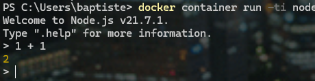

Nous remarquons que la création du nouveau conteneur n'a pas entrainé le téléchargement de l'image ! (Elle est sur notre machine hôte en local maintenant !).

Et nous avons en plus, un prompt dans lequel nous pouvons saisir des commandes *NodeJs* ou *Javascript* qui s'exécuteront seulement à l'intérieur de notre conteneur *et pas dans notre machine hôte, soyons bien claire avec cela !*

Pour sortir du shell, tapez sur la combinaison de touche du clavier : `CTRL + C` deux fois.

Et listons les conteneurs qui ont été créés :

[source,bash]
----
docker container ps -a
----
ou
[source,bash]
----
docker ps -a
----

Il existe maintenant plusieurs conteneurs Docker, basés sur la même image `Node`, indépendant les uns des autres.

[IMPORTANT]
====
Nous avons pris l'exemple de l'image `Node` pour illustrer le concept de conteneurs et d'images Docker. Cependant, tout ce que nous avons appris reste valable quelque soit votre environnement technique : PHP, PYTHON, RUBY, Etc.

En règle générale, vous utiliserez à chaque fois une image de base officielle pour créer un conteneur. Puis, vous personnaliserez cette image en ajoutant vos propres fichiers, dépendances, etc.

Nous verrons comment créer des images personnalisées dans le chapitre suivant.
====

## Les images Docker personnalisée

### Préambule

Nous avons appris comment utiliser une image *Docker* existante pour créer un conteneur. Cependant, il est souvent nécessaire de créer des images personnalisées pour répondre aux besoins spécifiques de nos applications.
Par exemple, si nous souhaitons déployer une application **Node.js**, nous allons utiliser une image de base *Node.js*, puis y ajouter nos fichiers et dépendances.

Dans ce sous-titre, nous allons voir comment procéder en suivant un exemple concret.

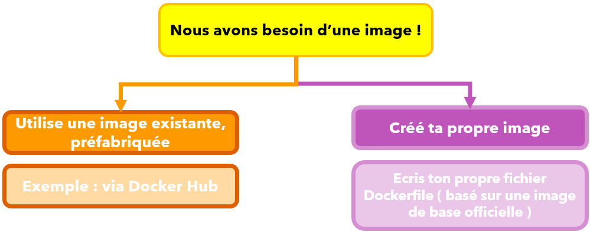

### TD : Créer une image pour une application Node.js

#### Objectif

Créer une image Docker personnalisée à partir d'une image NodeJs officielle et d'y ajouter le code source d'une application Node.js existante.

#### Préparation

[IMPORTANT]
====
Pour réaliser ce TD, il n'est pas nécessaire de connaitre Node.JS, ni Javascript.

Nous allons simplement utiliser Node.js pour illustrer la création d'une image Docker personnalisée.

Nous vous fournirons les fichiers nécessaires pour réaliser ce TD.
====

* Récupérez le fichier `td01_app_nodejs.zip` dans le répertoire `resources` de ce chapitre.

* Décompressez le fichier dans un répertoire de votre choix.

#### Présentation des fichiers

Le répertoire décompressé contient :

* Un répertoire `public` contenant :
** Un fichier `styles.css` : une feuille de style simple.
* Un fichier `package.json` : un fichier de configuration pour Node.js.
* Un fichier `server.js` : un fichier Javascript qui crée un serveur web simple.

Le fichier `server.js` contient le code de notre application Node.js.
Si vous connaissez Node.js, vous pouvez l'ouvrir pour voir son contenu. Sinon, ne vous inquiétez pas, nous n'aurons pas besoin de le modifier.

Toutefois, voici quelques explications sur ce fichier :

[%linenums,javascript]
----
include::./code/td01_app_nodejs/server.js[lines=1..5;45..46]
----

Le code ci-dessus crée un serveur web simple qui écoute sur le port 80 et nous gérons les requêtes HTTP entrantes (méthodes *GET* et *POST*) pour deux URL différentes : `/` et `/store-goal` :

[source,javascript, title="server.js : Code du traitement de la requête HTTP GET"]
----
// [...Some Code before]
app.get('/', (req, res) => {
  res.send(`
    <html>
      <head>
        <link rel="stylesheet" href="styles.css">
      </head>
      <body>
        <section>
          <h2>Objectif : </h2>
          <h3>${userGoal}</h3>
        </section>
        <form action="/store-goal" method="POST">
          

            <label>Course Goal</label>
            <input type="text" name="goal">
          

          <button>Ajouter un objectif</button>
        </form>
      </body>
    </html>
  `);
});
// [...Some Code after]
----

Le code ci-dessus gère la requête HTTP GET pour l'URL `/`. Il renvoie une page HTML contenant un formulaire pour saisir un objectif et affiche aussi l'objectif saisi précédemment ou un objectif par défaut.

[source,javascript, title="server.js : Code du traitement de la requête HTTP POST"]
----
// [...Some Code before]
app.post('/store-goal', (req, res) => {
  const enteredGoal = req.body.goal;
  console.log(enteredGoal);
  userGoal = enteredGoal;
  res.redirect('/');
});
// [...Some Code after]
----

Le code ci-dessus gère la requête HTTP POST pour l'URL `/store-goal`. Il récupère l'objectif saisi dans le formulaire, le stocke dans une variable `userGoal`, puis redirige l'utilisateur vers la page d'accueil.

Le fichier `package.json` central pour les applications Node.js, car il contient toutes les informations nécessaires pour installer les dépendances de l'application.

[source,javascript, title="Extrait du fichier package.json"]
----
// [...Some Code before]
  "dependencies": {
    "express": "^4.17.1",
    "body-parser": "1.19.0"
  }
// [...Some Code after]
----

Le fichier `package.json` nous montre que cette application nécessite la presence de deux dépendances pour fonctionner : `express` et `body-parser`.

[WARNING]
====
Je ne donnerais pas plus d'explication, ce cours ne traite pas de NodeJs, mais de comment "*Dockeriser*"/"*Conteneuriser*" cette application d'exemple.
====

#### Lancez l'application Node.js en Local

Avant de créer l'image Docker, nous allons lancer l'application Node.js en local pour vérifier qu'elle fonctionne correctement et surtout pour comprendre son fonctionnement.

Pour exécuter une application Node.js, il faut d'abord installer Node.js sur votre machine.

Pour vérifier si Node.js est installé sur votre machine, ouvrez un terminal et tapez la commande suivante :

[source,bash]
----
node -v
----

Si Node.js est installé, vous verrez sa version s'afficher. Sinon, vous devrez l'installer.

Rendez-vous sur le lien suivant pour télécharger et installer Node.js sur votre machine :

https://nodejs.org/en/download/[Télécharger Node.js]

Sélectionnez la version adaptée à votre système d'exploitation.

Une fois Node.js installé, ouvrez *un nouveau terminal* et déplacez-vous dans le répertoire où vous avez décompressé les fichiers de l'application *Node.js*.

Installez les dépendances de l'application en exécutant la commande suivante :

[source,bash]
----
npm install
----

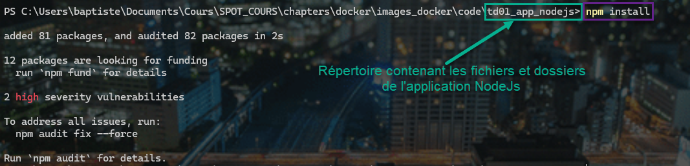

Un nouveau dossier `node_modules` est créé dans le répertoire de l'application. Il contient toutes les dépendances nécessaires pour exécuter l'application.

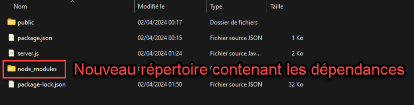

Vous pouvez maintenant lancer l'application en exécutant la commande suivante :

[source,bash]
----
node server.js
----

Laissez le terminal ouvert et ouvrez un navigateur web.

Tapez l'URL http://localhost[] dans la barre d'adresse pour accéder à l'application.

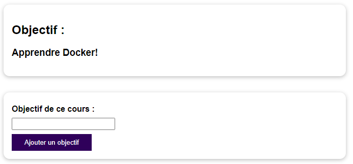

Testez l'application en saisissant un objectif dans le champ de texte et en cliquant sur le bouton `Ajouter un objectif` et observez le résultat.

Cette application fonctionne donc localement sans Docker !

Maintenant, arrêtons le server Node.js en tapant `CTRL + C` dans le terminal.
Et supprimons le dossier `node_modules` en tapant la commande suivante :

[source,bash, title="Sous Windows"]
----
rm  node_modules
----

[source,bash, title="Sous Linux"]
----
sudo rm  -R node_modules
----

et supprimons le fichier `package-lock.json` :

[source,bash]
----
rm package-lock.json
----

Nous allons maintenant créer une image Docker spécialement pour cette application !

#### Dockerfile : Création de notre propre image Docker

Pour créer une image Docker personnalisée, nous devons créer un fichier appelé `Dockerfile` à la racine de notre application.
C'est un nom spécial qui sera identifié par Docker.

Le `Dockerfile` contient les instructions pour construire une image Docker personnalisée.

[NOTE]
====
Pour plus de confort dans la rédaction du `Dockerfile`, je vous encourage à installer une extension pour vous aider à écrire du code Docker. Par exemple, l'extension `Docker` pour `Visual Studio Code` ou `PHPSTORM`.

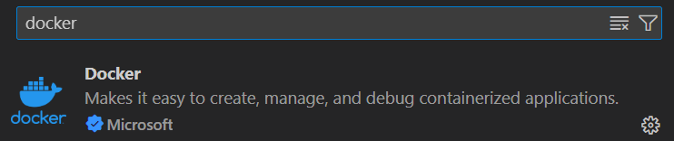

Ou

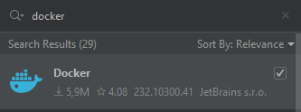

====

Nous commençons par le mot clé `FROM` suivi de l'image de base que nous voulons utiliser pour notre image personnalisée.
Nous sommes obligé de spécifier une image de base, car nous ne pouvons pas créer une image à partir de rien.

Dans notre cas, nous allons utiliser l'image officielle de **Node.js** dans sa dernière version grâce au tag de version `latest`.

##### Instruction : `FROM`

[source,docker, title="Dockerfile"]
----
FROM node:latest
----

Maintenant, nous voulons copier les fichiers de notre application dans l'image Docker. Pour cela, nous utilisons l'instruction `COPY` suivi du chemin du fichier ou du répertoire à copier dans l'image, puis du chemin de destination dans l'image.

[TIP]
====
Gardez à l'esprit qu'un conteneur ( et donc également son image) contient l'environnement + le code de l'application.
Votre code source soit alors être copié dans l'image.
====

##### Instruction : `COPY`

[source,docker, title="Dockerfile"]
----
FROM node:latest
COPY . /app
----

Le point `.` signifie que nous copions tous les fichiers, les répertoires et sous-répertoires du répertoire courant (celui où se trouve le `Dockerfile`) vers le répertoire de destination `/app` dans l'image.

En effet, les conteneurs possèdent leur propre système de fichiers, totalement isolé de celui de la machine hôte.

Si vous utilisez une machine Windows, il est important de noter que le système de fichiers Linux est différent. Sous Linux, le répertoire *racine* est nommé `/`, l'équivalent de `C:\` sous *Windows*.

Par conséquent, `/app` signifie que nous aurons un dossier `app` à la racine de notre conteneur. Ce dossier sera automatiquement créé s'il n'existe pas.

##### Instruction : `RUN`

[source,docker, title="Dockerfile"]
----
FROM node:latest
COPY . /app
RUN npm install
----

L'instruction `RUN` permet d'exécuter des commandes dans l'image Docker. Rappelez-vous, pour tester notre application, nous avons lancé la commande `npm install` pour installer les dépendances de l'application.
Nous devons donc exécuter cette commande dans l'image Docker pour installer les dépendances dedans.

Toutefois, il y a un piège, car l'instruction RUN sera exécutée dans le répertoire de travail de l'image  et du conteneur, qui est le répertoire *`root`* (`/`) par défaut.

##### Instruction : `WORKDIR`

Comme nous avons copié les fichiers de notre application dans le répertoire `/app`, nous devons d'abord nous déplacer dans ce répertoire avant d'exécuter la commande `npm install`.

Pour cela, nous utilisons l'instruction `WORKDIR` pour définir le répertoire de travail de l'image par défaut.

[source,docker, title="Dockerfile"]
----
FROM node:latest
WORKDIR /app
COPY . /app
RUN npm install
----

Cette instruction `WORKDIR` indique à Docker que toutes les commandes suivantes seront exécutées à partir du répertoire `/app`.

Maintenant que le répertorie de travail est défini, nous pouvons modifier l'instruction `COPY` et changer la définition du répertoire de destination `/app` par `.` ou `./`.

Ce deuxième point symbolisant le répertoire de travail défini par l'instruction `WORKDIR`.

[source,docker, title="Dockerfile"]
----
FROM node:latest
WORKDIR /app
COPY . .
RUN npm install
----

[IMPORTANT]
====
Toutefois, pour garantir une certaine lisibilité du `Dockerfile`, il est préférable de spécifier littéralement le répertoire de destination `/app` avec la commande `COPY`.
Cela évite de partir à la recherche du `WORKDIR` dans le cas de fichier Dockerfile volumineux.
====

[source,docker, title="Dockerfile"]
----
FROM node:latest
WORKDIR /app
COPY . /app
RUN npm install
----

##### Instruction : `CMD`

Désormais, nous désirons lancer notre serveur Node.js. Pour ce faire, nous devons exécuter la commande `node server.js`.

Il pourrait être tentant d'utiliser l'instruction `RUN` pour exécuter cette commande, mais cela ne serait pas efficace.

En effet, l'instruction `RUN` est exécutée lors de la construction de l'image, et non lors du démarrage du conteneur.

Il est important de se rappeler que l'image Docker est un modèle, un gabarit pour créer des conteneurs. Elle ne peut pas exécuter de commandes. Nous pouvons y copier des fichiers, lancer des commandes qui effectuent des installations. Cependant, nous ne pouvons pas exécuter des commandes qui nécessitent une interaction continue comme le démarrage d'un serveur.

Ainsi, si nous démarrons plusieurs conteneurs sur la même image, nous démarrons également plusieurs serveurs Node.js.

Pour résoudre ce problème, nous devons utiliser une autre instruction : `CMD`.

[source,docker, title="Dockerfile"]
----
FROM node:latest
WORKDIR /app
COPY . /app
RUN npm install
CMD ["node", "server.js"]
----

Instruction `CMD` permet de définir la commande par défaut qui sera exécutée lors du démarrage du conteneur.
La syntaxe est un tableau JSON, où chaque élément du tableau est un argument de la commande.

Dans notre cas, nous exécutons la commande `node server.js` pour démarrer notre serveur Node.js. Nous insérons donc chaque élèment qui constitue la commande dans le tableau : `["node", "server.js"]`.

[IMPORTANT]
====
Si vous ne spécifiez pas d'instruction `CMD` dans le `Dockerfile`, Docker utilisera l'instruction `CMD` de l'image de base.
Sans image de base et sans instruction `CMD`, vous générerons une erreur lors de la création du conteneur.
====

##### Instruction : `EXPOSE`

Comme nous l'avons mainte fois répété, les conteneurs Docker sont isolés de notre environnement local. Par conséquent, ils disposent également de leur propre réseau interne.

Dans notre application web, nous écoutons sur le port 80 les requêtes HTTP entrantes. Toutefois, ce port n'est pas accessible depuis l'extérieur du conteneur.

Pour cela, nous utilisons l'instruction `EXPOSE` suivie du numéro de port 80.
Cela va annoncer à Docker qu'il devra exposer le port 80 vers la machine hôte.

[source,docker, title="Dockerfile"]
----
FROM node:latest
WORKDIR /app
COPY . /app
RUN npm install
EXPOSE 80
CMD ["node", "server.js"]
----

Nous en avons terminé avec la rédaction du `Dockerfile`.
Voyons maintenant comment nous pouvons utiliser cette image personnalisée : la construire et lancer un conteneur basé dessus.

##### Construction de l'image

Maintenant que notre fichier Dockerfile est prêt, nous pouvons construire notre image Docker personnalisée.

Pour ce faire, ouvrez un terminal et déplacez-vous dans le répertoire où se trouve le `Dockerfile`.

Exécutez la commande suivante pour construire l'image :

[source,bash]
----
docker build .
----

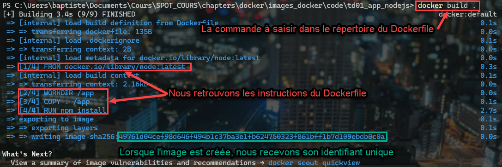

La commande `docker build .` construit l'image Docker en utilisant le `Dockerfile` situé dans le répertoire courant (le point `.`).

Lorsque vous exécutez cette commande, Docker commence par lire le `Dockerfile` et exécute les instructions une par une, du haut vers le bas, pour construire l'image.

A l'issue de la construction, Docker affiche un message indiquant que l'image a été construite avec succès et qu'elle a reçu un identifiant unique.

Lancez maintenant la commande `docker images` pour lister les images Docker présentes sur votre machine.

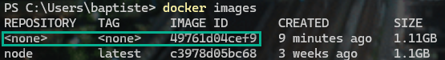

Nous voyons que l'image que nous venons de construire est présente sur notre machine hôte.

Grâce à son identifiant unique, nous pouvons maintenant lancer un conteneur basé sur cette image.

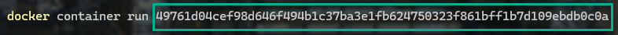

En exécutant cette commande, nous constatons que nous n'avons plus la main sur la console.

Cela est normal, car l'instruction `CMD` de notre `Dockerfile` exécute le serveur Node.js en arrière-plan.
Notre conteneur est donc en cours d'exécution avec le script `server.js` qui écoute sur le port 80.

Pour vérifier, ouvrez "Docker Desktop", cliquez sur l'onglet "Containers" et vous verrez le conteneur en cours d'exécution.

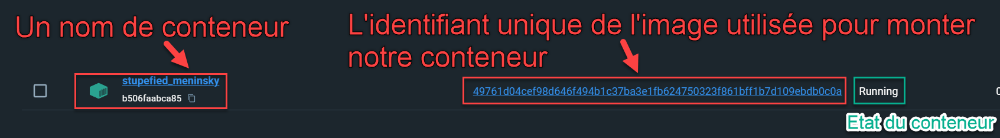

Testons maintenant notre application en ouvrant un navigateur web et en tapant l'URL http://localhost[] dans la barre d'adresse.

Que constatons-nous ? L'application fonctionne-t-elle correctement ?

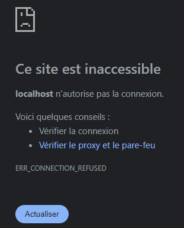

L'application ne fonctionne pas ! elle est totalement inaccessible.
Pourtant, dans notre fichier `Dockerfile`, nous avons bien exposé le port `80`.

Que s'est-il passé ?

Premièrement, arrêtons notre conteneur, car les choses ne semblent pas se passer comme prévu,  en tapant la commande suivante dans un nouveau termial :

[source,bash]
----
docker container ps
----

Cette commande liste les conteneurs en cours d'exécution.

Récupérez l'*identifiant* ou le *nom* de votre conteneur.
Le mien se nomme `stupefied_meninsky` et possède l'identifiant `b506faabca85`.

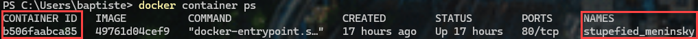

Puis tapez la commande suivante pour arrêter le conteneur :

[source,bash]
----
docker container stop b506faabca85
ou bien
docker container stop stupefied_meninsky
----

Une fois la procèdure achevée, si vous relancez la commande `docker container ps`, vous ne devriez plus voir votre conteneur.

Pour voir votre conteneur, il faudra alors rajouter le paramètre `-a` :

[source,bash]
----
docker container ps -a
----
Cela affichera tous les conteneurs, même ceux qui ne sont plus en cours d'exécution (*_status : Exited_*).

Revenons maintenant à notre problématique !

Oui, nous avons ajouté dans notre Dockerfile l'instruction `EXPOSE 80` pour exposer le port 80 de notre conteneur vers la machine hôte.

Mais concrètement, cela ne suffit pas !
Car l'instruction `EXPOSE` n'ouvre pas le port `80` de notre conteneur vers la machine hôte, elle est une facultative.
Elle ne sert à rien d'autre *qu'à documenter le port* sur lequel notre application écoute.
C'est une bonne pratique pour informer les autres utilisateurs de l'utilisation de ce port par votre application, et vous devez continuer à l'utiliser.

*Mais nous devons faire plus !*

Tout d'abord, nous allons supprimer notre conteneur avant d'en créer un nouveau, qui lui, permettra de communiquer avec notre machine hôte.

[source,bash]
----
docker container rm b506faabca85
ou bien
docker container rm stupefied_meninsky
----

##### Mapping de ports

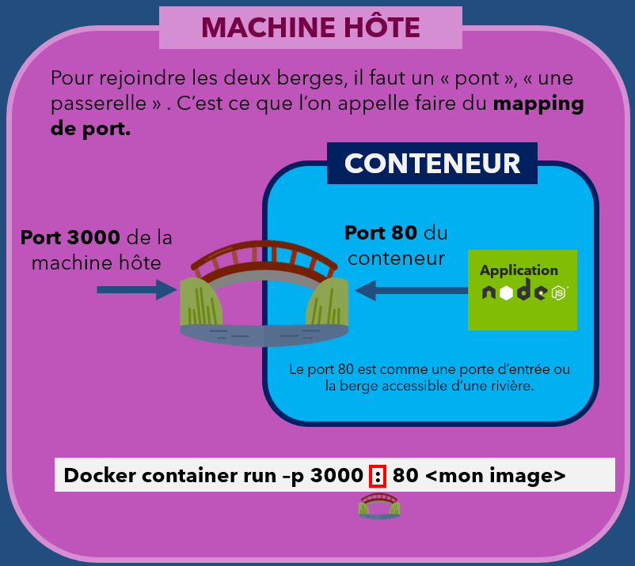

Pour permettre à notre application de communiquer avec notre machine hôte, nous devons réaliser un *mapping de ports*.

Le *mapping de ports* permet de rediriger le trafic d'un port d'un conteneur vers un port de la machine hôte.

C'est comme si vous aviez *un pont* entre le port du conteneur et le port de la machine hôte.

Pour réaliser un *mapping de ports*, nous utilisons l'option `-p` suivie du numéro de port de la machine hôte, puis du numéro de port du conteneur.

Le numéro de port de la machine hôte est *un choix arbitraire*, mais il ne doit pas être utilisé par un autre service.

Le numéro de port de notre conteneur est le port sur lequel notre application écoute.

Dans notre cas, c'est le *port 80*. C'est le port que nous avons exposé dans notre `Dockerfile`.
Vous comprenez alors pourquoi c'est bien pratique de préciser dans le Dockerfile le port sur lequel notre application écoute. Car nous avons besoin de cette information pour réaliser le *mapping de ports*.

Tapons la commande suivante pour lancer un nouveau conteneur avec un *mapping de ports* :

[source,bash]
----
docker container run -p 3000:80 <identifiant de votre image>
----

Assurez-vous que le conteneur est bien en cours d'exécution. Cette fois-ci vous pouvez utiliser *Docker Desktop*, dans l'onglet "*Containers*".

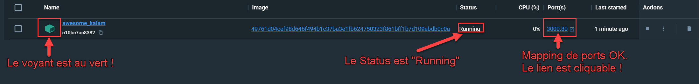

Cliquez sur le lien "3000:80" pour ouvrir l'application dans votre navigateur ou saisir l'URL http://localhost:3000[].

Notre application est maintenant accessible depuis notre machine hôte.

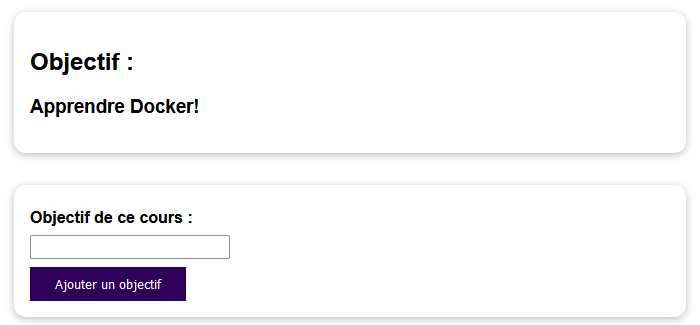

Vous pouvez tester l'application en saisissant un objectif dans le champ de texte et en cliquant sur le bouton `Ajouter un objectif`.

Félicitations ! Vous avez créé une image Docker personnalisée pour une application Node.js et vous avez lancé un conteneur basé sur cette image.

Vous avez appris à construire une image Docker personnalisée à partir d'une image officielle, à copier les fichiers de votre application dans l'image, à installer les dépendances de l'application, à exposer un port, à lancer un serveur Node.js et à réaliser un *mapping de ports* pour permettre à l'application de communiquer avec la machine hôte.

Maintenant, vous pouvez arrêter ce nouveau conteneur, vous disposez de tous les outils nécessaires pour le faire tout seul.

[NOTE]
====
**Note additionnelle : **

Pour toutes les commandes Docker où un identifiant peut être utilisé, vous n'avez pas besoin de copier/coller ou d'écrire l'identifiant complet. Il suffit de copier les premiers caractères de l'identifiant (par exemple, les 4 premiers caractères) pour que Docker puisse identifier le conteneur ou l'image.

Par exemple, si l'identifiant de votre conteneur est `b506faabca85`, vous pouvez taper `b506` pour que Docker comprenne que vous faites référence à ce conteneur.

Cela s'applique à TOUTES LES COMMANDES DOCKER.

Bien entendu, nous pouvons attribuer des noms personnalisés à nos conteneurs et images pour les identifier plus facilement. Nous verrons cela dans une section ultérieure.

====

### Précisions sur les images Docker

#### Lecture seule

Lorsque nous avons utilisé l'instruction `COPY` dans notre `Dockerfile`, nous avons copié les fichiers de notre application dans l'image Docker.

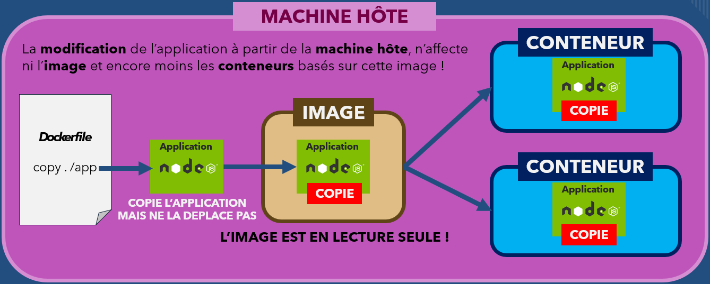

Si vous essayez de modifier vos fichiers depuis la machine hôte, et que vous relancez un conteneur basé sur cette image, vous constaterez que les modifications ne sont pas prises en compte.

*Ce n'est pas un comportement anormal*, c'est le fonctionnement normal des images Docker.

En effet, les images Docker sont *en lecture seule*. Cela signifie que vous ne pouvez pas modifier les fichiers d'une image une fois qu'elle a été créée.

Les fichiers présents dans l'image Docker sont une copie des fichiers de votre application à *un instant T*. 

[IMPORTANT]
====
Si vous modifiez les fichiers de votre application,** vous devez reconstruire** l'image Docker pour prendre en compte ces modifications.
====

#### Comprendre les Couches d'images

Une image est fermée une fois qu'on la construit, une fois que ces instructions ont été exécutées.
Sur cette base, il existe un autre concept important lié aux images Docker : les couches d'images.

Avez-vous noté le temps que cela prend pour construire une image Docker ?

Cela prend un certain temps, car Docker construit l'image instruction par instruction.

Maintenant, si vous modifiez un fichier de l'application et que vous reconstruisez l'image, Docker ne reconstruit pas toute l'image, mais seulement les parties qui ont été modifiées.

Cela permet de gagner du temps et de l'espace disque.

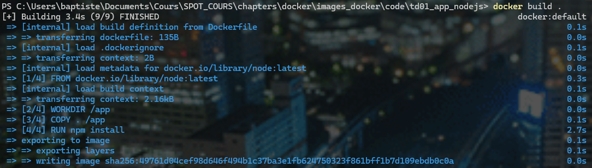

Lorsque Docker va parcourir les étapes de construction de l'image, c'est-à-dire les instructions du Dockerfile, il va vérifier dans le cache si le résultat sera le même que la dernière fois. Si c'est le cas, Docker va utiliser le cache et ne pas reconstruire l'image.

Par contre, si une instruction a été modifiée, Docker va reconstruire l'image à partir de cette instruction et des instructions suivantes.

Par exemple, dans notre exemple :

[source,docker, title="Dockerfile"]
----
FROM node:latest
WORKDIR /app
COPY . /app
RUN npm install
EXPOSE 80
CMD ["node", "server.js"]
----

Si nous modifions le fichier `server.js`, Docker va reconstruire l'image à partir de l'instruction `COPY . /app`. Et comme Docker ne fait pas d'analyse poussée des fichiers, il n'est pas capable de déterminer si le résultat de `npm install` sera le même ou non. Alors, il reconstruira toutes les couches à partir de l'instruction `COPY`.

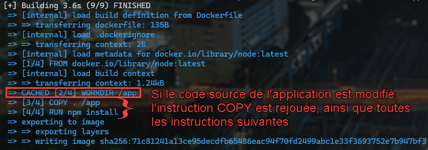

C'est ce que l'on appelle une** architecture basée sur des couches**.
Une image est donc simplement construite à partir de plusieurs couches basées sur ces différentes instructions.

Le seul cas particulier est celui de l'instruction `CMD` qui créé une couche supplémentaire seulement lorsqu'elle est appelée à l'exécution du conteneur.

[NOTE]
====
Chaque instruction du *Dockerfile* représente une *couche*
====

Fort de ce que nous venons de comprendre sur le cache et les couches, nous pouvons proposer une astuce pour accélérer la construction de l'image Docker.

Nous pouvons réorganiser les instructions du `Dockerfile` pour que les instructions qui changent le moins souvent soient placées en premier.

Par exemple, si je modifie le fichier `server.js`, nous savons que l'instruction suivante `RUN npm install` sera rejouée. Or, `npm install` est une instruction qui prend du temps, et si je modifie le fichier `server.js`, je n'ai pas besoin de réinstaller les dépendances à chaque fois.

Ainsi, je peux réorganiser mon `Dockerfile` de la manière suivante :
On effectue une première copie du fichier `package.json` pour installer les dépendances, puis on copie le reste des fichiers.

[source,docker, title="Dockerfile"]
----
FROM node:latest
WORKDIR /app
COPY package.json /app
RUN npm install
COPY . /app
EXPOSE 80
CMD ["node", "server.js"]
----

La prochaine fois que je modifierai le fichier `server.js`, la couche `RUN npm install` ne sera pas reconstruite, car Docker utilisera le cache.
La reconstruction de l'image sera super rapide !

C'est une astuce à garder en tête pour optimiser la construction de vos images Docker et qui nécessite de bien comprendre le fonctionnement des couches.

