:_chapter:
[[gestion_images_conteneurs]]

= Networking : La communication entre conteneurs
include::../../../run_app.adoc[]

== Introduction

Dans ce chapitre, nous allons explorer la manière dont les conteneurs peuvent communiquer entre eux.
Pour cela nous allons nous appuyer sur une application de démonstration qui nécessite de communiquer avec des services distants : une API et une base de données.

[NOTE]
.Vous avez dit 'API' ?
====
Dans le cadre du développement d'applications, il est courant de créer une base de données, comme une base de données SQL, et de la solliciter pour obtenir des données que nous utilisons directement dans notre application. Cependant, il existe une autre approche : développer une application distincte, destinée exclusivement à gérer les données de la base de données, c'est-à-dire l'ajout, la modification et la suppression.

Cette application spécifique ne possède pas d'interface utilisateur. Au lieu de cela, les actions sont accessibles uniquement via des routes ou des URL qui transmettent, par le biais du protocole HTTP, des requêtes de publication (méthode POST), de modification (méthode PUT), de suppression (méthode DELETE) ou de sélection (méthode GET). Chaque action renvoie généralement une réponse du serveur au format JSON.

Par exemple, le service de Météo Nationale fournit des données météorologiques que vous pouvez intégrer dans votre application pour afficher les prévisions météorologiques.
Ces données sont accessibles via une ou des URL que vous pouvez interroger pour récupérer les informations. On appelle cela une *API*.

Cette approche est communément appelée API REST (Application Programming Interface Representational State Transfer). Par exemple, l'URL `https://swapi.dev/api/people/1` permet de récupérer les données du personnage de Star Wars dont l'identifiant est 1.
====

Nous avons déjà vu comment conteneuriser une application simple. Nous allons maintenant compliquer un peu les choses en ajoutant des services externes à notre application.

Si vous avez bien compris le fonctionnement de Docker, vous devriez être en mesure de créer une image Docker contenant une application ainsi que sa propre base de données. Cependant, il est important de respecter un principe fondamental de Docker : un service équivaut à un conteneur. Par conséquent, si nous avons une application et sa base de données, nous devons créer une image pour l'application et une autre image pour la base de données.

Nous devrons ensuite monter les deux conteneurs et les faire communiquer entre eux, ce qui peut compliquer un peu les choses.

Avant d'entrer dans le vif du sujet, nous allons d'abord présenter l'application de démonstration que nous allons utiliser pour illustrer la communication entre conteneurs.

== Présentation de l'application de démonstration

Récupérez l'application via le fichier : `networks-starting-setup.zip` et décompressez le contenu :

En lisant le code source dans le fichier `app.js`, vous reconnaitrez certainement des éléments de code que nous avons déjà vu dans les chapitres précédents :

* Nous créons notre propre API REST à partir des données récupérées par l'API `swapi`, par exemple avec cette route `/movies`

[source, javascript]
.Fichier : code/networks-starting-setup/app.js
----
include::./code/networks-starting-setup/app.js[lines=52]
// code
});
----

* On consomme les données de l'API `swapi` grace à la librairie JS `Axios`.

[source, javascript]
.Fichier : code/networks-starting-setup/app.js
----
include::./code/networks-starting-setup/app.js[lines=52..60]
----

* L'application permet aussi de mettre des films ou des personnages en favoris et de les stocker en base de données `MONGODB` en utilisant la librairie `mongoose`.

[source, javascript]
.Fichier : code/networks-starting-setup/app.js
----
const mongoose = require('mongoose');
// .. some code
include::./code/networks-starting-setup/app.js[lines=19]
// .. some code
});
----

Bien évidement, nous pouvons tester notre application en local en installant MongoDB et son environnement, NodeJS, etc..

* Allez sur le site MongoDb et installez MongoDb Compass :
https://www.mongodb.com/products/tools/compass
Il s'agit d'une application avec une interface graphique (GUI) qui permet de créer et manipuler une base de données MongoDB. Je ne détaille pas l'installation ici.

* En lançant l'application, vous devriez voir cet écran :

image::images/01.png[]

* Maintenant, nous pouvons ouvrir un Terminal dans le dossier de notre application et installer les packages nécessaires :

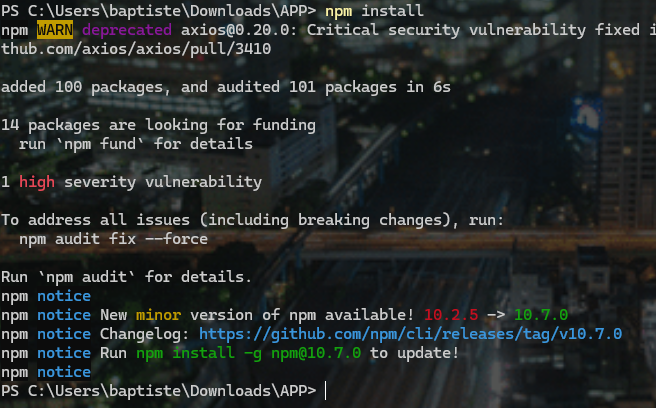

* Nous vérifions dans le code source que la chaîne de connexion à MongoDB soit la même que sur mon serveur local :

[source, javascript]
.Fichier : code/networks-starting-setup/app.js
----

// .. some code
include::./code/networks-starting-setup/app.js[lines=70..80]

----

Et maintenant testons l'application :

[source, ]
----
node app.js
----

Comment tester notre application ? nous n'avons par d'interface graphique (appelée aussi _UI_)!.

Notre application est une API ! Il faudra alors installer un logiciel qui nous permettra d'envoyer des requêtes HTTP facilement.
Personnellement, j'utilise *Insomnia*, mais il en existe d'autres comme *PostMan*.

* Allez sur : https://insomnia.rest/ et téléchargez l'application
* Une fois Insomnia lancé :

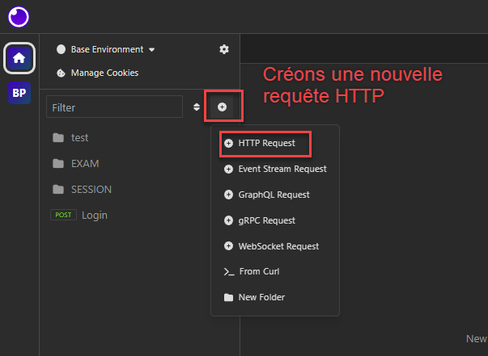

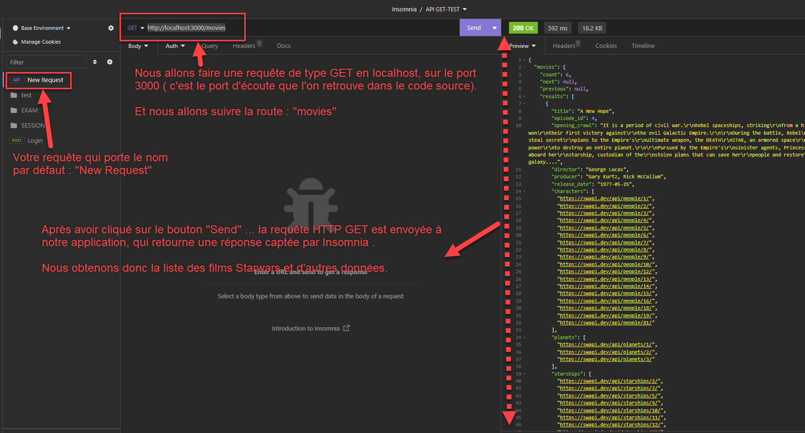

Vous pouvez tester d'autres routes que l'on retrouve dans le code source. Je vous laisse découvrir les choses.

Nous avons une meilleure compréhension de l'application de démonstration, et nous voyons qu'elle est beaucoup plus complexe que ce que nous avons utilisé jusqu'à présent.

[IMPORTANT]
====
Nous allons maintenant conteneuriser cette application !

En créant plusieurs conteneurs afin de respecter le principe :

* 1 service = 1 conteneur

====

== Communication
=== Préambule

Apres avoir étudié le fonctionnement de notre application, nous allons examiner les cas de figure où une *communication* sera initiée entre le conteneur et d'autres services.

Il y a 3 situations que l'on peut répertorier :

1. Du *conteneur* vers un *serveur distant* (_par exemple via HTTP vers une API_)
2. Du *conteneur* vers la *machine hôte locale* (_par exemple pour accéder à une base de données_)
3. Entre deux conteneurs

[WARNING]
====
Mais avant de continuer, assurez-vous d'avoir fermé :

* Le serveur Node ( `CTRL` + `C` dans le terminal )
* La fenêtre de MongoDb Compass.
====

=== Situation 1 : Du conteneur vers un serveur distant (HTTP)

image::images/05.png[]

L'API REST que nous interrogeons, n'est pas hébergée dans le conteneur et je ne l'ai pas non plus moi-même créée. C'est un service qui existe et que je désire *consommer* depuis mon conteneur.

Notre application va créer de nouvelles routes comme `/movies` ou `/people` par exemple, qui vont interroger l'API distante et retourner les données reçues.

En d'autres termes, notre application va devenir un proxy pour l'API distante. Elle va récupérer les données de l'API distante et les retourner à l'utilisateur.

Il y a une communication *HTTP* entre notre application et l'API distante.

[IMPORTANT]
====
Et comme l'application est hébergée dans un conteneur, il faudra *s'assurer que la requête HTTP puisse sortir du conteneur et atteindre l'API distante*, puis, que la réponse puisse revenir à l'intérieur de notre conteneur.

====

=== Situation 2 : Du conteneur vers la machine hôte locale

Notre application doit pouvoir communiquer avec MongoDb installé sur la machine hôte pour effectuer des requêtes CRUD sur la base de données( **C**reate, **R**ead, **U**pdate, **D**elete)

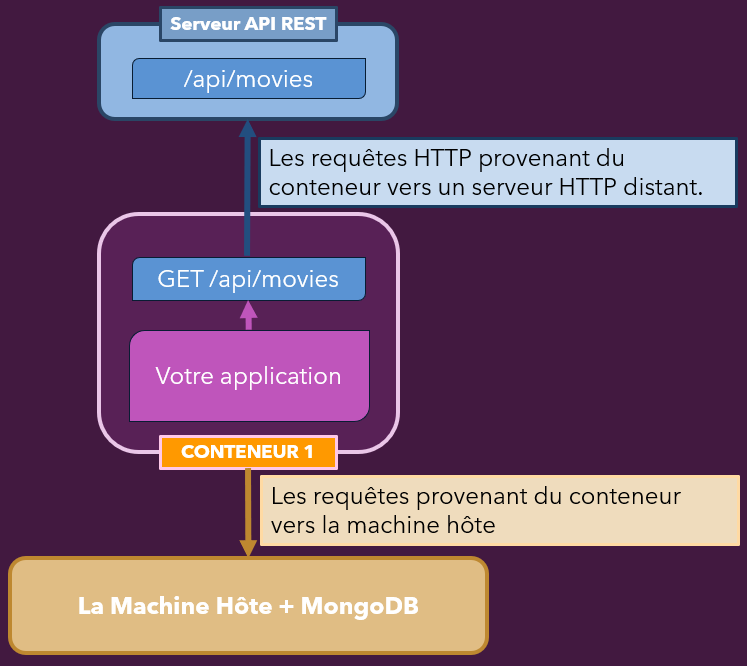

[source, javascript]
----
include::./code/networks-starting-setup/app.js[lines=70..80]
----

=== Situation 3 : Du conteneur vers un autre conteneur

Dans la situation 2, nous avons identifié le besoin de communiquer avec MongoDb installé sur la machine hôte.

Mais il est possible que le service de base de données soit lui aussi inclus dans un autre conteneur. **Et c'est d'ailleurs fortement recommandé !
**

Par conséquent, il faudra que le conteneur de notre application puisse dialoguer avec le conteneur de la base de données.

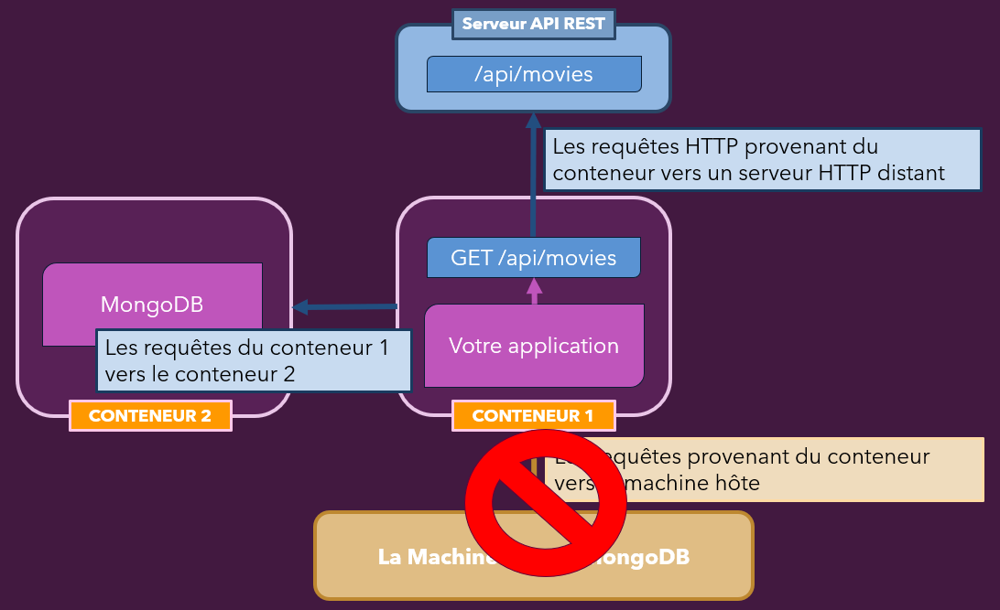

[NOTE]
====

Donc, nous devons créer une image pour l'application NodeJs et une autre image pour la base de données MongoDB.
====

== Mise en pratique : Création du conteneur et communication avec le serveur API REST

Dans le dossier de l'application de démonstration, supprimer le fichier `node_module` et `package-lock.json` si vous avez réalisé l'installation de l'application vue précédemment.

Nous allons mainternant créer une image avec le `Dockerfile` présent :

[source,bash]
----
docker build -t favorites-node .
----

Ensuite lançons un conteneur basé sur l'image `favorites-node` :

[source,bash]
----
docker container run --name favorites -d --rm -p 3000:3000 favorites-node
----
[NOTE]
.Rappels
====
* `--name` Permet de donner un nom au conteneur
* `-d` Démarre le conteneur en tâche de fond
* `--rm` Supprime le conteneur dès qu'il est arrêté
* `-p` Associé le port 3000 de la machine hôte avec le port 3000 du conteneur
* `favorites-node` nom de l'image
====
Il n'est pas nécessaire de définir de *volumes*, car l'application n'écrit rien dans des fichiers qui doivent persister après la suppression du conteneur. Les seules données qui seront écrites sont celles qui seront stockées dans la base de données, mais elles ne seront pas stockées dans ce conteneur.

En exécutant la commande, nous recevons un identifiant de conteneur.
Vérifions :

[source,bash]
----
docker container ps
docker container ps -a
----

Nous remarquons que la liste est vide ! Aucun conteneur n'a été démarré ni créé après la commande précédente !

Cela est tout à fait normal ! En effet, nous avons démarré le conteneur avec le paramètre --rm, ce qui signifie que le conteneur n'a pas pu démarrer correctement, qu'il s'est arrêté et qu'il a été supprimé.

Regardons plus en détail d'où peut provenir ce problème, en lançant de nouveau la commande sans le mode détaché `-d`.

[source,bash]
----
docker container run --name favorites --rm -p 3000:3000 favorites-node
----

Le conteneur se lance bien, mais l'application plante!

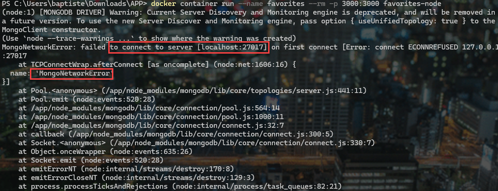

Il s'agit d'une erreur avec *MongoDb *!
Notre application tente de se connecter au serveur de base de données qui n'est pas inclus dans l'image.

Je vais lancer alors MongoCompass sur ma machine hôte et relancer le conteneur.

J'obtiens les mêmes messages d'erreurs !

[source, javascript]
.Fichier : code/networks-starting-setup/app.js
----
include::./code/networks-starting-setup/app.js[lines=70..80]
----

L'application, qui tourne dans le conteneur, tente de se connecter au serveur Mongo : `mongodb://localhost:27017/`.
Etant cloisonnée dans le cadre du conteneur, `localhost` fait référence, dans l'application, au `localhost` du conteneur.

Pour le moment donc, notre conteneur est incapable de joindre le `localhost` et le port `27017` de la machine hôte !

Ouvrez donc le fichier `app.js` :

* Commentez les lignes 70 à 80. En Javascript, on met en commentaire un bloc de code avec le symbole : /* placé en début et */ placé à la fin du bloc.
* Ajoutez l'écoute de l'application sur le port 3000.

[source, javascript]
.Fichier : code/networks-starting-setup/app.js
----
app.listen(3000);
/*
mongoose.connect(
  'mongodb://localhost:27017/swfavorites',
  { useNewUrlParser: true },
  (err) => {
    if (err) {
      console.log(err);
    } else {
      app.listen(3000);
    }
  }
);
*/
----

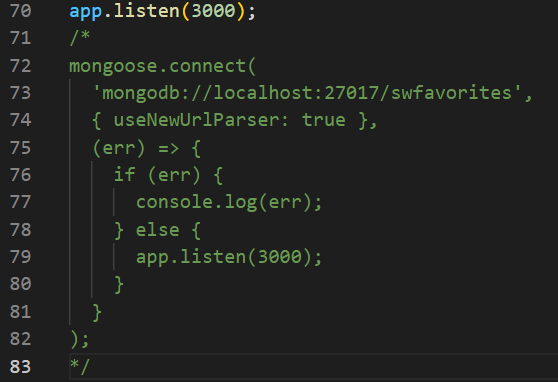

Reconstruisons l'image :
[source,bash]
----
docker build -t favorites-node .
----

Créons de nouveau le conteneur :

[source,bash]
----
docker container run --name favorites -d --rm -p 3000:3000 favorites-node
----

Vérifions :

[source,bash]
----
docker container ps
----

Résultat :

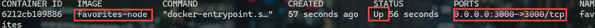

L'application est fonctionnelle et testable ! Sauf bien entendu les deux routes qui nécessitent MongoDb :

* GET /favorites
* POST /favorites

Mais les routes appelant seulement l'API externe sont testables :

* GET /movies
* GET /people

Ouvrons le logiciel *Insomnia* et testons la méthode GET sur l'URL :

http://localhost:3000/movies

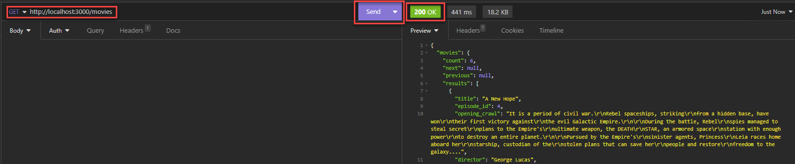

[NOTE]
====
Nous constatons que notre conteneur communique parfaitement avec le *serveur HTTP distant* !

Il n'y a pas besoin de faire des modifications dans le code de l'application pour faire communiquer un *conteneur* avec une *API distante* par exemple !

A contrario, *il faudra surement faire quelques* modifications pour permettre *au conteneur de communiquer* avec le *`localhost`* de la machine hôte.
====

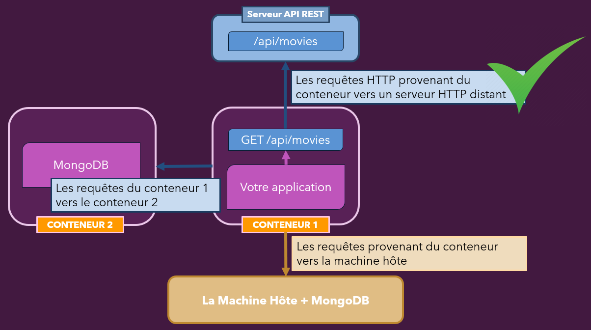

== Mise en pratique : Faire communiquer le conteneur avec le localhost

Nous allons faire communiquer le service Mongodb qui tourne sur la machine hôte avec le conteneur.

Pour cela supprimons les modifications apportées précédemment dans le fichier `app.js` :

[source, javascript]
.Fichier : code/networks-starting-setup/app.js
----
mongoose.connect(
  'mongodb://localhost:27017/swfavorites',
  { useNewUrlParser: true },
  (err) => {
    if (err) {
      console.log(err);
    } else {
      app.listen(3000);
    }
  }
);
----

La ligne qui pose un problème est la suivante :

`'mongodb://localhost:27017/swfavorites'`
Plus précisément, le nom de domaine `localhost`.

Comme nous l'avons déjà mentionné, lorsque localhost est lu par l'application et par le moteur de traduction d'adresse IP de Docker, il est compris comme faisant référence à l'adresse IP du conteneur.

Or, nous voulons qu'il soit interprété différemment ! Nous voulons que localhost pointe vers l'adresse IP de notre machine hôte.

Heureusement, il existe une instruction spéciale comprise par Docker qui permet de remplacer le terme localhost dans notre code par host.docker.internal, ce qui permettra de cibler l'adresse IP de la machine hôte.

[source, javascript]
.Fichier : code/networks-starting-setup/app.js
----
mongoose.connect(
  'mongodb://host.docker.internal:27017/swfavorites',
  { useNewUrlParser: true },
  (err) => {
    if (err) {
      console.log(err);
    } else {
      app.listen(3000);
    }
  }
);
----

Nous devons maintenant reconstruire l'image encore une fois pour que les modifications soient prises en compte.

Reconstruisons l'image :
[source,bash]
----
docker build -t favorites-node .
----

Créons de nouveau le conteneur :

[source,bash]
----
docker container run --name favorites -d --rm -p 3000:3000 favorites-node
----

Nous allons maintenant tester en postant un favori :

* Ouvrez *Insomnia* :

* Modifiez la requête HTTP en POST
* Ajouter l'URL : http://localhost:3000/favorites
* Modifiez le type du BODY de la requête en *JSON*
* ajoutez la structure *JSON* suivante :

[source, json]
----
{
	"type" :  "movie",
	"name" : "The Empire Strike Back",
	"url" : "http://swapi.dev/api/films/2/"
}
----

* Appuyez sur "Send"

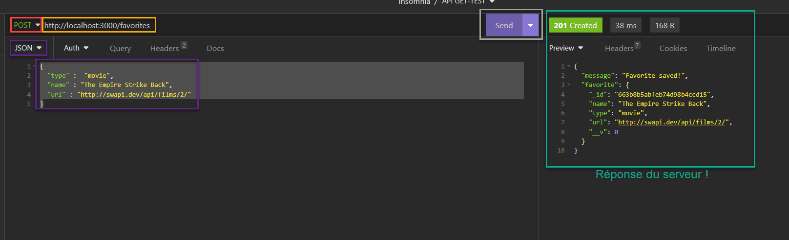

Cela fonctionne maintenant parfaitement !

Nous pouvons même récupérer le favori ajouté :

* Modifiez la requête HTTP en GET
* Laissez l'URL : http://localhost:3000/favorites
* Modifiez le type du BODY en "No Body"
* Appuyez sur "Send"

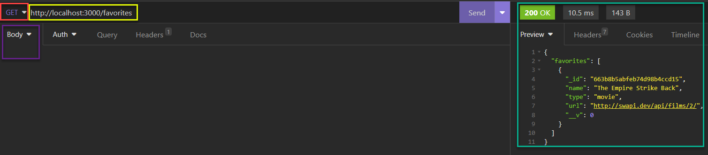

Nous avons réussi à faire communiquer notre conteneur avec la machine hôte !
Mais il faut penser à modifier légèrement notre code !

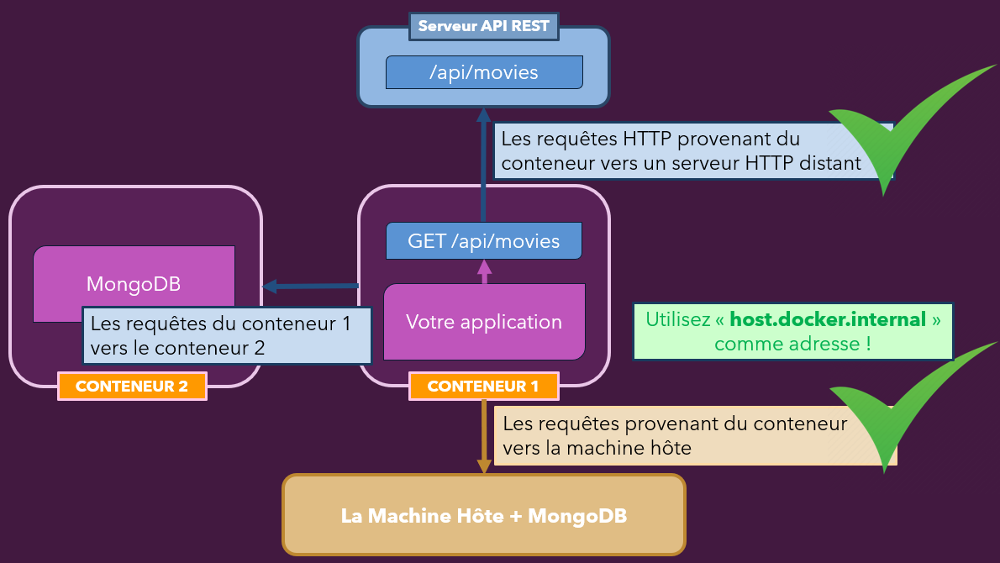

[CAUTION]
====
Toutefois, cela n'est pas la solution idéale. Dans notre situation, il faudra créer un conteneur avec MongoDB et s'arranger pour qu'il puisse communiquer avec le conteneur de l'application !
====

== Mise en pratique : Communication entre conteneurs [Solution basique]

Premièrement, nous créerons un nouveau conteneur basé sur une image officielle de MongoDB :

[source, bash]
----
docker container run -d --name mongodb mongo
----

Maintenant que le conteneur est lancé, comment faire communiquer notre application du conteneur `favorites` avec MongoDB présent dans le conteneur "mongodb" ?

Nous savons déjà qu'il faudra éditer le fichier `app.js` et la ligne contenant cette chaine de connexion :

[source, bash]
----
mongodb://host.docker.internal:27017/swfavorites,
----

`host.docker.internal` peut être remplacé par l'adresse IP de `mongodb`, que l'on peut connaitre en inspectant la configuration du conteneur :

[source, bash]
----
docker container inspect mongodb
----

La commande retourne un fichier JSON organisant les données du conteneur.

Nous n'avons plus qu'à chercher la clef `IPAddress` !

Le fichier de configuration est long à parcourir. Nous allons modifier un peu la commande et intégrer un filtre.

`IPAddress` se trouve dans la catégorie : `NetworkSettings`, cela est pratique de le savoir, car nous allons pouvoir formater la réponse en n'affichant que la clé qui nous intéresse.

[source, bash]
----
docker inspect --format '{{ .NetworkSettings.IPAddress }}' mongodb
----

L'adresse IP retournée est : **172.17.0.3**

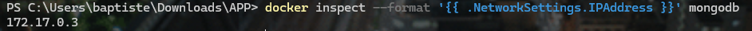

Modifions maintenant notre fichier `app.js` de la sorte :

[source, javascript]
----
// some code before
mongoose.connect(
  'mongodb://172.17.0.3:27017/swfavorites',
  { useNewUrlParser: true },
  (err) => {
    if (err) {
      console.log(err);
    } else {
      app.listen(3000);
    }
  }
);
----

Pour tester, stoppons le conteneur `favorites`, et reconstruisons l'image.

[source, bash]
----
docker container stop favorites
----
Puis :
[source, bash]
----
docker build -t favorites-node .
----

Lançons cette nouvelle version :

[source,bash]
----
docker container run --name favorites -d --rm -p 3000:3000 favorites-node
----

Vérifions si nos deux conteneurs sont bien lancés :

[source,bash]
----
docker ps
----

Et maintenant avec Insomnia, testons :

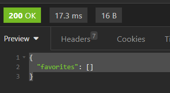

Le résultat est correcte puisque nous avons une nouvelle installation de MongoDB et nous n'avons pas encore inséré de données.

Nos deux conteneurs communiquent et échangent des informations ! Nous sommes arrivés à nos fins.

Mais cette solution est tout sauf pratique !

* Il faut chercher l'adresse IP du conteneur soit même.
* Quand l'adresse IP de MongoDB change, il faut recréer une image de l'application.

Voyons maintenant une manière élégante de procéder !

== Mise en pratique : Les Networks Docker [Solution élégante]

Avec Docker, nous pouvons créer des réseaux appelés en anglais : `Networks`.

Lorsque nous avons plusieurs conteneurs qui vont devoir communiquer, nous allons pouvoir les réunir au sein d'un même réseau grâce au paramètre ``--network ``.

Docker ne créé pas automatiquement les réseaux quand nous montons plusieurs conteneurs. Il faut le spécifier manuellement.

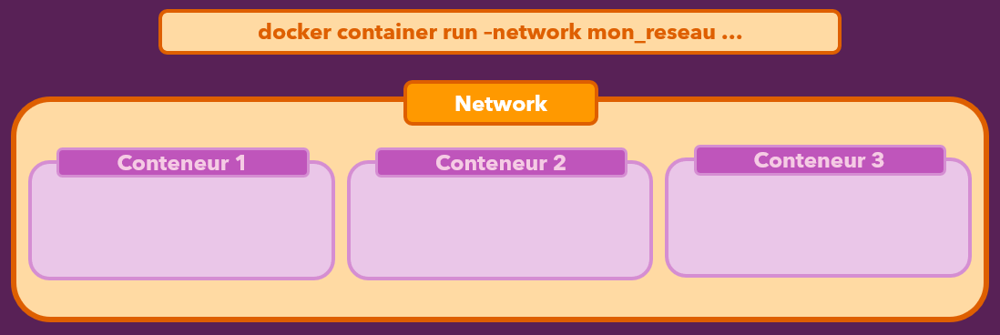

[IMPORTANT]
====
Dans un *réseau interne Docker*, tous les conteneurs peuvent communiquer. Les adresses IP sont automatiquement résolues, c'est-à-dire *qu'elles sont attribuées et connues de tous les membres du réseau*.
====

Mettons en place un réseau pour les conteneurs de notre application.

Stoppons d'abord les conteneurs :

[source, bash]
----
docker container stop favorites
----

puis

[source, bash]
----
docker container stop mongodb
----

Et supprimons tous les conteneurs arrêtés :

[source, bash]
----
docker container prune
----

Maintenant voyons comment nous allons pouvoir intégrer notre premier conteneur `mongodb` dans un réseau nommé arbitrairement `fav-network` :

Il faut créer le réseau en lui-même avec la commande :

[source, bash]
----
docker network create fav-network
----

Par curiosité, nous pouvons lister l'ensemble des réseaux existant sur notre Docker :

[source, bash]
----
docker network ls
----
image::images/19.png[]

Ensuite, créons un autre conteneur, en l'intégrant dans le nouveau réseau :

[source, bash]
----
docker container run -d --name mongodb --network fav-network mongo
----

[NOTE]
====
Mongodb est inclus dans un réseau Docker et sera utilisé par un autre conteneur. Vous remarquerez qu'il n'y a pas besoin ici d'exposer un port de mongodb vers une quelconque sortie. 

Comme Mongodb sera dans le même réseau que notre application, le lien via l'adresse IP et le PORT du service sera automatiquement réalisé par DOCKER !
====

La prochaine étape sera de monter le conteneur de notre application de la même manière !
Mais il faut modifier le code source pour permettre la communication entre notre application et le serveur mongodb.

Il faut trouver une solution pour récupérer l'adresse IP du conteneur `mongodb` automatiquement.

Comme les conteneurs font partie d**u même réseau Docker**, nous pouvons remplacer l'adresse IP du conteneur par le nom de ce conteneur: `mongodb` dans notre cas.

[source, javascript]
----
// some code before
mongoose.connect(
  'mongodb://mongodb:27017/swfavorites',
  { useNewUrlParser: true },
  (err) => {
    if (err) {
      console.log(err);
    } else {
      app.listen(3000);
    }
  }
);
----

Docker va alors automatiquement traduire ce nom de conteneur par la valeur de son adresse IP.

Faisons les modifications dans notre code, et montons une nouvelle image :

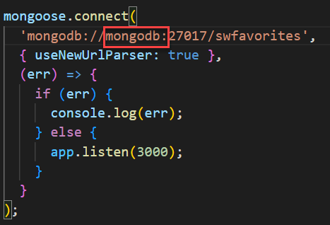

[source, bash]
----
docker build -t favorites-node .
----

Lançons cette nouvelle version :

[source,bash]
----
docker container run --name favorites --network fav-network -d --rm -p 3000:3000 favorites-node
----

Nous pouvons vérifier si le processus s'est bien déroulé :

[source, bash]
----
docker ps
----

La commande devrait montrer les deux conteneurs démarrés.

Puis les *_logs_*, qui nous indiqueraient si des problèmes de liaison entre les conteneurs du réseau seraient apparus.
[source, bash]
----
docker logs
----

Et au final, avec Insomnia, nous pouvons tester les routes !

En conclusion :

* Dans une communication de conteneur à conteneur, il faut créer un réseau, puis le *Docker Engine* se charge de faire la liaison automatiquement** sans que l'on ait à se soucier de l'exposition des ports**.

* L'*exposition des ports* n'est à réaliser que dans le cadre d'une communication entre un conteneur et la machine hôte.

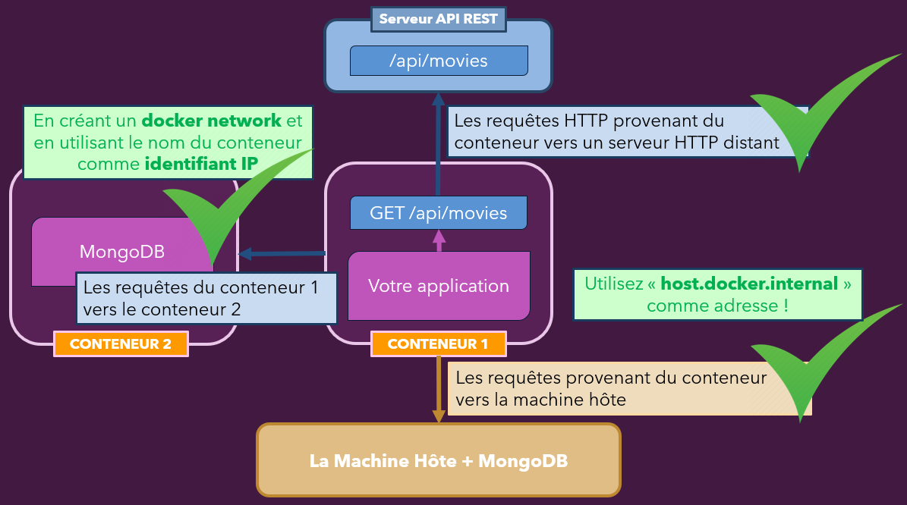

[IMPORTANT]
====
Docker ne modifie pas le code source de notre application en remplaçant le nom de domaine par l'adresse IP du conteneur. Cependant, Docker contrôle l'environnement réseau et reçoit les requêtes HTTP entrantes et sortantes des conteneurs. Lorsqu'un conteneur envoie une requête au serveur mongodb, Docker tente de résoudre le nom de domaine du destinataire. Si le nom de domaine est remplacé par une adresse IP, Docker enverra la requête à cette adresse. Si le nom de domaine est un nom de conteneur, qui agit comme un nom de domaine local, Docker cherchera son adresse IP pour envoyer la requête.

====

== Les pilotes (drivers) de Docker Network

Les réseaux Docker prennent en charge différents types de "pilotes" ou "*drivers*" en anglais, qui influencent le comportement du réseau.

Le pilote par *défaut* est le pilote "*bridge*"

- Il fournit le comportement présenté dans ce module, (c'est-à-dire que les conteneurs peuvent se trouver les uns les autres par nom s'ils se trouvent dans le même réseau).

Le pilote peut être défini lorsqu'un réseau est créé, simplement en ajoutant l'option `--driver`.

[source, bash]
----
docker network create --driver bridge mon_reseau
----

Bien sûr, si vous souhaitez utiliser le pilote "bridge", vous pouvez simplement omettre l'option entière car "bridge" est le pilote par défaut.

Docker prend également en charge les pilotes alternatifs suivants - bien que vous utilisiez le pilote "bridge" dans la plupart des cas :

* `host` : pour les conteneurs autonomes, l'isolement entre le conteneur et le système hôte est supprimé (c'est-à-dire qu'ils partagent localhost en tant que réseau)

* `overlay` : plusieurs démons Docker (c'est-à-dire Docker en cours d'exécution sur différentes machines) peuvent se connecter les uns aux autres. Fonctionne uniquement en mode "Swarm" qui est un moyen obsolète / presque obsolète de connecter plusieurs conteneurs

* `macvlan` : vous pouvez définir une adresse MAC personnalisée pour un conteneur - cette adresse peut ensuite être utilisée pour la communication avec ce conteneur

* `none` : toute la mise en réseau est désactivée.

* `Third-party plugins` : vous pouvez installer des plugins tiers qui peuvent alors ajouter toutes sortes de comportements et de fonctionnalités

Comme mentionné, le pilote "*bridge*" a le plus de sens dans la grande majorité des scénarios.

