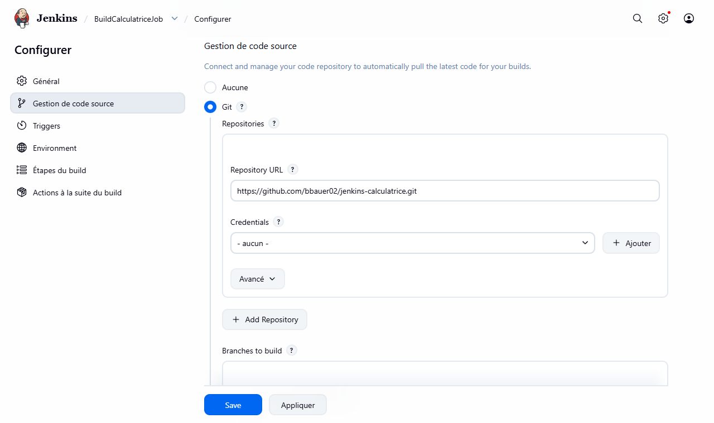
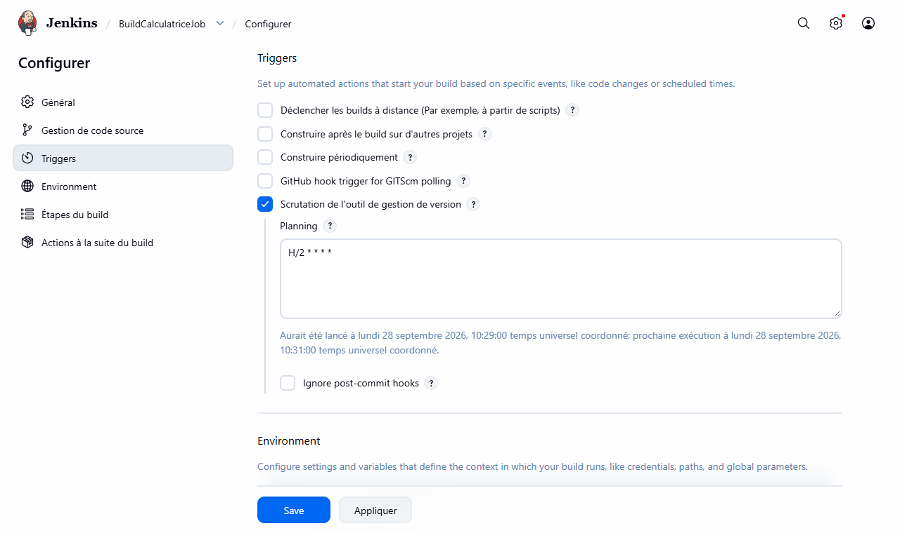
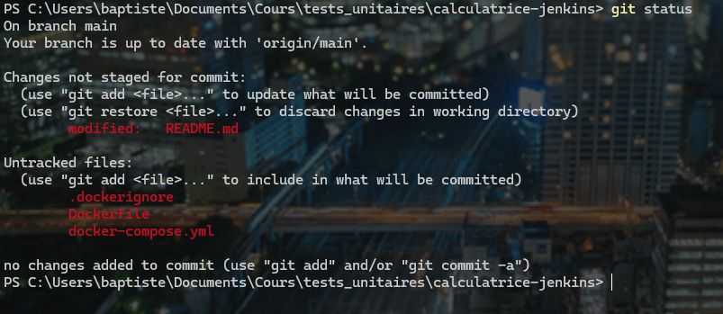
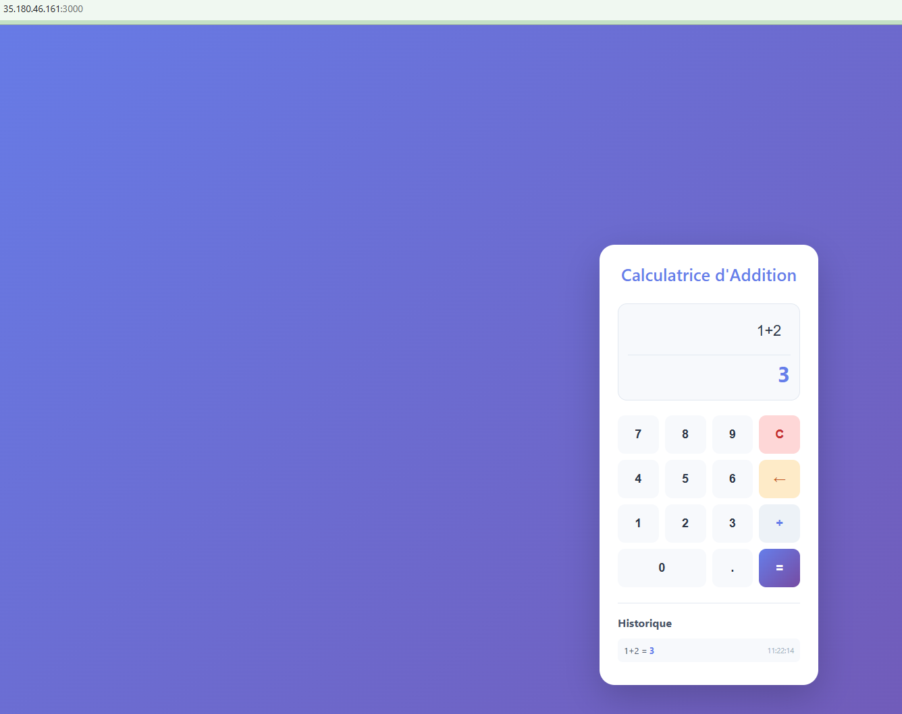
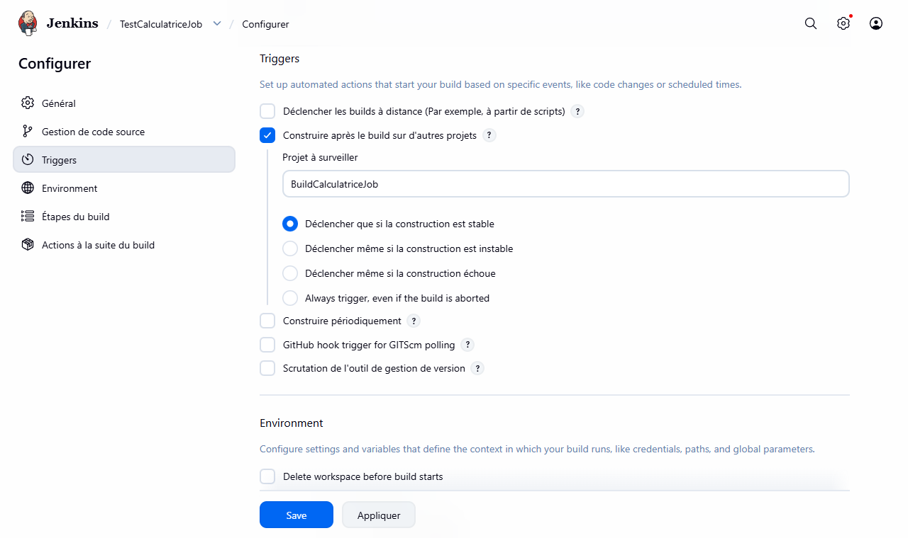
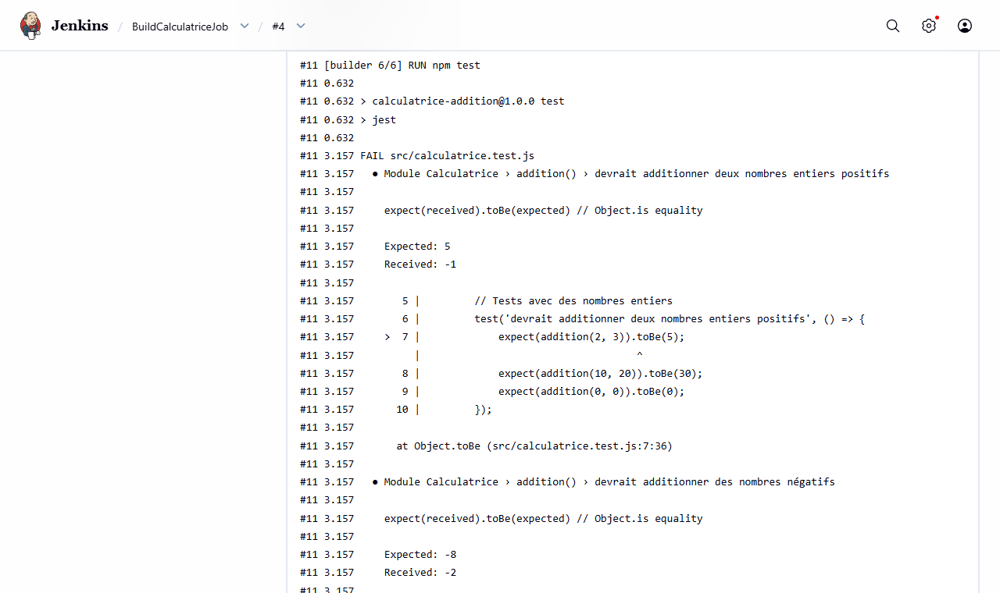
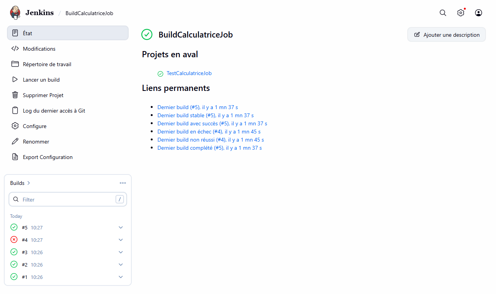
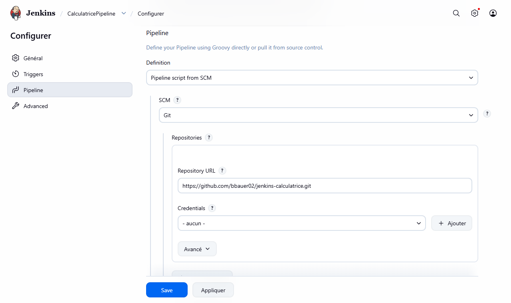
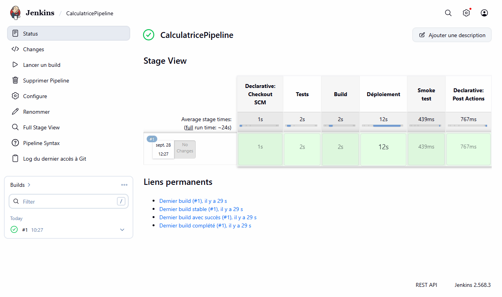

:_chapter:
:_author: Bauer Baptiste
:_duration: 6 heures
:_version_number: 2.0.0
:_version_date: 28/09/2026
[[jobs-pipelines]]
= Intégration continue de la calculatrice
include::../../../run_app.adoc[]

Dans ce chapitre, vous allez mettre en place, *sur votre machine*, une chaîne d'intégration continue complète pour la calculatrice :

* Jenkins détecte chaque nouveau commit sur GitHub (étape 3) ;
* il construit l'image Docker, tests compris, et déploie l'application (étape 4) ;
* il vérifie que l'application répond, et refuse de déployer une version buguée (étape 5) ;
* toute la chaîne est décrite dans un fichier `Jenkinsfile` versionné avec le code (étape 6).

.Prérequis
* Chapitre _Découvrir Jenkins_ terminé : `./check.sh 1` et `./check.sh 2` validés.

[NOTE]
====
Toutes les commandes de ce chapitre sont à lancer icon:desktop[] *sur votre poste*, depuis la racine de votre dépôt `jenkins-calculatrice` (dans *Git Bash* sous Windows). Remplacez `<votre_compte_github>` par votre nom d'utilisateur GitHub (sensible à la casse).
====

== Étape 3 : Relier un job au dépôt Git

icon:bullseye[] *Objectif* : un job Jenkins qui récupère automatiquement la dernière version du code à chaque commit.

icon:lightbulb-o[] *Comprendre*

Votre dépôt contient l'application :

[cols="1,3", options="header"]
|===
| Chemin | Contenu

| `server.js`
| Le serveur web (Express), qui écoute sur le port `3000`.

| `src/calculatrice.js`
| La fonction `addition()`.

| `public/`
| La page web (HTML, CSS, JavaScript).

| `*.test.js`
| Les tests automatisés (Jest), lancés par `npm test`.

| `jenkins/`, `check.sh`
| L'outillage du TP (chapitre précédent).
|===

Pour savoir qu'il y a du nouveau code, Jenkins peut :

* *scruter* le dépôt (_polling_) : il demande régulièrement à GitHub « y a-t-il un nouveau commit ? » ;
* être *prévenu* par GitHub grâce à un *webhook*, à chaque `push`.

Le webhook est plus rapide et plus économe, mais GitHub doit pouvoir joindre Jenkins depuis Internet. Votre Jenkins tourne sur votre poste, qui n'est pas joignable depuis Internet : nous utilisons donc la *scrutation*. Le webhook viendra à l'étape 8, sur un serveur AWS.

icon:wrench[] *À faire*

. Créez un nouveau job *free-style* nommé `BuildCalculatriceJob`.

. Dans *Gestion de code source*, choisissez *Git* :
** *Repository URL* : `https://github.com/<votre_compte_github>/jenkins-calculatrice.git` ;
** *Credentials* : laissez *- aucun -* (votre dépôt est public) ;
** *Branch Specifier* : `*/main` (et non `*/master`).
+

. Dans *Triggers*, cochez *Scrutation de l'outil de gestion de version* et saisissez le planning `H/2 * * * *`.
+

+
[NOTE]
====
Le planning utilise la syntaxe *cron* : `minute heure jour mois jour-de-la-semaine`. `H/2 * * * *` signifie « toutes les 2 minutes environ ». Le `H` (_hash_) décale un peu l'horaire de chaque job pour éviter que tous interrogent GitHub au même instant.
====

. Dans *Étapes du build*, ajoutez *Exécuter un script shell* :
+
[source,bash]
----
ls
git log -1 --oneline
----

. Sauvez, puis cliquez sur *Lancer un build*. Dans la sortie console, vous voyez Jenkins cloner votre dépôt, puis la liste des fichiers et le dernier commit.

. *Testez la scrutation* : icon:desktop[] modifiez le fichier `README.md` (ajoutez une ligne), puis :
+
[source,bash]
----
git commit -am "Test de la scrutation"
git push
----
+
Sans rien toucher, attendez au plus 2 minutes : un nouveau build démarre tout seul. Sa page indique *« Démarré par un changement dans la gestion de version »*, et la sortie console affiche votre nouveau commit.

icon:check-circle[] *Vérifier*

[source,bash]
----
./check.sh 3
----

icon:times-circle[] *En cas de problème*

[cols="1,2", options="header"]
|===
| Symptôme | Cause probable / solution

| `Couldn't find any revision to build`
| Le *Branch Specifier* ne correspond à aucune branche : utilisez `*/main`.

| `repository not found` / `Authentication failed`
| URL mal saisie (casse du nom de compte), ou dépôt privé. Vérifiez l'URL en l'ouvrant dans votre navigateur.

| Aucun build ne démarre après le push
| Vérifiez que le push a bien eu lieu (`git status` doit indiquer `up to date with 'origin/main'`). Le menu *Journal de scrutation* du job montre ce que Jenkins a vu lors de sa dernière vérification.

| `check.sh` indique que le dossier n'est pas un clone de votre dépôt
| Vous travaillez dans le dépôt modèle au lieu du vôtre : clonez *votre* dépôt (étape 1).
|===

[.question]
****
*Q{counter:_question})*
Avec la scrutation `H/2 * * * *`, combien de requêtes Jenkins envoie-t-il à GitHub par jour, même s'il ne se passe rien ? Quel est l'avantage du webhook de ce point de vue ?
//end question
****

// ---------- answer
ifeval::[{_show_correction} == 1]
[.answer]
****
_Correction de Q{_question}_

Une requête toutes les 2 minutes, soit 30 par heure et 720 par jour, qu'il y ait des commits ou non. Avec un webhook, GitHub n'envoie une requête qu'au moment d'un push : aucune requête inutile, et le build démarre immédiatement au lieu d'attendre jusqu'à 2 minutes.
****
endif::[]

ifeval::[{_show_correction} == 0]
[.discreet]#_réponse *{_question}* disponible._#
endif::[]
//  end answer ----------

== Étape 4 : Construire et déployer avec Docker

icon:bullseye[] *Objectif* : à chaque commit, Jenkins construit l'image Docker de l'application (tests compris) et relance le conteneur.

icon:lightbulb-o[] *Comprendre*

Jenkins ne contient pas Node.js : il n'a pas besoin de savoir construire l'application lui-même. Il demande à *Docker* de le faire, à partir d'un `Dockerfile`. C'est le `Dockerfile` qui décrit comment installer les dépendances, lancer les tests et démarrer l'application.

Rappel : le démon Docker utilisé est celui de *votre machine*. Le conteneur de l'application sera donc créé à côté du conteneur Jenkins, et publié sur le port `3000` de votre machine.

icon:wrench[] *À faire*

[.question]
****
*Q{counter:_question})*
Rédigez à la racine du dépôt un `Dockerfile` *multi-stage* pour l'application :

* un premier stage nommé `builder` part de `node:22-alpine`, installe toutes les dépendances (`npm ci`), copie le code et exécute les tests (`npm test`) ;
* un second stage, également basé sur `node:22-alpine`, n'installe que les dépendances de production (`npm ci --omit=dev`), copie depuis `builder` les fichiers `server.js`, `src/` et `public/`, s'exécute avec l'utilisateur non-root `node` et lance `node server.js` sur le port `3000`.
//end question
****

// ---------- answer
ifeval::[{_show_correction} == 1]
[.answer]
****
_Correction de Q{_question}_

[source,dockerfile]
----
include::code/Dockerfile-calculatrice[]
----
****
endif::[]

ifeval::[{_show_correction} == 0]
[.discreet]#_réponse *{_question}* disponible._#
endif::[]
//  end answer ----------

[.question]
****
*Q{counter:_question})*
Rédigez à la racine du dépôt un fichier `docker-compose.yaml` qui :

* fixe le nom du projet Compose à `calculatrice` (clé `name`) ;
* construit l'image `calculatrice:latest` à partir du `Dockerfile` ;
* nomme le conteneur `calculatrice-app` et publie le port `3000` ;
* redémarre automatiquement le conteneur (`restart: unless-stopped`).
//end question
****

// ---------- answer
ifeval::[{_show_correction} == 1]
[.answer]
****
_Correction de Q{_question}_

[source,yaml]
----
include::code/docker-compose-calculatrice.yaml[]
----

La clé `name: calculatrice` fixe le nom du projet Compose. Sans elle, le nom du projet est déduit du nom du dossier : lancé depuis deux workspaces Jenkins différents, Compose croirait gérer deux projets différents et échouerait (`container name "/calculatrice-app" is already in use`).
****
endif::[]
ifeval::[{_show_correction} == 0]
[.discreet]#_réponse *{_question}* disponible._#
endif::[]
//  end answer ----------

[TIP]
====
Le fichier `.dockerignore`, déjà présent dans le dépôt, évite de copier dans l'image les fichiers inutiles (`node_modules`, `.git`, `jenkins/`…). Il ne doit *pas* exclure les fichiers `*.test.js` : ils sont exécutés par `npm test` pendant la construction.
====

. icon:desktop[] Avant de confier ce travail à Jenkins, vérifiez vous-même que tout fonctionne :
+
[source,bash]
----
docker compose up -d --build
----
+
Pendant la construction, vous devez voir les tests passer (`Tests: 20 passed, 20 total`). Ouvrez ensuite http://localhost:3000 : la calculatrice s'affiche. Arrêtez-la avant de continuer :
+
[source,bash]
----
docker compose down
----

. icon:desktop[] Créez le script `calculatrice-app.sh` que Jenkins exécutera :
+
[source,bash]
.calculatrice-app.sh
----
include::code/calculatrice-app.sh[]
----
+
[NOTE]
====
* `set -e` arrête le script (et fait échouer le build) dès qu'une commande échoue.
* On écrit `docker compose` (le plugin Compose, installé dans l'image Jenkins) et non `docker-compose` (l'ancien programme Compose v1, abandonné) : sinon, le build échoue avec `docker-compose: not found`.
====

. icon:desktop[] Versionnez et poussez les trois fichiers :
+
[source,bash]
----
git add Dockerfile docker-compose.yaml calculatrice-app.sh
git commit -m "Ajout du Dockerfile, du docker-compose et du script de build"
git push
----
+

. Dans Jenkins, configurez `BuildCalculatriceJob` : remplacez le script de l'étape du build par :
+
[source,bash]
----
bash ./calculatrice-app.sh
----

. Lancez un build (ou attendez la scrutation). La sortie console montre la construction de l'image, les tests, puis le démarrage du conteneur.

icon:check-circle[] *Vérifier*

L'application est accessible sur http://localhost:3000.

[source,bash]
----
./check.sh 4
----

icon:times-circle[] *En cas de problème*

[cols="1,2", options="header"]
|===
| Symptôme | Cause probable / solution

| `no configuration file provided: not found`
| Pas de `docker-compose.yaml` à la racine du dépôt *sur GitHub* : vérifiez le nom du fichier et qu'il a bien été poussé.

| `docker-compose: not found`
| Remplacez `docker-compose` par `docker compose` dans le script.

| `No tests found` pendant `npm test`
| Les fichiers `*.test.js` sont exclus par le `.dockerignore`, ou ne sont pas copiés dans le stage `builder`.

| `container name "/calculatrice-app" is already in use`
| Un conteneur du même nom a été créé par un autre projet Compose. Ajoutez `name: calculatrice` dans `docker-compose.yaml`, ou supprimez-le : `docker rm -f calculatrice-app`.

| `port is already allocated` (port 3000)
| Une autre application utilise le port 3000 (par exemple un `npm start` oublié). Arrêtez-la.
|===

TIP: Bloqué ? Récupérez la correction de l'étape avec la branche `solution-etape-4` (voir _Comment utiliser ce cours_).

[.question]
****
*Q{counter:_question})*
Pourquoi est-il intéressant de lancer les tests *pendant la construction de l'image* plutôt qu'après son déploiement ?
//end question
****

// ---------- answer
ifeval::[{_show_correction} == 1]
[.answer]
****
_Correction de Q{_question}_

Si un test échoue, `npm test` renvoie un code d'erreur, la construction de l'image échoue et `docker compose up` s'arrête avant de remplacer le conteneur : la version défectueuse n'est jamais déployée, l'ancienne version continue de tourner. Vous le vérifierez à l'étape suivante.
****
endif::[]

ifeval::[{_show_correction} == 0]
[.discreet]#_réponse *{_question}* disponible._#
endif::[]
//  end answer ----------

== Étape 5 : Tester, casser, réparer

icon:bullseye[] *Objectif* : vérifier automatiquement que l'application répond après chaque déploiement, et voir la chaîne bloquer une version buguée.

=== Un job qui teste l'application

icon:lightbulb-o[] *Comprendre*

Les tests unitaires vérifient le code *avant* le déploiement. Un *smoke test* (« test de fumée ») vérifie *après* le déploiement que l'application démarre et répond. Nous allons l'exécuter dans un second job, déclenché automatiquement après chaque build réussi.

icon:wrench[] *À faire*

. Créez un job *free-style* nommé `TestCalculatriceJob`, *sans* gestion de code source.

. Dans *Triggers*, cochez *Construire après le build sur d'autres projets*, projet à surveiller : `BuildCalculatriceJob`, option *Déclencher que si la construction est stable*.
+

. Dans *Étapes du build*, ajoutez *Exécuter un script shell* :
+
[source,bash]
----
curl -fsS --retry 10 --retry-connrefused --retry-delay 3 http://host.docker.internal:3000 | grep "Calculatrice d'Addition"
----
+
* `host.docker.internal` désigne votre machine, vue depuis le conteneur Jenkins : c'est là que l'application publie son port `3000`. (`localhost` désignerait le conteneur Jenkins lui-même.)
* `--retry 10 --retry-connrefused --retry-delay 3` : l'application peut mettre quelques secondes à démarrer ; `curl` réessaie jusqu'à 10 fois, toutes les 3 secondes.
* `-f` : `curl` échoue si le serveur renvoie une erreur HTTP (404, 500…).
* `grep` cherche le titre de la page. S'il ne le trouve pas, il renvoie un code d'erreur et le build échoue.

. Lancez `BuildCalculatriceJob` : à la fin du build, `TestCalculatriceJob` démarre tout seul et doit réussir.

=== Casser le build

icon:wrench[] *À faire*

. icon:question-circle[] *Avant de faire la manipulation, notez votre prédiction* : si vous poussez un bug dans la fonction `addition()`, que va-t-il se passer pour le build ? pour le test ? pour l'application actuellement en ligne ?

. icon:desktop[] Introduisez un bug : dans `src/calculatrice.js`, remplacez `return nombre1 + nombre2;` par `return nombre1 - nombre2;`, puis :
+
[source,bash]
----
git commit -am "Nouvelle version de l'addition"
git push
----

. Attendez le build (ou lancez-le). Il est *en échec* : dans la sortie console, cherchez la ligne `Tests:` et le détail des tests en échec (`Expected: 5`, `Received: -1`).
+

. Observez :
** `TestCalculatriceJob` n'a *pas* été déclenché (le build n'est pas stable) ;
** http://localhost:3000 fonctionne toujours et calcule *juste* : c'est l'ancienne version, la version buguée n'a jamais été déployée.

=== Réparer

. icon:desktop[] Annulez le commit fautif :
+
[source,bash]
----
git revert --no-edit HEAD
git push
----

. Le build suivant redevient vert, et `TestCalculatriceJob` est de nouveau déclenché.

icon:check-circle[] *Vérifier*

[source,bash]
----
./check.sh 5
----

icon:times-circle[] *En cas de problème*

[cols="1,2", options="header"]
|===
| Symptôme | Cause probable / solution

| `curl: (7) Failed to connect to host.docker.internal`
| L'application n'a pas démarré (`docker logs calculatrice-app`), ou le conteneur Jenkins n'a pas été lancé avec le `compose.yaml` fourni (option `extra_hosts`).

| `curl: (6) Could not resolve host: host.docker.internal`
| Même cause : relancez Jenkins avec `docker compose up -d` dans le dossier `jenkins/`.

| Le build ne casse pas
| Vérifiez que le bug a été poussé (`git log origin/main -1`), et que le `Dockerfile` exécute bien `npm test`.

| `TestCalculatriceJob` ne se lance jamais
| Vérifiez le nom du projet surveillé dans ses *Triggers* : `BuildCalculatriceJob`, exactement.
|===

[.question]
****
*Q{counter:_question})*
Comparez votre prédiction avec ce que vous avez observé. Pourquoi l'application en ligne a-t-elle continué à fonctionner correctement pendant que le build était rouge ?
//end question
****

// ---------- answer
ifeval::[{_show_correction} == 1]
[.answer]
****
_Correction de Q{_question}_

Les tests sont exécutés pendant la construction de l'image (`RUN npm test` dans le stage `builder`). Le bug fait échouer des tests, donc la construction de l'image échoue, donc `docker compose up` s'arrête *avant* de remplacer le conteneur. L'ancien conteneur, avec l'ancienne version correcte, continue de tourner. Le smoke test n'est pas lancé car le build n'est pas stable.
****
endif::[]

ifeval::[{_show_correction} == 0]
[.discreet]#_réponse *{_question}* disponible._#
endif::[]
//  end answer ----------

== Étape 6 : Pipeline et Jenkinsfile

=== 6.1 Enchaîner les jobs dans un pipeline

icon:bullseye[] *Objectif* : découvrir les pipelines Jenkins, qui décrivent une chaîne d'étapes (_stages_) par un script.

icon:lightbulb-o[] *Comprendre*

Nos deux jobs free-style s'enchaînent grâce à un déclencheur. Un *pipeline* décrit toute la chaîne dans un script, découpé en *stages*, dont Jenkins affiche l'avancement.

icon:wrench[] *À faire*

. Créez un job de type *Pipeline* nommé `CalculatricePipeline`.

. Dans la section *Pipeline* (_Definition_ : *Pipeline script*), saisissez :
+
[source,groovy]
----
node {
    stage('Preparation') {
        // Supprime l'ancien conteneur s'il existe ("|| true" : pas d'erreur s'il n'existe pas)
        sh 'docker rm -f calculatrice-app || true'
    }
    stage('Build') {
        build 'BuildCalculatriceJob'
    }
    stage('Results') {
        build 'TestCalculatriceJob'
    }
}
----

. Sauvez et lancez un build : la page du job affiche les trois stages et leur durée.

[NOTE]
====
Vous remarquerez que `TestCalculatriceJob` s'exécute *deux fois* : une fois parce que le pipeline le lance (stage *Results*), une fois grâce à son propre déclencheur. C'est une limite des pipelines qui enchaînent des jobs free-style. La solution : décrire toute la chaîne *dans le pipeline lui-même*.
====

=== 6.2 Un Jenkinsfile de CI complet

icon:bullseye[] *Objectif* : décrire toute la chaîne dans un fichier `Jenkinsfile`, versionné avec le code.

icon:lightbulb-o[] *Comprendre*

Un `Jenkinsfile` placé à la racine du dépôt est lu par Jenkins à chaque exécution. Le pipeline est ainsi *versionné* : il évolue avec le code, se relit dans une _pull request_ et se restaure avec Git.

.Anatomie d'un pipeline déclaratif
[cols="1,3", options="header"]
|===
| Bloc | Rôle

| `pipeline { }`
| Englobe toute la description.

| `agent any`
| Exécute le pipeline sur n'importe quel exécuteur disponible (ici, Jenkins lui-même).

| `triggers { }`
| Les déclencheurs, par exemple `pollSCM('H/2 * * * *')`.

| `options { }`
| Réglages, par exemple `disableConcurrentBuilds()` pour éviter deux déploiements simultanés.

| `environment { }`
| Variables disponibles dans toutes les étapes (`$APP_URL`).

| `stages { stage('Nom') { steps { … } } }`
| Les étapes de la chaîne, exécutées dans l'ordre. Le pipeline s'arrête au premier stage en échec.

| `post { success { } failure { } always { } }`
| Actions exécutées à la fin, selon le résultat.
|===

Jenkins fournit aussi des variables d'environnement, par exemple `GIT_COMMIT` (le hash du commit construit) et `BUILD_NUMBER`.

icon:wrench[] *À faire*

[.question]
****
*Q{counter:_question})*
Créez à la racine du dépôt un fichier `Jenkinsfile` à partir du squelette ci-dessous, en remplaçant chaque `TODO` par la ou les commandes `sh '…'` adaptées.

[source,groovy]
----
pipeline {
    agent any
    triggers {
        pollSCM('H/2 * * * *')
    }
    options {
        disableConcurrentBuilds()
    }
    environment {
        APP_URL = 'http://host.docker.internal:3000'
    }
    stages {
        stage('Tests') {
            steps {
                // TODO : construire uniquement le stage "builder" du Dockerfile (il exécute npm test)
            }
        }
        stage('Build') {
            steps {
                // TODO : construire l'image de l'application avec Docker Compose
                // TODO : ajouter à l'image calculatrice:latest un tag égal aux 7 premiers caractères de GIT_COMMIT
            }
        }
        stage('Déploiement') {
            steps {
                // TODO : (re)lancer l'application avec Docker Compose
            }
        }
        stage('Smoke test') {
            steps {
                // TODO : vérifier que $APP_URL répond et contient "Calculatrice"
            }
        }
    }
    post {
        failure {
            sh 'docker compose logs --tail=50 || true'
        }
    }
}
----
//end question
****

.Indices
[%collapsible]
====
* Construire un seul stage d'un Dockerfile : `docker build --target <stage> -t <nom:tag> .`
* Construire les images d'un projet Compose : `docker compose build` ; les lancer : `docker compose up -d`.
* Dans une chaîne Groovy entre guillemets doubles, `${env.GIT_COMMIT.substring(0, 7)}` est remplacé par le début du hash.
* Le smoke test est la commande de `TestCalculatriceJob`, avec `$APP_URL` à la place de l'adresse (entre guillemets simples, c'est le shell qui remplace `$APP_URL`).
====

// ---------- answer
ifeval::[{_show_correction} == 1]
[.answer]
****
_Correction de Q{_question}_

[source,groovy]
.Jenkinsfile
----
include::code/Jenkinsfile-complet[]
----
****
endif::[]
ifeval::[{_show_correction} == 0]
[.discreet]#_réponse *{_question}* disponible._#
endif::[]
//  end answer ----------

. icon:desktop[] Poussez le `Jenkinsfile` :
+
[source,bash]
----
git add Jenkinsfile
git commit -m "Pipeline de CI complet dans un Jenkinsfile"
git push
----

. Dans Jenkins, configurez `CalculatricePipeline` → section *Pipeline* :
** *Definition* : `Pipeline script from SCM` ;
** *SCM* : `Git`, *Repository URL* : l'URL de votre dépôt, *Credentials* : aucun ;
** *Branch Specifier* : `*/main` ;
** *Script Path* : `Jenkinsfile`.
+

. Désactivez les anciens jobs, pour qu'un seul job déploie l'application : ouvrez `BuildCalculatriceJob` → *Configure*, basculez l'interrupteur *Enabled* (en haut à droite) sur désactivé, puis *Save*. Faites de même pour `TestCalculatriceJob`.

. Lancez *une fois à la main* `CalculatricePipeline`. Ce premier build enregistre le déclencheur `pollSCM` écrit dans le `Jenkinsfile` : les suivants démarreront tout seuls après chaque push.

icon:check-circle[] *Vérifier*

Les quatre stages sont verts, et la sortie console se termine par `Version xxxxxxx déployée sur le port 3000`.

[source,bash]
----
./check.sh 6
----

icon:times-circle[] *En cas de problème*

[cols="1,2", options="header"]
|===
| Symptôme | Cause probable / solution

| `WorkflowScript: … expecting '}'` (erreur au démarrage)
| Erreur de syntaxe dans le `Jenkinsfile` : accolade ou guillemet manquant. Le numéro de ligne est indiqué dans le message.

| `No steps specified for branch` / stage vide
| Un `TODO` n'a pas été remplacé : chaque bloc `steps` doit contenir au moins une commande.

| `target stage "builder" could not be found`
| Le premier stage de votre `Dockerfile` ne s'appelle pas `builder` (`FROM node:22-alpine AS builder`).

| `Scripts not permitted to use method …`
| Utilisez `substring(0, 7)` pour tronquer le hash, comme dans les indices.
|===

TIP: Bloqué ? Récupérez la correction de l'étape avec la branche `solution-etape-6`.

=== 6.3 Exercice de débogage (approfondissement)

icon:bullseye[] *Objectif* : savoir diagnostiquer un pipeline en échec à partir de sa sortie console.

Le dépôt modèle contient un `Jenkinsfile` qui comporte *trois erreurs*.

. icon:desktop[] Remplacez votre `Jenkinsfile` par la version à déboguer :
+
[source,bash]
----
git fetch https://github.com/bbauer02/jenkins-calculatrice.git exercice-debug
git checkout FETCH_HEAD -- Jenkinsfile
git commit -m "Exercice : Jenkinsfile à déboguer"
git push
----

. Lancez le pipeline. Repérez le stage en rouge, lisez la sortie console, corrigez, poussez… jusqu'à ce que le pipeline soit vert.

. Une fois le pipeline vert, remettez le `Jenkinsfile` complet de l'étape 6.2 (celui de la correction) :
+
[source,bash]
----
git fetch https://github.com/bbauer02/jenkins-calculatrice.git solution-etape-6
git checkout FETCH_HEAD -- Jenkinsfile
git commit -m "Retour au Jenkinsfile complet"
git push
----

TIP: Le pipeline s'arrête au premier stage en échec : les erreurs apparaissent une par une. Après chaque correction, relancez le pipeline pour découvrir la suivante.

[.question]
****
*Q{counter:_question})*
Pour chacune des trois erreurs, indiquez le stage en échec, le message qui vous a permis de la trouver et la correction.
//end question
****

// ---------- answer
ifeval::[{_show_correction} == 1]
[.answer]
****
_Correction de Q{_question}_

[cols="1,2,2", options="header"]
|===
| Stage | Message | Correction

| Tests
| `target stage "build" could not be found`
| Le stage du `Dockerfile` s'appelle `builder` : `--target builder`.

| Déploiement
| `docker-compose: not found`
| Utiliser le plugin Compose : `docker compose up -d`.

| Smoke test
| `curl: (7) Failed to connect to host.docker.internal port 3001`
| L'application écoute sur le port `3000` : corriger `APP_URL`.
|===

Le pipeline s'arrête au premier stage en échec : les erreurs apparaissent donc *une par une*, dans l'ordre des stages.
****
endif::[]
ifeval::[{_show_correction} == 0]
[.discreet]#_réponse *{_question}* disponible._#
endif::[]
//  end answer ----------

=== 6.4 Mesurer la couverture de tests (défi)

[.question]
****
*Q{counter:_question})*
Ajoutez au `Jenkinsfile`, juste après le stage `Tests`, un stage `Couverture` qui affiche le taux de couverture du code par les tests. Le script `npm run test:coverage` existe dans `package.json`, et l'image `calculatrice:test` contient tout le nécessaire.
//end question
****

// ---------- answer
ifeval::[{_show_correction} == 1]
[.answer]
****
_Correction de Q{_question}_

[source,groovy]
----
stage('Couverture') {
    steps {
        // L'image calculatrice:test (stage builder) contient le code, les tests et Jest
        sh 'docker run --rm calculatrice:test npm run test:coverage'
    }
}
----

La sortie console affiche un tableau avec le pourcentage de lignes, de fonctions et de branches couvertes, fichier par fichier.
****
endif::[]
ifeval::[{_show_correction} == 0]
[.discreet]#_réponse *{_question}* disponible._#
endif::[]
//  end answer ----------

== Récapitulatif

* icon:check-circle[] Jenkins détecte chaque commit sur votre dépôt (scrutation).
* icon:check-circle[] L'image est construite et testée par Docker ; une version buguée n'est jamais déployée.
* icon:check-circle[] Un smoke test vérifie que l'application répond après le déploiement.
* icon:check-circle[] Toute la chaîne est décrite dans un `Jenkinsfile` versionné avec le code.

Il reste une limite : tout tourne sur votre poste. Dans les chapitres suivants, vous allez installer la même chaîne sur un serveur AWS, et GitHub préviendra Jenkins à chaque push grâce à un webhook.
