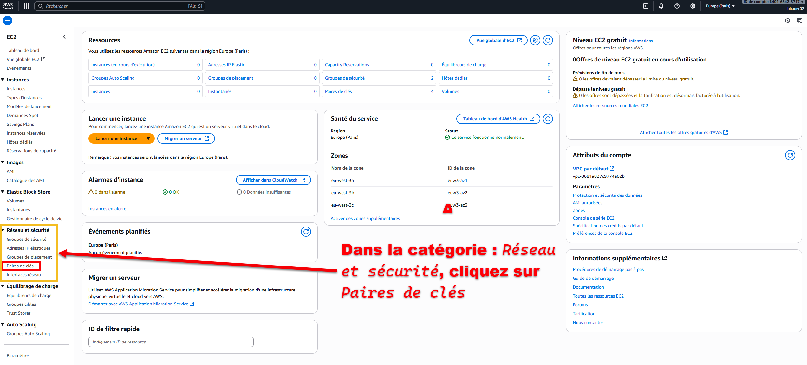
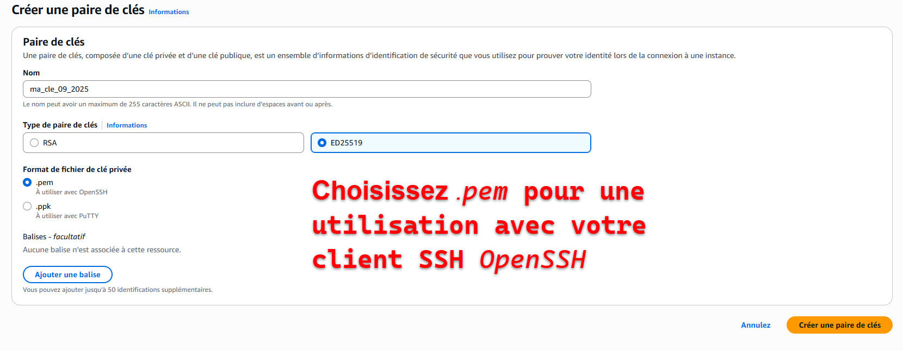
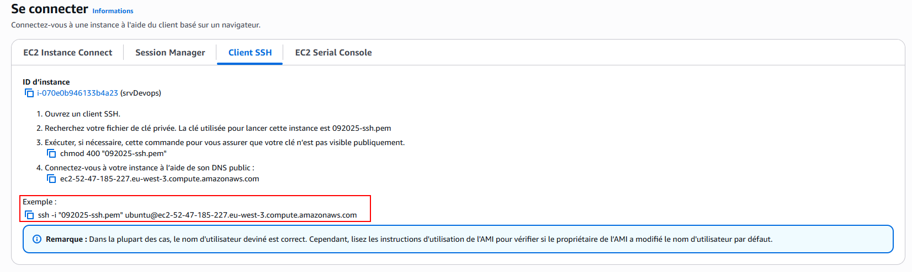
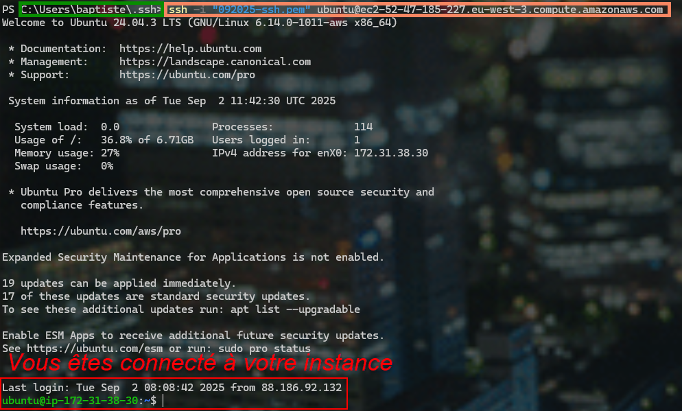

:_chapter:
:_author: Bauer Baptiste
:_duration: 1 heures
:_version_number: 1.0.0
:_version_date: 02/09/2025
[[aws-ssh]]
= Connexion avec SSH à une instance AWS EC2
include::../../../run_app.adoc[]

Dans ce chapitre, nous allons voir comment se connecter à une instance AWS EC2 en utilisant SSH. Nous allons couvrir les étapes nécessaires pour configurer votre environnement, générer une paire de clés SSH, et établir une connexion sécurisée à votre instance EC2.

== Création de la paire de clés SSH

Pour se connecter à une instance EC2 via SSH, vous devez d'abord créer une paire de clés SSH. Voici comment le faire :

Dans le panneau de contrôle AWS, allez dans la section "EC2" puis "Key Pairs" sous "Network & Security".

Cliquez sur `Create Key Pair`, donnez un nom à votre paire de clés, et choisissez le format PEM pour une utilisation avec OpenSSH. Cliquez ensuite sur "Create Key Pair" pour télécharger le fichier .pem.

- **RSA** : ancien standard, très répandu, fiable, mais lourdes (clés et signatures volumineuses, calculs plus lents).
- **ED25519** : moderne, rapide, signatures compactes, sécurité forte, mais parfois moins compatible avec les environnements anciens.

👉 Pour SSH : **ED25519 est recommandé par défaut**, sauf si vous devez gérer des systèmes anciens qui ne le supportent pas.

.Comparatif RSA vs ED25519
[cols="1,2,2", options="header"]
|===
| Critère | RSA | ED25519

| Type d’algorithme
| Basé sur la *factorisation de grands nombres premiers*
| Basé sur les *courbes elliptiques* (Edwards Curve 25519)

| Sécurité équivalente
| RSA 2048 ≈ 112 bits
RSA 4096 ≈ 150 bits
| Clé 256 bits ≈ 128 bits (équivalent RSA 3072–4096)

| Taille de clé
| Grande (2048–4096 bits)
| Petite (256 bits)

| Performance
| Plus lent (génération, signature, vérification)
Lourd sur petits appareils
| Très rapide, constant-time (protège contre attaques par timing)

| Robustesse future
| Ancien, éprouvé, universellement supporté
| Moderne, conçu pour éviter erreurs d’implémentation

| Compatibilité
| Supporté partout (anciens systèmes, logiciels propriétaires)
| Supporté par OpenSSH >= 6.5 (2014), moins universel sur vieux systèmes

| Taille des signatures
| Grandes (plusieurs centaines d’octets)
| Petites (64 octets)

| Simplicité d’usage
| Paramètres nombreux (taille de clé, padding) → risques de mauvaise config
| Safe by default, peu de paramètres
|===

Quand vous cliquez sur "Create Key Pair", le fichier `.pem` est automatiquement téléchargé.

[WARNING]
====
Ce fichier contient votre clé privée, que vous devez garder en sécurité.
====

Il faut ensuite s'assurer que SSH soit bien installé sur votre machine locale. Sur la plupart des systèmes Unix (Linux, macOS), SSH est préinstallé. Pour Windows, vous pouvez utiliser PowerShell ou le nouveau Terminal Windows que je conseille d'installer.

== Vérifier si SSH est installé

* Ouvrez un terminal et tapez la commande suivante :
+
[source,bash]
----
ssh -V
----
+
.Sur Windows

+
.Sur Ubuntu

== Installer un client OpenSSH sur Windows

* Dans un Powershell en mode administrateur, exécutez la commande suivante pour installer le client OpenSSH :
+
[source,bash]
----
Add-WindowsCapability -Online -Name OpenSSH.Client~~~~0.0.1.0
----

== Installer un client OpenSSH sur Linux

* Dans un Terminal en mode `sudo`, exécutez la commande suivante pour installer le client OpenSSH :
+
[source,bash]
----
sudo apt install openssh-client
----

== Configurer les permissions de la clé privée

* Le fichier `.pem` devrait être déplacé dans un répertoire sécurisé sur votre machine locale, par exemple `~/.ssh/` sur Linux et macOS, ou `C:\Users\VotreNom\.ssh\` sur Windows.

* Avant d'utiliser la clé privée, vous devez configurer les permissions du fichier `.pem` pour qu'il soit lisible uniquement par vous. Utilisez la commande suivante :

.Pour Linux et macOS :
[source,bash]
----
$k = "/chemin/vers/.ssh/votre-cle.pem"
takeown /F "$k"
icacls "$k" /reset
icacls "$k" /inheritance:r
icacls "$k" /grant:r "mon_compte_utilisateur_windows:R"
icacls "$k" /remove:g "Everyone" "BUILTIN\Users" "BUILTIN\Administrators" "NT AUTHORITY\Authenticated Users" "NT AUTHORITY\SYSTEM"
Unblock-File "$k"
----
.Pour Linux et macOS :
[source,bash]
----
chmod 400 /chemin/vers/.ssh/votre-cle.pem
----

== Test maintenant la connexion depuis votre machine vers votre instance EC2

* Pour se connecter à votre instance EC2, vous aurez besoin de l'adresse IP publique ou du nom DNS public de l'instance. Vous pouvez trouver cette information dans le panneau de contrôle AWS sous la section "Instances".

* Cliquez ensuite sur "se connecter" :

* Copier la commande SSH fournie par AWS, qui ressemble à ceci :

[source,bash]
----
ssh -i "092025-ssh.pem" ubuntu@ec2-52-47-185-227.eu-west-3.compute.amazonaws.com
----

Ouvrez un terminal et placez vous dans le répertoire où se trouve votre fichier `.pem`, puis exécutez la commande SSH en remplaçant le chemin vers votre fichier `.pem` et l'adresse de votre instance EC2.

* La première fois que vous vous connectez, vous recevrez un avertissement concernant l'authenticité de l'hôte. Tapez `yes` pour continuer.

* Si tout est configuré correctement, vous devriez maintenant être connecté à votre instance EC2 via SSH.

