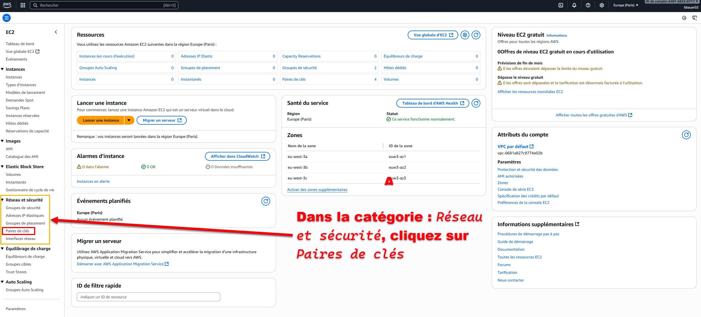
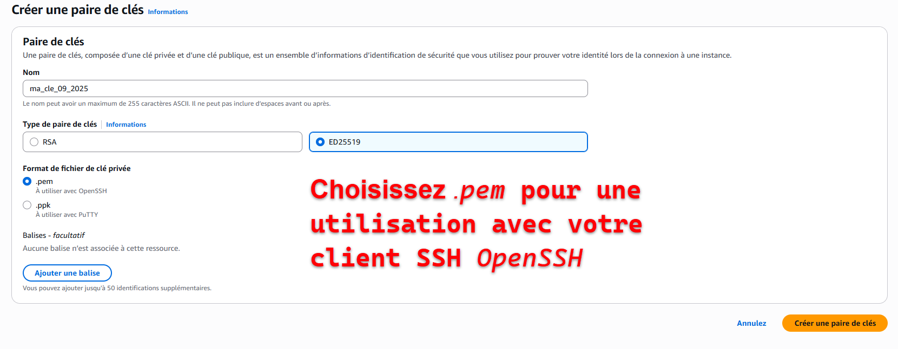
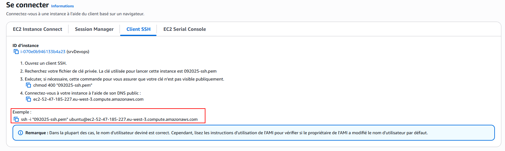
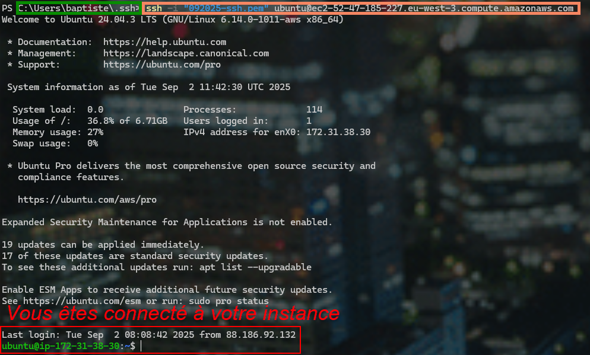

:_chapter:
:_author: Bauer Baptiste
:_duration: 2 heures
:_version_number: 2.0.0
:_version_date: 28/09/2026
[[aws-ssh]]
= Préparer une instance AWS EC2
include::../../../run_app.adoc[]

== Étape 7 : Préparer un serveur AWS EC2

icon:bullseye[] *Objectif* : disposer d'un serveur Linux sur Internet, accessible en SSH, avec Docker installé.

icon:lightbulb-o[] *Comprendre*

Jusqu'ici, Jenkins tournait sur votre poste. C'est pratique pour apprendre, mais :

* votre poste n'est pas joignable depuis Internet : GitHub ne peut pas prévenir Jenkins (webhook) ;
* l'application n'est disponible que lorsque votre ordinateur est allumé.

Dans ce chapitre, vous allez donc préparer un *serveur* :

* créer une paire de clés SSH et une instance *AWS EC2* ;
* configurer votre poste pour vous y connecter en *SSH* ;
* installer *Docker Engine* sur l'instance.

Au chapitre suivant, vous y installerez la même chaîne que sur votre poste.

.Prérequis
* Chapitre _Intégration continue de la calculatrice_ terminé (`./check.sh 6` validé).
* Un compte AWS (ou AWS Academy) avec accès à la console EC2.

[NOTE]
====
*Où taper les commandes ?* icon:desktop[] *Poste local* : votre ordinateur. icon:cloud[] *Instance EC2* : le serveur distant, une fois connecté en SSH.
====

=== Création de la paire de clés SSH

Pour se connecter à une instance EC2 via SSH, vous devez d'abord créer une paire de clés SSH. Voici comment le faire :

Dans le panneau de contrôle AWS, allez dans la section "EC2" puis "Key Pairs" sous "Network & Security".

Cliquez sur `Create Key Pair`, donnez un nom à votre paire de clés, choisissez le type de clé (voir le comparatif ci-dessous) et le format *PEM* pour une utilisation avec OpenSSH. Cliquez ensuite sur "Create Key Pair" pour télécharger le fichier `.pem`.

- **RSA** : ancien standard, très répandu, fiable, mais lourd (clés et signatures volumineuses, calculs plus lents).
- **ED25519** : moderne, rapide, signatures compactes, sécurité forte, mais parfois moins compatible avec les environnements anciens.

icon:hand-o-right[] Pour SSH : **ED25519 est recommandé par défaut**, sauf si vous devez gérer des systèmes anciens qui ne le supportent pas.

.Comparatif RSA vs ED25519
[cols="1,2,2", options="header"]
|===
| Critère | RSA | ED25519

| Type d’algorithme
| Basé sur la *factorisation de grands nombres premiers*
| Basé sur les *courbes elliptiques* (Edwards Curve 25519)

| Sécurité équivalente
| RSA 2048 ≈ 112 bits
RSA 4096 ≈ 150 bits
| Clé 256 bits ≈ 128 bits (équivalent RSA 3072)

| Taille de clé
| Grande (2048–4096 bits)
| Petite (256 bits)

| Performance
| Plus lent (génération, signature, vérification)
Lourd sur petits appareils
| Très rapide, constant-time (protège contre attaques par timing)

| Robustesse future
| Ancien, éprouvé, universellement supporté
| Moderne, conçu pour éviter les erreurs d’implémentation

| Compatibilité
| Supporté partout (anciens systèmes, logiciels propriétaires)
| Supporté par OpenSSH >= 6.5 (2014), moins universel sur vieux systèmes

| Taille des signatures
| Grandes (plusieurs centaines d’octets)
| Petites (64 octets)

| Simplicité d’usage
| Paramètres nombreux (taille de clé, padding) → risques de mauvaise config
| Safe by default, peu de paramètres
|===

Quand vous cliquez sur "Create Key Pair", le fichier `.pem` est automatiquement téléchargé.

[WARNING]
====
Ce fichier contient votre *clé privée*. AWS ne la conserve pas : si vous la perdez, vous ne pourrez plus vous connecter à l'instance.

* Ne la partagez jamais (ni par e-mail, ni sur Discord, ni dans un dépôt Git).
* Conservez-la dans un répertoire protégé (voir plus bas).
====

=== Création de l'instance EC2

Dans la console AWS, section *EC2* → *Instances* → *Launch instances*, renseignez :

[cols="1,2", options="header"]
|===
| Paramètre | Valeur conseillée

| *Name*
| `jenkins-server` (ou un nom de votre choix)

| *AMI*
| *Ubuntu Server 24.04 LTS* (les commandes du cours sont écrites pour Ubuntu)

| *Instance type*
| *t3.medium* (2 vCPU, 4 Go de RAM) au minimum. Jenkins et un build Node.js saturent une `t2.micro` / `t3.micro` (1 Go).

| *Key pair*
| La paire de clés créée à l'étape précédente

| *Network settings*
| Créer un *Security Group* avec une règle entrante *SSH (22)* limitée à *My IP*

| *Storage*
| 20 à 30 Go (gp3) : les images Docker prennent vite de la place
|===

Cliquez sur *Launch instance*.

[CAUTION]
====
*Adresse IP publique et coûts*

* L'adresse IP publique d'une instance *change à chaque arrêt/redémarrage*. Or nous allons la déclarer dans GitHub (webhook). Pour qu'elle reste stable, associez une *Elastic IP* à l'instance (*EC2* → *Elastic IPs* → *Allocate* puis *Associate*).
* Une `t3.medium` n'est *pas* couverte par l'offre gratuite. Pensez à *arrêter l'instance* à la fin de chaque séance (voir la dernière section de ce chapitre).
====

=== Installer et vérifier le client SSH

Sur la plupart des systèmes Unix (Linux, macOS), SSH est préinstallé. Pour Windows, vous pouvez utiliser PowerShell ou le *Terminal Windows*, que je conseille d'installer.

==== Vérifier si SSH est installé

* icon:desktop[] *Poste local* : ouvrez un terminal et tapez la commande suivante :
+
[source,bash]
----
ssh -V
----
+
.Sur Windows

+
.Sur Ubuntu

Si la commande affiche une version d'OpenSSH, passez directement à la section suivante. Sinon, installez le client :

==== Installer un client OpenSSH sur Windows

* icon:desktop[] Dans un *PowerShell ouvert en mode administrateur*, exécutez la commande suivante pour installer le client OpenSSH :
+
[source,powershell]
----
Add-WindowsCapability -Online -Name OpenSSH.Client~~~~0.0.1.0
----

==== Installer un client OpenSSH sur Linux

* icon:desktop[] Dans un terminal, exécutez la commande suivante pour installer le client OpenSSH :
+
[source,bash]
----
sudo apt update && sudo apt install -y openssh-client
----

=== Configurer les permissions de la clé privée

* Déplacez le fichier `.pem` dans un répertoire sécurisé de votre poste local : `~/.ssh/` sur Linux et macOS, ou `C:\Users\VotreNom\.ssh\` sur Windows.

* Avant d'utiliser la clé privée, vous devez restreindre les permissions du fichier `.pem` pour qu'il ne soit lisible *que par vous*. Sinon, SSH refuse de l'utiliser (`WARNING: UNPROTECTED PRIVATE KEY FILE!`).

.icon:desktop[] Pour Windows (PowerShell) :
[source,powershell]
----
$k = "$env:USERPROFILE\.ssh\votre-cle.pem"
icacls $k /inheritance:r                  # supprime les droits hérités du dossier
icacls $k /grant:r "$($env:USERNAME):R"   # seul votre compte peut lire la clé
icacls $k                                 # vérification : une seule ligne doit apparaître
----

.icon:desktop[] Pour Linux et macOS :
[source,bash]
----
chmod 400 ~/.ssh/votre-cle.pem
----

=== Tester la connexion depuis votre poste vers l'instance EC2

* Pour se connecter à votre instance EC2, vous aurez besoin de son adresse IP publique (ou de son nom DNS public). Vous trouverez cette information dans la console AWS, section "Instances".

* Cliquez ensuite sur "Se connecter" (_Connect_), onglet *SSH client* :

* Copiez la commande SSH fournie par AWS, qui ressemble à ceci :

[source,bash]
----
ssh -i "votre-cle.pem" ubuntu@ec2-XX-XX-XX-XX.eu-west-3.compute.amazonaws.com
----

icon:desktop[] Ouvrez un terminal, placez-vous dans le répertoire où se trouve votre fichier `.pem` (ou indiquez son chemin complet après `-i`), puis exécutez la commande SSH.

* La première fois que vous vous connectez, vous recevrez un avertissement concernant l'authenticité de l'hôte. Tapez `yes` pour continuer.

* Si tout est configuré correctement, vous êtes maintenant connecté à votre instance EC2 : l'invite de commande devient `ubuntu@ip-...:~$`.

[TIP]
====
*Se connecter avec une commande courte*

Créez (ou complétez) le fichier `~/.ssh/config` de votre poste local :

[source]
----
Host jenkins
    # remplacez XX.XX.XX.XX par votre Elastic IP
    HostName XX.XX.XX.XX
    User ubuntu
    IdentityFile ~/.ssh/votre-cle.pem
----

Vous pourrez ensuite vous connecter simplement avec `ssh jenkins`.
====

.En cas de problème
[cols="1,2", options="header"]
|===
| Symptôme | Cause probable / solution

| `Connection timed out`
| Le port 22 n'est pas autorisé depuis votre IP dans le *Security Group*, ou votre IP a changé (réseau de l'établissement, partage de connexion…). Mettez à jour la règle *My IP*.

| `Permission denied (publickey)`
| Mauvaise clé (`-i`), mauvais utilisateur (c'est `ubuntu` pour une AMI Ubuntu), ou clé non associée à l'instance.

| `UNPROTECTED PRIVATE KEY FILE`
| Les permissions du fichier `.pem` sont trop ouvertes : reprenez la section précédente.

| `Host key verification failed`
| L'instance a été recréée avec la même IP. Supprimez l'ancienne empreinte : `ssh-keygen -R XX.XX.XX.XX`.
|===

=== Installer Docker Engine sur l'instance

Jenkins et l'application seront exécutés dans des conteneurs : Docker doit donc être installé *sur l'instance EC2*.

* icon:cloud[] *Instance EC2* : installez Docker Engine et le plugin Compose depuis le dépôt officiel Docker :
+
[source,bash]
----
# Dépendances et clé GPG du dépôt Docker
sudo apt update
sudo apt install -y ca-certificates curl
sudo install -m 0755 -d /etc/apt/keyrings
sudo curl -fsSL https://download.docker.com/linux/ubuntu/gpg -o /etc/apt/keyrings/docker.asc
sudo chmod a+r /etc/apt/keyrings/docker.asc

# Ajout du dépôt Docker
echo "deb [arch=$(dpkg --print-architecture) signed-by=/etc/apt/keyrings/docker.asc] https://download.docker.com/linux/ubuntu $(. /etc/os-release && echo "$VERSION_CODENAME") stable" | sudo tee /etc/apt/sources.list.d/docker.list > /dev/null

# Installation
sudo apt update
sudo apt install -y docker-ce docker-ce-cli containerd.io docker-buildx-plugin docker-compose-plugin
----

* icon:cloud[] Autorisez l'utilisateur `ubuntu` à utiliser Docker sans `sudo`, puis *déconnectez-vous et reconnectez-vous* en SSH pour que le changement de groupe soit pris en compte :
+
[source,bash]
----
sudo usermod -aG docker ubuntu
exit
----

* icon:cloud[] Après reconnexion, vérifiez l'installation :
+
[source,bash]
----
docker version
docker compose version
docker run --rm hello-world
----

icon:check-circle[] *Vous devriez voir* : les versions du client et du serveur Docker, la version de Docker Compose, puis le message `Hello from Docker!`.

=== Vérifier l'étape

icon:cloud[] *Instance EC2* : clonez votre dépôt (il est public) et lancez la vérification de l'étape 7 :

[source,bash]
----
git clone https://github.com/<votre_compte_github>/jenkins-calculatrice.git
cd jenkins-calculatrice
./check.sh 7
----

Le script vérifie le système, Docker (utilisable sans `sudo`), Docker Compose, la mémoire et l'espace disque, et affiche l'adresse IP publique de l'instance : elle doit correspondre à votre Elastic IP.

=== Arrêter l'instance en fin de séance

Une instance EC2 est facturée tant qu'elle est *en cours d'exécution* (_running_).

* À la fin de chaque séance : *EC2* → *Instances* → sélectionnez l'instance → *Instance state* → *Stop instance*.
* À la fin de la séquence : *Terminate instance*, puis *libérez l'Elastic IP* (*Elastic IPs* → *Release*). Une Elastic IP non associée à une instance démarrée est facturée.

[NOTE]
====
Les conteneurs configurés avec `restart: unless-stopped` (Jenkins et la calculatrice, au chapitre suivant) redémarrent automatiquement quand vous relancez l'instance.
====

== Récapitulatif

* icon:check-circle[] Une paire de clés SSH, protégée sur votre poste.
* icon:check-circle[] Une instance EC2 Ubuntu avec une Elastic IP et un Security Group limité à votre IP.
* icon:check-circle[] Une connexion SSH fonctionnelle.
* icon:check-circle[] Docker Engine et Docker Compose installés sur l'instance.
* icon:check-circle[] `./check.sh 7` validé.

Vous êtes prêt pour installer Jenkins sur le serveur.
