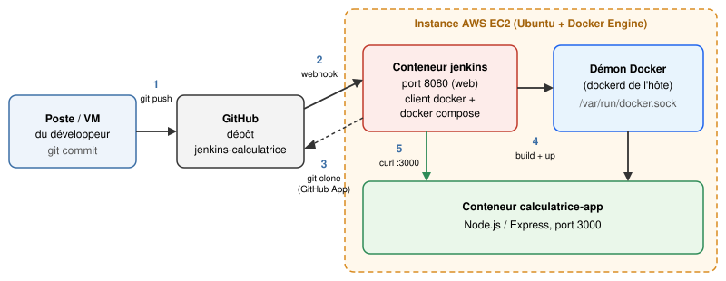
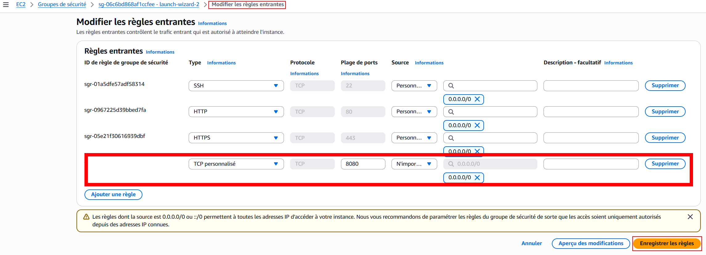
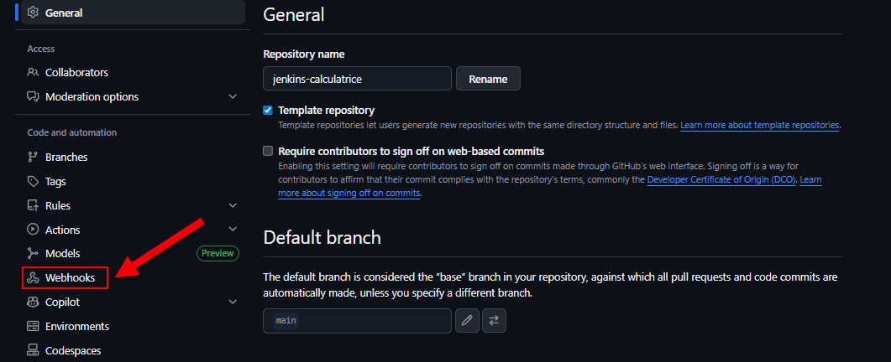
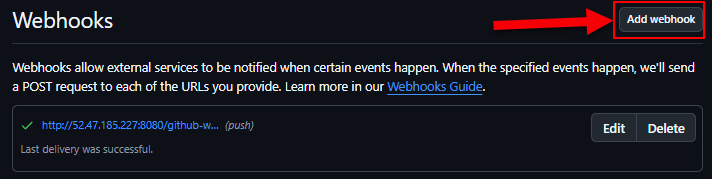
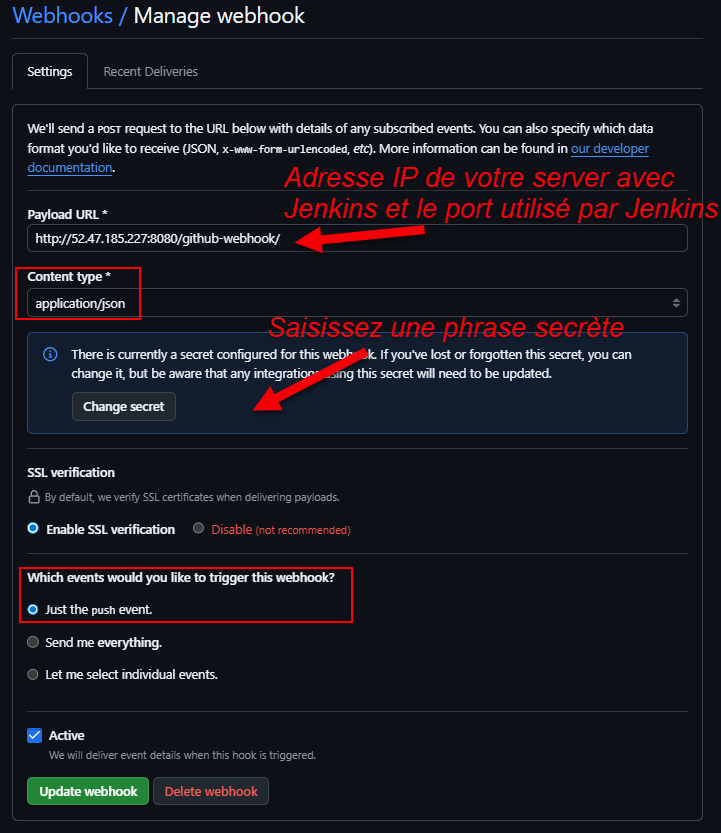
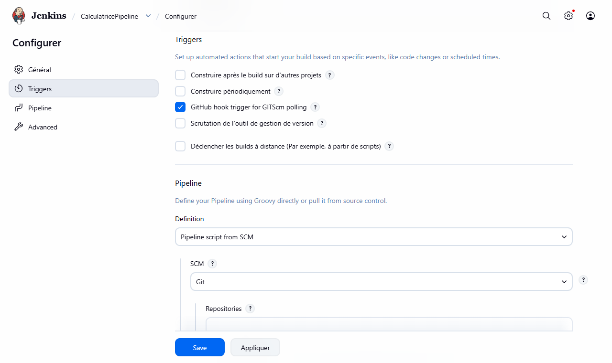
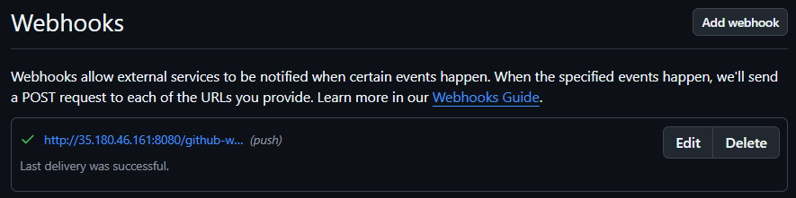

:_chapter:
:_author: Bauer Baptiste
:_duration: 3 heures
:_version_number: 2.0.0
:_version_date: 28/09/2026
[[deploiement-aws]]
= Jenkins sur AWS et webhook GitHub
include::../../../run_app.adoc[]

== Étape 8 : Jenkins sur AWS et webhook GitHub

icon:bullseye[] *Objectif* : faire tourner la chaîne CI/CD sur le serveur AWS, et faire en sorte que *GitHub prévienne Jenkins* à chaque push, au lieu que Jenkins aille vérifier toutes les 2 minutes.

.Prérequis
* Étape 7 validée : `./check.sh 7` sur l'instance EC2.
* Votre dépôt contient le `Jenkinsfile` complet de l'étape 6.

icon:lightbulb-o[] *Comprendre*

Un *webhook* est un mécanisme qui permet à GitHub de prévenir automatiquement une application externe (ici Jenkins) lorsqu'un événement survient dans un dépôt (un push, une pull request, une release…). GitHub envoie alors une requête HTTP (un message JSON) à l'URL indiquée.

[cols="1,2,2", options="header"]
|===
| | Scrutation (étapes 3 à 6) | Webhook (cette étape)

| Qui prend l'initiative ?
| Jenkins interroge GitHub régulièrement.
| GitHub prévient Jenkins à chaque push.

| Délai avant le build
| Jusqu'à 2 minutes.
| Quelques secondes.

| Requêtes inutiles
| 720 par jour, même sans commit.
| Aucune.

| Condition
| Jenkins doit pouvoir joindre GitHub.
| *GitHub doit pouvoir joindre Jenkins* depuis Internet.
|===

C'est cette dernière condition qui impose un serveur accessible depuis Internet : votre poste ne l'était pas, l'instance EC2 l'est.

.Architecture cible

=== 8.1 Lancer Jenkins sur le serveur

icon:wrench[] *À faire*

. icon:cloud[] *Instance EC2* : dans le clone de votre dépôt (étape 7), récupérez la dernière version puis préparez le fichier `.env` :
+
[source,bash]
----
cd ~/jenkins-calculatrice
git pull
cd jenkins
./init-env.sh
----
+
Cette fois, pour l'URL de Jenkins, indiquez l'adresse publique du serveur : `http://<ip_publique>:8080/` (votre Elastic IP).

. icon:cloud[] Lancez Jenkins :
+
[source,bash]
----
docker compose up -d --build
----

. Dans la console AWS, ajoutez au *Security Group* de l'instance une règle entrante *Custom TCP*, port `8080`, source *My IP*.
+

. icon:desktop[] Ouvrez `http://<ip_publique>:8080` dans votre navigateur et connectez-vous.

[WARNING]
====
* N'ouvrez pas le port `8080` à tout Internet (`0.0.0.0/0`) : seuls votre IP et GitHub en ont besoin.
* Jenkins est ici servi en *HTTP* : votre mot de passe circule en clair. En production, on place Jenkins derrière un serveur web en *HTTPS* (Nginx, Caddy, Traefik…).
====

=== 8.2 Recréer le pipeline

Ce Jenkins est tout neuf : il ne connaît pas encore votre pipeline. Grâce au `Jenkinsfile`, un seul job suffit à tout recréer.

icon:wrench[] *À faire*

. Créez un job de type *Pipeline* nommé `CalculatricePipeline` :
** *Definition* : `Pipeline script from SCM` ;
** *SCM* : `Git`, *Repository URL* : `https://github.com/<votre_compte_github>/jenkins-calculatrice.git` ;
** *Branch Specifier* : `*/main`, *Script Path* : `Jenkinsfile`.

. Lancez un build : l'application est construite, testée et déployée *sur le serveur*.

. Ajoutez au Security Group une règle entrante pour le port `3000` (source *My IP*), puis ouvrez `http://<ip_publique>:3000`.

[NOTE]
====
Remarquez l'intérêt du `Jenkinsfile` : toute la chaîne (tests, build, déploiement, smoke test, déclencheur) est décrite dans le dépôt. Recréer le pipeline sur un nouveau serveur ne demande que quelques clics.
====

=== 8.3 Autoriser GitHub à joindre Jenkins

Les notifications de GitHub arrivent depuis ses propres serveurs : elles sont bloquées tant que le port `8080` n'est ouvert qu'à votre IP.

icon:wrench[] *À faire*

Dans le Security Group, ajoutez des règles entrantes *Custom TCP*, port `8080`, pour les plages d'adresses utilisées par les webhooks GitHub. Elles sont listées dans la rubrique `"hooks"` de https://api.github.com/meta, par exemple :

----
192.30.252.0/22
185.199.108.0/22
140.82.112.0/20
143.55.64.0/20
----

TIP: Ces plages peuvent évoluer : en cas de webhook sans réponse (_timeout_), comparez vos règles avec la liste à jour.

=== 8.4 Créer le webhook

icon:wrench[] *À faire*

. Sur GitHub, ouvrez les *Settings* de votre dépôt, puis *Webhooks* :
+

. Cliquez sur *Add webhook* :
+

. Remplissez le formulaire :
** *Payload URL* : `http://<ip_publique>:8080/github-webhook/` (le `/` final est obligatoire) ;
** *Content type* : `application/json` ;
** *Secret* : une phrase secrète de votre choix (notez-la, elle servira en 8.6) ;
** *Which events* : _Just the push event_.
+

. Validez. GitHub envoie aussitôt un événement de test (_ping_). Dans l'onglet *Recent Deliveries* du webhook, il doit apparaître avec une coche verte et un code de réponse `200`.

=== 8.5 Déclencher le pipeline par le webhook

icon:lightbulb-o[] Le déclencheur est écrit dans le `Jenkinsfile` : il suffit de remplacer la scrutation par l'écoute du webhook.

icon:wrench[] *À faire*

. icon:desktop[] *Sur votre poste*, dans le `Jenkinsfile`, remplacez le bloc `triggers` :
+
[source,groovy]
----
    triggers {
        // Lancé par le webhook GitHub à chaque push
        githubPush()
    }
----
+
puis poussez :
+
[source,bash]
----
git commit -am "Pipeline déclenché par le webhook GitHub"
git push
----

. Dans Jenkins (sur le serveur), lancez *une fois à la main* `CalculatricePipeline` : ce build enregistre le nouveau déclencheur. Dans *Configure* → *Triggers*, la case *GitHub hook trigger for GITScm polling* est maintenant cochée.
+

. icon:desktop[] Faites une modification visible, par exemple le numéro de version dans le titre de `public/index.html`, puis :
+
[source,bash]
----
git commit -am "Nouvelle version de la page"
git push
----

icon:check-circle[] *Vérifier*

* Dans GitHub → *Settings* → *Webhooks* → *Recent Deliveries* : une livraison `push` avec le code `200`.
* Dans Jenkins : un build démarre *dans les secondes qui suivent* le push. Sa page indique *« Started by GitHub push by <votre_compte_github> »*.
* Sur `http://<ip_publique>:3000` : le nouveau titre.

icon:cloud[] *Instance EC2* :

[source,bash]
----
cd ~/jenkins-calculatrice
git pull
./check.sh 8
----

TIP: Bloqué ? La branche `solution-etape-8` contient le `Jenkinsfile` avec `githubPush()`.

=== 8.6 Faire vérifier le secret par Jenkins (approfondissement)

Le secret du webhook permet à Jenkins de s'assurer qu'une requête vient réellement de GitHub : GitHub signe chaque message avec ce secret, et Jenkins vérifie la signature.

. Dans *Administrer Jenkins* → *Credentials* → *System* → *Identifiants globaux* → *Add Credentials*, créez un credential de type *Secret text* contenant la phrase secrète du webhook.
. Dans *Administrer Jenkins* → *System*, section *GitHub* → *Avancé* → *Shared secrets*, sélectionnez ce credential, puis sauvez.
. Poussez un commit : le build doit toujours se déclencher. Modifiez volontairement le secret côté GitHub : les livraisons sont alors refusées par Jenkins.

icon:times-circle[] *En cas de problème*

[cols="1,2", options="header"]
|===
| Symptôme | Cause probable / solution

| *Recent Deliveries* : `We couldn't deliver this payload: timed out`
| Le Security Group bloque GitHub sur le port `8080` (étape 8.3), ou Jenkins est arrêté.

| *Recent Deliveries* : code `302` ou `404`
| URL incorrecte : elle doit se terminer par `/github-webhook/`, avec le `/` final.

| Livraison `200` mais aucun build
| Le pipeline n'a pas été lancé une fois à la main après l'ajout de `githubPush()`, ou l'URL du dépôt dans le job ne correspond pas à celle du dépôt qui envoie le webhook.

| Deux builds par push
| Deux webhooks pointent vers Jenkins (par exemple celui d'une GitHub App, au chapitre suivant). N'en gardez qu'un.

| `check.sh` : `JENKINS_URL vaut http://localhost:8080/`
| Relancez `./init-env.sh` avec l'adresse publique, puis `docker compose up -d`.
|===

[.question]
****
*Q{counter:_question})*
Pourquoi faut-il lancer une fois le pipeline à la main après avoir ajouté `githubPush()` dans le `Jenkinsfile` ?
//end question
****

// ---------- answer
ifeval::[{_show_correction} == 1]
[.answer]
****
_Correction de Q{_question}_

Jenkins ne lit le `Jenkinsfile` qu'au moment où il exécute le pipeline. Tant qu'il ne l'a pas exécuté, il ne sait pas que ce job doit réagir aux notifications de GitHub. Le premier build lit le bloc `triggers` et enregistre le déclencheur dans la configuration du job.
****
endif::[]

ifeval::[{_show_correction} == 0]
[.discreet]#_réponse *{_question}* disponible._#
endif::[]
//  end answer ----------

[.question]
****
*Q{counter:_question})*
Un camarade propose d'ouvrir le port `8080` à `0.0.0.0/0` « pour que le webhook marche à coup sûr ». Quels risques cela présente-t-il, compte tenu de la façon dont Jenkins est installé ?
//end question
****

// ---------- answer
ifeval::[{_show_correction} == 1]
[.answer]
****
_Correction de Q{_question}_

L'interface de Jenkins deviendrait accessible à tout Internet, en HTTP : les robots qui scannent Internet tenteraient de deviner le mot de passe, et une faille de Jenkins ou d'un plugin serait exploitable par n'importe qui. Or Jenkins a accès au socket Docker, ce qui équivaut à un accès root sur le serveur : prendre le contrôle de Jenkins, c'est prendre le contrôle de l'instance.
****
endif::[]

ifeval::[{_show_correction} == 0]
[.discreet]#_réponse *{_question}* disponible._#
endif::[]
//  end answer ----------

== Récapitulatif

* icon:check-circle[] Jenkins et l'application tournent sur un serveur accessible depuis Internet.
* icon:check-circle[] Le pipeline a été recréé en quelques clics grâce au `Jenkinsfile`.
* icon:check-circle[] GitHub prévient Jenkins à chaque push : le build démarre en quelques secondes.
* icon:check-circle[] Le port `8080` n'est ouvert qu'à votre IP et à GitHub.

[CAUTION]
====
N'oubliez pas d'*arrêter l'instance* en fin de séance (voir le chapitre _Préparer une instance AWS EC2_). En fin de séquence : `docker compose down -v` dans `jenkins/`, suppression du webhook, puis résiliation de l'instance et libération de l'Elastic IP.
====
