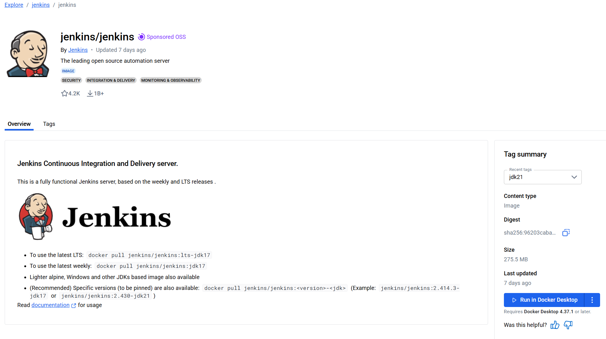
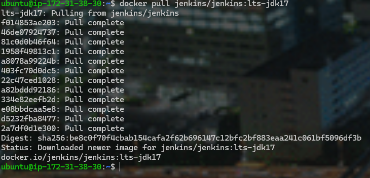
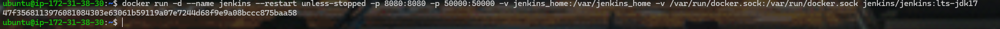
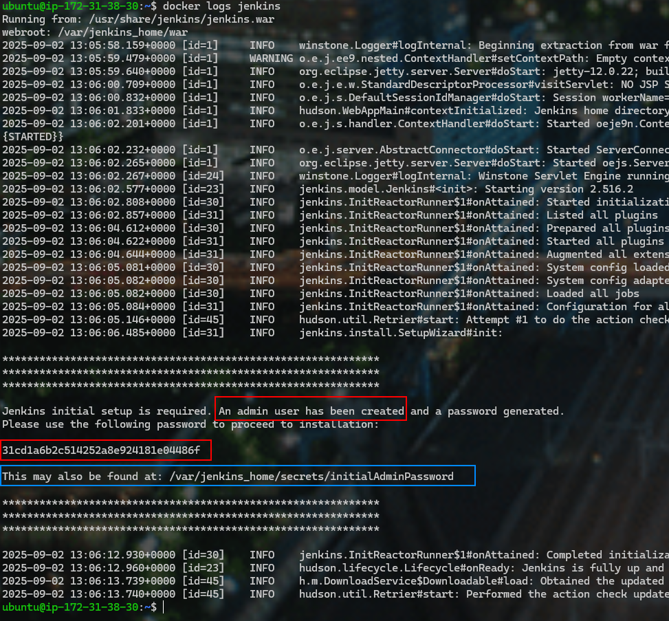
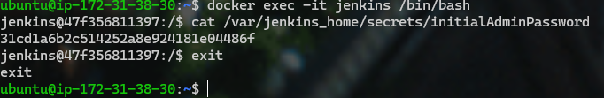
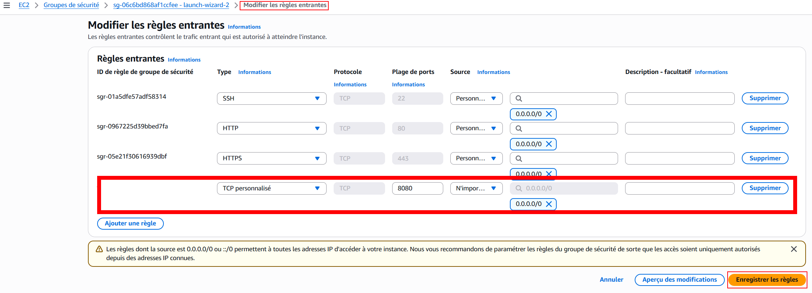
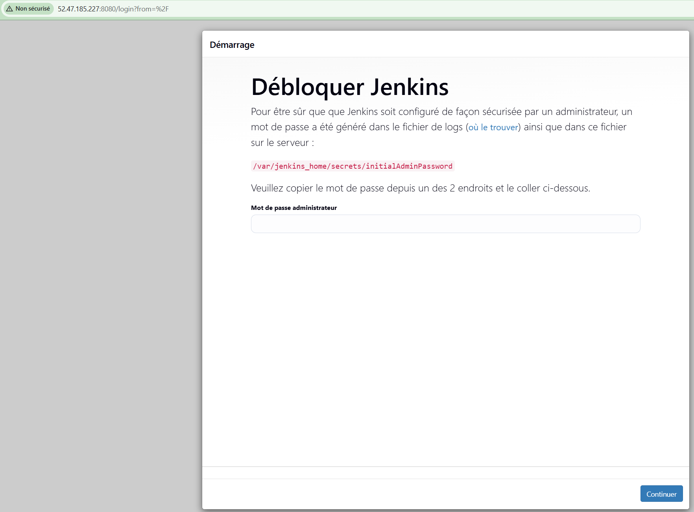
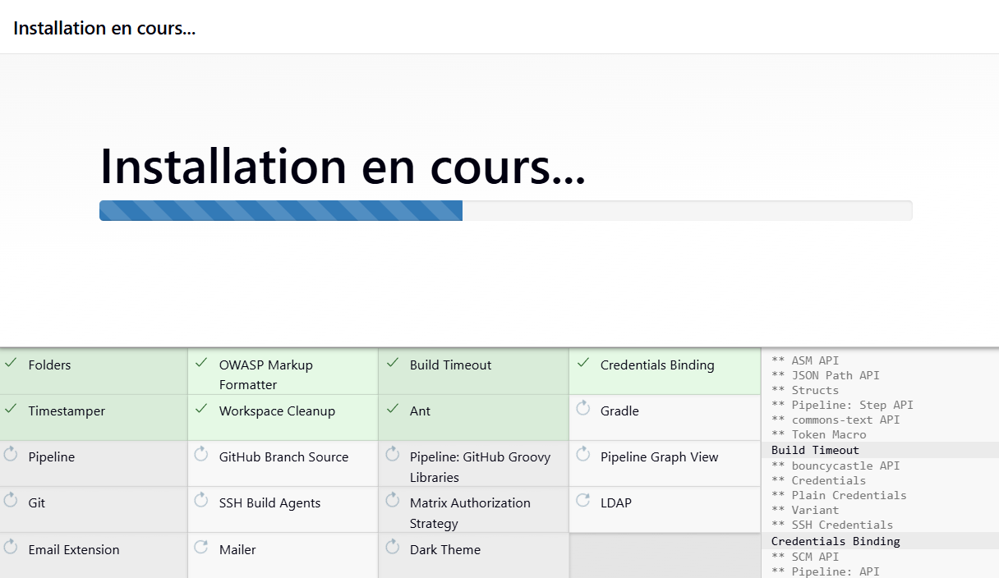
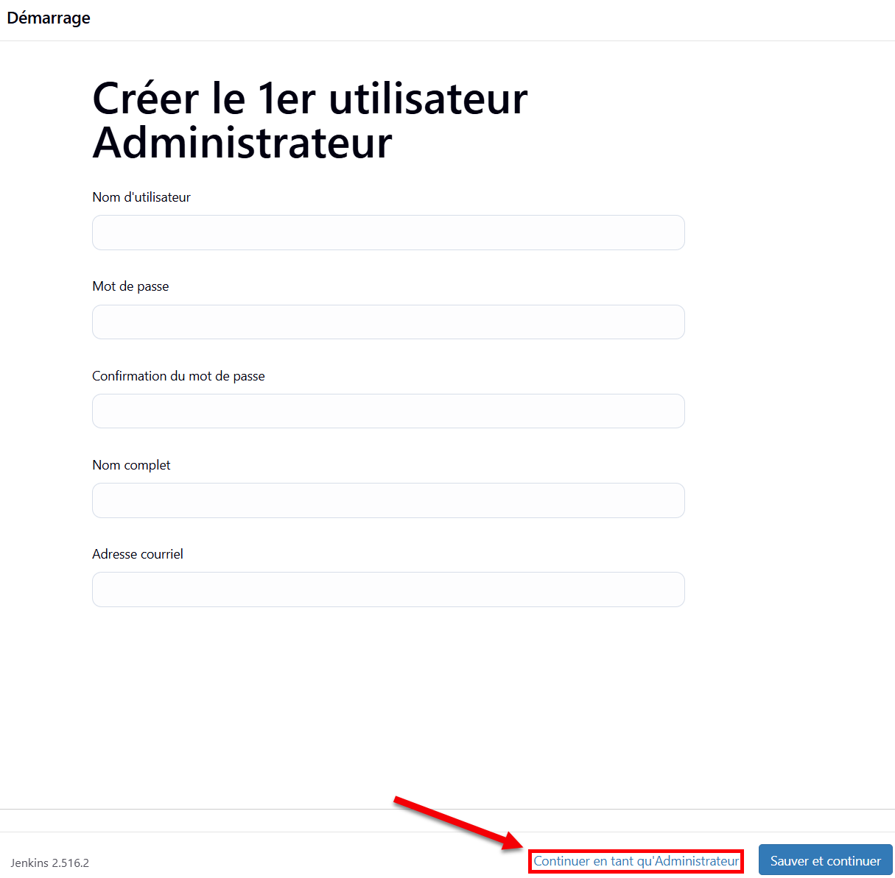
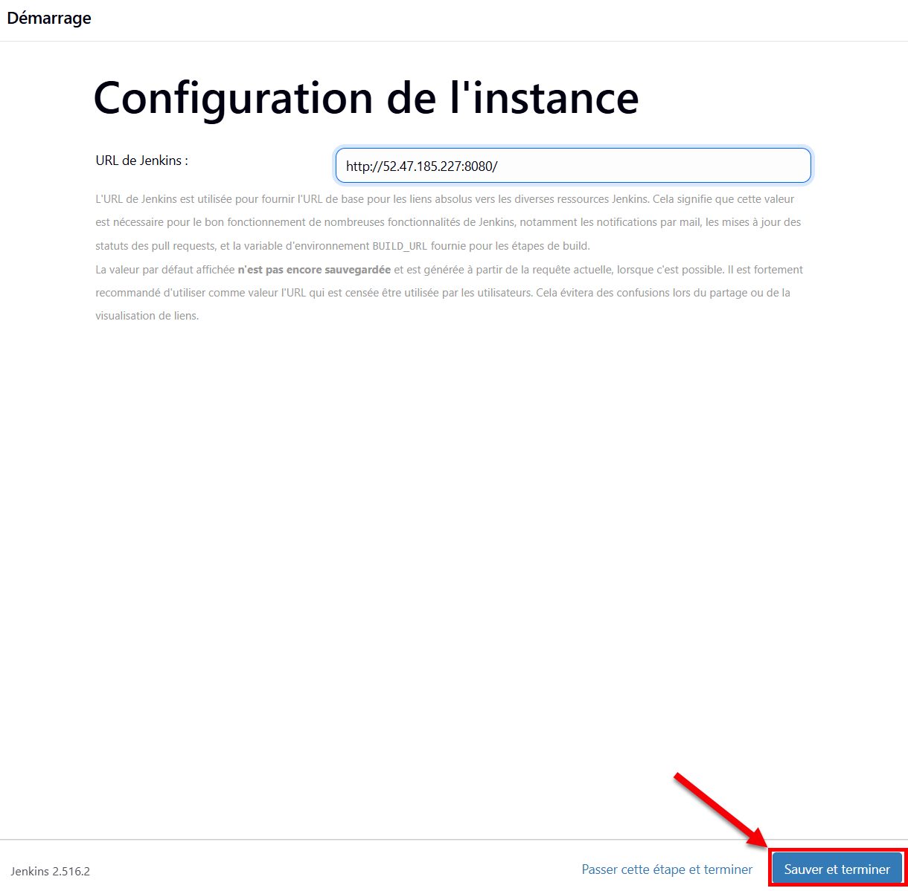

:_chapter:
:_author: Bauer Baptiste
:_duration: 4 heures
:_version_number: 1.0.0
:_version_date: 02/09/2025
[[aws-ssh]]
= Intégration continue avec JENKINS
include::../../../run_app.adoc[]

== Introduction

Imaginez un monde où chaque modification de code est automatiquement testée, compilée et déployée sans que vous ayez besoin d’intervenir manuellement.
C’est exactement ce que permet Jenkins.
Jenkins est un outil open-source d’intégration continue et de livraison continue (CI/CD), utilisé par des millions de développeurs et d’équipes DevOps à travers le monde.

Sa force ? Automatiser vos tâches répétitives de build, de test et de déploiement, afin d’accélérer vos livraisons et de sécuriser vos projets logiciels.
Dans cette vidéo, nous allons découvrir ce qu’est Jenkins, à quoi il sert, et pourquoi il est devenu un incontournable dans l’univers du DevOps et du développement moderne.

Jenkins est un logiciel open-source qui permet d’automatiser les étapes du cycle de vie d’une application : compiler le code, lancer les tests, détecter les erreurs et même déployer automatiquement sur un serveur.

Pourquoi est-ce important ?

Parce qu’au lieu de refaire manuellement les mêmes tâches à chaque modification, Jenkins s’occupe de tout. C’est un peu comme un chef d’orchestre qui coordonne tous les outils du développeur et de l’administrateur système.

Dans ce cours, on va voir ensemble :ce qu’est Jenkins et son rôle dans l’intégration continue (CI) et la livraison continue (CD), comment il s’installe et s’utilise, et quelques exemples concrets pour vos projets."

== Objectifs

A chaque modification de code d'une application dans le gestionnaire de configuration, Jenkins se charge
automatiquement de la recompiler et de la tester.

Cette séquence a pour objectif de mettre en place un processus d’intégration continue lors du développement d’une application grâce à Jenkins. Elle se compose de plusieurs parties permettant :

• d’installer et de configurer Jenkins ;
• de créer des builds et les lancer de manière automatisée ;
• de créer et de configurer des pipelines dans Jenkins ;
• d’écrire un JenkinsFile ;
• de créer des déclencheurs pour automatiser le lancement de jobs après une mise à jour d’une application ;
• de créer des scripts Jenkins pour répondre à des besoins spécifiques.

== Activité 1 : Installation et configuration de Jenkins

=== Étape 1 : Téléchargement et exécution de l'image Docker Jenkins
==== Télécharger l'image Docker Jenkins

Dans cette étape, vous allez télécharger l'image Docker Jenkins. Vous allez ensuite démarrer une instance de
l'image et vérifier que le serveur Jenkins est en cours d'exécution.

Déterminons dans un premier temps quelle sera l'imagine Docker que nous allons utiliser pour installer Jenkins.
Nous allons utiliser l'image officielle de Jenkins disponible sur Docker Hub.
Cette image est maintenue par la communauté Jenkins et est régulièrement mise à jour avec les dernières versions de Jenkins et des plugins.

https://hub.docker.com/r/jenkins/jenkins

[source,bash]
.A ce jour le tag de version LTS la plus récente est la `lts-jdk21` :
----
docker pull jenkins/jenkins:lts-jdk21
----

[NOTE]
====
*Version LTS ou JDK ?*

** *Jenkins LTS*
*** LTS = Long-Term Support (support à long terme).
*** C’est la *version stable* de Jenkins, mise à jour tous les 12 semaines environ.
*** Elle est recommandée pour la *production* (entreprise, serveurs d’intégration continue).
*** Objectif : fiabilité, sécurité, stabilité.

👉 À l’inverse, il existe aussi la version *weekly*, publiée chaque semaine, qui contient les dernières nouveautés, mais qui peut être moins stable.

** *JDK (Java Development Kit)*

*** Jenkins est écrit en Java, donc il a besoin d’un JDK pour tourner.
*** Le JDK est le kit qui contient :
**** la JVM (Java Virtual Machine) : exécute le code Java,
**** les *bibliothèques Java*,
**** les *outils de compilation*.

Aujourd’hui, Jenkins fonctionne surtout avec les versions Java 11 et Java 17 (LTS également côté Java).

👉 Sans JDK, Jenkins ne peut pas démarrer, un peu comme une voiture sans carburant.

En résumé => Jenkins LTS = version stable et recommandée du logiciel Jenkins
====

==== Création d'un Dockerfile personnalisé

Nous voulons que notre conteneur Jenkins puisse utiliser Docker pour builder des images et lancer des conteneurs.
Pour cela, nous allons créer un Dockerfile personnalisé qui utilise l'image officielle de Jenkins comme base et ajoute la possibilité d'utiliser Docker et Docker Compose.

[source,bash]
----
FROM jenkins/jenkins:lts-jdk21

USER root

# Dépendances + dépôt Docker officiel
RUN apt-get update && apt-get install -y \
    ca-certificates curl gnupg lsb-release \
 && install -m 0755 -d /etc/apt/keyrings \
 && curl -fsSL https://download.docker.com/linux/debian/gpg \
    | gpg --dearmor -o /etc/apt/keyrings/docker.gpg \
 && chmod a+r /etc/apt/keyrings/docker.gpg \
 && echo "deb [arch=$(dpkg --print-architecture) signed-by=/etc/apt/keyrings/docker.gpg] \
    https://download.docker.com/linux/debian \
    $(. /etc/os-release; echo $VERSION_CODENAME) stable" \
    > /etc/apt/sources.list.d/docker.list \
 && apt-get update \
 # 👇 Installe **le client Docker** + **Compose v2 (plugin)**
 && apt-get install -y docker-ce-cli docker-compose-plugin \
 && apt-get clean \
 && rm -rf /var/lib/apt/lists/*

# Revenir à l'utilisateur Jenkins
USER jenkins

----

Puis on Build l’image personnalisée avec la commande suivante (à exécuter dans le répertoire où se trouve le Dockerfile) :

[source,bash]
----
docker build -t jenkins-with-docker:latest .
----

==== Démarrer le conteneur (Docker) Jenkins
Une fois l’image téléchargée, vous pouvez démarrer un conteneur Jenkins avec la commande suivante :
[source,bash]
----

export DOCKER_GID=$(stat -c %g /var/run/docker.sock)

docker run -d --name jenkins --restart unless-stopped -p 8080:8080 -p 50000:50000 -v jenkins_home:/var/jenkins_home -v /var/run/docker.sock:/var/run/docker.sock --group-add $(stat -c %g /var/run/docker.sock) jenkins21-with-docker

----

[cols="1,3", options="header"]
|===
| Option | Explication

| `--name jenkins`
| Donne un nom au conteneur (`jenkins` ici), pratique pour le gérer plus facilement (`docker stop jenkins`, `docker logs jenkins`).

| `-d`
| Lance Jenkins en arrière-plan (il continue à tourner même si tu fermes ton terminal).

| `--restart unless-stopped`
| Redémarre automatiquement après un crash ou un redémarrage du serveur (sauf si tu arrêtes manuellement le conteneur).

| `-p 8080:8080`
| Expose le port web de Jenkins (accès à l’interface via `http://localhost:8080`).

| `-p 50000:50000`
| Expose le port utilisé par les agents Jenkins (utile si tu ajoutes des nœuds distants).

| `-v jenkins_home:/var/jenkins_home`
| Volume persistant pour sauvegarder la configuration Jenkins (jobs, plugins, utilisateurs, logs…).

| `-v /var/run/docker.sock:/var/run/docker.sock`
| Permet à Jenkins d’utiliser Docker de l’hôte (lancer des conteneurs, builder des images), sans installer Docker dans Jenkins.

| `jenkins21-with-docker`
| L'image Docker personnalisée que nous avons créée précédemment.
|===

[IMPORTANT]
====
Un mot de passe de connection initial est généré lors du premier démarrage de Jenkins.
Il est accessible via les logs du conteneur Docker.

[source,bash]
----
docker logs jenkins
----
====

[IMPORTANT]
====
Copiez le mot de passe admin qui s'affiche dans le résultat de la commande, comme surligné sur la
page précédente. Il sera nécessaire pour configurer le serveur Jenkins.

Mon code : `31cd1a6b2c514252a8e924181e04486f`
====

si vous perdez votre mot de passe, vous pourrez le retrouver en exécutant la commande suivante :

[source,bash]
----
docker exec -it jenkins /bin/bash
----

Puis une fois dans le shell du conteneur, exécutez :
[source,bash]
----
cat /var/jenkins_home/secrets/initialAdminPassword
----

=== Étape 2 : Configuration initiale de Jenkins

* Ouvrir un onglet du navigateur web et
accéder à :

* http://localhost:8080/ si vous êtes sur une VM locale.
* http://<ip_public> si vous êtes sur un serveur distant.

Se connecter à l'aide de votre mot de passe administrateur précédemment copié.

[TIP]
====
Il est probable que le port `8080` soit bloqué par les règles de votre *pare-feu*. Dans ce cas, vous devez ouvrir ce port pour accéder à l'interface web de Jenkins.

Dans les groupes de sécurité de votre instance EC2, ajoutez une règle entrante pour autoriser le trafic HTTP (port 8080) depuis votre adresse IP.

====

Vous devriez voir la page de configuration initiale de Jenkins.

Cliquez sur Installer les plugins suggérés et attendre que Jenkins télécharge et installe les plugins.

image::images/08.png[]

[IMPORTANT]
====
Dans *la fenêtre du terminal* depuis laquelle le serveur a été lancé, il est possible de suivre l’installation
des plugins à travers les messages de journal affichés au fur et à mesure que les plugins s’installent. Assurez-vous que vous ne fermez pas cette fenêtre de terminal. Si vous avez besoin de lancer des commandes en ligne, ouvrez une autre fenêtre de terminal.
====

Une fois l'installation terminée, la fenêtre "*Créer le 1er utilisateur Administrateur*" s'affiche.
Pour l'instant, cliquez sur *Skip and continue as admin* en bas.

Dans la fenêtre Configuration de l’Instance, ne modifiez rien. Cliquez sur Sauver et Terminer en bas.

Dans la fenêtre suivante, cliquez sur *Commencez à utiliser Jenkins*.

Vous devriez maintenant être sur le tableau de bord principal avec un message : "Bienvenue Sur Jenkins !".

