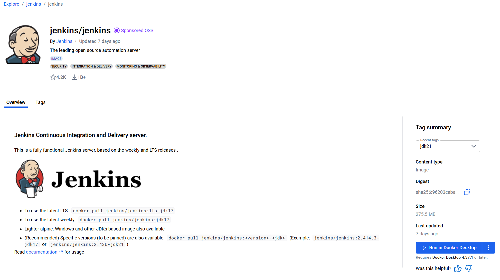
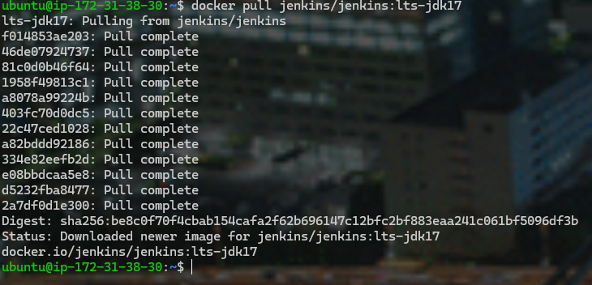
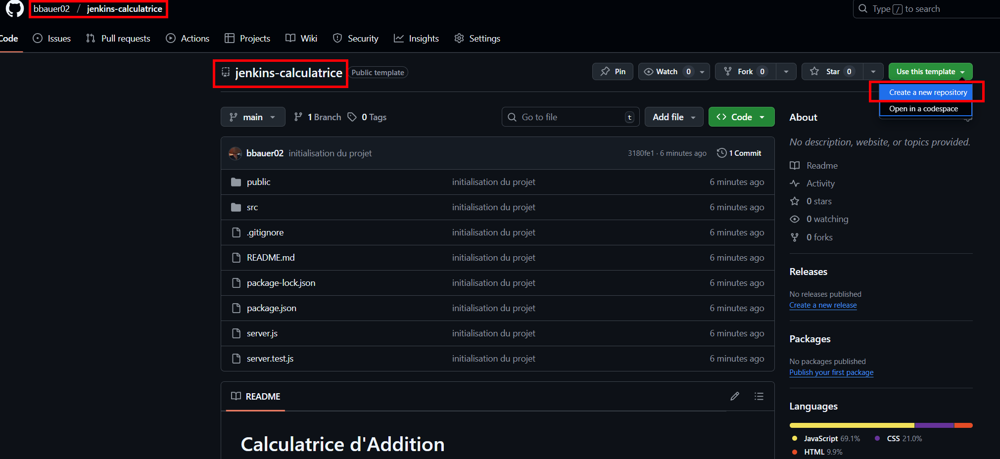
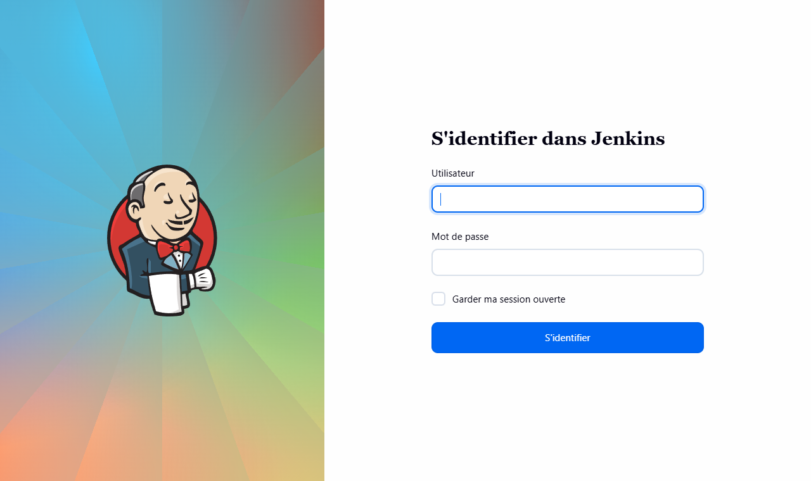
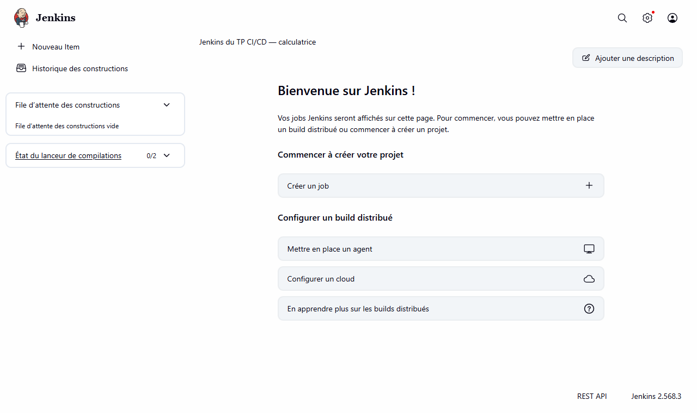
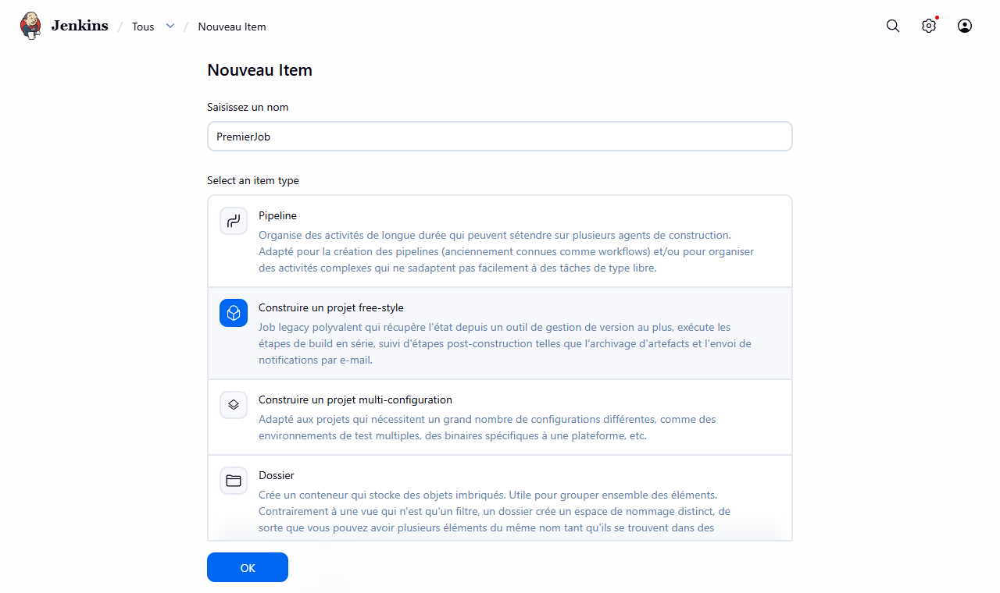
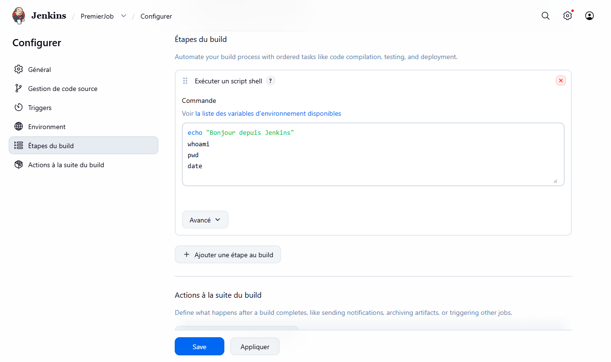
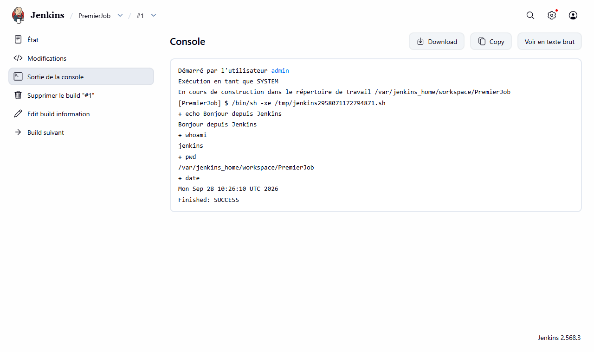
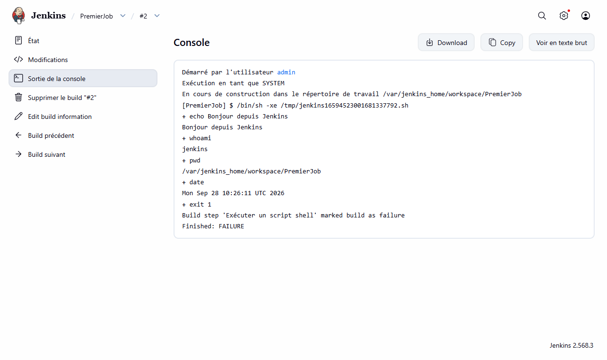
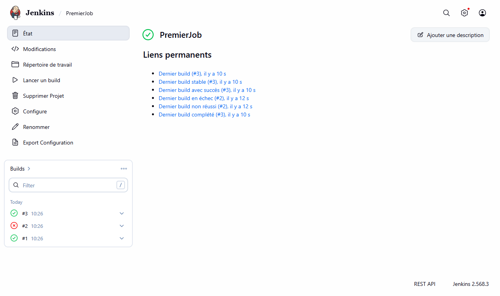

:_chapter:
:_author: Bauer Baptiste
:_duration: 2 heures
:_version_number: 2.0.0
:_version_date: 28/09/2026
[[getting-started]]
= Découvrir Jenkins
include::../../../run_app.adoc[]

== Introduction

Imaginez un monde où chaque modification de code est automatiquement testée, compilée et déployée sans que vous ayez besoin d’intervenir manuellement.
C’est exactement ce que permet Jenkins.
Jenkins est un outil open-source d’intégration continue et de livraison continue (CI/CD), utilisé par des millions de développeurs et d’équipes DevOps à travers le monde.

Sa force ? Automatiser vos tâches répétitives de build, de test et de déploiement, afin d’accélérer vos livraisons et de sécuriser vos projets logiciels. C’est un peu comme un chef d’orchestre qui coordonne tous les outils du développeur et de l’administrateur système.

== Comment utiliser ce cours

Ce cours est conçu pour être suivi *en autonomie*. Il est découpé en *étapes* courtes : chacune n'introduit qu'une seule nouveauté et se termine par une vérification automatique.

=== Le parcours

[cols="1,4,3,2", options="header"]
|===
| Étape | Contenu | Chapitre | Niveau

| 0 | Comprendre l'intégration continue | Découvrir Jenkins | icon:star[]
| 1 | Installer Jenkins sur votre machine | Découvrir Jenkins | icon:star[]
| 2 | Premier job : vert, rouge, vert | Découvrir Jenkins | icon:star[]
| 3 | Relier un job à un dépôt Git | Intégration continue de la calculatrice | icon:star[]
| 4 | Construire et déployer avec Docker | Intégration continue de la calculatrice | icon:star[]
| 5 | Tester, casser, réparer | Intégration continue de la calculatrice | icon:star[]
| 6 | Pipeline et Jenkinsfile | Intégration continue de la calculatrice | icon:star[] à icon:star[]icon:star[]icon:star[]
| 7 | Préparer un serveur AWS EC2 | Préparer une instance AWS EC2 | icon:star[]
| 8 | Jenkins sur AWS et webhook GitHub | Jenkins sur AWS et webhook GitHub | icon:star[]
| 9 | Dépôt privé et GitHub App | Dépôt privé et GitHub App | icon:star[]icon:star[]
| 10 | Mini-projet en autonomie | Mini-projet | icon:star[]icon:star[]icon:star[]
|===

* icon:star[] *Essentiel* : à faire obligatoirement, dans l'ordre.
* icon:star[]icon:star[] *Approfondissement* : pour aller plus loin une fois l'essentiel validé.
* icon:star[]icon:star[]icon:star[] *Défi* : peu guidé, pour les plus rapides.

Les étapes 1 à 6 se font *sur votre propre machine*, sans frais. Le serveur AWS n'arrive qu'à l'étape 7, une fois que vous maîtrisez Jenkins.

=== Structure d'une étape

Chaque étape suit toujours le même plan :

[cols="1,4", options="header"]
|===
| Rubrique | Rôle

| icon:bullseye[] *Objectif*
| Ce que vous saurez faire à la fin de l'étape.

| icon:lightbulb-o[] *Comprendre*
| Les notions nécessaires, en quelques lignes.

| icon:wrench[] *À faire*
| Les manipulations. Chaque bloc de commandes indique *où* le lancer : icon:desktop[] votre poste, icon:cloud[] le serveur EC2, icon:cube[] le conteneur Jenkins.

| icon:check-circle[] *Vérifier*
| Ce que vous devez observer, puis la commande `./check.sh <étape>`.

| icon:times-circle[] *En cas de problème*
| Les erreurs les plus fréquentes et leur solution.

| icon:question-circle[] *Pour vérifier vos connaissances*
| Une ou deux questions de compréhension.
|===

=== Les outils d'autonomie

[TIP]
====
*`./check.sh` : la vérification automatique.* À la racine de votre dépôt, lancez `./check.sh` suivi du numéro de l'étape (ex. `./check.sh 2`). Le script vérifie votre travail et, en cas d'erreur, indique quoi corriger :

----
── Étape 2 — Premier job
  ✔ Le job 'PremierJob' existe
  ✔ Vous avez provoqué un échec (build #2)
  ✘ Pas de build réussi après l'échec
     → Retirez 'exit 1' et relancez un build.
----

Ne passez à l'étape suivante que lorsque le script affiche `✔ Étape N validée !`.
====

[TIP]
====
*Vous êtes bloqué ? Reprenez à partir de la correction.* Le dépôt modèle contient une branche de correction pour les étapes importantes (`solution-etape-4`, `solution-etape-6`, `solution-etape-8`). Pour récupérer les fichiers d'une étape dans votre dépôt, sans supprimer les vôtres :

[source,bash]
----
git fetch https://github.com/bbauer02/jenkins-calculatrice.git solution-etape-4
git checkout FETCH_HEAD -- .
git commit -m "Reprise à partir de la solution de l'étape 4"
git push
----
====

Un *mémo des commandes* et un *glossaire* sont disponibles dans le dernier chapitre.

== Étape 0 : Comprendre l'intégration continue

icon:bullseye[] *Objectif* : savoir expliquer ce que sont la CI et la CD, et ce que nous allons construire.

icon:lightbulb-o[] *Comprendre*

[cols="1,3", options="header"]
|===
| Notion | Définition

| *Intégration continue* (CI)
| À chaque `push`, le code est automatiquement récupéré, construit et *testé*. Une erreur est détectée en quelques minutes, par la personne qui vient de l'introduire.

| *Livraison continue* (CD)
| Chaque version qui passe les tests produit un livrable (ici une image Docker) *prêt à être déployé*.

| *Déploiement continu*
| Le livrable validé est *déployé automatiquement* sur un serveur, sans intervention humaine.
|===

Au fil de la séquence, nous allons construire la chaîne suivante pour une petite application web, une *calculatrice* écrite en Node.js :

.Architecture de la chaîne CI/CD (état final, à l'étape 8)
image::images/architecture.svg[Architecture CI/CD,width=100%]

. Le développeur pousse (`git push`) une modification sur GitHub.
. GitHub prévient Jenkins grâce à un *webhook*.
. Jenkins récupère le code (`git clone`).
. Jenkins demande au *démon Docker* de construire l'image (tests compris) et de relancer le conteneur de l'application.
. Jenkins vérifie que l'application répond.

Pendant les étapes 1 à 6, tout tourne sur votre machine : Jenkins ira lui-même vérifier le dépôt régulièrement, au lieu d'être prévenu par GitHub.

[.question]
****
*Q{counter:_question})*
Une équipe fusionne le travail de chacun une fois par mois, puis passe une semaine à corriger les conflits et les bugs. En quoi l'intégration continue changerait-elle leur façon de travailler ?
//end question
****

// ---------- answer
ifeval::[{_show_correction} == 1]
[.answer]
****
_Correction de Q{_question}_

Avec l'intégration continue, chacun intègre ses modifications très souvent (plusieurs fois par jour), et chaque intégration est automatiquement construite et testée. Les conflits restent petits, et un bug est détecté quelques minutes après avoir été introduit, par la personne qui vient de l'écrire : il est bien plus facile à corriger.
****
endif::[]

ifeval::[{_show_correction} == 0]
[.discreet]#_réponse *{_question}* disponible._#
endif::[]
//  end answer ----------

== Étape 1 : Installer Jenkins sur votre machine

icon:bullseye[] *Objectif* : faire tourner Jenkins dans un conteneur Docker sur votre poste, et vous y connecter.

.Prérequis
* *Docker* : Docker Desktop (Windows, macOS) ou Docker Engine (Linux), démarré.
* *Git* : sous Windows, installez https://git-scm.com[Git for Windows] et utilisez le terminal *Git Bash* pour toutes les commandes de ce cours.
* Un *compte GitHub*.

icon:lightbulb-o[] *Comprendre*

Jenkins est une application Java. Plutôt que de l'installer directement sur votre machine, nous allons le lancer dans un *conteneur Docker*, à partir de l'image officielle `jenkins/jenkins` (https://hub.docker.com/r/jenkins/jenkins).

[NOTE]
====
*Que signifie le tag `2.568.3-lts-jdk21` utilisé dans ce cours ?*

* `2.568.3` : la version exacte de Jenkins. Elle est *figée* pour que l'interface corresponde aux captures du cours.
* `lts` (_Long-Term Support_) : version *stable*, recommandée en production. Une nouvelle ligne LTS est choisie environ toutes les 12 semaines, puis reçoit des correctifs toutes les 4 semaines. À l'inverse, la version _weekly_ sort chaque semaine avec les dernières nouveautés.
* `jdk21` : la version de Java embarquée dans l'image. Jenkins exige Java 17 ou 21 : vous n'avez rien à installer.
====

Le dépôt de l'application, que vous allez créer, contient un dossier `jenkins/` qui prépare tout :

[cols="1,3", options="header"]
|===
| Fichier | Rôle

| `jenkins/Dockerfile`
| Part de l'image officielle, ajoute le *client Docker* (pour que Jenkins puisse construire des images) et préinstalle les *plugins* listés dans `plugins.txt`.

| `jenkins/casc/jenkins.yaml`
| Configuration de Jenkins _as code_ : crée le compte administrateur, protège l'accès, met l'interface en français.

| `jenkins/compose.yaml`
| Décrit comment lancer le conteneur (ports, volumes, accès à Docker).

| `jenkins/init-env.sh`
| Crée le fichier `jenkins/.env` : identifiants de l'administrateur, port, URL. Ce fichier contient un mot de passe : il n'est jamais versionné.
|===

icon:wrench[] *À faire*

. Rendez-vous sur le dépôt modèle https://github.com/bbauer02/jenkins-calculatrice et cliquez sur *Use this template* → *Create a new repository*. Nommez votre dépôt `jenkins-calculatrice` et laissez-le *public*.
+

. icon:desktop[] Configurez votre identité Git (une seule fois par machine) :
+
[source,bash]
----
git config --global user.name "Prénom Nom"
git config --global user.email "<votre_email>"
git config --global init.defaultBranch main
----

. icon:desktop[] Clonez *votre* dépôt (remplacez `<votre_compte_github>`, sensible à la casse) :
+
[source,bash]
----
git clone https://github.com/<votre_compte_github>/jenkins-calculatrice.git
cd jenkins-calculatrice
----
+
[NOTE]
====
Lors du premier `git push`, Git vous demandera de vous authentifier auprès de GitHub. Sous Windows, une fenêtre de connexion GitHub s'ouvre automatiquement (_Git Credential Manager_).
====

. icon:desktop[] Préparez le fichier `.env`, puis lancez Jenkins :
+
[source,bash]
----
cd jenkins
./init-env.sh
docker compose up -d --build
----
+
Le script vous demande un identifiant, un *mot de passe robuste* (8 caractères minimum), le port (laissez `8080` s'il est libre) et l'URL de Jenkins (laissez la valeur proposée).
+
La première construction de l'image prend quelques minutes (téléchargement de Jenkins et des plugins).

. Attendez que Jenkins démarre (environ une minute), puis ouvrez http://localhost:8080 et connectez-vous avec l'identifiant et le mot de passe choisis.
+

icon:check-circle[] *Vérifier*

Vous arrivez sur le tableau de bord, avec le message « Bienvenue sur Jenkins ! ».

icon:desktop[] Depuis la racine du dépôt, lancez la vérification :

[source,bash]
----
cd ..
./check.sh 1
----

.Ce que fait `compose.yaml`
[cols="1,3", options="header"]
|===
| Option | Explication

| `ports: "${JENKINS_PORT:-8080}:8080"`
| Publie l'interface web de Jenkins sur le port choisi (8080 par défaut).

| `env_file: .env`
| Transmet au conteneur les identifiants de l'administrateur, utilisés par `casc/jenkins.yaml`.

| `JAVA_OPTS: -Djenkins.install.runSetupWizard=false`
| Désactive l'assistant de premier démarrage : le compte administrateur est créé par la configuration _as code_.

| `jenkins_home:/var/jenkins_home`
| Volume persistant : jobs, historique des builds, identifiants. Supprimer ou recréer le conteneur ne les efface pas.

| `/var/run/docker.sock:/var/run/docker.sock`
| Donne à Jenkins l'accès au *démon Docker de votre machine* : les conteneurs que Jenkins lancera seront créés à côté de lui, et non à l'intérieur.

| `group_add: ${DOCKER_GID}`
| Ajoute l'utilisateur `jenkins` au groupe propriétaire du socket Docker (détecté par `init-env.sh`). Sans cela : `permission denied ... docker.sock`.

| `extra_hosts: host.docker.internal:host-gateway`
| Permet aux jobs de joindre votre machine (et donc l'application sur le port 3000) sous le nom `host.docker.internal`.
|===

[WARNING]
====
*Monter `docker.sock` revient à donner les droits administrateur (root) sur la machine.* Tout job capable d'exécuter `docker` peut prendre le contrôle de l'hôte. C'est acceptable pour un TP, mais en entreprise on utilise des *agents Jenkins dédiés*, Docker _rootless_ ou des outils de build sans démon (Kaniko, Buildah). C'est aussi pour cela que l'accès à Jenkins est protégé par un mot de passe.
====

icon:times-circle[] *En cas de problème*

[cols="1,2", options="header"]
|===
| Symptôme | Cause probable / solution

| `./init-env.sh: Permission denied`
| Lancez-le avec `bash init-env.sh`.

| `Docker ne répond pas`
| Démarrez Docker Desktop (ou `sudo systemctl start docker` sous Linux), puis recommencez.

| `Bind for 0.0.0.0:8080 failed: port is already allocated`
| Le port 8080 est déjà utilisé. Relancez `./init-env.sh` en choisissant un autre port (ex. `18080`), puis `docker compose up -d`.

| `check.sh` : « Jenkins ne peut pas utiliser Docker » (`permission denied ... docker.sock`)
| Le groupe du socket Docker n'est pas le bon. Relancez `./init-env.sh` (il le détecte automatiquement), puis `docker compose up -d`.

| La page `http://localhost:8080` ne répond pas
| Jenkins démarre encore : suivez son démarrage avec `docker logs -f jenkins` (`Ctrl+C` pour quitter l'affichage). Attendez la ligne `Jenkins is fully up and running`.

| Identifiant ou mot de passe refusé
| Consultez `jenkins/.env`. Pour changer de mot de passe : relancez `./init-env.sh`, puis `docker compose up -d`.
|===

[.question]
****
*Q{counter:_question})*
Que deviennent les jobs et l'historique des builds si l'on supprime le conteneur avec `docker compose down`, puis qu'on le relance avec `docker compose up -d` ? Pourquoi ?
//end question
****

// ---------- answer
ifeval::[{_show_correction} == 1]
[.answer]
****
_Correction de Q{_question}_

Ils sont conservés : ils sont stockés dans le volume nommé `jenkins_home`, monté sur `/var/jenkins_home`. `docker compose down` supprime le conteneur mais pas le volume (il faudrait ajouter l'option `-v` pour le supprimer).
****
endif::[]

ifeval::[{_show_correction} == 0]
[.discreet]#_réponse *{_question}* disponible._#
endif::[]
//  end answer ----------

== Étape 2 : Premier job — vert, rouge, vert

icon:bullseye[] *Objectif* : créer un job, le lancer, lire sa sortie console, et comprendre ce qui fait qu'un build est réussi ou en échec.

icon:lightbulb-o[] *Comprendre*

[cols="1,3", options="header"]
|===
| Notion | Définition

| *Job* (ou projet)
| Une tâche que Jenkins sait exécuter : une « recette ». Le type le plus simple est le *projet free-style*, configuré entièrement dans l'interface.

| *Build*
| Une exécution du job. Chaque build porte un numéro (`#1`, `#2`…) et garde sa propre sortie console.

| *Workspace*
| Le dossier de travail du job, dans le conteneur : `/var/jenkins_home/workspace/<nom du job>`.

| *Statut*
| icon:check-circle[] *Succès* si toutes les commandes se terminent avec le code de retour `0`. icon:times-circle[] *Échec* dès qu'une commande renvoie un code différent de `0`.
|===

icon:wrench[] *À faire*

. Sur le tableau de bord, cliquez sur *Nouveau Item*. Saisissez le nom `PremierJob`, choisissez *Construire un projet free-style*, puis cliquez sur *OK*.
+

. Dans la section *Étapes du build*, ajoutez une étape *Exécuter un script shell* avec le contenu suivant, puis cliquez sur *Save* :
+
[source,bash]
----
echo "Bonjour depuis Jenkins"
whoami
pwd
date
----
+

. Cliquez sur *Lancer un build*. Un build `#1` apparaît dans l'historique : cliquez dessus, puis sur *Sortie de la console*.
+

. *Provoquez un échec* : cliquez sur *Configure*, ajoutez une dernière ligne `exit 1` au script, sauvez et relancez un build. Le build `#2` est en échec : lisez sa sortie console.
+

. *Réparez* : retirez la ligne `exit 1`, sauvez et relancez un build. Le build `#3` est de nouveau un succès.

icon:check-circle[] *Vérifier*

L'historique du job montre un succès, un échec puis un succès.

[source,bash]
----
./check.sh 2
----

icon:times-circle[] *En cas de problème*

[cols="1,2", options="header"]
|===
| Symptôme | Cause probable / solution

| `check.sh` indique que le job n'existe pas
| Le nom doit être exactement `PremierJob` (majuscules comprises). Vous pouvez renommer un job depuis sa page (*Renommer*).

| Le build reste « en attente »
| Aucun exécuteur disponible : attendez la fin des autres builds, ou vérifiez que Jenkins n'est pas en cours de redémarrage.
|===

[.question]
****
*Q{counter:_question})*
D'après la sortie console, sous quel utilisateur et dans quel dossier votre script a-t-il été exécuté ? Sur quelle machine ce dossier se trouve-t-il réellement ?
//end question
****

// ---------- answer
ifeval::[{_show_correction} == 1]
[.answer]
****
_Correction de Q{_question}_

Le script est exécuté par l'utilisateur `jenkins`, dans le dossier `/var/jenkins_home/workspace/PremierJob`. Ce dossier se trouve *dans le conteneur Jenkins*, sur le volume `jenkins_home` : il n'apparaît pas directement dans les dossiers de votre machine.
****
endif::[]

ifeval::[{_show_correction} == 0]
[.discreet]#_réponse *{_question}* disponible._#
endif::[]
//  end answer ----------

[.question]
****
*Q{counter:_question})*
Pourquoi la ligne `exit 1` suffit-elle à faire échouer le build ? Citez une commande « réelle » qui ferait échouer un build de la même manière.
//end question
****

// ---------- answer
ifeval::[{_show_correction} == 1]
[.answer]
****
_Correction de Q{_question}_

Jenkins exécute le script avec `sh -xe` : l'option `-e` arrête le script à la première commande qui renvoie un code de retour différent de `0`, et le build est alors marqué en échec. `exit 1` renvoie le code `1`. Dans la réalité, c'est par exemple `npm test` quand un test échoue, `docker build` quand l'image ne se construit pas, ou `curl -f` quand un serveur répond par une erreur.
****
endif::[]

ifeval::[{_show_correction} == 0]
[.discreet]#_réponse *{_question}* disponible._#
endif::[]
//  end answer ----------

== Récapitulatif

* icon:check-circle[] Jenkins tourne dans un conteneur, sur votre machine, protégé par un compte administrateur.
* icon:check-circle[] Vous savez créer un job, lancer un build et lire sa sortie console.
* icon:check-circle[] Vous savez qu'un build échoue dès qu'une commande renvoie un code différent de `0`.

Au chapitre suivant, votre job va récupérer le code d'un vrai projet, le construire, le tester et le déployer.
