:_chapter:
[[start_with_kubernetes]]
= Débuter avec Kubernetes
:_author: Bauer Baptiste
:_version_number: 1.0.0
:_version_date: 17/11/2024
include::../../../run_app.adoc[]

== Introduction
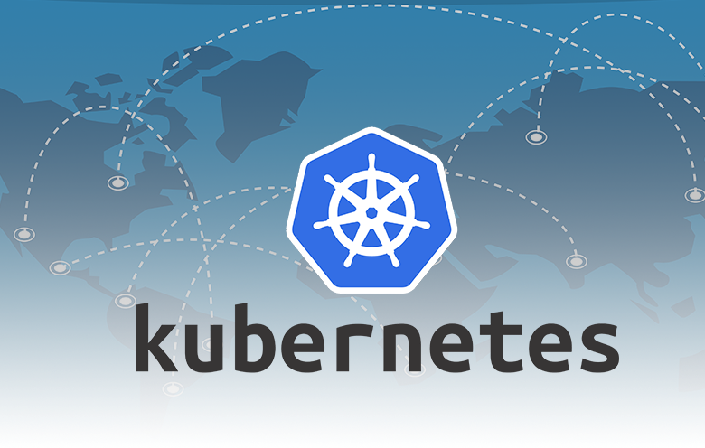
Kubernetes est un outil supplémentaire, bien que ce ne soit pas vraiment un outil au sens strict. Il s'agit plutôt d'un framework, un ensemble de concepts et de standards. Ce framework va nous aider dans l'orchestration de conteneurs et les déploiements à grande échelle, indépendamment du fournisseur de cloud que nous utilisons.

Mais allons-y étape par étape. Dans ce premier module sur Docker et Kubernetes, nous allons comprendre les défis auxquels nous pouvons être confrontés lors du déploiement de conteneurs, puis nous verrons comment Kubernetes peut nous aider à les surmonter. Nous découvrirons ce qu'est exactement Kubernetes et pourquoi nous voudrions l'utiliser, et nous commencerons à explorer les concepts et les composants clés de Kubernetes.

Comme je l'ai mentionné, ce ne sera pas le seul chapitre sur Kubernetes. Tout comme Docker, il ne s'agit pas d'un *outil simple*. Il comporte de nombreux aspects.  Dans ce premier chapitre, nous commencerons par la théorie. Ensuite, dans le chapitre suivant, nous verrons Kubernetes en action. Enfin, nous apprendrons comment utiliser Kubernetes pour mettre des conteneurs en production sur un fournisseur de cloud réel.

Mais prenons les choses étape par étape. Commençons par les bases de Kubernetes dans cette section du cours.

== D'autres problèmes avec le déploiement manuel

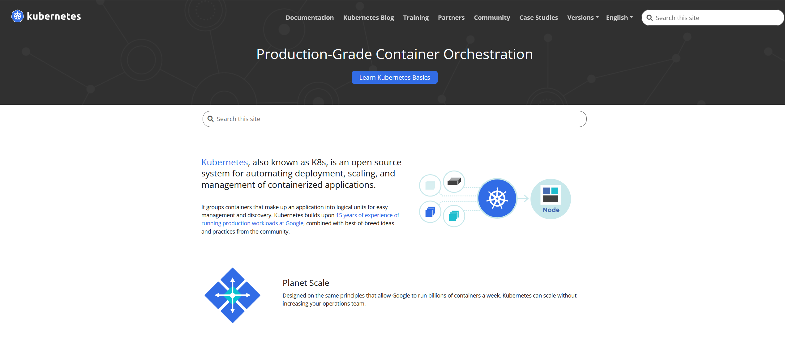

Si vous consultez https://kubernetes.io, vous pouvez approfondir vos connaissances sur Kubernetes. Toutefois, il n'est pas indispensable de vous plonger dans leur documentation immédiatement, car ces chapitres vous fourniront les bases essentielles de Kubernetes.

Sur le site officiel, *Kubernetes* est défini comme un système *open source* destiné à automatiser le déploiement, la mise à l'échelle et la gestion des applications conteneurisées. Il ne s'agit donc pas d'un logiciel unique, mais bien d'un système composé d'un ensemble d'outils et de pratiques qui facilitent le déploiement et la gestion des conteneurs.

Bien que cette définition soit correcte, elle ne permet pas de saisir pleinement ce qu'est Kubernetes, comment il s'utilise et pourquoi il est pertinent dans le contexte des infrastructures modernes. Pour mieux comprendre ces aspects, il convient de prendre du recul et de s'intéresser aux défis inhérents au déploiement manuel des conteneurs.

=== Les défis du déploiement manuel des conteneurs

Le déploiement manuel de conteneurs consiste à gérer soi-même l'infrastructure sous-jacente. Il ne s'agit pas simplement de faire tourner Docker localement pour le développement, mais plutôt de procéder au déploiement en environnement de production.

Prenons l'exemple classique de la gestion manuelle de serveurs pour déployer des conteneurs : il s'agit de créer des instances EC2 sur AWS, d'y installer Docker, puis d'exécuter manuellement les conteneurs sur ces instances. C'est cette approche que nous avons adoptée dans la section précédente sur le déploiement.

* *Gestion manuelle des serveurs :* La gestion manuelle des instances EC2 requiert non seulement leur configuration initiale, mais aussi leur maintenance continue, notamment en assurant que le système d'exploitation et les logiciels sont régulièrement mis à jour. Si cette maintenance n'est pas rigoureusement effectuée, cela peut exposer les serveurs à des vulnérabilités et à des risques opérationnels considérables.

* *Surveillance et remplacement des conteneurs défaillants :* Même en l'absence de failles de sécurité, il est possible que des conteneurs rencontrent des erreurs critiques, ce qui peut entraîner leur plantage. Un problème interne à l'application conteneurisée peut en effet rendre le conteneur inutilisable. Si cela se produit, il est impératif de remplacer rapidement le conteneur pour garantir la disponibilité continue de l'application.

Lorsque nous déployons manuellement des conteneurs sur *une instance EC2*, il incombe à l'administrateur de surveiller les pannes éventuelles et de redémarrer les conteneurs de manière proactive. Or, il est impossible de surveiller constamment les journaux du système pour détecter ces pannes, en particulier dans le cas d'applications complexes ou de grande envergure. Un tel processus, effectué manuellement, est à la fois chronophage et peu adapté à des environnements de production sérieux.

=== Le besoin de mise à l'échelle

Même si aucun incident de ce type ne survient, la nécessité d'ajuster dynamiquement le nombre d'instances de conteneurs peut se poser lors de pics de trafic. En cas d'augmentation du trafic, un conteneur unique peut rapidement se retrouver saturé par les requêtes en cours, retardant ainsi le traitement des nouvelles requêtes. Pour répondre à cette demande croissante, il est indispensable d'augmenter le nombre de conteneurs afin de répartir la charge sur plusieurs instances. À l'inverse, lorsque le trafic diminue, il peut être nécessaire de réduire le nombre de conteneurs actifs pour optimiser l'utilisation des ressources.

Cette problématique de mise à l'échelle n'a pas encore été abordée en profondeur dans ce cours. Jusqu'à présent, nous avons toujours exécuté une seule instance de conteneur pour chaque image, que ce soit avec EC2 ou ECS. Cependant, dans un environnement de production réel, cela peut se révéler insuffisant.

Il est également essentiel de souligner que l'utilisation des conteneurs ne se limite pas au développement web. Par exemple, si un conteneur exécute une tâche spécifique, comme la transformation de fichiers image, il ne dépendra pas nécessairement de requêtes HTTP entrantes. Si un grand nombre de fichiers est traité simultanément, un seul conteneur peut être insuffisant pour accomplir cette tâche en temps voulu. Dans ce cas, l'exécution de plusieurs conteneurs, chacun prenant en charge une partie de la charge de travail, pourrait constituer une solution efficace.

Ainsi, il peut s'avérer nécessaire de faire évoluer dynamiquement le nombre d'instances de conteneurs en fonction de la charge de travail et des variations du trafic.

=== Répartition de la charge

Lorsqu'il est question de trafic, et plus particulièrement de trafic HTTP entrant, il est également crucial de garantir que ce trafic soit réparti de manière équilibrée entre les différentes instances de conteneurs. Si une seule instance de conteneur est en cours d'exécution, il n'y a rien à répartir. Cependant, dès lors que plusieurs instances d'un même conteneur fonctionnent en parallèle, il devient primordial de distribuer équitablement le trafic entre ces instances, afin d'éviter que certaines soient surchargées tandis que d'autres demeurent inactives.

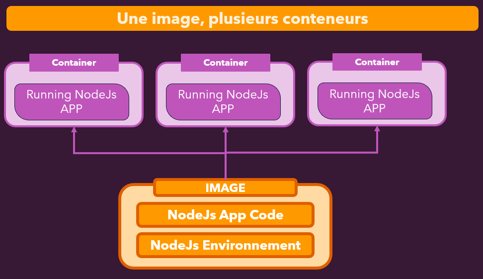

Le concept d'exécution de multiples instances d'un même conteneur peut paraître nouveau à certains. Nous avons mentionné plus tôt dans le cours que la commande docker run peut être exécutée autant de fois que nécessaire pour lancer plusieurs conteneurs à partir d'une même image. Cependant, dans nos exemples précédents, qu'il s'agisse de développement local ou de déploiement, nous avons toujours utilisé un conteneur par image.

Dans un environnement de production réel, que ce soit pour des applications web ou d'autres cas d'usage, il est souvent nécessaire d'exécuter plusieurs instances de conteneurs basées sur une même image. Cela permet de répartir la charge de travail et de garantir qu'il y ait suffisamment de conteneurs disponibles pour traiter des volumes de trafic importants.

Nous aborderons plus en détail ces concepts de mise à l'échelle dans les modules suivants.

=== Conclusion

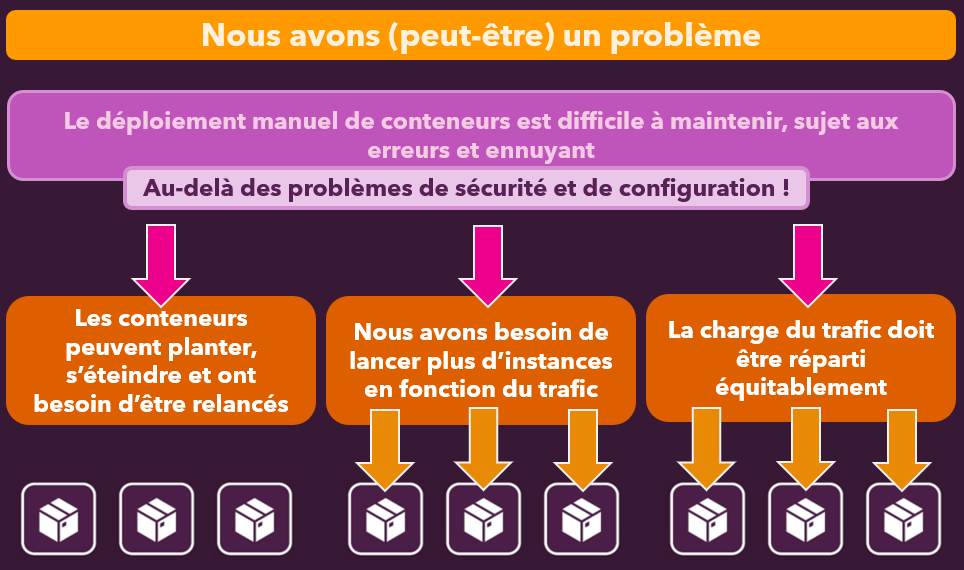

Ces défis liés au déploiement manuel des conteneurs, en particulier dans des environnements complexes ou à grande échelle, illustrent clairement la nécessité d'automatiser la gestion des conteneurs. Il devient essentiel d'adopter des systèmes capables de surveiller, de mettre à l'échelle et de répartir les charges de manière efficace. Kubernetes a précisément été conçu pour répondre à ces besoins. Dans les sections à venir, nous allons explorer comment Kubernetes permet de surmonter ces défis et d'optimiser la gestion des conteneurs.

== Pourquoi Kubernetes ?

Les services comme *ECS (Elastic Container Service)* que nous avons utilisé dans la section déploiement peuvent nous aider à résoudre plusieurs des problèmes rencontrés. Dans une certaine mesure, nous avons déjà bénéficié des fonctionnalités d'AWS ECS sans forcément nous en rendre compte.

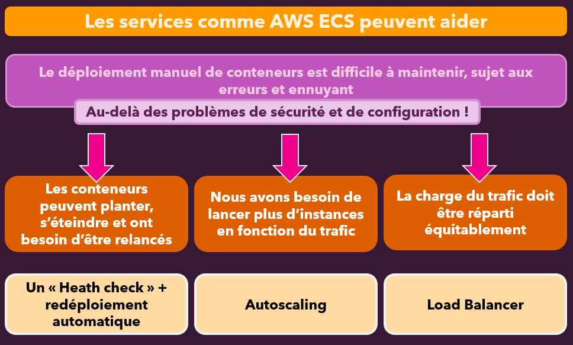

Par exemple, le service ECS vérifie automatiquement l'état de santé de nos conteneurs. Il s'assure que ceux-ci sont toujours en cours d'exécution et redémarre automatiquement les conteneurs en cas de panne. Nous avons pu observer cela en action lors du déploiement, notamment lorsque notre conteneur échouait à se connecter à une base de données et était redémarré à plusieurs reprises. AWS nous propose cette fonctionnalité, et l'utilisation d'ECS permet d'en tirer parti très facilement.

Bien que nous n'ayons pas exploité toutes ses capacités, *AWS ECS* nous aide également avec la mise à l'échelle automatique. Cette fonction permet d'ajuster dynamiquement le nombre d'instances de conteneurs en fonction des besoins, augmentant ou diminuant leur nombre pour répondre aux pics de trafic, par exemple.

De plus, *AWS ECS* intègre un outil appelé *Load Balancer* (équilibrage de charge), que nous avons configuré afin d’obtenir une adresse IP fixe ou un domaine pour nos tests. Cet outil, au-delà de fournir une adresse stable, assure également une répartition homogène du trafic entrant entre toutes les instances de conteneurs en cours d'exécution, si nous en avons plusieurs.

Ces services, *comme AWS ECS*, résolvent ainsi plusieurs des problèmes évoqués, ce qui constitue un avantage considérable en faveur de ces services gérés, plutôt que de tout déployer manuellement. Cependant, cela comporte également des inconvénients. En utilisant un service comme AWS ECS, *nous devenons dépendants de ce service*. Quel que soit le fournisseur de cloud choisi, l'utilisation d'un service spécifique nous lie à son *écosystème*.

Prenons l'exemple d'ECS : nous devons configurer les ressources en suivant les normes et concepts propres à AWS, tels que les clusters, tâches et services. Nous sommes donc contraints de respecter les options que AWS nous permet de définir. Ainsi, tout ce que nous configurons ici fonctionnera uniquement avec *AWS ECS*, que ce soit via l'interface utilisateur de la console AWS ou avec des outils en ligne de commande comme le `ecs-cli`, que nous n'avons pas encore utilisé. Cependant, nous ne sommes pas obligés d'utiliser *la console AWS* ; il est également possible de créer toutes ces ressources via la ligne de commande.

En outre, il est possible de définir des fichiers de configuration où nous pouvons inscrire la configuration souhaitée pour notre cluster et nos tâches ECS. Ensuite, ces fichiers peuvent être traités par le `ecs-cli` pour générer les ressources nécessaires dans le cloud, ce qui permet de gagner du temps lors du déploiement. Toutefois, nous restons toujours liés à *AWS ECS*, ce qui signifie que si nous voulons passer à un autre fournisseur de cloud, les fichiers de configuration que nous avons créés pour *AWS ECS* ne seront pas compatibles. Ces configurations étant spécifiques à AWS, elles ne fonctionneront pas avec des services proposés par d'autres fournisseurs, comme *Microsoft Azure*.

Cette dépendance signifie qu’en adoptant *AWS ECS*, nous devons maîtriser les spécificités du service, les terminologies et les options de configuration disponibles. Si nous souhaitons changer de fournisseur, il faudra réapprendre les particularités de ce nouveau service et adapter manuellement nos configurations pour les rendre compatibles avec le nouveau système.

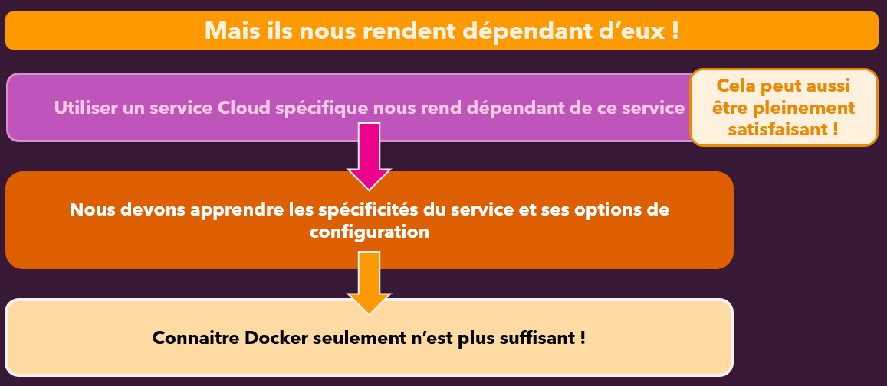

Ainsi, il ne suffit pas de connaître *Docker* ; il est également essentiel d'apprendre à utiliser des services comme AWS ECS, ou tout autre service que nous choisissons. Cela dit, si nous sommes satisfaits d'AWS et que nous prévoyons de rester sur cette plateforme, cette compétence acquise sur ECS devient un atout durable. Toutefois, cette dépendance peut poser un problème à long terme, ce qui nous amène à considérer des alternatives comme *Kubernetes*.

=== Qu'est-ce que Kubernetes exactement ?

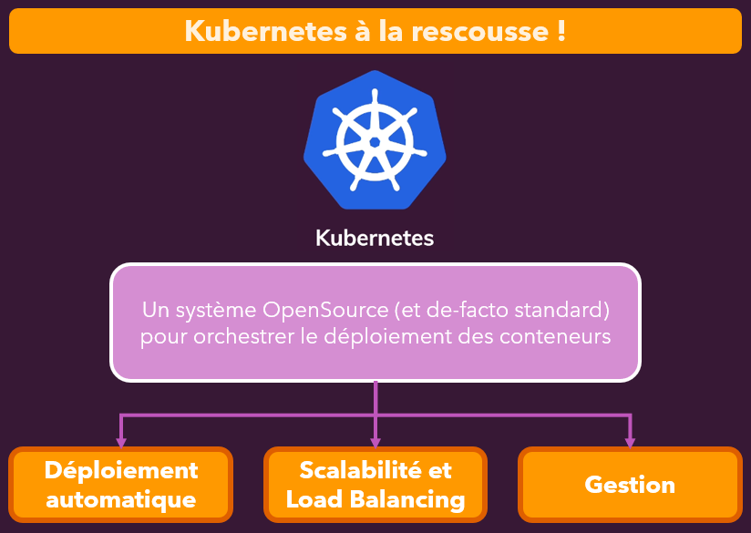

*Kubernetes* permet de résoudre les problèmes évoqués dans le chapitre précédent, car il offre une méthode de définition des déploiements, de mise à l'échelle des conteneurs, et de gestion des conteneurs en termes de surveillance et de remplacement en cas de défaillance. *Kubernetes* permet de définir ces éléments de manière indépendante du fournisseur de services cloud utilisé. Étant un système *open-source* et le standard de facto pour la gestion des déploiements de conteneurs et leur *orchestration*, *Kubernetes* facilite les tâches comme le déploiement automatique, la mise à l’échelle, l'équilibrage de charge et la gestion générale des conteneurs.

*Kubernetes* offre des outils pour surveiller les conteneurs et les remplacer automatiquement s'ils tombent en panne. Il suffit de rédiger une configuration Kubernetes (fichier de configuration) où sont définis les déploiements souhaités : quels conteneurs déployer, combien d'instances, s'ils doivent être mis à l'échelle, s'ils doivent être remplacés, etc. Ensuite, cette configuration peut être transmise à tout fournisseur cloud ou à toute machine correctement configurée. Celle-ci, à son tour, récupérera la configuration Kubernetes pour créer les ressources et le déploiement spécifiés.

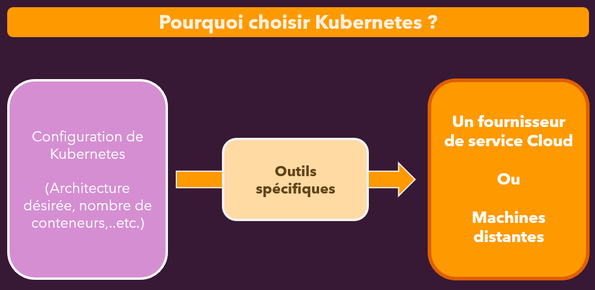

Cela signifie qu'il existe une méthode standardisée pour rédiger un fichier de configuration, comme suit :

[source,bash]
----
apiVersion: apps/v1
kind: Service
metadata:
  name: auth-service
  annotations:
     service.beta.kubernetes.io/aws-load-balancer-access-log-enabled: "true"
spec:
  selector:
      app: auth-app
  ports:
    - protocol: TCP
      port: 80
      targetPort: 8080
  type: LoadBalancer

....

----

Cette configuration est valable avec n'importe quel fournisseur cloud prenant en charge *Kubernetes*. Même si un fournisseur ne le prend pas en charge nativement, il est possible d'installer Kubernetes manuellement sur une machine, laquelle pourra ensuite interpréter ce fichier de configuration. Cela permet une standardisation dans la description des ressources à créer et à gérer, et tant que le serveur est capable d'exécuter Kubernetes, il sera en mesure de comprendre et d'exécuter la configuration.

Un autre avantage majeur de Kubernetes est qu'il permet d'ajouter des options spécifiques à un *fournisseur cloud* dans ce fichier de configuration. Si un fournisseur nécessite une configuration supplémentaire, elle peut être incluse dans le fichier. En cas de changement de fournisseur, il suffira de remplacer ou de supprimer ces configurations spécifiques, sans avoir à réécrire le fichier dans son intégralité.

Ainsi, *Kubernetes* est un système extrêmement puissant pour standardiser les déploiements. Il est toutefois essentiel de comprendre ce qu'est Kubernetes, ainsi que ce qu'il n'est pas.

Kubernetes *n'est pas un fournisseur de services cloud*. Ce n'est pas une alternative *à des services comme AWS ou Microsoft Azure*, mais un projet open-source qui regroupe un ensemble de concepts et *d'outils qui peuvent être utilisés avec n'importe quel fournisseur cloud*. Certains de ces fournisseurs peuvent proposer des services facilitant l'utilisation de Kubernetes, mais Kubernetes lui-même peut être utilisé n'importe où.

Il est important de noter que Kubernetes n'est pas un logiciel unique à exécuter sur une machine, **mais plutôt un ensemble d'outils et de concepts qui**, ensemble, permettent de gérer les déploiements. *Ce n'est pas non plus une alternative à Docker*. En fait, Kubernetes fonctionne en tandem avec *Docker* pour déployer des conteneurs sur n'importe quelle infrastructure. *Ce n'est pas non plus un service payant*. Étant donné qu'il s'agit d'un projet open-source, il n'y a pas de coût associé à son utilisation. *Cependant, des frais peuvent s'appliquer si vous utilisez Kubernetes avec un service cloud, comme les frais pour les ressources créées par ce fournisseur.*

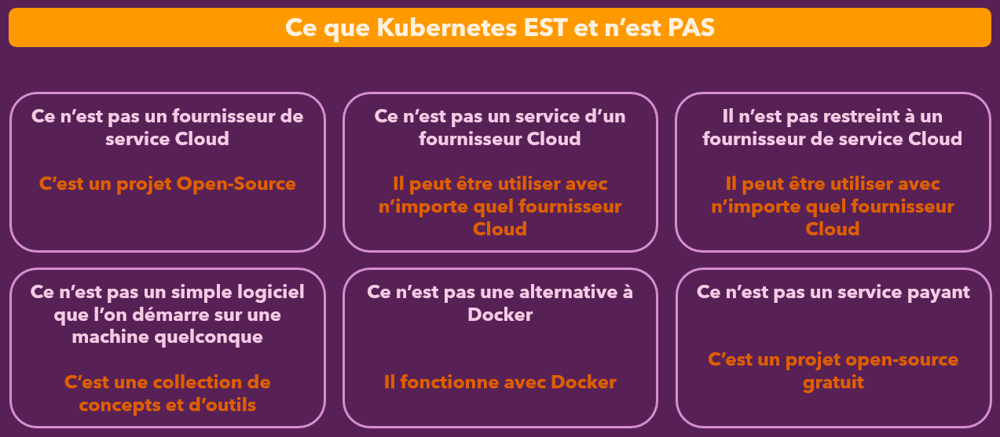

En résumé, *Kubernetes* peut être comparé à *Docker-Compose* à l'échelle de plusieurs machines. *Docker-Compose* est un outil que nous utilisons pour gérer facilement des projets multi-conteneurs sur une machine locale. De la même manière, Kubernetes permet de gérer des déploiements sur plusieurs machines, tout en surveillant et en redémarrant automatiquement les conteneurs. Kubernetes offre ainsi des fonctionnalités pratiques supplémentaires pour déployer des applications conteneurisées à grande échelle. 

[TIP]
====
Au fond, Kubernetes fait pour le déploiement multi-machines ce que Docker-Compose fait pour la gestion de conteneurs sur une machine unique.
====

== Kubernetes : Architectures et concepts clés

Kubernetes est un ensemble de concepts et d'outils qui facilitent le déploiement de conteneurs sur n'importe quelle infrastructure. Examinons maintenant l'architecture d'un déploiement Kubernetes et voyons ce que ce système peut configurer et gérer sur n'importe quel fournisseur de services cloud.

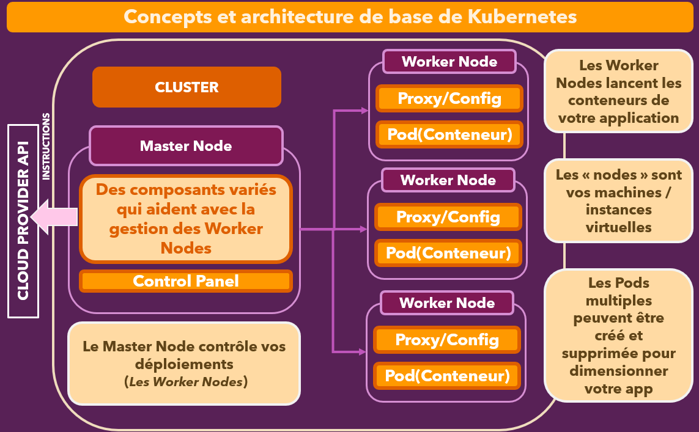

Tout commence par le conteneur que nous souhaitons déployer. Dans l'univers Kubernetes, ce conteneur est géré par ce qu'on appelle un pod. Un pod est la plus petite unité que vous pouvez définir dans un fichier de configuration Kubernetes. Ce pod contient le ou les conteneurs. En effet, un pod peut contenir plusieurs conteneurs qui ont besoin de fonctionner ensemble, mais dans sa forme la plus simple, un pod contient un seul conteneur responsable de son exécution.

Ce pod, contenant le conteneur, est ensuite exécuté sur ce que l'on appelle un nœud de travail (worker node). Le nœud de travail est la machine sur laquelle vos conteneurs sont exécutés. Vous pouvez imaginer les nœuds de travail comme vos machines physiques ou vos instances virtuelles. Dans le cas d'AWS, par exemple, une instance EC2 (une machine distante entièrement gérée par vous) pourrait jouer le rôle de nœud de travail. Chaque nœud de travail possède des ressources en CPU et mémoire, et peut héberger plusieurs pods.

En plus du rôle du nœud de travail pour exécuter les pods, Kubernetes nécessite également la configuration d'un proxy. Ce dernier est un outil supplémentaire que Kubernetes configure sur le nœud de travail pour contrôler le trafic réseau des pods. Il détermine si les pods peuvent se connecter à Internet et comment les conteneurs, au sein des pods, peuvent être atteints par l'extérieur. Par exemple, si vous exécutez une application web dans un conteneur au sein d'un pod, le proxy doit être configuré de sorte que le trafic provenant de vos utilisateurs puisse atteindre ce conteneur.

Nous verrons comment configurer et déployer ces éléments dans les prochains chapitres et modules pratiques.

Lorsque vous travaillez avec *Kubernetes*, il est généralement *nécessaire d'avoir au moins un nœud de travail* pour exécuter vos *pods* et *conteneurs*. Toutefois, pour des applications plus complexes, vous aurez souvent besoin de plusieurs nœuds de travail, afin de disposer de suffisamment de puissance de calcul pour exécuter tous vos conteneurs. Cela inclut la scalabilité des conteneurs. Si vous utilisez *Kubernetes* pour ajouter ou supprimer dynamiquement des conteneurs en fonction des fluctuations du trafic, Kubernetes répartit automatiquement les pods sur l'ensemble des nœuds de travail disponibles. Cela permet de distribuer la charge de manière uniforme sur plusieurs nœuds.

Tous ces nœuds de travail, ainsi que les *pods* et conteneurs qui y sont exécutés, doivent être supervisés. Quelqu'un (ou un système) doit créer et démarrer ces conteneurs et pods, les remplacer en cas de défaillance ou les arrêter lorsqu'ils ne sont plus nécessaires. C'est là qu'intervient le nœud maître (*master node*), plus précisément le plan de contrôle (*control plane*), qui constitue le centre de gestion chargé de contrôler les nœuds de travail.

Dans la pratique, vous n'interagissez généralement pas directement avec les nœuds de travail ou les pods. Bien que cela soit possible, ce n'est pas l'approche courante. Vous définissez plutôt l'état final souhaité que Kubernetes doit maintenir. Le nœud maître, qui est une machine distincte, exécute le plan de contrôle et se charge d'interagir avec les nœuds de travail et les pods qui y sont déployés.

Théoriquement, une seule machine peut servir à la fois de *nœud maître* et de *nœud de travail*, mais pour des déploiements de grande envergure, il est préférable d'avoir un *nœud maître dédié*, souvent réparti sur plusieurs machines pour garantir une haute disponibilité, tandis que les nœuds de travail sont indépendants du nœud maître. De cette manière, si un nœud de travail tombe en panne, le *nœud maître* reste fonctionnel.

Sur le *nœud maître*, le plan de contrôle est en réalité un ensemble de services et d'outils qui collaborent pour assurer la gestion de l'infrastructure Kubernetes. Nous explorerons plus en détail le fonctionnement des nœuds de travail et du nœud maître dans les sections suivantes.

Ensemble, ces composants forment un *cluster* : une collection de *nœuds maîtres* et de *nœuds de travail* interconnectés, formant un réseau dans lequel toutes ces parties sont liées. Le nœud maître peut ensuite envoyer des instructions à l'API du fournisseur cloud, demandant la création des ressources nécessaires, spécifiques à ce fournisseur, afin de répliquer l'état final désiré.

Dans le contexte d'AWS, par exemple, vous pourriez interagir avec AWS pour demander la création des instances EC2 nécessaires, d'un équilibreur de charge (_load balancer_) et de toute autre ressource nécessaire pour exécuter Kubernetes et ses outils sur l'instance EC2 du nœud maître. Ce nœud maître contrôlera ensuite les autres instances EC2 qui font partie du réseau, afin d'exécuter les conteneurs au sein des pods.

Je comprends que tout cela puisse paraître encore abstrait à ce stade, mais tout deviendra plus clair une fois que nous commencerons à manipuler Kubernetes dans les prochaines sections pratiques. Il est important de se familiariser avec cette vue d'ensemble théorique avant de passer aux exercices pratiques, afin que les concepts et termes employés plus tard aient un sens.

Avant de nous plonger dans la pratique, explorons davantage les rôles des nœuds de travail et des nœuds maîtres.

== Kubernetes ne gère pas votre infrastructure

Lorsque vous examinez cette vue d'ensemble de l'architecture Kubernetes que vous allez mettre en place, et avec laquelle Kubernetes vous aidera, il est essentiel de faire une distinction importante. Kubernetes réalisera certaines tâches pour vous, mais il y a également des aspects que vous devez configurer vous-même avant de pouvoir utiliser Kubernetes.

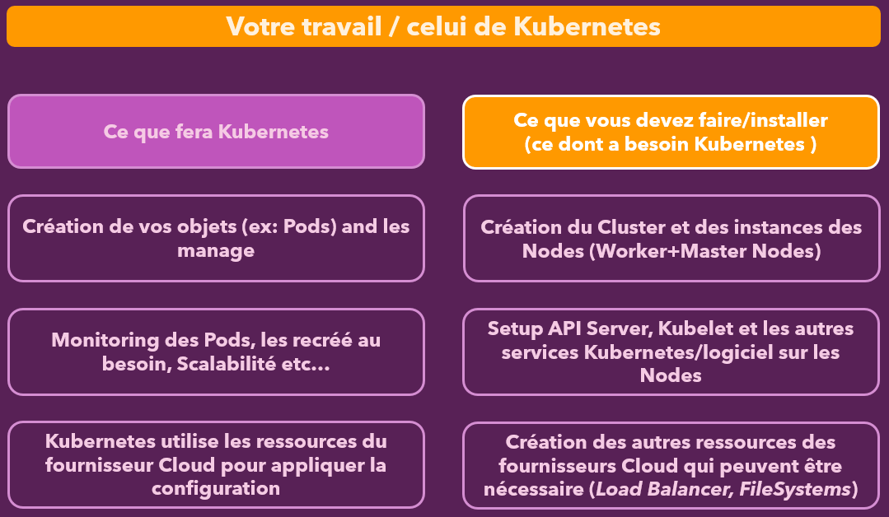

[NOTE]
====
En tant que *développeur* ou *administrateur*, vous devez préparer l'environnement dans lequel Kubernetes pourra s'exécuter.
====

Une des tâches cruciales consiste à *créer* et *configurer le cluster*, ainsi que les nœuds de travail (_worker nodes_) et le nœud maître (_master node_) sur lesquels Kubernetes sera installé. C'est une étape à votre charge. Vous devrez installer tous les logiciels nécessaires de Kubernetes sur ces nœuds, c’est-à-dire sur les machines faisant partie de votre cluster, et configurer les éléments dont Kubernetes aura besoin.

En fonction du fournisseur de *services cloud* que vous utilisez, vous devrez également mettre en place certaines ressources supplémentaires dont votre cluster Kubernetes pourrait avoir besoin, comme un équilibreur de charge (*load balancer*) ou des services de fichiers spécifiques. Nous explorerons ces éléments dans les sections suivantes, où je vous montrerai comment configurer un environnement de test local sur votre machine, ainsi que les ressources requises sur AWS, en guise d'exemple.

Il est important de noter que la préparation du cluster est une étape à votre charge. Bien que cela puisse paraître complexe à ce stade, vous apprendrez au cours de cette formation que le processus est en *réalité assez simple*. Que ce soit pour un développement local ou sur AWS, vous disposez de certains outils et services qui *facilitent* la création du cluster.

Cependant, il est crucial de comprendre que Kubernetes *ne crée pas ces ressources*. Une fois installé et configuré, Kubernetes *utilise ces ressources* pour gérer vos pods, c'est-à-dire les** unités contenant vos conteneurs**.

Kubernetes se charge de créer les pods, de les répartir automatiquement pour optimiser l'utilisation des ressources disponibles, de les surveiller et de les *redémarrer en cas de défaillance*. Kubernetes gère l'ensemble du déploiement, en veillant à ce qu'il fonctionne de manière *fluide* et *continue*, et prend en charge tout cela pour vous.

Kubernetes démarre les conteneurs pour vous, tout comme *Docker Compose*, mais pour des environnements de déploiement de conteneurs. Alors que **Docker Compose **peut rencontrer des limites pour des environnements de grande échelle, Kubernetes est spécialement conçu pour répondre à ces besoins.

Kubernetes fait tout cela, mais, tout comme *Docker Compose* n'installe pas *Docker* sur votre machine locale ni ne configure votre environnement local, *Kubernetes* a également besoin d'un environnement spécifique pour fonctionner sur des machines distantes.

C'est une distinction importante à garder à l'esprit. Je vous montrerai comment configurer un déploiement avec Kubernetes, comment l'ajuster pour qu'il prenne en charge vos conteneurs, ainsi que la manière de mettre en place un cluster Kubernetes.

Il est cependant essentiel de comprendre que la mise en place de cette architecture nécessite également du travail de votre part.

[NOTE]
====
Kubernetes n'installe pas le cluster ; il ne fait que l'utiliser une fois qu'il est prêt.
====

Maintenant que cette distinction est claire, plongeons plus en détail dans les nœuds de travail et les nœuds maîtres, afin d'examiner plus précisément ce que Kubernetes fait dans ces environnements.

== Les nœuds de travail (Worker Nodes)

Regardons de plus près les *nœuds de travail* (Worker Nodes). Comme mentionné précédemment, un nœud de travail est simplement une machine, telle qu'une instance *EC2* par exemple, qui est exécutée quelque part dans le cloud. Le nœud de travail est géré par le *nœud maître* (Master Node), comme expliqué plus tôt.

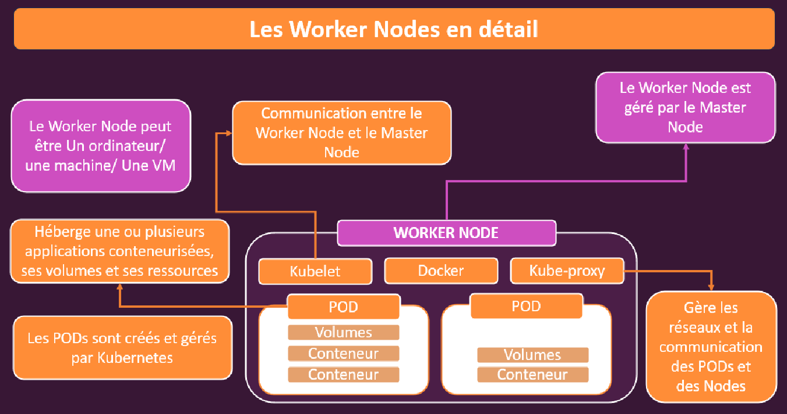

À l'intérieur de ce nœud de travail, nous trouvons nos *pods*. Un _pod_ héberge un ou plusieurs _conteneurs d'applications_ ainsi que toutes les ressources nécessaires à ces conteneurs. Cela inclut, par exemple, la configuration nécessaire au bon fonctionnement des conteneurs, mais aussi des éléments tels que les volumes.

Les pods eux-mêmes sont gérés par _Kubernetes_, et plus précisément par le _nœud maître_. Kubernetes est capable de *créer* ou de *supprimer* des pods selon les besoins. Lorsqu'un pod est supprimé, il est également responsable de l'exécution et de la gestion des conteneurs qui lui sont associés. Un pod peut contenir un seul conteneur, mais il est également possible d'avoir plusieurs conteneurs à l'intérieur d'un pod, notamment lorsqu'ils doivent travailler étroitement ensemble. En outre, tout type de ressource supplémentaire dont les conteneurs pourraient avoir besoin, comme un _volume_ (espace disque accessible aux conteneurs), peut être intégré au pod.

Généralement, plusieurs pods sont exécutés sur un même nœud de travail. Ces pods peuvent être des _répliques_ d'un autre pod (dans un scénario de mise à l'échelle où plusieurs instances d'un même conteneur sont nécessaires pour répartir le trafic entrant), ou bien des pods contenant des _conteneurs totalement différents_, dédiés à des tâches distinctes. Il est important de garder à l'esprit que le *nœud de travail* n'est pas spécifique à une tâche particulière. C'est simplement une machine, quelque part sur Internet, avec une certaine capacité en _CPU_ et en _mémoire_. Ainsi, vous pouvez y exécuter divers conteneurs et tâches, tout comme vous pouvez exécuter différents conteneurs sur votre machine de développement locale.

De la même manière que vous pouvez exécuter plusieurs conteneurs à partir de différentes images sur votre machine de développement avec la commande `docker run`, vous pouvez faire de même sur un nœud de travail dans Kubernetes. Par exemple, dans les chapitres précédents, nous avons utilisé _Docker Compose_ pour exécuter plusieurs conteneurs localement, tels qu'un backend, un frontend et une base de données. C'est exactement le même principe, mais cette fois-ci sur une machine distante fournie par un *fournisseur de services cloud*.

Sur ce nœud de travail, outre les pods, il y a également des _logiciels supplémentaires_ qui doivent être installés. _Docker_ doit être présent, car Kubernetes a besoin de Docker pour créer et exécuter les conteneurs. Un autre composant essentiel est le _kubelet_, qui est un _agent de communication_ entre le nœud de travail et le nœud maître. Le kubelet est un service logiciel qui s'exécute sur le nœud de travail et permet au nœud maître de contrôler les pods sur ce nœud.

De plus, il y a un _service proxy_ en cours d'exécution sur le nœud de travail. Ce proxy est responsable de la gestion du _trafic entrant et sortant_, garantissant que tout fonctionne correctement et que seul le trafic autorisé peut atteindre les pods ou quitter le nœud de travail.

Voilà en quoi consiste un nœud de travail. C’est une vue détaillée de ce qui s'y passe. Un des grands avantages de Kubernetes est que vous, en tant que développeur, n'avez qu'à *définir l'état final souhaité*. Si vous utilisez un fournisseur cloud comme *AWS*, ce dernier propose des services qui vous permettent de soumettre cette définition Kubernetes, et AWS se chargera de créer toutes les instances nécessaires et d'installer les logiciels requis. Vous n'avez donc pas à vous en préoccuper directement.

Cependant, il est important de bien comprendre ce qui se passe en arrière-plan, car en tant que développeur, vous devez toujours savoir *ce que votre code et vos configurations produisent*.

== Le nœud maître (Master Node)

Maintenant que nous avons examiné le *nœud de travail* (Worker Node), examinons le *nœud maître* (Master Node). Que fait le nœud maître et quels logiciels y sont exécutés ?

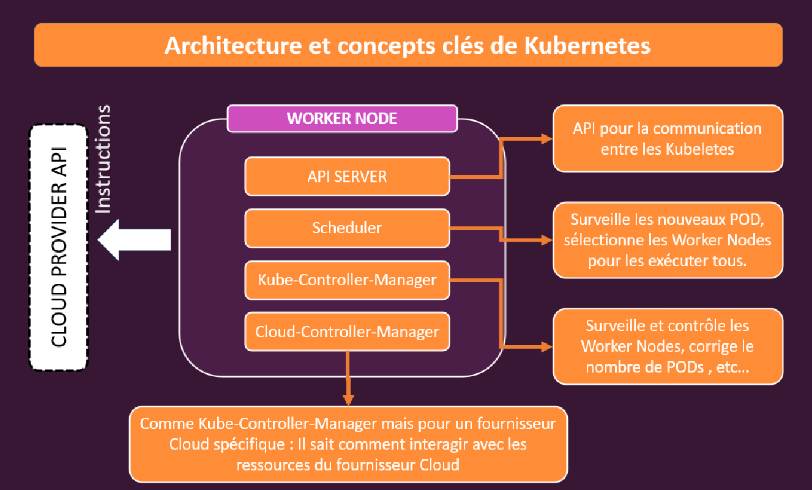

À l'intérieur du nœud maître, l'élément le plus important, le service essentiel, le logiciel clé que vous pourriez dire, qui est en cours d'exécution, est le *serveur API* (API Server). Ce service s'exécute sur la machine du nœud maître et agit comme un point central de communication pour les services kubelet qui fonctionnent sur les nœuds de travail. En d'autres termes, il est chargé de gérer la communication entre le nœud maître et les nœuds de travail.

En plus de ce *serveur API*, un autre service installé et exécuté sur la machine du nœud maître est un composant appelé *scheduler* (planificateur), qui est responsable de la surveillance des pods et de la sélection des nœuds de travail sur lesquels de nouveaux pods doivent être créés. Cela se produit lorsqu'un nouveau pod doit être ajouté, par exemple, parce qu'un pod est devenu défaillant ou qu'il est nécessaire d'en créer un nouveau en raison de la montée en charge (*scaling*).

Le scheduler a donc pour rôle d'indiquer au *serveur API* ce qu'il doit communiquer aux nœuds de travail.

Nous avons également un autre service appelé *kube-controller manager*. Ce dernier surveille et contrôle l'ensemble des nœuds de travail et est responsable de garantir que le nombre correct de pods soit en cours d'exécution. Ce service fonctionne bien sûr en étroite collaboration avec le *scheduler* et le *serveur API*.

Il existe une version spécifique de ce *kube-controller manager*, appelée *cloud-controller manager*, qui fait la même chose mais qui est spécifique à un fournisseur de cloud. Ce service sait comment donner des instructions au fournisseur de cloud, par exemple *AWS* ou *Microsoft Azure*.

Le *cloud-controller manager* traduit les instructions pour *AWS*, *Azure* ou tout autre fournisseur de cloud que vous utilisez. Les principaux fournisseurs de cloud, que vous utiliserez probablement dans la pratique, offrent déjà des services qui simplifient cette tâche, et où il vous suffit de fournir votre configuration Kubernetes, puis ils se chargent du reste.

Et voilà, c'est la vue d'ensemble et l'architecture de base. Comme je l'ai mentionné, je sais qu'à ce stade, vous avez probablement encore des questions à ce sujet, mais tout cela deviendra plus clair dans les prochains chapitres et modules au fur et à mesure que nous entrerons dans la pratique.

== Termes et concepts importants

Pour résumer, voici quelques termes que vous devriez garder à l'esprit, car vous les rencontrerez tout au long de ce cours.

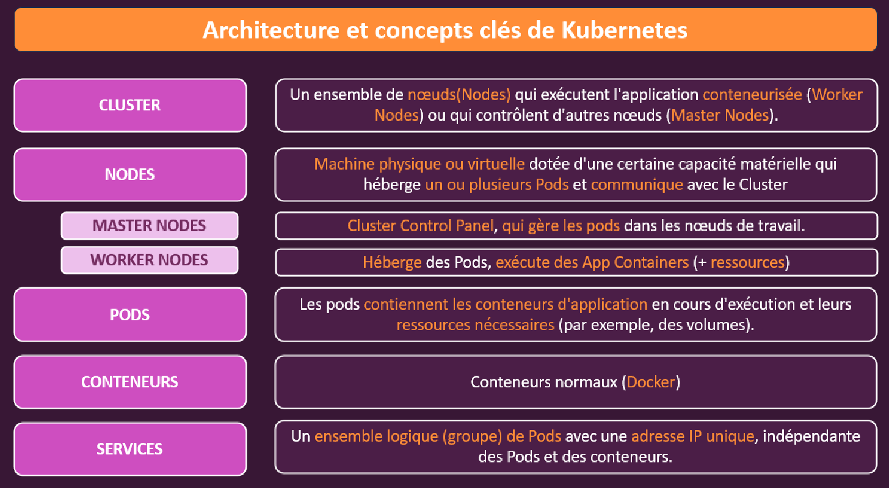

Tout d'abord, nous avons le *Cluster*, qui représente cet ensemble de machines *Nodes*, incluant les *nœuds maîtres* (Master Nodes) et les *nœuds de travail* (Worker Nodes). Ensemble, ces machines forment votre déploiement ou l'état final souhaité.

Les *Nodes* sont ensuite un élément crucial. Il s'agit des machines physiques ou virtuelles, avec des capacités matérielles spécifiques, qui hébergent un ou plusieurs *Pods* et qui communiquent au sein du *Cluster*.

Dans ce contexte, vous avez le *nœud maître* avec le *Plan de contrôle* (Control Plane), qui gère les *Pods* sur tous les *nœuds de travail*. Ensuite, il y a les *nœuds de travail*, qui sont les machines qui hébergent vos *Pods* et exécutent donc, en fin de compte, vos *conteneurs d'applications* ainsi que les ressources dont ces conteneurs pourraient avoir besoin.

Le terme *Pods* est également important et récurrent dans ce cours, car il s'agit d'un concept propre à *Kubernetes*. Un *Pod* représente une unité regroupant les *conteneurs d'applications* ainsi que les ressources nécessaires, combinées dans une structure appelée *Pod*. C'est essentiellement une enveloppe autour de votre conteneur, responsable de l'exécution et de la gestion de ce conteneur spécifique.

Les *Pods* sont ensuite gérés par le *nœud maître*. Lorsqu'un *Pod* est créé, cela revient à exécuter le conteneur à l'intérieur de ce *Pod*.

Les *conteneurs* demeurent également essentiels. Après tout, il s'agit d'un cours sur *Docker*. Ces conteneurs sont vos conteneurs Docker habituels. Donc, lorsque je dis qu'un *Pod* exécute un conteneur, cela signifie qu'à la fin, ce *Pod* exécute en quelque sorte la commande `docker run` en interne.

Enfin, bien que vous n'en ayez pas encore entendu parler dans ce module, mais que vous rencontrerez dans les modules suivants, il y a aussi les *services*. Les *services* sont des ensembles logiques, donc en fin de compte, des groupes de *Pods* avec une adresse IP unique, indépendante du *Pod* et des *conteneurs*.

Les *services* seront essentiels pour atteindre nos *Pods* et donc les conteneurs qu'ils hébergent. Les *services* sont donc bien sûr liés à ce *proxy* dont j'ai parlé dans cette section. Un *service* est simplement un terme dans le monde de *Kubernetes* qui désigne l'exposition de certains *Pods* au monde extérieur, en garantissant qu'ils soient accessibles avec une adresse IP ou un nom de domaine spécifique.

Mais tout cela reste théorique pour l'instant, et bien que ces termes soient importants, pour bien comprendre *Kubernetes*, nous devons mettre la main à la pâte. C'est exactement ce que nous allons faire dans le prochain du cours.

