:_chapter:
[[core_concepts]]
= Kubernetes : Principes fondamentaux
include::../../../run_app.adoc[]

== Introduction

Dans la section précédente du cours, je vous ai introduit à *Kubernetes* et j'ai présenté une vue d'ensemble, l'architecture générale ainsi que quelques termes et concepts clés que vous retrouverez également dans ce module.

Dans ce module, nous allons approfondir *Kubernetes* et commencer à le manipuler concrètement. Pour cela, nous allons tout d'abord apprendre à configurer *Kubernetes* et à créer un environnement de test Kubernetes, afin de pouvoir expérimenter avec ce système.

Ensuite, nous allons découvrir comment créer des *déploiements Kubernetes*, comment travailler avec les objets Kubernetes, ce que sont ces objets et quels types d'objets Kubernetes reconnaît. *Bien entendu, nous allons étudier tout cela à travers des exemples concrets.*

Ainsi, à la fin de ce module, nous aurons déployé notre première application basique avec l'aide de *Kubernetes*. Pour l'instant, cela se fera localement sur cet environnement de test, sur notre machine hôte locale, mais avec les connaissances acquises, nous serons en mesure d'appliquer la même configuration Kubernetes à plus grande échelle sur n'importe quel fournisseur cloud ou sur des machines distantes de notre choix.

== Kubernetes ne gère PAS votre infrastructure

Maintenant, pour commencer à travailler concrètement avec *Kubernetes*, il y a un point très, très important à comprendre et à garder en tête. Il s'agit de la distinction entre le travail que vous, en tant que développeur ou administrateur, devez faire, et celui que *Kubernetes* fera pour vous.

Cette distinction est cruciale, car il est essentiel de bien comprendre ce que *Kubernetes* fait et ce qu'il ne fait pas. Il y a un point particulièrement important que *Kubernetes* ne gère pas et que vous devrez prendre en charge : la création du *cluster* et des *nœuds*.

Vous pourriez vous attendre à ce que *Kubernetes* soit un outil tout-en-un où vous définissez votre architecture finale, comme la configuration de votre *cluster*, de vos *Master Nodes* et de vos *Worker Nodes*, et que *Kubernetes* crée automatiquement toutes ces ressources pour vous. Mais ce n'est pas le cas.

Comme je l'ai déjà mentionné dans la section précédente du cours, *Kubernetes* vous aide à gérer les *pods*, à surveiller les *pods*, à surveiller les conteneurs dans ces pods, à remplacer les pods défaillants, et à mettre à l'échelle(scalabilité) les pods. Il s'agit essentiellement de l'**orchestration des conteneurs** à l'intérieur des pods, de leur distribution entre les nœuds de travail, et de s'assurer que tout fonctionne correctement et est accessible à vos utilisateurs finaux.

En d'autres termes, *Kubernetes* est responsable de **gérer votre application déployée**, en s'assurant que tout fonctionne comme prévu, que vos conteneurs sont actifs et que tout ce qui est lié à l'exécution des conteneurs est pris en charge. Cependant, *Kubernetes* ne gère pas l'infrastructure nécessaire à votre application. Il ne connaît rien de cela, et ce n'est pas un outil de création d'infrastructure cloud.

Comme mentionné précédemment, *Kubernetes* n'est pas un fournisseur de services cloud, ni un service spécifique fourni par un fournisseur de cloud. C'est un cadre (*framework*) et un ensemble de concepts et d'outils qui vous permettent de configurer des déploiements pour vos applications conteneurisées. Par conséquent, *Kubernetes* ne sait rien des machines distantes, des instances virtuelles ou des ordinateurs que vous souhaitez utiliser.

Vous devez donc créer ces machines à l'avance et installer le *serveur API Kubernetes*, les *kubelets* et tous les services nécessaires sur les *nœuds maîtres* et les *nœuds de travail* que vous aurez créés. En d'autres termes, vous devez gérer la création et la gestion des instances ainsi que l'installation de tous ces logiciels.

Si vous gérez votre propre centre de données, cela signifie que vous devrez tout préparer pour *Kubernetes*. Si vous utilisez un fournisseur de cloud, comme *AWS*, vous devrez créer toutes les instances EC2 nécessaires pour les *nœuds maîtres* et *nœuds de travail*, et potentiellement ajouter des ressources supplémentaires, comme un *load balancer* ou un système de fichiers, tel que *Elastic File System* d'AWS si votre application en a besoin.

Ceci nous ramène à la partie de **déploiement manuel**, que nous cherchons justement à éviter. Cela implique de maintenir les instances à jour, de gérer la sécurité des systèmes, et de s'assurer que tout fonctionne correctement. Cependant, *Kubernetes* ne peut pas vous aider avec la gestion de ces machines ni leur sécurité, car ce n'est pas un outil d'administration de serveurs ni un service géré qui s'en occupe.

*En résumé*, *Kubernetes* vous aide à créer des pods, à exécuter les conteneurs à l'intérieur de ces pods, à les surveiller, les remplacer et à les mettre à l'échelle. Il se contente d'utiliser les ressources que vous avez créées, telles que les *nœuds de travail*, mais il ne crée pas ces ressources pour vous. Cela reste votre responsabilité.

Si vous êtes un administrateur système expérimenté, vous pouvez bien sûr gérer tout cela. Si ce n'est pas le cas, il existe des outils supplémentaires comme *Kubermatic*, qui est conçu pour *Kubernetes*, mais qui n'en fait pas partie, et qui peut vous aider à créer l'infrastructure nécessaire à votre déploiement Kubernetes.

De plus, certains fournisseurs de cloud, comme *AWS*, proposent des services dédiés, tels que *EKS* (*Elastic Kubernetes Service*), qui peuvent également vous aider. Ce service vous permet d'apporter votre propre configuration *Kubernetes* sans avoir à utiliser la configuration spécifique d'AWS, comme vous deviez le faire avec *ECS*. *EKS* configure alors toutes les ressources nécessaires à votre déploiement Kubernetes.

En conclusion, des outils comme *Kubermatic* ou des services gérés comme *EKS* peuvent compléter le tableau en vous aidant à éviter de devoir tout gérer manuellement. Cependant, il est essentiel de comprendre que *Kubernetes* ne crée pas de machines ou d'instances virtuelles, ni n'installe de logiciels. Il ne fait que gérer les *pods*, surveiller les conteneurs, les mettre à l'échelle, et s'assurer qu'ils sont accessibles.

Pour créer les ressources nécessaires à votre application, vous devrez le faire manuellement ou utiliser un outil comme *Kubermatic* ou un service géré comme *EKS*.

Dans un premier temps, nous allons configurer un environnement Kubernetes localement. Nous mettrons en place un *Master Node* et un *Worker Node* localement, et nous installerons tous les logiciels nécessaires à *Kubernetes* sur ces nœuds.

== Pré-requis et étapes d'installation

Alors, que devons-nous installer pour commencer à utiliser *Kubernetes* localement sur notre machine, afin de nous familiariser avec l'outil ?

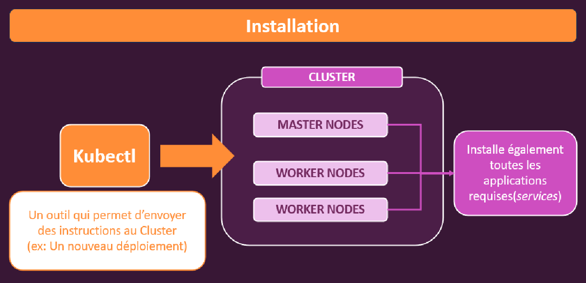

Peu importe où nous voulons utiliser Kubernetes, que ce soit sur notre machine locale, sur une machine dans le cloud ou dans notre propre centre de données. Nous aurons besoin d'un *cluster*.

Un *cluster* avec un *nœud maître* (Master Node) : en production, ce *nœud maître* peut être réparti sur plusieurs machines pour garantir sa disponibilité, car en cas de défaillance, l'ensemble du cluster rencontrerait des problèmes. Mais pour simplifier, nous avons besoin d'une seule instance virtuelle, une machine dans un cluster avec un *nœud maître* configuré, et un ou plusieurs *nœuds de travail* (Worker Nodes).

Ces machines ne doivent pas seulement être créées, mais elles doivent également avoir les logiciels et services nécessaires installés. 

* Sur le *nœud maître*, nous devons installer le *serveur API* (API Server), le *scheduler*, ainsi que d'autres composants. 

* Sur le *nœud de travail*, *Docker* doit être installé, ainsi que les *kubelets* qui servent de dispositifs de communication avec le *nœud maître*, et bien d'autres composants nécessaires.

Ensuite, il nous faut un autre outil localement sur notre machine, le *kubectl* (ou _kube-control_). Le *kubectl* est l'outil que vous utiliserez pour envoyer des instructions au *cluster* :

* Créer un nouveau déploiement, 
* Supprimer un déploiement,
* Modifier un déploiement en cours. 

Avec l'outil *kubectl*, en tant que développeur ou administrateur, vous êtes en mesure d'envoyer des instructions au *nœud maître*, qui à son tour communiquera avec les *nœuds de travail* pour effectuer les actions requises. 

[TIP]
====
Par exemple, si vous envoyez une instruction pour créer plusieurs *Pods* d'un conteneur spécifique, le *nœud maître* interagira avec les *nœuds de travail* pour que ces nouveaux *Pods* soient créés.
====

Le *cluster* représente l'infrastructure technique, et l'outil *kubectl* est votre moyen de communication avec cette infrastructure et la configuration *Kubernetes*. Ne confondez pas l'outil *kubectl* avec le *serveur API* ou le *nœud maître*. Le *nœud maître* est l'élément dans votre *cluster* qui applique vos commandes et s'assure qu'elles sont exécutées correctement. L'outil *kubectl* est simplement le moyen par lequel vous donnez ces commandes.

Pour utiliser une analogie, bien qu'un peu étrange, imaginez que le président des États-Unis, en tant que commandant en chef, donne l'ordre d'attaquer un pays. Les généraux (le *nœud maître*) appliquent cet ordre en coordonnant les soldats (les *nœuds de travail*). Dans cet exemple, *kubectl* serait le président, le *nœud maître* serait le général, et les *nœuds de travail* seraient les soldats. J'espère que cette analogie, bien que simplifiée, aide à clarifier la relation entre ces éléments.

Si nous devions configurer cela dans le cloud ou dans notre centre de données, le *cluster* se trouverait dans le cloud ou dans le centre de données, tandis que *kubectl* serait installé localement sur notre machine.

Pour tester et expérimenter localement, nous allons configurer tout cela sur notre machine locale. Nous allons installer non seulement *kubectl*, mais aussi un *cluster* de test.

Pour configurer ce *cluster* localement, nous pouvons utiliser un outil appelé *minikube*. Vous trouverez ci-joint un lien avec des instructions d'installation, et nous le configurerons ensemble dans les prochaines sections. *Minikube* est un outil que vous pouvez installer localement pour jouer avec *Kubernetes* et le tester. Il utilise une machine virtuelle sur votre ordinateur pour créer un *cluster* local.

*Minikube* simule une autre machine sur votre machine à l'aide d'une machine virtuelle, et cette machine virtuelle héberge le *cluster*. Il crée en fait un *cluster* à un seul nœud, ce qui signifie que le *nœud maître* et le *nœud de travail* sont combinés en une seule machine virtuelle. Ce n'est pas une configuration que l'on utiliserait en production, mais c'est parfaitement adéquat pour le développement et pour limiter l'utilisation des ressources.

.https://minikube.sigs.k8s.io/docs/start/?arch=%2Fwindows%2Fx86-64%2Fstable%2F.exe+download[Lien d'installation de Minikube]
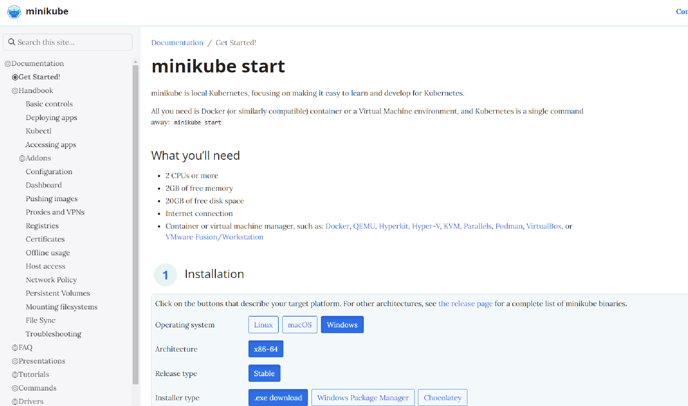

*Minikube* est un excellent outil pour débuter avec *Kubernetes* et tester les choses localement. L'avantage est qu'il peut être installé sur *Linux*, *macOS* et *Windows*. Vous trouverez également des instructions d'installation pour ces trois systèmes, mais nous passerons en revue l'installation sur *macOS* et *Windows* ensemble.

Il est également important de noter que *minikube* ne remplace pas la commande *kubectl* ; vous aurez besoin d'installer *kubectl* en plus de *minikube*. Même si vous n'utilisez pas *minikube*, vous aurez toujours besoin de *kubectl* pour communiquer avec votre *cluster*, qu'il soit local avec *minikube* ou distant sur AWS.

.https://kubernetes.io/docs/tasks/tools/[Lien d'installation de Kubectl]
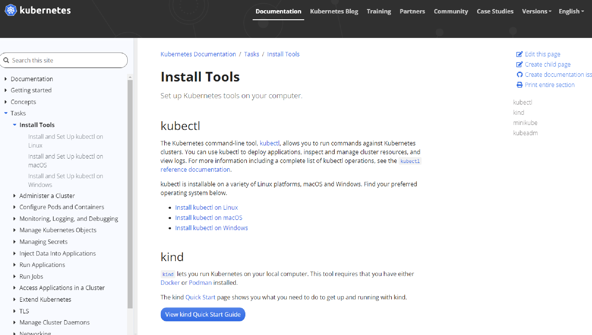

Nous allons donc installer deux choses : *kubectl* et ensuite *minikube*. Nous commencerons avec l'installation sur *macOS* dans la prochaine section, puis sur *Windows* dans la section suivante.

== Installation de *kubectl* et *minikube* sur Windows

Dans cette section, nous allons installer *Minikube* et l'outil *kubectl* sur Windows. Bien entendu, vous pouvez passer cette section si vous n'utilisez pas de dispositif sous Windows.

Nous voulons tout d'abord vérifier si notre configuration est correcte. Pour cela, copiez cette commande et exécutez-la dans l'invite de commande :

[source]
----
systeminfo | Select-String "Hyper-V"
----

Cela prendra un court instant, et si vous voyez un message indiquant qu'un *hyperviseur* a été détecté, alors vous avez déjà tout ce dont vous avez besoin.

Si vous voyez quelque chose comme *le système supporte la virtualisation, mais qu'un hyperviseur n'a pas été configuré*, cela signifie que votre système prend en charge la virtualisation (ce qui est nécessaire), mais qu'un hyperviseur n'a pas encore été configuré.

Dans ce cas, vous devrez installer un hyperviseur. Je vais utiliser *HyperV* comme hyperviseur. Mais *VirtualBox*  fonctionne aussi sur n'importe quel système, y compris *Windows 10 Home*, qui ne dispose pas d'un hyperviseur intégré.

[IMPORTANT]
====
Si votre système ne répond pas aux exigences, vous ne pourrez malheureusement pas installer *Minikube*. Si tout est en ordre, vous pouvez procéder à l'installation de l'outil *kubectl*.
====

=== Installation de `kubectl`

Allez sur : https://kubernetes.io/docs/tasks/tools/install-kubectl-windows/#install-nonstandard-package-tools[Lien d'installation de Kubectl]

L'outil *kubectl* est nécessaire pour communiquer avec le *cluster* et envoyer des instructions, même si vous n'installez pas *Minikube*. Il est essentiel pour gérer les déploiements, supprimer ou modifier les déploiements existants.

Pour installer *kubectl* sur Windows, je recommande d'utiliser *Chocolatey*, un gestionnaire de paquets pour Windows qui facilite l'installation de logiciels tiers. Vous pouvez installer *Chocolatey* en suivant les instructions fournies sur leur site officiel, et en exécutant la commande dans *PowerShell*.

.Site officiel de Chocolatey : https://chocolatey.org/install[Installation de Chocolatey]
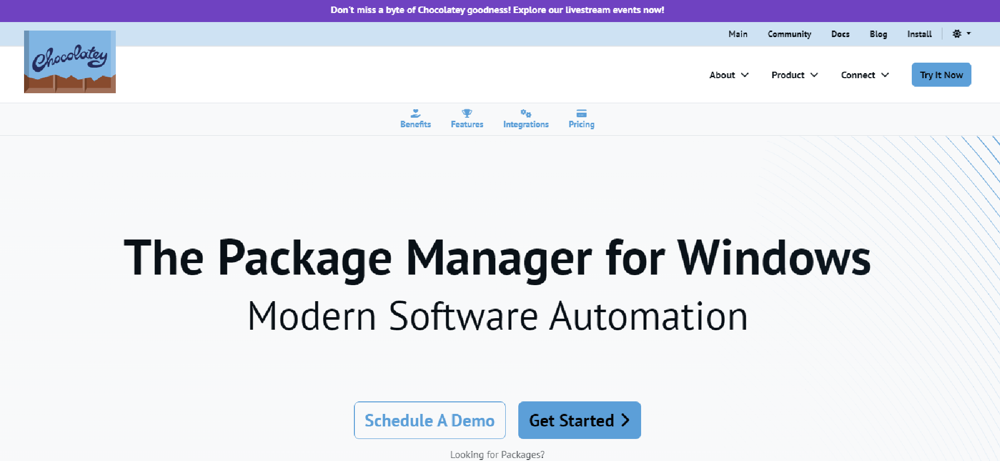

Exécutez en administrateur le script d'installation de *Chocolatey* dans *Powershell* :

[source]
----
 Get-ExecutionPolicy
----

Si la commande retourne : `Restricted`, exécutez la commande suivante pour autoriser l'exécution de scripts :

`Set-ExecutionPolicy AllSigned` ou `Set-ExecutionPolicy Bypass -Scope Process`

Puis :

[source]
----
Set-ExecutionPolicy Bypass -Scope Process -Force; [System.Net.ServicePointManager]::SecurityProtocol = [System.Net.ServicePointManager]::SecurityProtocol -bor 3072; iex ((New-Object System.Net.WebClient).DownloadString('https://chocolatey.org/install.ps1'))
----

Une fois *Chocolatey* installé, vous pouvez installer *kubectl* en exécutant la commande suivante dans l'invite de commande :

[source]
----
choco install kubernetes-cli
----

Cela installera l'outil *kubectl*.
Vous devriez voir une sortie qui confirme son installation.

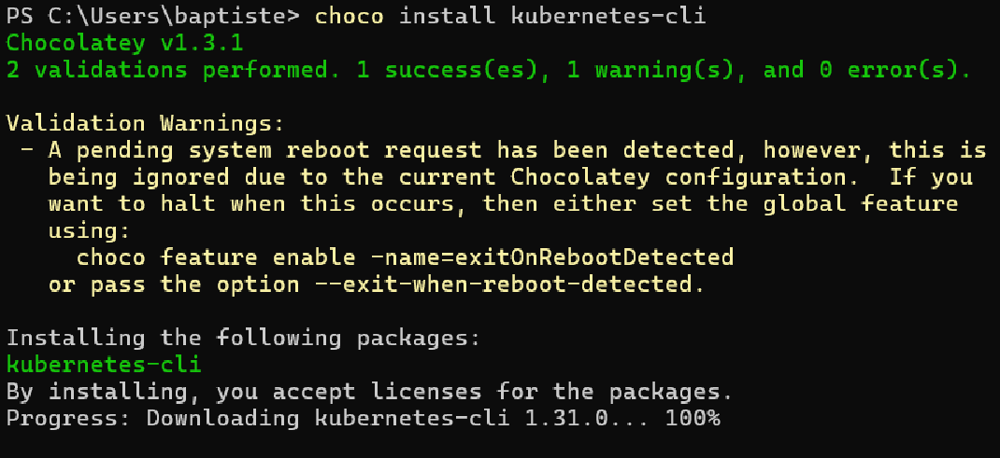

Pour vérifier que tout a fonctionné correctement, exécutez :

[source]
----
kubectl version --client
----

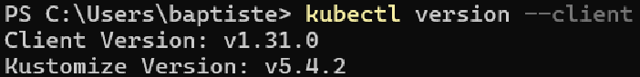

Ensuite, nous devons créer un dossier `.kube` dans votre dossier utilisateur. Pour cela, exécutez `cd $USERPROFILE$` dans l'Invite de Commande, ou bien `cd ~`.

Si vous êtes sur *Powershell*. puis `mkdir .kube` pour créer le dossier.

Ensuite, dans l'explorateur Windows, créez un fichier texte nommé `config` sans extension dans ce dossier. Ce fichier pourra être modifié plus tard si nécessaire.

Ou exécutez la commande suivante dans un Terminal Powershell :

[source]
----
 New-Item config -type file
----

Ce fichier permettra de spécifier la commande que `kubectl` doit exécuter pour communiquer avec le cluster. Vous pouvez le laisser vide pour l'instant, mais il sera nécessaire pour communiquer avec le cluster.

[NOTE]
====
Une fois *kubectl* installé, nous pouvons passer à l'installation de *Minikube*.
====

=== Installation de `Minikube`

Nous avons besoin d'un hyperviseur, et comme mentionné plus tôt *VirtualBox* peut faire l'affaire si vous n'avez pas Hyper-V sur votre machine. Téléchargez l'installateur *VirtualBox* à partir de leur site officiel, puis installez-le sur votre système Windows. Vous pouvez conserver les options par défaut.

Ensuite, nous pouvons installer *Minikube* avec *Chocolatey*. Exécutez la commande suivante dans l'invite de commande :

[source]
----
choco install minikube
----

Cela installera *Minikube*. Une fois l'installation terminée, redémarrez l'invite de commande et vérifiez l'installation de *Minikube* en exécutant la commande.

.Avec Hyper-V
[source]
----
minikube start
----

[source]
.Avec VirtualBox
----
minikube start --driver=virtualbox
----

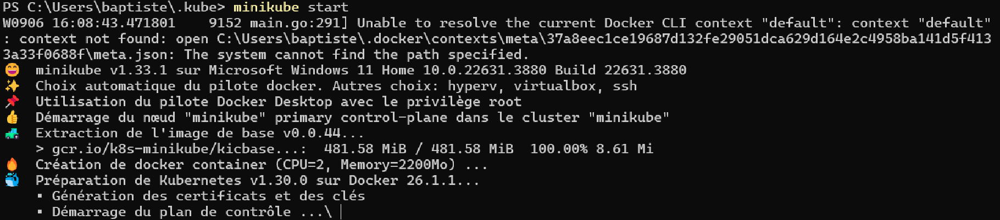

Cette commande créera une machine virtuelle avec *VirtualBox* ou *Hyper-V* qui hébergera votre *cluster* de développement. Elle configurera le *nœud maître* et le *nœud de travail*, bien que dans cet environnement de développement, ces deux rôles seront combinés en une seule machine virtuelle.

*Minikube* installera également tous les logiciels nécessaires à *Kubernetes*, tels que le *serveur API* et les *kubelets*.

Une fois que l'installation est terminée, vous pouvez vérifier le statut de *Minikube* en exécutant `minikube status`,

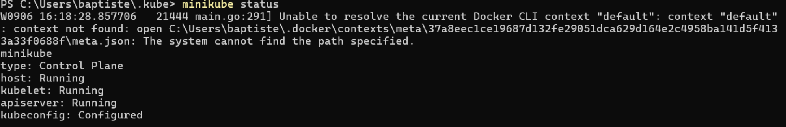

Ce qui devrait vous montrer que le *cluster* est en *cours d'exécution*.

Vous pouvez également ouvrir un tableau de bord visuel pour inspecter votre *cluster* en exécutant `minikube dashboard`.

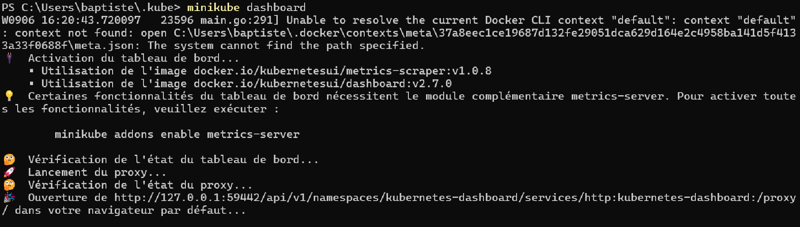

Cela ouvrira un onglet dans votre navigateur avec une application web intégrée à *Minikube* qui vous permettra de visualiser les ressources de votre *cluster*.

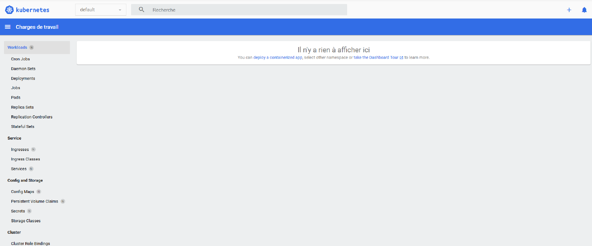

Pour résumer, nous avons installé *kubectl* et *Minikube*, et nous sommes prêts à commencer à travailler avec *Kubernetes* en utilisant ce *cluster* de développement local.

=== Annexe : Erreurs rencontrés

Lors de la saisie de certaines commandes "minikube" dans l'invite de commande, vous pourriez rencontrer des erreurs. Voici quelques erreurs courantes et comment les résoudre :

[source]
----
W0906 16:20:43.720097   23596 main.go:291] Unable to resolve the current Docker CLI context "default": context "default": context not found: open C:\Users\baptiste\.docker\contexts\meta\37a8eec1ce19687d132fe29051dca629d164e2c4958ba141d5f4133a33f0688f\meta.json: The system cannot find the path specified.
----

1. Vérifier le contexte Docker actuel : `docker context ls` ,
Cela affichera la liste des contextes Docker disponibles. Si le contexte default est manquant, il est possible que votre configuration Docker soit corrompue ou supprimée.

2.  Réinitialiser ou recréer le contexte Docker : docker context create new-context

3. Changer le contexte Docker : `docker context new-context`

== Comprendre les objets Kubernetes (Ressources)

Maintenant que nous avons créé notre configuration *Minikube* et que notre machine virtuelle avec le *cluster Kubernetes* est opérationnelle, nous pouvons commencer à interagir avec ce cluster et envoyer des commandes à *Kubernetes* pour lui demander d'exécuter des actions.

Pour commencer, il est essentiel de comprendre comment *Kubernetes* fonctionne en interne. Je ne parle pas directement de l'architecture ou de la structure d'un cluster *Kubernetes*, mais plutôt des types de commandes et du langage que *Kubernetes* comprend pour créer, par exemple, un *Pod* et démarrer un conteneur.

Il est important de comprendre que *Kubernetes* travaille avec ce que l'on appelle des **objets**. C'est ainsi que *Kubernetes* nomme les entités avec lesquelles il interagit. *Kubernetes* reconnaît plusieurs types d'objets : *pods*, *deployments*, *services*, *volumes*, et bien plus encore. Nous allons voir les objets les plus importants.

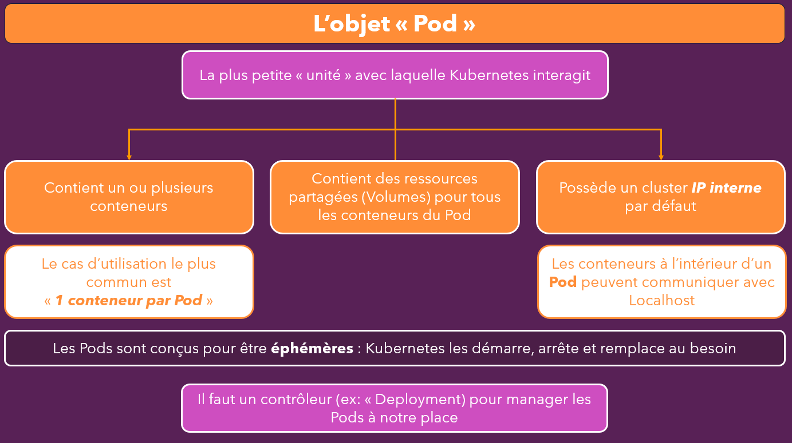

L'idée derrière ces objets est simple : vous pouvez créer un objet en exécutant une commande spécifique. Ensuite, *Kubernetes* prend cet objet, qui est essentiellement un ensemble d'instructions, et fait quelque chose basé sur ce qui est codé dans cet objet.

Ces objets peuvent être créés de deux façons : de manière impérative ou déclarative. Nous allons explorer ces deux approches et comprendre quelle est la plus adaptée selon les situations. En bref, *Kubernetes* attend que vous créiez ces objets pour exécuter les actions correspondantes.

=== Le POD

Parmi les objets clés que nous allons utiliser régulièrement, le **pod** est fondamental. Un *pod* dans *Kubernetes* est l'unité la plus petite avec laquelle *Kubernetes* interagit. Vous vous souvenez peut-être du *pod* dans le schéma d'architecture que je vous ai montré plus tôt. *Kubernetes* crée des *pods*, et ces *pods* contiennent des conteneurs. *Kubernetes* gère ces *pods*, et par conséquent, les conteneurs qu'ils contiennent.

Un *pod* contient et exécute un ou plusieurs conteneurs. Les deux configurations sont possibles : vous pouvez avoir un seul conteneur par *pod* ou plusieurs conteneurs. Cependant, le cas d'utilisation le plus courant est d'avoir un conteneur par *pod*.

Si vous souhaitez que *Kubernetes* crée un *pod*, exécute un conteneur et place ce *pod* sur un *nœud de travail* dans le cluster, vous devez créer un objet *pod* en code ou via une commande, puis l'envoyer à *Kubernetes*.

Les *pods* ne se contentent pas d'exécuter des conteneurs, ils peuvent également contenir des ressources partagées, comme des *volumes* (que nous aborderons plus en détail plus tard). Par défaut, un *pod* dispose d'une adresse IP interne au cluster, mais cela peut être modifié pour permettre une communication externe avec les *pods*.

Si un *pod* contient plusieurs conteneurs, ceux-ci peuvent communiquer entre eux via l'adresse *localhost*. Si vous avez suivi les leçons sur *AWS ECS* dans la section précédente, vous vous souviendrez peut-être que dans *AWS ECS*, les tâches contenaient également des conteneurs pouvant communiquer via *localhost*. Une tâche dans *AWS ECS* est en fait très similaire à un *pod* dans *Kubernetes*. Bien que cela ne soit pas directement lié, c'est une analogie utile pour ceux qui ont déjà travaillé avec *AWS ECS*.

Deux points importants à retenir sur les *pods* :

1. Les *pods* sont **éphémères**. Cela signifie qu'ils ne persistent pas. Si un *pod* est supprimé ou remplacé, toutes les ressources dans ce *pod*, y compris les données générées par un conteneur, seront perdues. Cela fonctionne de manière similaire aux conteneurs, où les données sont perdues si un conteneur est supprimé. Cependant, il existe des moyens de persister les données avec *Kubernetes*, que nous aborderons plus tard.

2. Bien que vous puissiez créer des *pods* manuellement, ce n'est généralement pas la méthode recommandée. L'une des raisons principales d'utiliser *Kubernetes* est qu'il gère automatiquement vos *pods* pour vous : il crée, remplace et met à l'échelle les *pods* en fonction des besoins de votre application. Si vous deviez créer manuellement chaque *pod*, autant utiliser un simple conteneur *Docker* sur une instance. C'est pourquoi, dans la plupart des cas, nous utilisons des **objets de contrôleur**, notamment l'objet **deployment**, qui prend en charge la gestion des *pods* pour nous.

Passons maintenant à l'objet **deployment**, et voyons comment il fonctionne.

== L'objet "Deployment" (Ressource)

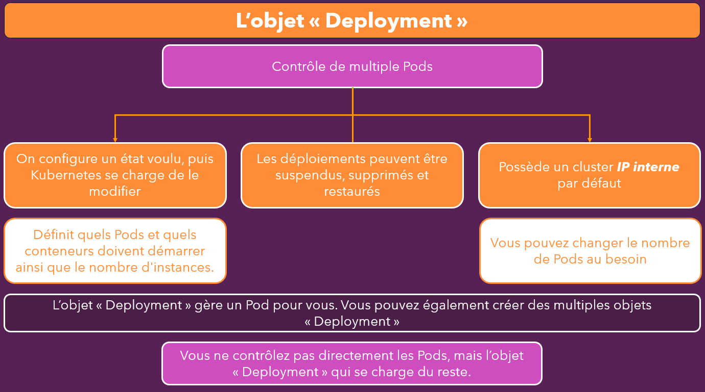

Nous avons déjà examiné l'objet Pod. Passons maintenant à l'objet Deployment, qui est l'un des objets clés que vous utiliserez fréquemment avec Kubernetes. En général, vous ne créerez pas directement des objets Pod ni ne les déplacerez manuellement vers un nœud de travail spécifique. Au lieu de cela, vous utiliserez un objet Deployment pour définir le nombre de Pods et les conteneurs que Kubernetes doit créer et gérer pour vous.

L'objet Deployment permet de contrôler un ou plusieurs Pods. Il peut ainsi être utilisé pour créer plusieurs Pods simultanément. L'idée centrale de cet objet, qui est en réalité un contrôleur sous-jacent, est de définir un état cible souhaité. Par exemple, vous pouvez indiquer à Kubernetes que vous souhaitez deux Pods avec un certain conteneur en cours d'exécution. Kubernetes se chargera ensuite de tout pour atteindre cet état cible.

L'avantage de ce système est que Kubernetes gère entièrement la création et le placement des Pods en fonction des ressources disponibles sur les nœuds de travail, tels que la mémoire et la capacité CPU. Vous n'avez donc pas besoin de choisir manuellement une machine distante pour y placer vos Pods. Kubernetes s'en charge automatiquement.

Un autre atout de l'utilisation de l'objet Deployment est la possibilité de mettre en pause, de supprimer ou même de restaurer un Deployment. Par exemple, si une erreur survient et que votre application échoue, vous n'avez pas à corriger immédiatement le code et à remplacer le Pod défaillant. Vous pouvez simplement revenir à une version antérieure du Deployment qui fonctionnait correctement. Cela vous laisse le temps de corriger le bogue sans urgence, puis de redéployer la nouvelle version une fois les corrections effectuées.

L'objet Deployment offre également une fonctionnalité de mise à l'échelle (scaling). Vous pouvez demander à Kubernetes d'augmenter ou de réduire le nombre de Pods en fonction de vos besoins. De plus, la fonction d'auto-scaling permet de définir des métriques telles que le trafic entrant ou l'utilisation du CPU. Lorsque ces seuils sont dépassés, Kubernetes crée automatiquement davantage de Pods pour gérer la charge. À l'inverse, lorsque la charge diminue, Kubernetes retire les Pods supplémentaires devenus inutiles.

En résumé, l'objet Deployment facilite la gestion des Pods et permet d'automatiser des aspects critiques comme la mise à l'échelle et la gestion des erreurs. En général, vous n'aurez pas à gérer directement les Pods individuellement, car Kubernetes le fait à votre place via les Deployments.

Maintenant que nous avons couvert ces concepts, passons à la pratique en exécutant des commandes pour créer un Deployment dans notre cluster de démonstration Minikube.

