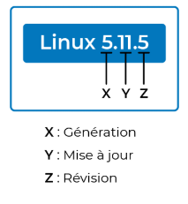
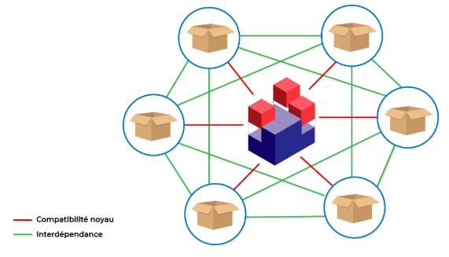
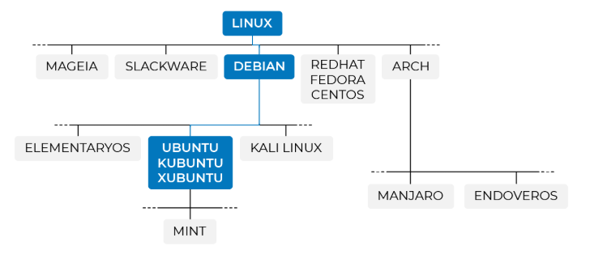

:_chapter:
:_author: Bauer Baptiste
:_duration: 3
:_version_number: 1.0.0
:_version_date: 20/01/2025
[[distribution-linux-]]
= Distribution Linux
include::../../../run_app.adoc[]

Dans ce chapitre, nous aborderons :

* [x] le cœur fondamental de Linux, à savoir son noyau ;

* [x] le concept de "distribution", résultant d'un effort communautaire considérable visant à rendre Linux accessible et maintenable par l'ensemble des utilisateurs.

== Principes fondamentaux du noyau

[NOTE]
====
*Linux* constitue un **système d'exploitation monolithique modulaire**.
====

* *Monolithique* :
+
Cette qualification signifie que l'intégralité du code Linux s'exécute au sein d'UNE SEULE entité en mémoire de l'ordinateur. Cette entité est désignée sous l'appellation de noyau.
Le noyau Linux représente la fondation, l'élément central du système Linux.
Il intègre toutes les fonctionnalités fournies par le système d'exploitation, notamment la gestion mémoire, la gestion processeur, l'accès aux périphériques de stockage, et d'autres composants essentiels.

* *Modulaire* :
+
Cette caractéristique indique que l'architecture du noyau Linux est organisée en *modules* fonctionnels, constituant des unités de code distinctes.

L'architecture peut être représentée schématiquement de la manière suivante :

.Noyau Linux monolithique et modulaire

Cette organisation présente un avantage considérable. Grâce à cette modularité, il est possible d'intégrer ou de retirer des modules d'un noyau en cours d'exécution, sans nécessiter d'interruption ou de redémarrage du système.

Il convient de noter que Linux est distribué sous licence *GPL* (General Public Licence), licence open source la plus répandue à l'échelle mondiale. L'intégralité du code du système d'exploitation est ainsi accessible *librement et gratuitement*.

[TIP]
====
Les sources du noyau sont disponibles sur le https://www.kernel.org/[site officiel de Linux Kernel Archives], référentiel maintenu par les équipes de développement associées à Linus Torvalds.
====

Le téléchargement du noyau Linux s'apparente à l'acquisition d'une archive compressée, comparable à un fichier .zip.

Les extensions diffèrent pour les sources du noyau Linux, mais le principe demeure identique : la décompression de cette archive, représentant plusieurs centaines de mégaoctets, révèle un répertoire contenant plus de 25 millions de lignes de code. Cette volumétrie considérable constitue l'infrastructure logicielle permettant le fonctionnement du processeur, des interfaces réseau, des systèmes de fichiers, et de nombreux autres composants système.

Il n'est pas nécessaire d'être intimidé par l'apparence inhabituelle du fichier à télécharger. Sa nomenclature suit le modèle "X.Y.Z".

Cette convention de numérotation permet de suivre l'évolution progressive des versions. La nature libre du projet favorise des mises à jour fréquentes.

Cette nomenclature répond à une logique précise :

* X représente le *numéro majeur*, correspondant à une génération spécifique, marquant une évolution significative.

* Y constitue le *numéro mineur*, évoluant plus rapidement au sein d'une même branche majeure, reflétant les mises à jour périodiques au sein d'une génération.

* Z désigne une *révision*, correspondant généralement à une correction d'anomalie ou une amélioration sécuritaire.

Il n'est pas requis de télécharger directement le noyau dans le cadre de ce cours. Le noyau constituant la base du système Linux, des équipes de développement ont élaboré à partir de celui-ci des *distributions* complètes, qui feront l'objet d'un téléchargement ultérieur.

== Le concept de distribution

Les fonctionnalités intrinsèques du noyau Linux présentent une complexité significative pour l'utilisateur final. Par conséquent, des programmes applicatifs ont été développés pour s'interfacer avec le noyau et permettre la réalisation de diverses tâches : création de documents, traitement d'images, production audiovisuelle, développement logiciel, etc.

Ces applications ont été conçues et mises à disposition par des développeurs collaborant au sein de la communauté open source. Il convient de rappeler que Linux s'inscrit dans une philosophie communautaire, libre et ouverte.

[NOTE]
====
Ces applications sont proposées sous forme de *packages* précompilés.

Ces packages ne sont pas uniquement compatibles avec une version spécifique du noyau, mais présentent également une interopérabilité entre eux.

L'assemblage cohérent de ces packages, répondant à des besoins spécifiques ou généraux, constitue ce que l'on désigne par le terme *distribution* Linux.
====

.Les packages forment une distribution autour du noyau

== Sélection d'une distribution adaptée

L'écosystème Linux actuel présente une diversité considérable de distributions.

Pour les adeptes des représentations chronologiques ou cartographiques, la figure suivante illustre l'arborescence généalogique des distributions Linux :  https://upload.wikimedia.org/wikipedia/commons/1/1b/Linux_Distribution_Timeline.svg[Linux Distribution Timeline].

Cette multiplicité apparente ne doit pas être source d'inquiétude. Une observation attentive révèle que la majorité des distributions dérive en réalité de quelques distributions fondatrices : Debian, Red Hat et Slackware.

Il est important de comprendre que chaque distribution répond à des objectifs spécifiques. Certaines privilégient les aspects sécuritaires, d'autres les fonctionnalités multimédias, d'autres encore sont optimisées pour des environnements serveur ou des infrastructures réseau.

[NOTE]
====
Les distributions orientées serveur présentent une complexité technique accrue et s'adressent principalement aux administrateurs système souhaitant déployer des services spécifiques tels que des serveurs web ou des bases de données.
====

Dans le cadre de ce cours, nous nous intéresserons prioritairement aux distributions conçues pour les postes de travail.

Ces distributions présentent plusieurs avantages significatifs :

elles intègrent des environnements graphiques sophistiqués (développés notamment pour concurrencer les interfaces Windows et macOS qui dominaient historiquement le marché) ;

elles offrent une accessibilité accrue pour les utilisateurs provenant de l'environnement Windows.

[TIP]
====
Il convient de noter qu'une distribution poste de travail peut être aisément reconfigurée en serveur sécurisé, témoignant de la flexibilité intrinsèque de l'écosystème Linux.
====

Parmi les distributions majeures orientées poste de travail, on peut citer :

* *Linux Mint* (créée par un développeur français, dérivée de la famille Debian). Cette distribution est particulièrement reconnue pour son esthétique et son ergonomie ;

* *Elementary OS* (également issue de la famille Debian). Sa conception vise à reproduire l'expérience utilisateur caractéristique de macOS ;

* *Fedora* (appartenant à la famille Red Hat). Cette distribution se distingue par l'intégration des innovations technologiques les plus récentes ;

* *Ubuntu* (distribution dérivée de Debian, probablement la plus répandue actuellement).

La sélection d'une distribution reste une décision personnelle. Néanmoins, pour les besoins de ce cours, la distribution Ubuntu constitue un choix pertinent.

.Arborescence des distributions Linux

Son fondateur, Mark Shuttleworth, avait pour ambition de créer une plateforme Linux universellement accessible, avec l'objectif explicite de proposer une alternative crédible à la prédominance de Windows sur le marché des postes de travail.

[TIP]
====
*Pour obtenir Ubuntu :*

* Consultez le https://ubuntu.com/download/desktop[site officiel d'Ubuntu].

* Sélectionnez la version la plus récente (qu'elle soit LTS ou non).

* Téléchargez le fichier image ISO (de type `ubuntu-24.04.2-desktop-amd64.iso`) d'environ 5.9 Go.

* Conservez ce fichier dans un répertoire facilement accessible pour une utilisation ultérieure dans le cadre de ce cours.
====

== Synthèse
Le noyau Linux présente une architecture monolithique modulaire.

Ses versions suivent une nomenclature structurée, et ses sources sont accessibles via le site officiel Linux Kernel Archives.

Une distribution Linux comprend un noyau, des packages applicatifs, et des outils de gestion des dépendances.

Les distributions sont conçues pour répondre à des besoins spécifiques (environnements serveur, postes de travail, etc.).

Debian, Red Hat et Slackware constituent les trois distributions Linux historiques fondatrices.

Ubuntu, dérivée de Debian, représente une distribution particulièrement accessible pour les nouveaux utilisateurs.