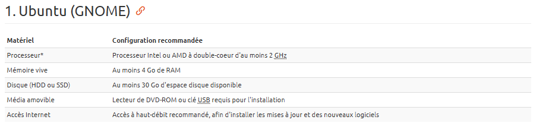
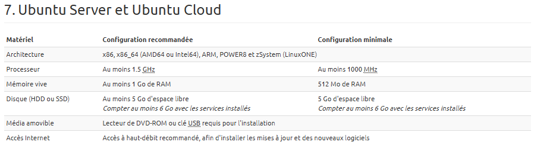
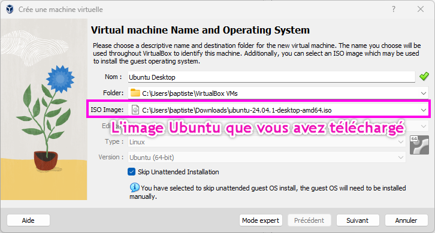
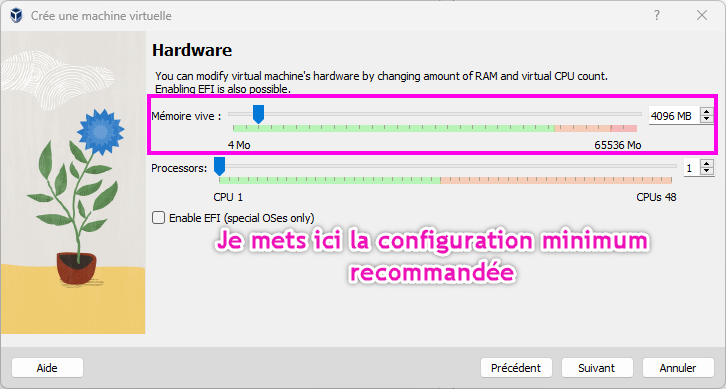
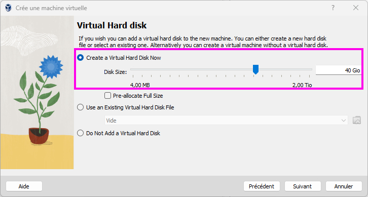
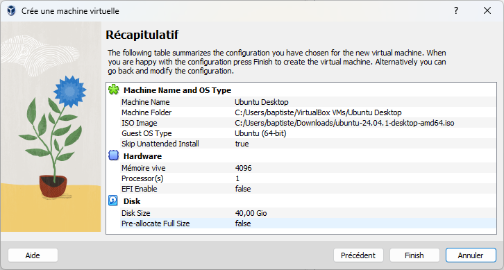
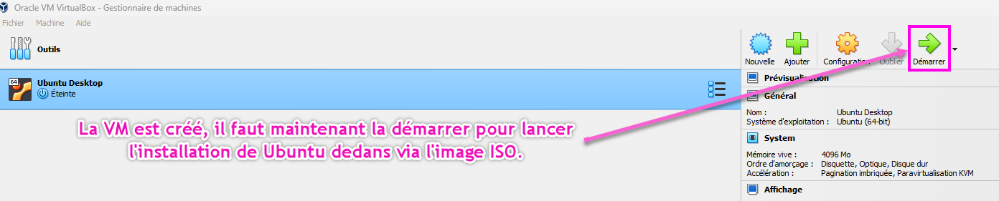
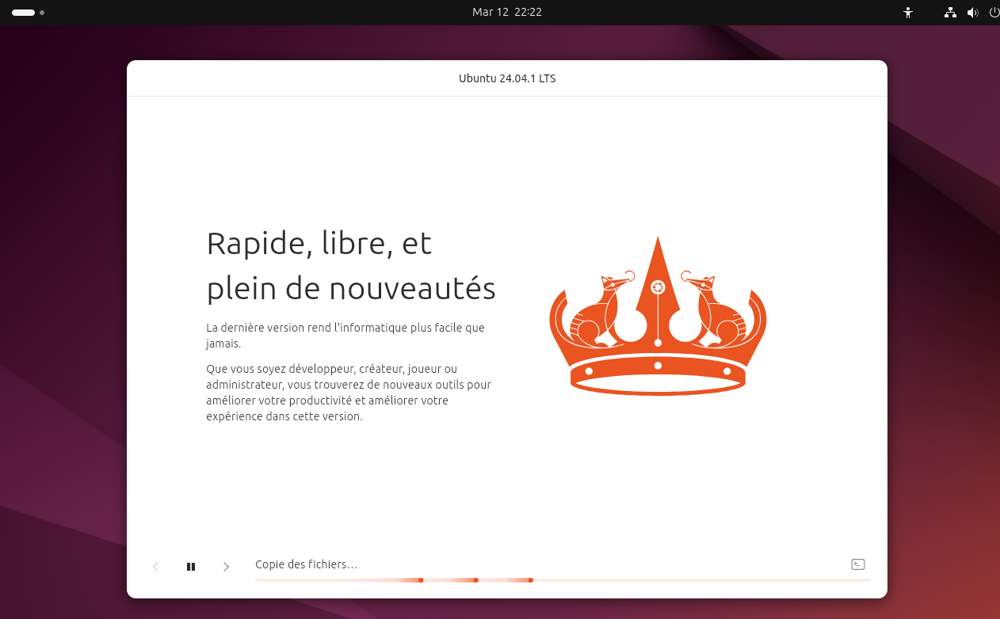

:_chapter:
:_author: Bauer Baptiste
:_duration: 3
:_version_number: 1.0.0
:_version_date: 20/01/2025
[[installation-linux-]]
= Installation de Linux Ubuntu
include::../../../run_app.adoc[]

== Virtualisation de l'environnement Linux

L'installation de la distribution Ubuntu nécessite préalablement la mise en place d'un environnement virtualisé, procédé qui s'inscrit dans les pratiques informatiques contemporaines.

[IMPORTANT]
====
La *virtualisation* constitue un procédé technique permettant de simuler un système informatique autonome au sein d'un système hôte existant.

Cette *machine virtuelle* crée un environnement isolé pour le système d'exploitation souhaité, en l'occurrence Linux, préservant ainsi l'intégrité du système principal.
====

Cette technologie offre la possibilité d'exécuter simultanément plusieurs systèmes d'exploitation. Ainsi, Linux peut être déployé dans une interface Windows et inversement, ou encore un système Linux peut fonctionner au sein d'un autre environnement Linux. Cette approche présente un intérêt considérable pour l'expérimentation de nouveaux systèmes sans compromettre l'architecture existante, caractéristique particulièrement appréciée par les utilisateurs soucieux de sécurité informatique.

La mise en œuvre de cette virtualisation s'effectue par l'intermédiaire d'un hyperviseur, en l'occurrence VirtualBox, reconnu pour son accessibilité et son interface intuitive. Ce logiciel constituera l'objet central de ce chapitre.

[CAUTION]
====
*Attention :* l'implémentation d'un environnement virtualisé requiert la compatibilité du processeur avec les fonctionnalités de virtualisation, ainsi que leur activation préalable. Pour vérifier ces paramètres, il est recommandé de consulter les ressources proposées par https://support.bluestacks.com/hc/fr-fr/articles/115003174386-Comment-puis-je-activer-la-virtualisation-VT-sur-mon-PC-[BlueStacks], qui fournit une documentation détaillée. Les procédures d'activation varient selon les spécificités de votre carte mère.
====

== Préparation de l'environnement de virtualisation

L'allocation des ressources système pour la machine virtuelle doit respecter certains critères techniques :

[NOTE]
====
Pour garantir le fonctionnement optimal de la distribution Ubuntu, il est recommandé de se référer aux https://doc.ubuntu-fr.org/exigences_minimales[spécifications techniques officielles fournies par l'éditeur].
====

Les configurations recommandées sont détaillées ci-après :

Les exigences en termes de ressources système varient selon l'environnement de bureau sélectionné. L'interface Gnome présente une consommation de ressources relativement élevée, bien que ses performances tendent à s'optimiser au fil des versions.

[NOTE]
====
En synthèse, les recommandations de l'éditeur préconisent :

* Un processeur Intel ou AMD bi-cœur cadencé à 2GHz minimum.
* Une mémoire vive d'au moins 4Go.
* Un espace de stockage minimal de 30Go.
====

== Création de la machine virtuelle

La première étape consiste à obtenir le logiciel VirtualBox depuis le https://www.virtualbox.org/[portail officiel].

* Configuration initiale de la machine virtuelle :

* Paramètres matériels :

* Configuration du stockage :

* Synthèse des paramètres :

== Installation de la distribution Ubuntu

[TIP]
====
Il est recommandé de réaliser cette procédure en démonstration interactive avec les participants au cours.
====

== Résumé

* L'hyperviseur constitue l'outil fondamental permettant la virtualisation d'un environnement système.

* Linux peut être déployé sur une infrastructure virtuelle.

* L'allocation des ressources système pour la machine virtuelle Linux doit être adaptée en fonction de la distribution sélectionnée.

* Le processus d'installation d'Ubuntu s'effectue via une interface graphique intuitive et didactique.