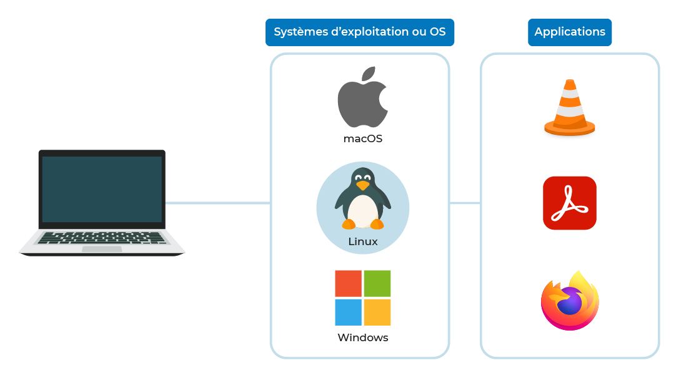
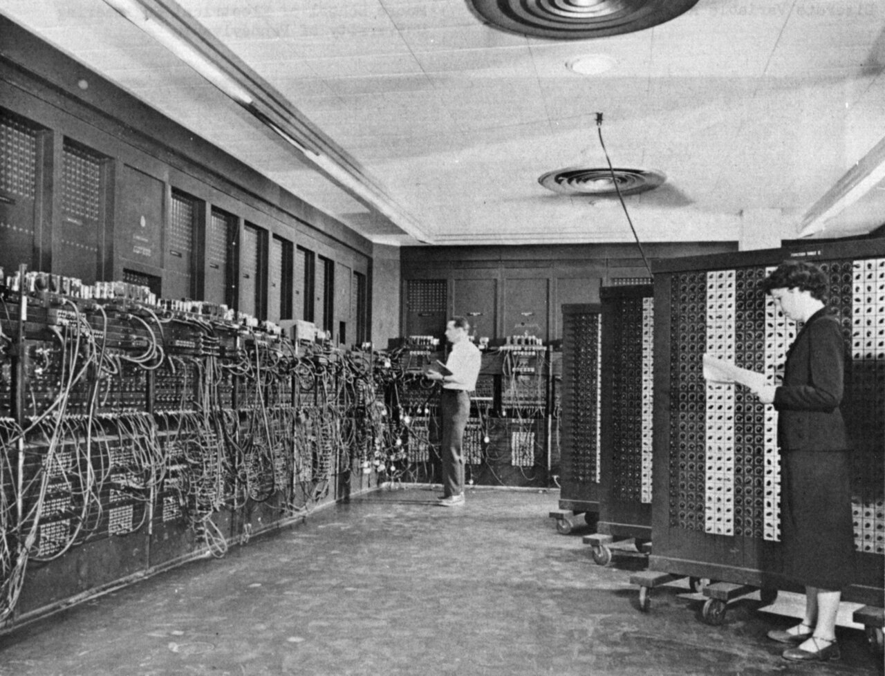
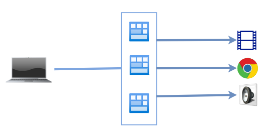
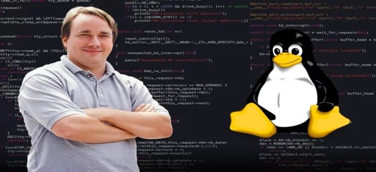
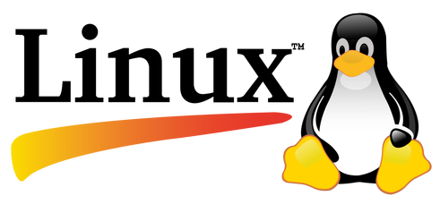

:_chapter:
:_author: Bauer Baptiste
:_duration: 3
:_version_number: 1.0.0
:_version_date: 20/01/2025
[[introduction-linux-initiation]]
= Premiers pas sur linux
include::../../../run_app.adoc[]

== Le rôle fondamental d'un système d'exploitation

Un système d'exploitation constitue la pierre angulaire de tout ordinateur. Tel un chef d'orchestre numérique, il coordonne l'ensemble des composants et fonctions de la machine.

=== Définition et fonction principale

Le système d'exploitation représente l'infrastructure logicielle primordiale qui établit le pont entre l'utilisateur et les composants physiques de l'ordinateur. Sa mission essentielle consiste à orchestrer l'utilisation des différentes ressources matérielles :

* Processeur
* Carte graphique
* Dispositifs de stockage
* Mémoire vive
* Périphériques divers

Cette gestion efficace des ressources matérielles justifie pleinement son appellation de "système d'exploitation".

=== Expérience utilisateur

Grâce au système d'exploitation, l'ordinateur devient véritablement fonctionnel et accessible :

. L'allumage de l'ordinateur déclenche le processus d'initialisation
. Le système d'exploitation s'active et présente l'interface utilisateur
. L'accès aux applications, jeux et programmes divers devient possible via les périphériques d'entrée standard

=== Rôle d'intermédiaire

L'importance cruciale du système d'exploitation réside dans sa capacité à *servir d'intermédiaire entre les logiciels installés et les composants matériels* de l'ordinateur, permettant ainsi une interaction harmonieuse entre ces deux dimensions.

== Particularités distinctives du système Linux

Linux se distingue par sa capacité à offrir une maîtrise approfondie des ressources informatiques à ses utilisateurs, leur conférant une autonomie significative dans la gestion de leur environnement numérique.

=== Autonomisation technologique

La philosophie fondamentale de Linux réside dans la restauration du contrôle utilisateur sur l'infrastructure informatique. Cette approche permet l'implémentation de diverses solutions techniques, notamment :

* Des environnements de calcul optimisés exploitant les capacités des processeurs graphiques contemporains
* Des infrastructures multimédias facilitant la production audiovisuelle
* Des environnements de développement pour la conception d'applications personnalisées

=== Contexte historique

Il convient de noter que Linux, bien qu'opérationnel depuis le début des années 1990, trouve ses fondements conceptuels dans une période antérieure. Une analyse chronologique nous ramène aux années 1970, période formatrice de l'informatique moderne.

Cette contextualisation historique n'est pas accessoire, mais essentielle. L'étude de la genèse et de l'évolution de Linux permet d'appréhender les divergences fondamentales entre ce système et ses homologues propriétaires, notamment Windows.

La compréhension de ces dimensions historiques constitue un prérequis pour saisir pleinement les principes architecturaux et philosophiques qui sous-tendent l'écosystème Linux contemporain.

== Genèse et évolution du système UNIX

=== Contexte historique initial

Dans le contexte technologique des années 1970, l'informatique se caractérisait par l'utilisation d'équipements volumineux occupant des espaces considérables. Ces dispositifs computationnels primitifs présentaient des capacités de traitement significativement inférieures aux technologies mobiles contemporaines, avec une puissance approximativement 100 000 fois moindre qu'un terminal téléphonique actuel, tout en représentant un investissement financier substantiel.

.Les premiers ordinateurs

L'absence d'interfaces graphiques nécessitait l'élaboration de méthodologies d'interaction homme-machine alternatives. Cette problématique conduisit à la conception d'un système permettant l'exploitation de ces infrastructures informatiques via un paradigme d'interaction basé sur des instructions textuelles.

=== Développement initial d'UNIX

Le système d'exploitation UNIX résulte d'une collaboration entre les laboratoires de recherche AT&T et divers constructeurs informatiques, notamment General Electric. Sa dénomination initiale, UNICS, fut ultérieurement simplifiée en UNIX par souci d'optimisation terminologique.

L'architecture conceptuelle d'UNIX repose sur un principe fondamental de spécialisation fonctionnelle : chaque composant du système est conçu pour exécuter une fonction spécifique avec une efficacité optimale. Cette approche modulaire se traduit par:

* La segmentation du code en modules fonctionnels indépendants
* L'établissement de protocoles de communication inter-modulaires standardisés
* L'implémentation d'un principe de responsabilité unique pour chaque composant

À titre d'illustration, la gestion des périphériques de stockage comme un disque dur par exemple s'effectue par l'intermédiaire d'un module dédié exclusivement à cette fonction, auquel les autres composants doivent nécessairement faire appel pour les opérations de lecture et d'écriture.

Unix est codé sous forme de modules, chaque module ayant une fonction spécifique. Cela permet une meilleure organisation du code et une meilleure maintenance.

.Le système d'exploitation UNIX sous forme de module

== Linux : héritier de la tradition UNIX

=== Émergence du mouvement open source

La commercialisation progressive des systèmes informatiques a conduit à l'établissement de régimes de licences restrictives pour les dérivés d'UNIX, chaque fabricant développant sa version propriétaire. Cette fragmentation a généré une tension notable dans la communauté des développeurs, cristallisée autour de la figure de Richard Stallman.

En réaction à cette privatisation des ressources logicielles, Stallman initia en 1983 la Licence Publique Générale (GPL), fondement juridique du mouvement open source. Cette licence garantit :

* La liberté d'utilisation du logiciel
* La possibilité de modification du code source
* Le droit de redistribution des versions dérivées
* L'accessibilité permanente du code source

Cette philosophie d'ouverture a ultérieurement influencé d'autres initiatives majeures, notamment le projet encyclopédique Wikipédia, conceptualisé en 1999 par Stallman lui-même.

=== Genèse et caractéristiques du système Linux

Au début des années 1990, Linus Torvalds entreprit le développement d'un système d'exploitation compatible avec l'architecture des ordinateurs personnels, s'inscrivant dans la lignée d'UNIX tout en adoptant la philosophie open source.

Ce système, dénommé Linux en référence à son créateur et en hommage à UNIX, se distingue par plusieurs caractéristiques fondamentales :

* Filiation directe avec l'architecture UNIX
* Adhésion au principe de spécialisation fonctionnelle des modules
* Distribution sous licence GPL, garantissant sa gratuité et son ouverture

=== Omniprésence contemporaine de Linux

La robustesse et l'adaptabilité de Linux ont conduit à son adoption dans de multiples contextes technologiques, notamment:

* Le système d'exploitation Android pour dispositifs mobiles
* Les équipements de télécommunication résidentielle
* Les systèmes embarqués pour applications spatiales, incluant le robot Ingenuity déployé sur Mars en février 2021

=== Comparaison avec les systèmes propriétaires

Contrairement aux solutions commerciales comme Windows, Linux présente les spécificités suivantes :

* Gratuité d'acquisition et d'utilisation
* Architecture ouverte permettant la personnalisation
* Évolution progressive vers des interfaces utilisateur accessibles, transcendant sa réputation initiale de système réservé aux spécialistes

== Conclusion

Linux constitue l'aboutissement contemporain d'une tradition informatique initiée par UNIX, caractérisée par:

* Une architecture modulaire efficiente
* Une diffusion sous licence libre garantissant son accessibilité
* Une philosophie de conception axée sur l'excellence fonctionnelle de chaque composant

L'écosystème Linux continue son évolution en conciliant robustesse technique et accessibilité, offrant une alternative viable aux systèmes propriétaires pour un spectre croissant d'utilisations.