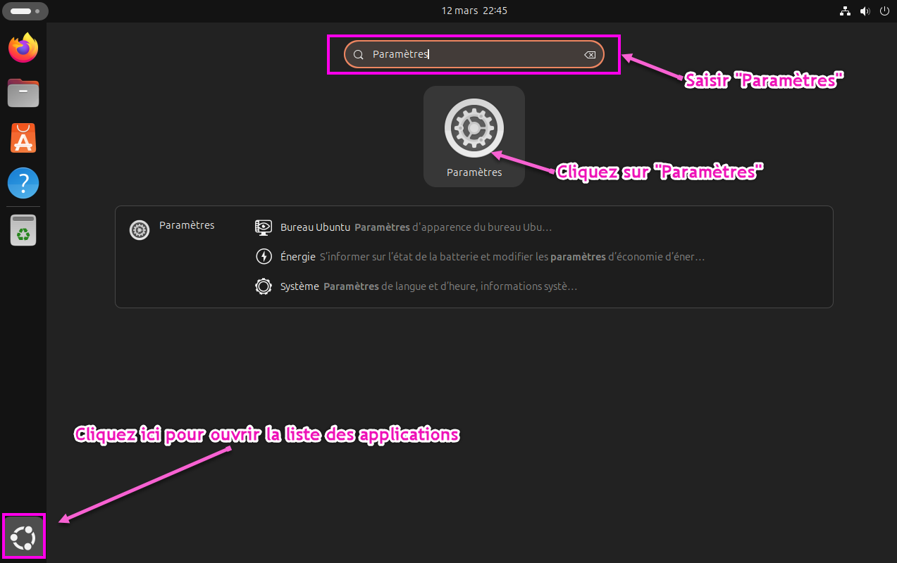

:_chapter:
:_author: Bauer Baptiste
:_duration: 3
:_version_number: 1.0.0
:_version_date: 20/01/2025
[[premiers-pas-linux]]
= Introduction aux réseaux sous Linux
include::../../../run_app.adoc[]

Ce chapitre traite des fondements de la configuration réseau sous le système d'exploitation Ubuntu Linux.

== Configuration du réseau sous Ubuntu

Cette section présente les méthodes de configuration réseau disponibles dans l'environnement Ubuntu afin d'établir une connexion Internet. Deux approches sont possibles : la configuration automatique et la configuration manuelle.

[NOTE]
====
La *configuration automatique* présente un faible niveau de complexité. Il suffit d'adhérer aux indications fournies par l'interface de configuration.

La *configuration manuelle* nécessite la préparation des paramètres réseau suivants :

* Adresse IP ;
* Masque de sous-réseau ;
* Passerelle par défaut ;
* Serveur DNS.
====

La section suivante détaille les méthodes d'obtention de ces paramètres réseau essentiels.

[TIP]
====
Les instructions fournies par votre enseignant constituent une ressource précieuse pour la configuration appropriée de votre environnement réseau.
====

== Systèmes de gestion de paquets

Une fois la connectivité Internet établie sous Ubuntu, il convient d'explorer les fonctionnalités de gestion logicielle.

Le système de gestion de paquets constitue l'une des fonctionnalités distinctives des distributions Linux. Ces paquets logiciels précompilés sont accessibles via une interface de gestion similaire conceptuellement aux mécanismes d'installation logicielle de Windows.

L'utilisation du gestionnaire de paquets offre une méthodologie efficace pour l'installation et la mise à jour des composants logiciels du système.

Cette section présente deux méthodes distinctes pour effectuer des mises à jour système :

. Utilisation de l'interface graphique (GUI)
. Utilisation de l'interface en ligne de commande (CLI)

=== Mise à jour logicielle via l'interface graphique

Cette première méthodologie présente un niveau d'accessibilité supérieur grâce à son interface visuelle intuitive, reproduisant les paradigmes d'interaction familiers aux utilisateurs.

=== Mise à jour logicielle via l'interface en ligne de commande

Cette seconde approche requiert l'utilisation du terminal et l'exécution de commandes spécifiques pour effectuer une mise à jour complète du système.

.Identification des mises à jour disponibles dans le système
[source,bash]
----
sudo apt-get update
----

.Identification des mises à jour pour une application spécifique
[source,bash]
----
sudo apt-get update <nom de l'application>
----

.Application des mises à jour identifiées
[source,bash]
----
sudo apt-get upgrade
----

.Application des mises à jour pour une application spécifique
[source,bash]
----
sudo apt-get upgrade <nom de l'application>
----

L'utilisation de la commande sudo est nécessaire pour certaines opérations système.

[NOTE]
====
La *commande sudo* confère temporairement des *privilèges d'administration* nécessaires à l'exécution de tâches systèmes privilégiées, telles que l'installation de nouveaux logiciels via le système de paquets.
====

Ce mécanisme est comparable aux demandes d'élévation de privilèges dans Windows, avec une différence significative : sudo utilise le mot de passe de l'utilisateur courant sans nécessiter de changement de compte. Cette élévation temporaire des privilèges constitue un élément fondamental de l'architecture de sécurité des systèmes Unix.

=== Installation de logiciels

Une fois les mises à jour système effectuées, l'installation de nouveaux logiciels peut être réalisée selon deux méthodologies :

. Via l'interface graphique du Centre de logiciels Ubuntu
. Via l'interface en ligne de commande

La première option offre une expérience d'utilisation intuitive, particulièrement adaptée aux utilisateurs débutants, permettant la navigation et l'installation à partir d'un catalogue d'applications disponibles.

La seconde option, fonctionnellement équivalente, nécessite l'utilisation du terminal et la connaissance des commandes appropriées.

L'interface en ligne de commande présente des avantages significatifs en termes d'efficacité et d'automatisation des processus. Elle constitue un outil fondamental dans l'environnement Linux, offrant des capacités avancées que les sections suivantes illustreront à travers l'installation d'un gestionnaire de fonds d'écran et d'un lecteur PDF.

==== Option 1 : installez un logiciel via le Store d'Ubuntu

Cette première option permet d'installer des logiciels à partir du Store d'Ubuntu, une interface graphique intuitive offrant une expérience utilisateur simplifiée.

==== Option 2 : installez un logiciel via le terminal de commande

Cette seconde option requiert l'utilisation du terminal de commande et l'exécution de commandes spécifiques pour installer un logiciel.

.Trouver le nom d'un logiciel dans la bibliothèque des logiciels disponibles
[source,bash]
----
sudo apt-cache search <mot-clé>
----

.Installer le logiciel
[source,bash]
----
sudo apt-get install <nom-logiciel>
----

== Naviguer sur Internet

Cette partie aborde les méthodes de navigation sur Internet sous environnement *Linux*, en se concentrant particulièrement sur les navigateurs disponibles et leurs fonctionnalités spécifiques.

=== Diversité des navigateurs sous Linux

Linux offre une grande variété de navigateurs web, chacun présentant des caractéristiques distinctes. Cette section présente les options les plus pertinentes pour les utilisateurs de systèmes Linux.

[NOTE]
====
*Ubuntu* s’installe directement avec Firefox. Il est d’ailleurs open source. Mais ce n’est pas le seul navigateur disponible sous *Linux*.
====

==== Firefox : le navigateur par défaut

Firefox constitue le navigateur web par défaut dans la majorité des distributions Linux, incluant Ubuntu. Ce navigateur open source développé par *Mozilla Foundation* présente plusieurs avantages significatifs :

* Protection de la vie privée renforcée
* Personnalisation avancée via des extensions
* Performances optimisées pour Linux
* Conformité aux standards web contemporains

[NOTE]
====
*Firefox* synchronise efficacement les données entre différents appareils (favoris, historique, mots de passe) via un compte *Mozilla*, facilitant ainsi une expérience utilisateur cohérente entre les plateformes.
====

==== Chromium : l'alternative open source

Chromium représente la version open source du navigateur Chrome de Google. Il offre des fonctionnalités similaires tout en respectant davantage les principes du logiciel libre.

.Installation de Chromium via le terminal
[source,bash]
----
sudo apt install chromium-browser
----

==== Autres navigateurs disponibles

Plusieurs alternatives méritent d'être considérées selon les besoins spécifiques des utilisateurs :

* *Opera* : Navigateur offrant un VPN intégré et des fonctionnalités de gestion de médias avancées
* *Brave* : Centré sur la protection de la vie privée et le blocage de publicités
* *Vivaldi* : Hautement personnalisable avec des fonctionnalités avancées pour utilisateurs expérimentés
* *Falkon* : Navigateur léger basé sur QtWebEngine, parfaitement intégré à l'environnement KDE

==== Considérations de sécurité

La navigation sécurisée sous Linux implique plusieurs aspects à considérer :

* Maintenir le navigateur et ses extensions à jour
* Vérifier les connexions HTTPS avant de transmettre des informations sensibles
* Utiliser des gestionnaires de mots de passe intégrés pour générer et stocker des identifiants robustes
* Activer la protection contre le pistage dans les paramètres du navigateur

[WARNING]
====
Même si Linux est généralement moins vulnérable aux logiciels malveillants que d'autres systèmes d'exploitation, les menaces web demeurent pertinentes indépendamment de la plateforme utilisée.
====

=== Navigation en ligne de commande

Linux offre également des options de navigation textuelle via le terminal, particulièrement utiles pour les serveurs sans interface graphique ou les connexions à distance.

.Navigateurs web en ligne de commande
[source, bash]
----
# Installation de lynx
sudo apt install lynx

# Installation de w3m
sudo apt install w3m

# Installation de links
sudo apt install links
----

.Exemple d'utilisation de lynx
[source,bash]
----
lynx https://linux.org
----

Ces outils permettent d'accéder au contenu web dans des environnements où les interfaces graphiques ne sont pas disponibles ou souhaitables.

== Configurez Linux pour développer

Cette section présente les méthodes et outils essentiels pour configurer un environnement de développement optimal sous Linux, en abordant les différents langages de programmation, éditeurs de code et outils de gestion de versions.

=== Installation des outils fondamentaux de développement

Avant d'aborder des langages de programmation spécifiques, il est nécessaire d'installer certains outils fondamentaux qui constituent la base d'un environnement de développement sous Linux.

=== Compilation et build systems

Les outils de compilation et de construction sont essentiels pour transformer le code source en programmes exécutables.

.Installation des outils de compilation essentiels
[source, bash]
----
sudo apt install build-essential
----

Cette commande installe un ensemble complet d'outils incluant:

* GCC (GNU Compiler Collection)
* G++ (compilateur C++)
* Make (utilitaire de construction)
* Librairies de développement essentielles

[NOTE]
====
Le package `build-essential` constitue une dépendance fondamentale pour la compilation de nombreux logiciels à partir des sources. Son installation est recommandée même pour les développeurs qui n'utilisent pas directement C ou C++.
====

=== Environnements de développement intégrés

Plusieurs environnements de développement intégrés (IDE) sont disponibles sous Linux, offrant des fonctionnalités avancées pour faciliter le processus de développement.

.IDEs populaires sous Linux
[options="header"]
|===
|IDE|Langages supportés|Commande d'installation
|Visual Studio Code|Multi-langage|`sudo apt install code`
|Eclipse|Java, C/C++, PHP|`sudo snap install eclipse`
|IntelliJ IDEA|Java, Kotlin|`sudo snap install intellij-idea-community`
|PyCharm|Python|`sudo snap install pycharm-community`
|===

=== Configuration pour les langages de programmation spécifiques

Cette section détaille la configuration d'environnements de développement pour différents langages de programmation couramment utilisés.

==== Python

Python constitue l'un des langages les plus populaires, particulièrement adapté au développement web, à l'analyse de données et à l'intelligence artificielle.

.Installation de Python et des outils associés
[source, bash]
----
#Installation de Python 3 et pip
sudo apt install python3 python3-pip

#Installation de l'environnement virtuel
sudo apt install python3-venv

#Installation d'outils de développement Python
sudo apt install python3-dev
----

La création d'environnements virtuels est recommandée pour isoler les dépendances de différents projets.

.Création et activation d'un environnement virtuel
[source, bash]
----
# Création d'un environnement virtuel
python3 -m venv mon_environnement

# Activation de l'environnement virtuel
source mon_environnement/bin/activate
----

[TIP]
====
L'utilisation d'environnements virtuels constitue une bonne pratique en développement Python, permettant d'éviter les conflits de dépendances entre projets et facilitant la reproductibilité des environnements.
====

==== Java

Java demeure un langage essentiel dans le développement d'applications d'entreprise, d'applications Android et de systèmes distribués.

.Installation du JDK (Java Development Kit)
[source, bash]
----
# Installation d'OpenJDK
sudo apt install default-jdk
# Vérification de l'installation
java -version
javac -version
----

Le développement web moderne nécessite l'installation de *Node.js* et de ses outils associés.

==== Node

.Installation de Node.js et npm
[source, bash]
----
# Installation via apt
sudo apt install nodejs npm

ou

# Alternative : installation via NVM (Node Version Manager)

curl -o- https://raw.githubusercontent.com/nvm-sh/nvm/v0.39.0/install.sh | bash
source ~/.bashrc
nvm install --lts

----

==== Git

Le contrôle de version constitue un aspect fondamental du développement logiciel moderne, permettant la collaboration efficace et le suivi des modifications.

.Installation et configuration de Git
[source, bash]
----
# Installation de Git
sudo apt install git

# Configuration initiale
git config --global user.name "Votre Nom"
git config --global user.email "votre.email@domaine.com"

# Génération d'une clé SSH pour GitHub/GitLab
ssh-keygen -t ed25519 -C "votre.email@domaine.com"

----

Plusieurs interfaces graphiques facilitent l'utilisation de Git pour les développeurs préférant une approche visuelle.

.Installation d'interfaces graphiques pour Git
[source, bash]
----
# GIT KRAKEN
wget https://release.gitkraken.com/linux/gitkraken-amd64.deb
sudo dpkg -i gitkraken-amd64.deb

# GIT COLA
sudo apt install git-cola
----

==== Shells alternatifs boostés

.Installation de Zsh
[source, bash]
----
# Un terminal qui intégre de l'IA
sudo apt install zsh
----

.Installation de Oh My Zsh (framework de configuration pour Zsh)
[source, bash]
----
sh -c "$(curl -fsSL https://raw.github.com/ohmyzsh/ohmyzsh/master/tools/install.sh)"
----