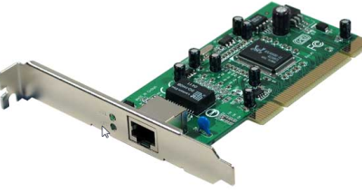

:_exercise:
[[bases_reseau_qcm1]]
= QCM de validation des principes de base de la communication en réseau
include::../../../../../run_app.adoc[]

[.question]
****
*Q{counter:_question})*
La carte réseau suivante permet de connecter :

* [ ] Câble fibre optique
* [ ] Ondes radio
* [ ] Câble cuivre à paires torsadées

//end question
****

// ---------- answer
ifeval::[{_show_correction} == 1]
[.answer]
****
_Correction de Q{_question}_

* [x] Câble fibre optique

****
endif::[]

ifeval::[{_show_correction} == 0]
[.discreet]#_réponse *{_question}* disponible._#
endif::[]
//  end answer ----------

[.question]
****
*Q{counter:_question})*
La carte réseau suivante permet de connecter :

* [ ] Câble fibre optique
* [ ] Ondes radio
* [ ] Câble cuivre à paires torsadées

//end question
****

// ---------- answer
ifeval::[{_show_correction} == 1]
[.answer]
****
_Correction de Q{_question}_

* [x] Câble cuivre à paires torsadées

****
endif::[]
ifeval::[{_show_correction} == 0]
[.discreet]#_réponse *{_question}* disponible._#
endif::[]
//  end answer ----------

[.question]
****
*Q{counter:_question})*
La carte réseau suivante permet de connecter :

* [ ] Câble fibre optique
* [ ] Ondes radio
* [ ] Câble cuivre à paires torsadées
//end question
****

// ---------- answer
ifeval::[{_show_correction} == 1]
[.answer]
****
_Correction de Q{_question}_

* [x] Ondes radio
****
endif::[]
ifeval::[{_show_correction} == 0]
[.discreet]#_réponse *{_question}* disponible._#
endif::[]
//  end answer ----------

[.question]
****
*Q{counter:_question})*
Associez l'élément d'interconnexion à la définition qui lui correspond.

`Le routeur` - `Le concentrateur` - `Le commutateur`
[cols="1,1"]
|===

|C'est un élément qui permet d'interconnecter les hôtes dans un réseau local. Un message émis par un hôte qui lui est connecté est systématiquement envoyé à tous les hôtes du réseau.
|

|C'est un élément qui permet d'interconnecter les hôtes dans un réseau local. Il met en relation les seuls hôtes concernés par l’échange.
|

|C'est un élément qui permet d'interconnecter des réseaux logiques.
|
|===

//end question
****

// ---------- answer
ifeval::[{_show_correction} == 1]
[.answer]
****
_Correction de Q{_question}_

[cols="1,1"]
|===

|C'est un élément qui permet d'interconnecter les hôtes dans un réseau local. Un message émis par un hôte qui lui est connecté est systématiquement envoyé à tous les hôtes du réseau.
| `Le concentrateur`

|C'est un élément qui permet d'interconnecter les hôtes dans un réseau local. Il met en relation les seuls hôtes concernés par l’échange.
| `Le commutateur`

|C'est un élément qui permet d'interconnecter des réseaux logiques.
| `Le routeur`
|===

****
endif::[]
ifeval::[{_show_correction} == 0]
[.discreet]#_réponse *{_question}* disponible._#
endif::[]
//  end answer ----------

[.question]
****
*Q{counter:_question})*
À quoi sert la table MAC/PORT d'un commutateur ?

* [ ] Elle sert à faire l'association entre l'adresse MAC de la carte réseau destinataire du message et son adresse IP.

* [ ] Elle sert à faire l'association entre un port du commutateur et une adresse MAC de manière à ce que le commutateur aiguille le message vers la bonne carte réseau.
* [ ] Elle sert à faire l'association entre un port du commutateur et l'adresse IP d'une carte réseau.

* [ ] Elle ne sert pas à grand chose s’il n'y a qu'un seul commutateur. 

//end question
****

// ---------- answer
ifeval::[{_show_correction} == 1]
[.answer]
****
_Correction de Q{_question}_

* [x] Elle sert à faire l'association entre un port du commutateur et une adresse MAC de manière à ce que le commutateur aiguille le message vers la bonne carte réseau.
****
endif::[]
ifeval::[{_show_correction} == 0]
[.discreet]#_réponse *{_question}* disponible._#
endif::[]
//  end answer ----------

[.question]
****
*Q{counter:_question})*
Quelles affirmations définissent correctement l’adresse MAC (deux réponses correctes) ?

* [ ] Les adresses MAC servent à identifier une carte réseau dans le monde.
* [ ] Les adresses MAC contiennent un numéro de réseau et une identification d’hôte unique.
* [ ] Les adresses MAC sont des adresses physiques.
* [ ] Les adresses MAC sont toujours attribuées à des périphériques réseau par un administrateur réseau.

//end question
****

// ---------- answer
ifeval::[{_show_correction} == 1]
[.answer]
****
_Correction de Q{_question}_

* [x] Les adresses MAC servent à identifier une carte réseau dans le monde.
* [x] Les adresses MAC sont des adresses physiques.

****
endif::[]
ifeval::[{_show_correction} == 0]
[.discreet]#_réponse *{_question}* disponible._#
endif::[]
//  end answer ----------

[.question]
****
*Q{counter:_question})*
Quelle adresse une carte réseau utilise-t-elle lorsqu’elle décide de lire ou non une trame ?

* [ ] L’adresse IP d’origine
* [ ] L’adresse MAC d’origine
* [ ] L’adresse IP de destination
* [ ] L’adresse MAC de destination
//end question
****

// ---------- answer
ifeval::[{_show_correction} == 1]
[.answer]
****
_Correction de Q{_question}_

* [x] L’adresse MAC de destination

****
endif::[]
ifeval::[{_show_correction} == 0]
[.discreet]#_réponse *{_question}* disponible._#
endif::[]
//  end answer ----------

[.question]
****
*Q{counter:_question})*
Lesquelles de ces affirmations sont exactes (trois réponses correctes) ?.

* [ ] L'adresse MAC d'une machine est configurée à l'installation de la carte réseau
* [ ] Un commutateur se sert de l'adresse MAC du destinataire pour transmettre une trame *unicast* sur le bon port
* [ ] Un commutateur mémorise dans sa table d’adresse MAC/PORT toutes les adresses MAC des cartes réseaux qu'il met en relation.
* [ ] Une carte réseau lit tous les messages qui arrivent sur le port sur lequel elle est connectée
* [ ] Entre deux réseaux logiques différents, il faut passer par un routeur pour communiquer
* [ ] Deux hôtes connectés sur un même commutateur peuvent forcément communiquer

//end question
****

// ---------- answer
ifeval::[{_show_correction} == 1]
[.answer]
****
_Correction de Q{_question}_

* [x] Un commutateur se sert de l'adresse MAC du destinataire pour transmettre une trame *unicast* sur le bon port
* [x] Un commutateur mémorise dans sa table d’adresse MAC/PORT toutes les adresses MAC des cartes réseaux qu'il met en relation.
* [x] Entre deux réseaux logiques différents, il faut passer par un routeur pour communiquer
****
endif::[]
ifeval::[{_show_correction} == 0]
[.discreet]#_réponse *{_question}* disponible._#
endif::[]
//  end answer ----------

[.question]
****
*Q{counter:_question})*
Quel est l'élément qui permet d'interconnecter plusieurs réseaux logiques ?

* [ ] Le commutateur
* [ ] Le concentrateur
* [ ] Le routeur
* [ ] Le scanner

//end question
****

// ---------- answer
ifeval::[{_show_correction} == 1]
[.answer]
****
_Correction de Q{_question}_

* [x] Le routeur
****
endif::[]
ifeval::[{_show_correction} == 0]
[.discreet]#_réponse *{_question}* disponible._#
endif::[]
//  end answer ----------

[.question]
****
*Q{counter:_question})*
Quel est l'élément qui permet d'interconnecter des postes dans un même réseau logique ?

* [ ] Le commutateur
* [ ] Le concentrateur
* [ ] Le routeur
* [ ] Le scanner

//end question

****

// ---------- answer
ifeval::[{_show_correction} == 1]
[.answer]
****
_Correction de Q{_question}_

* [x] Le commutateur

****
endif::[]
ifeval::[{_show_correction} == 0]
[.discreet]#_réponse *{_question}* disponible._#
endif::[]
//  end answer ----------

[.question]
****
*Q{counter:_question})*
Quel est ou quels sont les éléments de configuration d'une carte réseau indispensables pour qu'un hôte puisse se connecter à Internet et naviguer sur le Web ?

* [ ] Adresse IP
* [ ] Adresse IP et masque de réseau
* [ ] Adresse IP, masque de réseau et passerelle
* [ ] Adresse IP, masque de réseau, passerelle et serveur DNS

//end question
****

// ---------- answer
ifeval::[{_show_correction} == 1]
[.answer]
****
_Correction de Q{_question}_

* [x] Adresse IP, masque de réseau, passerelle et serveur DNS
****
endif::[]
ifeval::[{_show_correction} == 0]
[.discreet]#_réponse *{_question}* disponible._#
endif::[]
//  end answer ----------

