:_chapter:

[[bases-reseau]]
= Principes de base de la communication réseau
:_author: Bauer Baptiste
:_duration: 3
:_version_number: 1.0.0
:_version_date: 20/01/2025
include::../../../run_app.adoc[]

== Préambule

Dans cette section, nous explorerons les bases essentielles de la communication au sein des réseaux informatiques. L'objectif est de comprendre comment les informations circulent entre les différents composants d'un réseau.

Les compétences visées dans ce chapitre sont les suivantes :

- Identifier les principaux composants d'un réseau informatique.
- Expliquer les caractéristiques essentielles de chaque composant.
- Définir le rôle de chaque dispositif d'interconnexion.
- Apprendre à connecter les éléments entre eux de manière optimale.
- Se familiariser avec les concepts et termes fondamentaux liés aux réseaux.

[.skill]
****
{_bloc_skill_label2}

* [x] Caractériser les éléments d’interconnexion d’un réseau

//end skill
****

[.skill]
****
{_bloc_skill_label3}

* [x] Modèles de référence associés aux architectures réseaux
* [x] Rôle et positionnement des éléments d'interconnexion dans les modèles de référence

//end skill
****

==  Contexte

.Voici une représentation simplifiée d'un environnement réseau
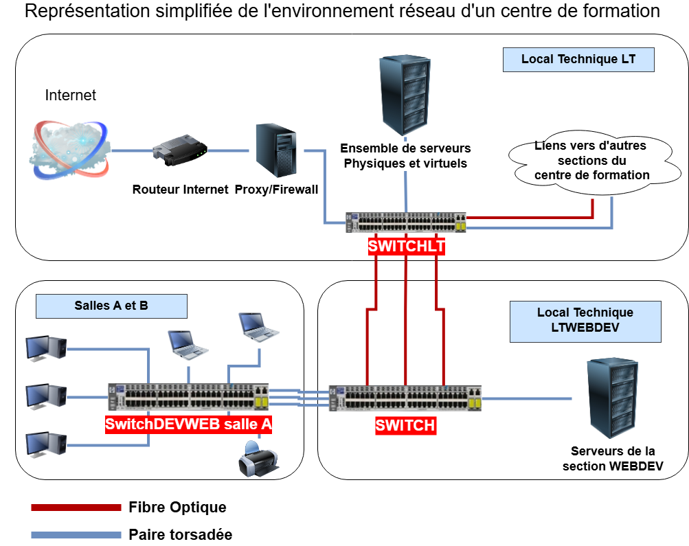

Dans un réseau informatique, plusieurs composants interagissent pour permettre la communication et l'échange d'informations. Ces éléments se répartissent en différentes catégories :

Un hôte{empty}footnote:[Un hôte est un dispositif capable d'envoyer et de recevoir des données via un réseau.] désigne tout dispositif connecté directement au réseau. Ces équipements, également appelés STA (_station_), incluent notamment :

- Ordinateurs de bureau et portables
- Smartphones et tablettes
- Imprimantes connectées
- Télévisions intelligentes
- Scanners réseau

Les hôtes jouent un rôle central dans l'émission et la réception des informations au sein d'un réseau.

Les hôtes ne fonctionnent pas isolément. Ils sont reliés entre eux par des équipements et des supports spécifiques :

1. **Éléments actifs d'interconnexion** :
- *Concentrateurs (hubs)* : Simplifient la connexion des dispositifs, bien qu'ils soient de moins en moins utilisés.
- *Commutateurs (switches)* : Optimisent la transmission des données en dirigeant les paquets vers leur destination spécifique.
- *Points d'accès (AP)* : Permettent aux dispositifs de se connecter à un réseau sans fil.
- *Routeurs* : Gèrent la communication entre différents réseaux.

2. **Médias de transmission (supports réseau)** :
- *Câbles* : Incluent les câbles Ethernet (cuivre) pour les connexions filaires.
- *Fibres optiques* : Fournissent une transmission rapide et sur de longues distances.
- *Ondes radio* : Utilisées pour les connexions sans fil, notamment via le Wi-Fi, la 4G/5G ou le Bluetooth.

Chaque élément joue un rôle essentiel dans l'infrastructure réseau, garantissant une communication fluide entre les différents dispositifs.

== Médias et matériel d’interconnexion

Pour qu’une communication puisse avoir lieu dans un réseau informatique, trois éléments sont indispensables : un _émetteur_, un _récepteur_ et un _support de transmission_.

C'est la même chose dans le monde réel. Pour que vous puissiez parler à quelqu'un, il faut que vous soyez à proximité, que vous parliez et que l'autre personne vous entende. Dans un réseau informatique, c'est la même chose. Il faut un émetteur, un récepteur et un support de transmission.

=== Cartes réseaux, câbles et ondes

Dans un réseau informatique, les *émetteurs* et *récepteurs* sont représentés par les cartes réseau. Ces composants électroniques assurent la communication en permettant à un ordinateur de *transmettre* et de *recevoir* des informations via un média réseau.

La *carte réseau* joue un rôle essentiel en servant d’interface entre l’ordinateur et le support de transmission (câble réseau ou autre). Elle peut être intégrée directement à la carte mère, ou ajoutée ultérieurement dans un connecteur d’extension (slot) prévu à cet effet dans l’ordinateur.

.Carte Ethernet RJ45
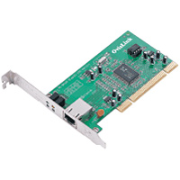

.Carte Wifi PCI

.Carte Wifi USB
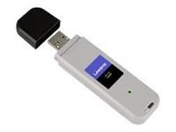

.Carte fibre optique PCI
image::images/carte_fibre.png[width=300]

[TIP]
====
L'*interface réseau* est dotée d’une interface de connexion différente selon le type de câble (_support de transmission_) qui va lui être connecté :

* Interface RJ45
* Interface fibre
* Antenne wifi

====

Il existe plusieurs types de câbles, chacun ayant un usage différent.

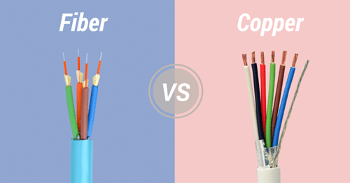

Pour le câblage des réseaux à l'intérieur des bâtiments, on utilise généralement des câbles à _paires torsadées_ de type FTP (_Foiled Twisted Pair_). Ces câbles sont composés de huit fils de cuivre regroupés par paires torsadées, une configuration qui réduit les interférences électromagnétiques.

.Câble Ethernet
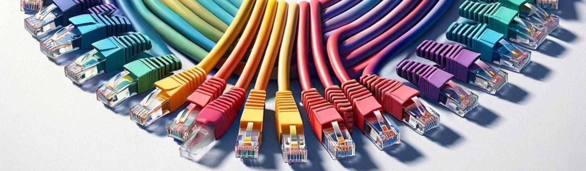

La performance des câbles dépend de leur catégorie, qui détermine leur capacité maximale en termes de débit et de fréquence. Les principales catégories rencontrées, selon la date d'installation, sont les suivantes :

* *Catégorie 5 (Cat.5)* : prise en charge d’un débit allant jusqu'à 100 Mbits/s.
* *Catégorie 6 (Cat.6)* : capacité maximale de 1 Gbits/s.
* *Catégorie 7 (Cat.7)* : permet des débits jusqu'à 10 Gbits/s.

Ces évolutions reflètent les besoins croissants en vitesse de transmission et en fiabilité dans les réseaux modernes.

.Coupe d'un câble Ethernet
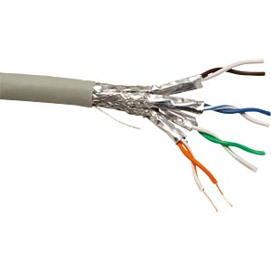

Seules deux paires sont utilisées : une pour l'émission des données et l'autre pour la réception.
Le câblage en cuivre utilise les signaux électriques pour transmettre les données entre les périphériques.

[.question]
****
*Q{counter:_question})*
Dans le cadre du centre de formation dont le schéma est présenté en _Figure 1_ , Quel est l'usage de ce type de câble (FTP catégorie 6) ?
//end question
****

// ---------- answer
ifeval::[{_show_correction} == 1]
[.answer]
****
_Correction de Q{_question}_

Le câble FTP Cat.6 est utilisé pour le câblage des réseaux à l'intérieur des bâtiments. Il permet de garantir une transmission rapide et fiable des données, avec un débit maximal de 1 Gbits/s.

Dans le cadre du centre de formation, ce type de câble est utilisé pour relier les différents équipements entre eux, assurant une communication fluide et efficace au sein du réseau.

* Pour relier un poste de travail au commutateur via des prises murales par exemple.

* Pour relier deux élèments d'interconnexion entre eux.

* Pour relier un sous-répartiteur (*SR*) à un répartiteur général dans le local technique (*RG*), dans certaines conditions : à l'intérieur d'un bâtiment et si la distance n'est pas trop grande.

****
endif::[]
ifeval::[{_show_correction} == 0]
[.discreet]#_réponse *{_question}* disponible._#
endif::[]

[WARNING]
====
Attention, ce type de câble, peu coûteux et facile d'installation est sensible aux perturbations électromagnétiques. Il est donc recommandé de l'éloigner des sources de perturbations (câbles électriques, appareils électroniques, etc.) et surtout, il est recommandé de ne pas l'utiliser sur de longues distances. (Au-delà de 100m, le signal s'atténue).
====

Pour relier deux commutateurs entre différents bâtiments, ou parfois à l'intérieur d'un même bâtiment (notamment entre le SR et le RG), on utilise généralement de la fibre optique.

La fibre optique est un fil extrêmement fin et flexible, composé de verre ou parfois de plastique, comparable à l'épaisseur d'un cheveu. Elle permet la transmission des données sous forme d'ondes lumineuses, offrant ainsi des débits très élevés et une grande résistance aux interférences électromagnétiques.

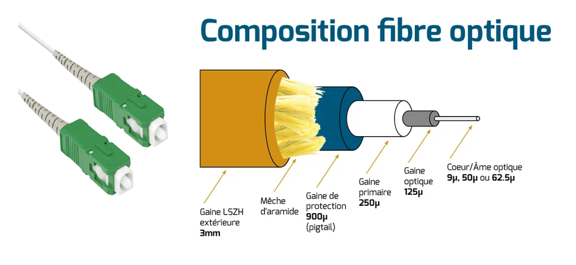

[.question]
****
*Q{counter:_question})*
D'après la _figure 1_, quel est l'usage de ce type de câble (fibre optique) dans le réseau de du centre de formation ?
//end question
****

// ---------- answer
ifeval::[{_show_correction} == 1]
[.answer]
****
_Correction de Q{_question}_
Pour relier le local technique général au local technique de la section WEBDEV du centre de formation.

****
endif::[]
ifeval::[{_show_correction} == 0]
[.discreet]#_réponse *{_question}* disponible._#
endif::[]
//  end answer ----------

En complément du réseau local câblé, il est également possible d’utiliser un support de transmission sans fil, particulièrement dans les lieux publics équipés de hotspots.

Le WiFi (_Wireless Fidelity_) est une technologie de communication sans fil qui permet de transporter des données à travers des ondes radio. Cette transmission se fait généralement sur des bandes de fréquences spécifiques, notamment 2,4 GHz et 5 GHz, offrant une solution flexible et pratique pour se connecter au réseau sans nécessiter de câblage physique.

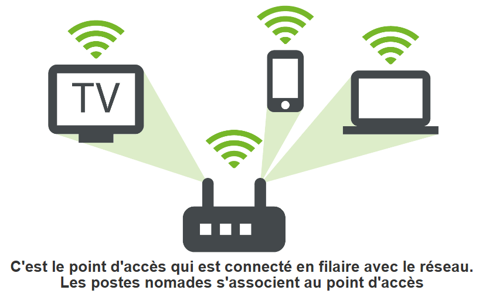

Pour permettre la communication entre les postes d’un réseau, ceux-ci doivent être connectés entre eux, que ce soit par des connexions filaires ou sans fil. Cette interconnexion repose sur des équipements spécifiques, parmi lesquels on distingue les principaux éléments suivants :

. *Le concentrateur (hub)* : désormais considéré comme obsolète, il servait à connecter plusieurs appareils en diffusant les données reçues à tous les ports.
. *Le commutateur (switch)* : un équipement plus avancé qui transmet les données uniquement à l’appareil destinataire, optimisant ainsi la bande passante.
. *Le routeur* : il gère la communication entre différents réseaux, en acheminant les paquets de données vers leur destination finale.
. **Le point d’accès (access point) **: utilisé pour connecter des dispositifs sans fil (WiFi) au réseau local.

=== Le concentrateur (hub) et l'adresse MAC

Le *concentrateur* (_hub_ en anglais) permet d’établir une topologie en *étoile*. Chaque ordinateur du réseau est connecté à l’un des ports de communication du concentrateur. Le nombre de ports disponibles varie en fonction du modèle de concentrateur utilisé, ce qui détermine sa capacité à connecter plusieurs dispositifs simultanément.

.Topologies de réseaux
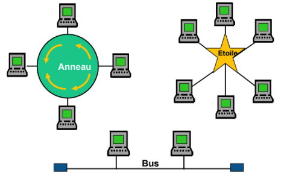

À partir du logiciel "_Simulateur réseau_", Ajoutez un concentrateur à votre réseau et connectez-le à plusieurs stations. Afin de reproduire cette architecture réseau :

.Un hub et ses stations de travail
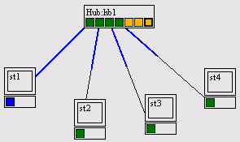

Demandez ensuite à la station _st1_ d'envoyer un message à la station _st2_.
Vous verrez le parcours du message dans le réseau en bleu.

[.question]
****
*Q{counter:_question})*
Comment le concentrateur fonctionne-t-il ?
//end question
****

// ---------- answer
ifeval::[{_show_correction} == 1]
[.answer]
****

_Correction de Q{_question}_

Le *concentrateur* fonctionne en répétant les signaux reçus sur l’un de ses ports vers l’ensemble des autres ports.

Ainsi, lorsqu’un ordinateur envoie un message, ce dernier est transmis simultanément à tous les autres appareils du réseau, sans distinction. Cette diffusion, appelée broadcast, peut engendrer des collisions de données dans les réseaux à forte activité, ce qui explique pourquoi les concentrateurs sont aujourd’hui largement remplacés par des commutateurs.

****
endif::[]
ifeval::[{_show_correction} == 0]
[.discreet]#_réponse *{_question}* disponible._#
endif::[]
//  end answer ----------

[.question]
****
*Q{counter:_question})*
Qu’est-ce qu’une adresse MAC ? Quelle est son utilité ?
//end question
****

// ---------- answer
ifeval::[{_show_correction} == 1]
[.answer]
****
_Correction de Q{_question}_

*Une adresse MAC* (Media Access Control) est un identifiant unique au niveau mondial, attribué à chaque carte réseau. Ce "code" distinctif permet d’identifier de manière précise un dispositif sur un réseau.

Lorsqu’un message est transmis au sein d’un réseau, l’adresse MAC permet de déterminer l’émetteur et le destinataire, assurant ainsi une communication efficace entre les appareils. Chaque adresse MAC est composée de 48 bits, généralement représentés sous la forme de 12 caractères hexadécimaux (par exemple : 00:1A:2B:3C:4D:5E).
****
endif::[]
ifeval::[{_show_correction} == 0]
[.discreet]#_réponse *{_question}* disponible._#
endif::[]
//  end answer ----------

[.question]
****
*Q{counter:_question})*
Comment le destinataire sait-il que le message appelé *trame* lui est adressé ?
//end question
****

// ---------- answer
ifeval::[{_show_correction} == 1]
[.answer]
****
_Correction de Q{_question}_

Chaque carte réseau est associée à une adresse unique appelée adresse physique ou adresse MAC (_Medium Access Control_).

Lorsqu’un message circule sur le réseau, son en-tête contient deux informations essentielles :

* L’adresse MAC de l’émetteur, qui identifie la source du message.
* L’adresse MAC du destinataire, qui désigne l’appareil auquel le message est destiné.

Ce fonctionnement peut être comparé à un courrier postal :

l’en-tête du message agit comme une enveloppe indiquant l’expéditeur et le destinataire. Seule la carte réseau correspondant à l’adresse MAC du destinataire interprète et lit le message, garantissant ainsi une communication ciblée et efficace.

****
endif::[]
ifeval::[{_show_correction} == 0]
[.discreet]#_réponse *{_question}* disponible._#
endif::[]
//  end answer ----------

[.question]
****
*Q{counter:_question})*
À quel moment un hôte, via sa carte réseau, lit-il un message ?
//end question
****

// ---------- answer
ifeval::[{_show_correction} == 1]
[.answer]
****
_Correction de Q{_question}_

Une carte réseau ne lit un message que si l’adresse de destination indiquée dans l’en-tête correspond à son adresse MAC ou si le message est un message de _diffusion (broadcast)_.

Dans le cas d’un message de diffusion, une adresse MAC spéciale est utilisée dans l’en-tête, permettant à toutes les cartes réseau du réseau de recevoir et de lire le message. Ce mécanisme est essentiel pour certaines communications générales, comme la découverte de périphériques ou la transmission d’informations à l’ensemble du réseau.
****
endif::[]
ifeval::[{_show_correction} == 0]
[.discreet]#_réponse *{_question}* disponible._#
endif::[]
//  end answer ----------

[.question]
****
*Q{counter:_question})*
Quels sont les deux types de messages (trames) que l’on peut envoyer sur le réseau ?
//end question
****

// ---------- answer
ifeval::[{_show_correction} == 1]
[.answer]
****
_Correction de Q{_question}_

* *Message unicast :* message destiné à un seul destinataire.
* *Message broadcast* (ou message de diffusion) : message destiné à tous les postes du réseau.
****
endif::[]
ifeval::[{_show_correction} == 0]
[.discreet]#_réponse *{_question}* disponible._#
endif::[]
//  end answer ----------

[.question]
****
*Q{counter:_question})*
Quelle est, selon vous, la limite principale du concentrateur ?
//end question
****

// ---------- answer
ifeval::[{_show_correction} == 1]
[.answer]
****
_Correction de Q{_question}_

Le *concentrateur*, ne disposant pas d’informations sur l’emplacement exact du destinataire, transmet le message à tous les postes du réseau. Ce processus repose sur le principe de la diffusion (*broadcast*), où toutes les cartes réseau reçoivent le message, qu’elles soient concernées ou non.

Cette méthode de transmission, bien que simple, entraîne une augmentation significative du trafic réseau, ce qui peut nuire aux performances, en particulier dans des environnements à forte activité. C’est l’une des principales raisons pour lesquelles les concentrateurs ont été remplacés par des dispositifs plus efficaces, comme les commutateurs.

****
endif::[]
ifeval::[{_show_correction} == 0]
[.discreet]#_réponse *{_question}* disponible._#
endif::[]
//  end answer ----------

[IMPORTANT]
====
Aujourd'hui, il reste très peu , voir plus du tout de concentrateurs dans les réseaux d'entreprise.
====

=== Le commutateur (switch) et l'adressage dans un réseau physique

==== Introduction

Dans les réseaux d’entreprise, la connexion entre plusieurs hôtes est assurée par un ou plusieurs *commutateurs* (_switch_ en anglais), qui ont remplacé les concentrateurs en raison de leur efficacité accrue.

À titre d’exemple, si vous êtes connectés à Internet via une box chez vous, celle-ci intègre également un commutateur. Les ports situés à l’arrière de la box permettent de connecter plusieurs équipements, tels que des ordinateurs ou une imprimante réseau.

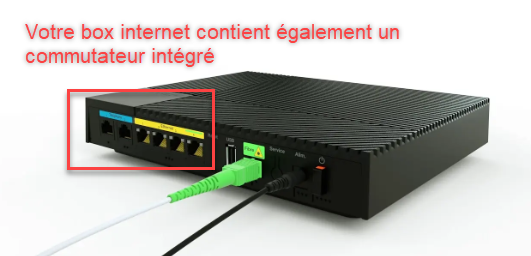

Le *commutateur*, bien qu’il ressemble à un concentrateur sur le plan physique, fonctionne différemment. Contrairement au concentrateur, qui diffuse systématiquement les messages à tous les ports, le commutateur établit une connexion directe entre les appareils concernés par l’échange de données. Cela réduit considérablement le nombre de trames circulant sur le réseau, améliorant ainsi les performances globales.

Cependant, avant de pouvoir fonctionner efficacement, le commutateur doit localiser progressivement les postes du réseau. Ce processus s’appelle la** phase d’apprentissage**. Vous allez découvrir cette étape clé dans l’activité suivante.

==== Mise en place des activités

ifeval::[{_show_note_prof} == 1]
[.noteprof]
*******
{_bloc_noteprof_label}

L’activité peut être réalisée *avec* ou *sans* simulateur, en mode démonstration (seul le professeur manipule) ou en mode TP.

La partie grisée du tableau ci-dessous contient les indications qui peuvent être utiles si les étudiants utilisent le simulateur.

//end noteprof
*******
//end _show_note_prof
endif::[]

Pour distribuer correctement les messages, le *commutateur* doit savoir quels postes, identifiés par leur *adresse MAC*, sont connectés à chacun de ses *ports*. Ces informations sont stockées dans une *base de données interne appelée table MAC/port*.

La *table MAC/port* associe chaque adresse MAC à un port spécifique du commutateur, permettant ainsi une transmission ciblée et efficace des données.

Cette activité vous permettra de comprendre comment cette table se remplit progressivement au cours de la phase d’apprentissage, lorsque le commutateur découvre les appareils connectés au réseau.

[.resourcesstudent]
****
{_bloc_resources_student_label}

* assets/unSwitch.xml

//end resourcesstudent
****

Importez dans le simulateur réseau le fichier *assets/unSwitch.xml*. :

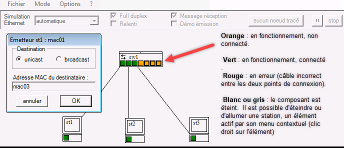

[TIP]
====
    * Pour *émettre une trame*, il faut positionner la souris sur le carré vert représentant la *carte réseau du poste émetteur* et cliquer droit ;
    * L'adresse MAC du destinataire peut être saisi automatiquement en cliquant sur la carte réseau du poste destinataire ; 
    * Il faut activer « message réception » pour voir quel poste lit réellement la trame ;
    * Pour pouvoir simuler la phase d'apprentissage, il faut impérativement vider la table mac/port du commutateur : ce type de paramétrage se réalise par clic droit sur le commutateur.

Découverte de la phase d'apprentissage du commutateur : videz la table mac/port du commutateur.

====

==== Activité 1 : Observer les copies d’écran et répondre aux questions associées

[.question]
****

*Q{counter:_question})*
Observez l’envoi d’une trame de st1 vers st3. Qui reçoit la trame ? Qui lit le message ?

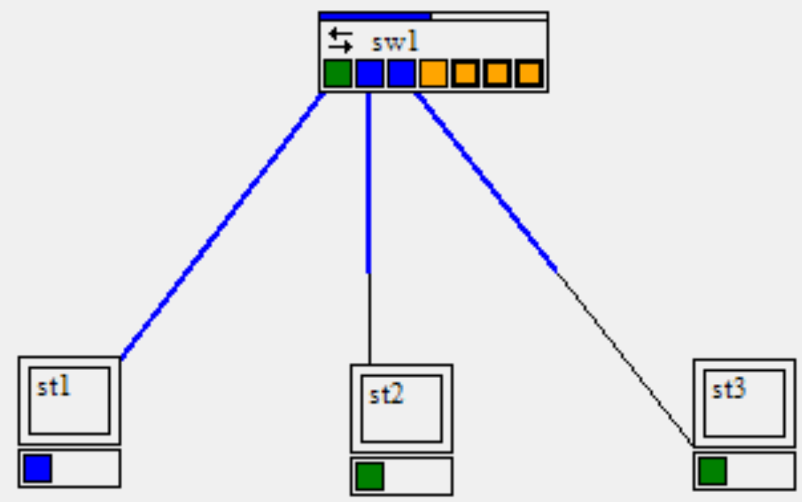

//end question
****

// ---------- answer
ifeval::[{_show_correction} == 1]
[.answer]
****
_Correction de Q{_question}_

Tous les postes reçoivent mais seul st3 lit le message car l’adresse MAC de destination de la trame est « st3 ».
****
endif::[]
ifeval::[{_show_correction} == 0]
[.discreet]#_réponse *{_question}* disponible._#
endif::[]
//  end answer ----------

[.question]
****
*Q{counter:_question})*
Observez la table *mac/port* du commutateur.
Quelle information contient-elle ? En déduire son mode de complétion.

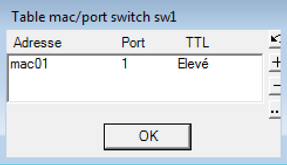
//end question
****

// ---------- answer
ifeval::[{_show_correction} == 1]
[.answer]
****
_Correction de Q{_question}_

La table MAC/port du commutateur ne contient initialement qu’une seule entrée, indiquant sur quel port est connecté le poste st1, qui agit ici comme poste émetteur.

On peut supposer que cette entrée a été ajoutée suite à l’envoi d’une trame par st1. Ce processus illustre la manière dont le commutateur complète progressivement sa table MAC/port au fur et à mesure des communications sur le réseau.
****
endif::[]
ifeval::[{_show_correction} == 0]
[.discreet]#_réponse *{_question}* disponible._#
endif::[]
//  end answer ----------

[.question]
****
*Q{counter:_question})*
Observez l’envoi d’une trame de st3 vers st1. Qui reçoit la trame ? Justifiez. Qui lit le message ?

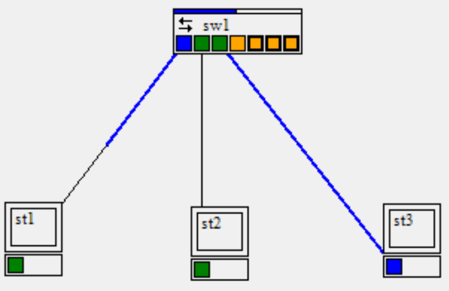
//end question
****

// ---------- answer
ifeval::[{_show_correction} == 1]
[.answer]
****
_Correction de Q{_question}_

Seul *st1* reçoit la trame, car le commutateur a mémorisé la position de st1 sur ses ports lors de l’envoi précédent fait par *st1*.

Seul *st1* lit le message (puisque c’est le seul à recevoir une trame qui lui est directement destinée)
****
endif::[]
ifeval::[{_show_correction} == 0]
[.discreet]#_réponse *{_question}* disponible._#
endif::[]
//  end answer ----------

Qui reçoit la trame et qui lit le message (justifiez vos réponses) lors des envois suivants :

[.question]
****
*Q{counter:_question})*
Envoi de trame de st1 vers st3 ?

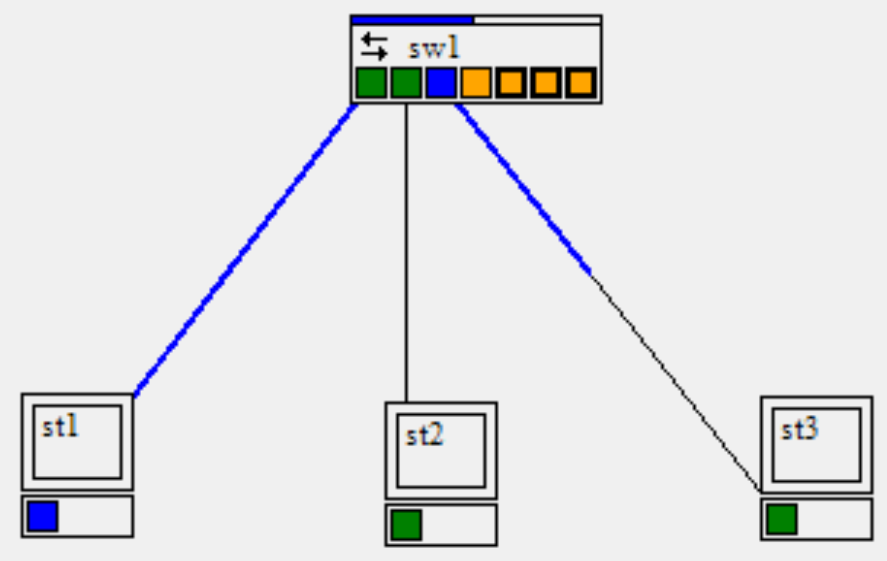
//end question
****

// ---------- answer
ifeval::[{_show_correction} == 1]
[.answer]
****
_Correction de Q{_question}_

Seul *st3* reçoit et lit le message, car le commutateur a mémorisé la position de *st3* sur ses ports lors de l’envoi précédent fait par *st3*.
****
endif::[]
ifeval::[{_show_correction} == 0]
[.discreet]#_réponse *{_question}* disponible._#
endif::[]
//  end answer ----------

[.question]
****
*Q{counter:_question})*
Que doit contenir la table mac/port à ce stade ?
//end question
****

// ---------- answer
ifeval::[{_show_correction} == 1]
[.answer]
****
_Correction de Q{_question}_

Les correspondances pour st1 et pour st3
****
endif::[]
ifeval::[{_show_correction} == 0]
[.discreet]#_réponse *{_question}* disponible._#
endif::[]
//  end answer ----------

[.question]
****
*Q{counter:_question})*
Envoi de trame de st1 vers st2 ?

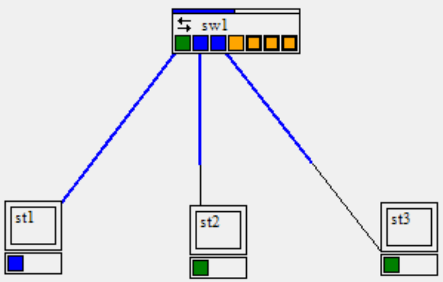

//end question
****

// ---------- answer
ifeval::[{_show_correction} == 1]
[.answer]
****
_Correction de Q{_question}_

st2 et st3 reçoivent car st2 n’a encore jamais envoyé de message ⇒ le commutateur n’a pas encore déterminé sa position (mais seul st2 lit le message).
****
endif::[]
ifeval::[{_show_correction} == 0]
[.discreet]#_réponse *{_question}* disponible._#
endif::[]
//  end answer ----------

[.question]
****
*Q{counter:_question})*
Envoi de trame de st2 vers st3 ?

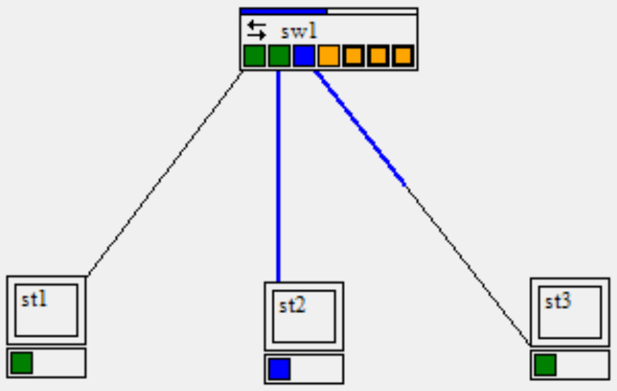
//end question
****

// ---------- answer
ifeval::[{_show_correction} == 1]
[.answer]
****
_Correction de Q{_question}_

Seul st3 reçoit et lit le message car le commutateur a mémorisé la position de st3 sur ses ports lors de l’envoi précédent fait par st3.
****
endif::[]
ifeval::[{_show_correction} == 0]
[.discreet]#_réponse *{_question}* disponible._#
endif::[]
//  end answer ----------

[.question]
****
*Q{counter:_question})*
La table d’adresse MAC/PORT est maintenant remplie :

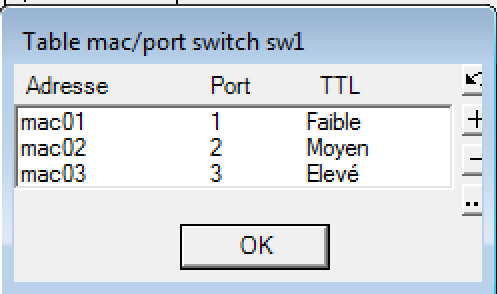

Que se passera-t-il si on réitère l’envoi de trame de st1 vers st2 ?
//end question
****

// ---------- answer
ifeval::[{_show_correction} == 1]
[.answer]
****
_Correction de Q{_question}_

Seul st2 reçoit et lit le message.
****
endif::[]
ifeval::[{_show_correction} == 0]
[.discreet]#_réponse *{_question}* disponible._#
endif::[]
//  end answer ----------

==== Activité 2 : Conclusion

[.question]
****
*Q{counter:_question})*
De quoi a-t-on besoin pour que le commutateur sache où se trouvent tous les postes ?
//end question
****

// ---------- answer
ifeval::[{_show_correction} == 1]
[.answer]
****
_Correction de Q{_question}_

Toutes les stations doivent avoir émis au moins une trame.
****
endif::[]
ifeval::[{_show_correction} == 0]
[.discreet]#_réponse *{_question}* disponible._#
endif::[]
//  end answer ----------

[.question]
****
*Q{counter:_question})*
Le commutateur peut-il ignorer la position d’une station ?
//end question
****

// ---------- answer
ifeval::[{_show_correction} == 1]
[.answer]
****
_Correction de Q{_question}_
Oui, si celle-ci n’émet jamais de trames (ce qui est pratiquement impossible, une station destinataire d’une trame répond généralement à cette trame).

****
endif::[]
ifeval::[{_show_correction} == 0]
[.discreet]#_réponse *{_question}* disponible._#
endif::[]
//  end answer ----------

[.question]
****
*Q{counter:_question})*
Que fait un commutateur quand il reçoit une trame dont il ne connaît pas l’adresse du destinataire ?
//end question
****

// ---------- answer
ifeval::[{_show_correction} == 1]
[.answer]
****
_Correction de Q{_question}_

Il diffuse à tous les ports sur lequel se trouvent des connexions (il agit comme un concentrateur dans ce cas).

****
endif::[]
ifeval::[{_show_correction} == 0]
[.discreet]#_réponse *{_question}* disponible._#
endif::[]
//  end answer ----------

[TIP]
====
**A retenir : **

*Lorsqu'une trame est reçue par un commutateur, celui-ci associe le port d'entrée de la trame à l'adresse MAC de l'émetteur*. Si cette adresse MAC n'est pas encore présente dans sa table d'association (table MAC/port), le commutateur l'enregistre. Ce mécanisme permet au commutateur, après avoir traité un certain nombre de trames, de construire une table de correspondance complète des adresses MAC et des ports réseau. Cela lui permet de rediriger efficacement les trames en établissant des connexions directes entre les hôtes du réseau.

En pratique, dès qu'un hôte est connecté au commutateur, il émet une trame qui déclenche la mise à jour de la table *MAC/port*. Si un hôte change de port, l'envoi d'une nouvelle trame met immédiatement à jour l'association dans la table. De plus, chaque entrée de la table MAC/port est associée à un TTL (Time To Live), qui représente la durée pendant laquelle l'association est conservée (par défaut, 300 secondes sur les commutateurs Cisco). Une fois le *TTL* expiré, l'entrée est supprimée. Cependant, si le commutateur reçoit une nouvelle trame avant l'expiration du *TTL*, le délai est réinitialisé, garantissant que les associations actives restent à jour.

====

*Limite des commutateurs*

Un commutateur maintient *une table d'association MAC/port* qui enregistre les adresses *MAC* des cartes réseau connectées directement ou indirectement (via d'autres commutateurs). Néanmoins, la capacité de cette table est limitée, ce qui restreint le nombre d'adresses MAC qu'un commutateur peut gérer simultanément.

Il est donc impossible d'interconnecter des millions de postes uniquement à l'aide de commutateurs. Si tous les appareils du monde étaient reliés via des commutateurs, cela aboutirait à un réseau unique et gigantesque dans lequel chaque hôte devrait connaître l'adresse MAC de tous les autres. Cette situation engendrerait une complexité de gestion insoutenable et un encombrement considérable des tables MAC.

Pour surmonter cette limitation, *un système d'adressage logique*, comme celui utilisé par le protocole *IP* (_Internet Protocol_), est employé. *Ce système permet de segmenter le réseau en sous-réseaux indépendants*, simplifiant la gestion des communications et rendant possible l'interconnexion à grande échelle via des routeurs, qui se basent sur des adresses logiques pour diriger le trafic.

=== Réseau logique et adressage

==== Pourquoi un réseau logique ?

Imaginons un service postal fonctionnant sur le principe d’un *commutateur* réseau. Chaque usager recevrait un identifiant unique (*équivalent à une adresse MAC*) que le service postal utiliserait pour distribuer le courrier.

Cela poserait un problème de gestion colossal : un facteur devrait identifier l’emplacement exact de la boîte aux lettres associée à l’identifiant, par exemple, "855497789991004", sans structure hiérarchique pour guider la recherche.

Si le service postal fonctionnait selon la logique d’un *concentrateur (hub)*, la situation serait encore pire : chaque lettre serait envoyée à tous les usagers, mais seul le destinataire ouvrirait l’enveloppe. Cela entraînerait une énorme surcharge inutile de traitement et de distribution.

Pour résoudre ce problème, le service postal regroupe les usagers en niveaux hiérarchiques : par *pays*, par *code postal*, par *rue*, puis par *numéro dans la rue*. Ces niveaux intermédiaires permettent d’accélérer la recherche du destinataire et de réduire la complexité. Un même code postal regroupe tous les habitants d’un quartier, tandis qu’un numéro individuel distingue chaque habitation au sein de la rue. La distribution suit une logique d’élimination progressive : localisation du pays, puis de la ville, du quartier, de la rue, et enfin de l’adresse exacte.

Les réseaux informatiques adoptent un principe similaire. Pour limiter le nombre d'adresses à gérer, les ordinateurs sont regroupés en réseaux logiques. Une adresse réseau, telle qu'une adresse IP, est structurée en deux parties :

. Une *partie commune* qui identifie le réseau logique auquel appartient l'appareil.
. Une *partie spécifique* qui identifie de manière unique l'appareil au sein de ce réseau.

Ces niveaux permettent une recherche plus efficace et une gestion simplifiée du routage des données.

La création de ces niveaux hiérarchiques est en partie arbitraire. Dans le cas des villes, la structure historique détermine leur taille et leur configuration, avec des communes adjacentes pouvant se toucher ou se chevaucher. Traverser une rue peut signifier entrer dans une autre commune, indépendamment de la géographie physique.

De manière analogue, dans les réseaux informatiques, les regroupements en réseaux logiques (sous-réseaux) répondent de plus en plus à des critères organisationnels plutôt qu’à des contraintes géographiques. Par conséquent, deux postes situés physiquement proches l’un de l’autre peuvent appartenir à des réseaux logiques différents. Cette abstraction permet de découpler la topologie physique (emplacement réel des appareils) de la topologie logique (organisation des réseaux), facilitant l’évolution et la gestion des infrastructures réseau.

==== Comment définir un réseau logique ?

Un réseau logique est constitué de postes regroupés selon des critères définis, indépendamment de leur emplacement physique. Ces postes partagent une organisation commune permettant une identification unique au sein de ce regroupement. Pour adresser un réseau logique et ses postes de manière univoque, il est nécessaire de définir :

1. Une *adresse logique* pour identifier le réseau lui-même.
2. Une *adresse logique spécifique* pour chaque poste au sein de ce réseau.

Ces adresses logiques complètent les adresses matérielles (ou physiques) des cartes réseau, comme les adresses MAC, qui sont gravées directement sur le matériel.

Dans les réseaux informatiques, c’est le *protocole IP (Internet Protocol)* qui fournit le mécanisme d’adressage logique. Ce protocole permet de définir des adresses logiques, appelées *adresses IP*, qui sont attribuées à chaque hôte sur le réseau.

Actuellement, la version majoritairement utilisée du protocole est *IPv4* _(Internet Protocol version 4_). Une adresse IPv4 est composée de 32 bits, ce qui permet de représenter environ 4,3 milliards d’adresses uniques. Ces adresses sont généralement exprimées en notation décimale pointée, divisées en quatre octets, par exemple : *192.168.1.1*.

[NOTE]
====

*Comment sont formées les adresses IP ?*

Une *adresse IP* se compose de deux parties principales :

* La *partie réseau*, qui identifie le réseau logique auquel appartient l'hôte.
* La *partie hôte*, qui identifie de manière unique une carte réseau (ou interface) au sein de ce réseau.

Une *adresse IP en version 4 (IPv4)* est exprimée sous forme de quatre valeurs décimales séparées par des points, chaque valeur étant comprise entre *0* et *255* (représentant un octet ou 8 bits). Par exemple : *192.168.10.15*.

La distinction entre la partie réseau et la partie hôte d'une adresse IP est définie par un *masque de sous-réseau*. Ce masque indique la longueur de la partie réseau et est également exprimé sous la forme de quatre octets, comme *255.255.255.0*.

Pour simplifier :

* Les bits à *255* dans le masque correspondent à la partie réseau de l’*adresse IP*.
* Les bits à *0* correspondent à la *partie hôte*.

Ainsi, pour une adresse IP *192.168.10.15* avec un masque de sous-réseau *255.255.255.0*, les trois premiers octets (*192.168.10*) identifient le réseau, et le dernier octet (*15*) identifie l'hôte dans ce réseau.

La méthode précise pour déterminer la division réseau/hôte, bien que fondamentale, dépasse le cadre de cette introduction.
====

*Voici quelques exemples d’adresses IPv4 et de masques de sous-réseau :*

[cols="1,1,1"]
|===
|192.168.1.1
|Masque *255.255.255*.0
|Correspond au poste 1 du réseau *192.168.1*.0

|192.168.1.2
|Masque *255.255.255*.0
|Correspond au poste 2 du réseau *192.168.1*.0

|192.168.2.1
|Masque *255.255.255*.0
|Correspond au poste 1 du réseau *192.168.2*.0

|10.0.0.1
|Masque *255*.0.0.0
|Correspond au poste 1 du réseau *10*.0.0.0

|160.20.12.1
|Masque *255.255*.0.0
|Correspond au poste 12.1 du réseau *160.20*.0.0

|===

Voici une représentation simplifiée des réseaux logiques de la section des *WEBDEV* et du Local technique du centre de formation de la _figure 1_:

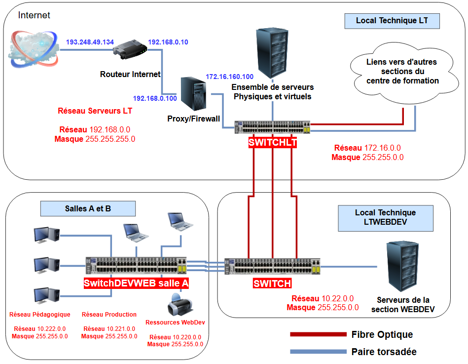

[.question]
****
*Q{counter:_question})*
Quels sont les réseaux logiques utilisés dans la section WEBDEV ?
//end question
****

// ---------- answer
ifeval::[{_show_correction} == 1]
[.answer]
****
_Correction de Q{_question}_

*Quatre réseaux logiques :*

* Les ressources :  10.220.0.0 masque *255.255*.0.0
* Le réseau de production : 10.221.0.0 masque *255.255*.0.0
* Le réseau pédagogique  : 10.222.0.0 masque *255.255*.0.0
* Les serveurs : 10.22.0.0 masque *255.255*.0.0
****
endif::[]
ifeval::[{_show_correction} == 0]
[.discreet]#_réponse *{_question}* disponible._#
endif::[]
//  end answer ----------

[.question]
****
*Q{counter:_question})*
Comment savoir si le poste avec lequel on veut communiquer se trouve sur notre réseau ?
//end question
****

// ---------- answer
ifeval::[{_show_correction} == 1]
[.answer]
****
_Correction de Q{_question}_
En comparant la partie réseau des adresses IP des deux postes. Si elles sont identiques, les deux postes sont sur le même réseau logique.

****
endif::[]
ifeval::[{_show_correction} == 0]
[.discreet]#_réponse *{_question}* disponible._#
endif::[]
//  end answer ----------

[.question]
****
*Q{counter:_question})*
Donnez un exemple d’adresse IP que vous pouvez utiliser sachant que quand votre poste est connecté à la prise murale étiquetée « Vlan 21 », vous êtes dans le réseau de production.
//end question
****

// ---------- answer
ifeval::[{_show_correction} == 1]
[.answer]
****
_Correction de Q{_question}_

10.221.0.1 masque 255.255.0.0
****
endif::[]
ifeval::[{_show_correction} == 0]
[.discreet]#_réponse *{_question}* disponible._#
endif::[]
//  end answer ----------

[.question]
****
*Q{counter:_question})*
Les hôtes suivants sont situées sur le même commutateur :

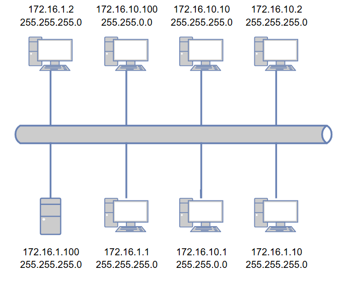

. Quels sont les différents réseaux logiques présents sur ce segment et de quels ordinateurs
chaque réseau logique est-il composé ?

. Comment faire communiquer tous les hôtes de ce segment sans ajout d’éléments
supplémentaires ?

. Peut-il y avoir plusieurs adresses IP identiques sur un segment réseau logique ?
//end question
****

// ---------- answer
ifeval::[{_show_correction} == 1]
[.answer]
****
_Correction de Q{_question}_

1)

* Le réseau _172.16.1.0_ masque _255.255.255.0_ avec les postes _172.16.1.1_ - _172.16.1.2_ – _172.16.1.10_ - _172.16.1.100_
* Le réseau _172.16.10.0_ masque _255.255.255.0_ avec les postes _172.16.10.2_ - _172.16.10.10_
* Le réseau _172.16.0.0_ masque _255.255.0.0_ avec les postes _172.16.10.1_ - _172.16.10.100_

2) En mettant un masque de 255.255.0.0 sur tous les hôtes.

3) Non, sinon il y a un conflit d'adresse IP.

****
endif::[]
ifeval::[{_show_correction} == 0]
[.discreet]#_réponse *{_question}* disponible._#
endif::[]
//  end answer ----------

=== Les réseaux logiques et le rôle des routeurs

Les *réseaux logiques* ont été conçus pour faciliter l'identification et l'accès à un poste au sein d'un réseau. Cependant, une question essentielle se pose : *quel élément du réseau est chargé d'assurer cette gestion et de permettre la communication entre différents réseaux ?*

Pour illustrer cela, on peut faire une analogie avec un *service postal*. Dans ce système, le courrier est trié en fonction de sa destination, puis acheminé à travers différents relais postaux jusqu'à son destinataire final. Dans un réseau informatique, le rôle de ces relais est assuré par un *routeur*.

*Communication dans les réseaux logiques*

* *Dans un même réseau logique*, les postes peuvent communiquer directement entre eux sans intermédiaire.
* *Entre deux réseaux logiques différents*, la communication nécessite obligatoirement le passage par un routeur. Ce dernier agit comme une *porte d'entrée et de sortie* entre différents réseaux logiques.

*Fonctionnement d'un routeur*

Un routeur est une machine équipée de *plusieurs interfaces réseau* (cartes réseaux), chacune connectée à un réseau différent. Lorsqu'un routeur reçoit un message, il effectue les opérations suivantes :

. *Analyse de l'adresse IP de destination* : Le routeur identifie la partie réseau de cette adresse.
. *Routage du message :*
+
* Si le destinataire se trouve dans un réseau directement accessible via l'une de ses interfaces, le routeur lui transmet le message directement.
* Si le destinataire se trouve sur un réseau distant, le message est transmis à un autre routeur en direction du réseau cible. Ce processus est répété jusqu'à atteindre le destinataire final.

*Exemple de routage*

Considérons deux postes situés dans des réseaux logiques distincts. Ces postes ne peuvent pas communiquer directement. Le message envoyé par l'un des postes doit passer par un routeur, qui le dirigera soit vers une autre interface réseau connectée au destinataire, soit vers un routeur intermédiaire, selon la configuration des réseaux.

[.question]
****
*Q{counter:_question})*
Quel est l’élément indispensable dans la configuration IP d’un poste pour que ce dernier
puisse atteindre un poste situé sur un autre réseau ?

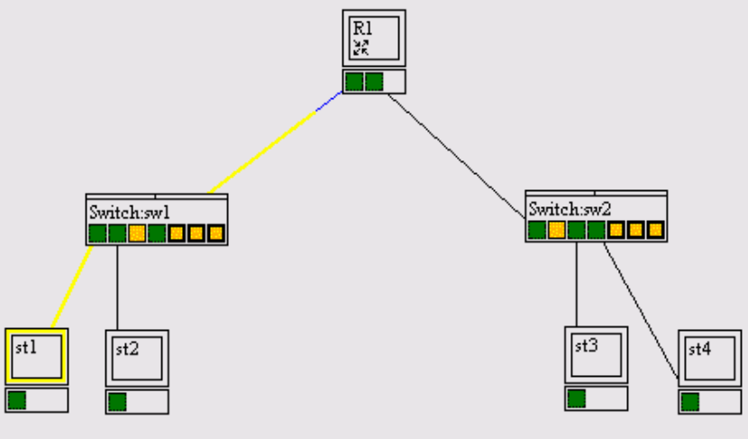
//end question
****

// ---------- answer
ifeval::[{_show_correction} == 1]
[.answer]
****
_Correction de Q{_question}_

Pour sortir du réseau logique auquel il appartient, un ordinateur doit connaître l’adresse d’un routeur.
****
endif::[]
ifeval::[{_show_correction} == 0]
[.discreet]#_réponse *{_question}* disponible._#
endif::[]
//  end answer ----------

[IMPORTANT]
====
Remarque : dans la configuration des postes, que l'on soit sous Windows, Linux ou autre, le terme utilisé est
« passerelle » (traduction de l’anglais « gateway »).
====

*Exemple de configuration réelle* de carte réseau dans la salle de cours de la section WEBDEV lorsque le poste est connecté
en WiFi dans le réseau « Ressources » :

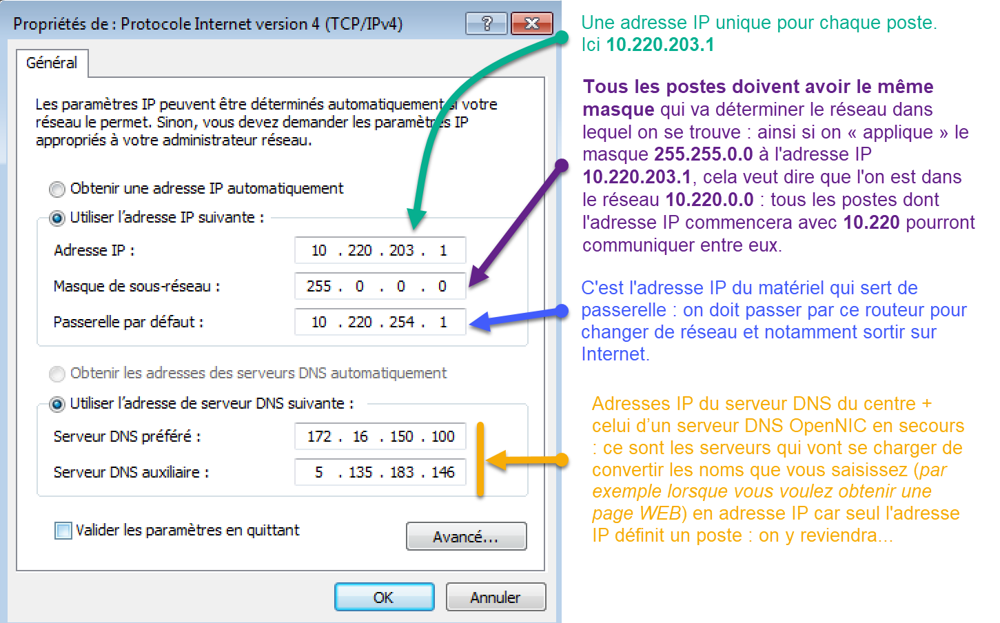

*L'adressage IP* est une couche d'identification logique qui se superpose à l'*adressage MAC*, sans pour autant le remplacer. Alors que l'adresse MAC est une identification physique et unique inscrite directement dans les cartes réseau, l'adresse IP agit comme une identification logique, permettant d'organiser et de structurer la communication entre dispositifs sur un réseau, notamment sur Internet.

*Rôle de l'adresse IP*

L'adresse IP sert à identifier chaque appareil connecté à un réseau, qu'il s'agisse d'ordinateurs, de téléphones portables ou d'autres dispositifs. Elle permet de localiser ces appareils au sein d'une infrastructure réseau et d'assurer la livraison des données de manière efficace.

*Modes d'attribution des adresses IP*

. *Attribution statique :*

* Une adresse IP peut être configurée manuellement pour un appareil, comme illustré dans la capture d'écran ci-dessus.
* Cette méthode est souvent utilisée dans des environnements où les adresses des équipements doivent rester constantes, comme pour des serveurs ou des imprimantes.

. *Attribution dynamique :*

* Une adresse IP peut être attribuée automatiquement par un serveur, généralement via le protocole *DHCP (Dynamic Host Configuration Protocol)*.
* Cette méthode est couramment utilisée dans les réseaux locaux pour simplifier la gestion des adresses.

*Commande pour afficher l'adresse IP sur un système Windows*

Sur un système Windows, il est possible de connaître l'adresse IP d'un appareil en utilisant la commande suivante dans un terminal (`cmd`) :

* Commande de base : `ipconfig`
** Affiche les informations réseau essentielles, comme l'adresse IP, le masque de sous-réseau et la passerelle par défaut.

* Commande avancée : `ipconfig /all`
** Fournit des informations détaillées sur toutes les interfaces réseau, y compris les adresses MAC, les serveurs DNS configurés, et les paramètres DHCP.

[NOTE]
====
Cette distinction entre les niveaux d'adressage (IP et MAC) est essentielle pour comprendre le fonctionnement des réseaux informatiques et leur gestion dans des contextes pratiques.
====

[.question]
****
*Q{counter:_question})*
Pour accéder au mode `commande` sur Windows : `Touche WINDOWS` + `R` et saisir "cmd".

ou

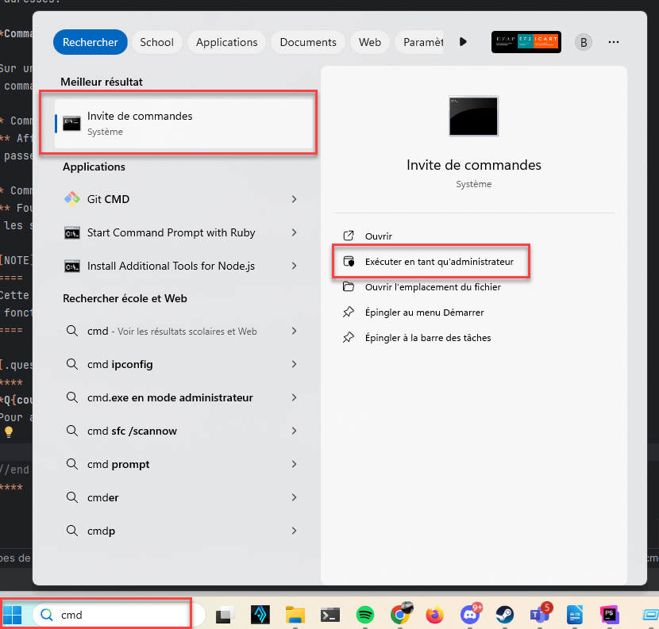

Saisissez maintenant les commandes `ipconfig` et `ipconfig /all`

. Quelle est la configuration IP de votre ordinateur sous Windows 10 ?
. Quel est le réseau logique auquel appartient votre poste ?
//end question
****