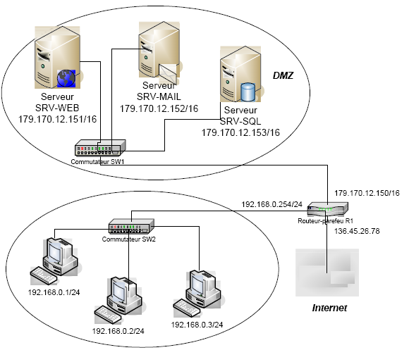

:_exercise:
:_show_correction: 1
[[exo_adresse_ip]]
= L’adressage IP – Notions de base
include::../../../../../run_app.adoc[

== Exercice 1

* Pour l'hôte `10.12.25.2/8`, donnez les adresses suivantes :

[cols="1,1"]
|===

|*Adresse de réseau*
|
ifeval::[{_show_correction} == 1]
10.0.0.0/8
endif::[]

|*Nombre d'hôtes*
|
ifeval::[{_show_correction} == 1]
2^25 - 2 =  16 777 214
endif::[]

|*Adresse du premier hôte*
|
ifeval::[{_show_correction} == 1]
10.0.0.1
endif::[]

|*Adresse du dernier hôte*
|
ifeval::[{_show_correction} == 1]
10.255.255.254
endif::[]

|*Adresse de diffusion*
|
ifeval::[{_show_correction} == 1]
10.255.255.255
endif::[]
|===

* Pour l'hôte `172.20.10.34/16`, donnez les adresses suivantes :

[cols="1,1"]
|===

|*Adresse de réseau*
|
ifeval::[{_show_correction} == 1]
172.20.0.0/16
endif::[]

|*Nombre d'hôtes*
|
ifeval::[{_show_correction} == 1]
2^16- 2 =  65 534
endif::[]

|*Adresse du premier hôte*
|
ifeval::[{_show_correction} == 1]
172.20.0.1
endif::[]

|*Adresse du dernier hôte*
|
ifeval::[{_show_correction} == 1]
172.20.255.254
endif::[]

|*Adresse de diffusion*
|
ifeval::[{_show_correction} == 1]
172.20.255.255
endif::[]
|===

* Pour l'hôte `192.168.20.185/24`, donnez les adresses suivantes :

[cols="1,1"]
|===

|*Adresse de réseau*
|
ifeval::[{_show_correction} == 1]
192.168.20.0/24
endif::[]

|*Nombre d'hôtes*
|
ifeval::[{_show_correction} == 1]
2^8 - 2 =254
endif::[]

|*Adresse du premier hôte*
|
ifeval::[{_show_correction} == 1]
192.168.20.1
endif::[]

|*Adresse du dernier hôte*
|
ifeval::[{_show_correction} == 1]
192.168.20.254
endif::[]

|*Adresse de diffusion*
|
ifeval::[{_show_correction} == 1]
192.168.20.255
endif::[]
|===

Un réseau contient 600 postes, combien d’octets seront nécessaires pour identifier tous les hôtes ?

ifeval::[{_show_correction} == 1]
*2 octets ==> beaucoup de gaspillage d'adresses.*
endif::[]

== Exercice 2

Pour chaque adresse en binaire ci-dessous :

. L’écrire en notation décimale.
. Déterminer son adresse réseau en binaire.
. Ecrire en notation décimale, son adresse de réseau ainsi que son adresse de diffusion.

[.question]
****
*Q{counter:_question})*
*10010011 11011000 01100111 10111110 masque 255.255.0.0 :*
//end question
****
// ---------- answer
ifeval::[{_show_correction} == 1]
[.answer]
****
_Correction de Q{_question}_

.. `147.216.103.190`
.. La partie hôte (les 16 derniers bits) doivent être mis à 0.
L’adresse de réseau est donc : `10010011 11011000 00000000 00000000`
.. @réseau : `147.216.0.0` et @diffusion : `147.216.255.255`

****
endif::[]
ifeval::[{_show_correction} == 0]
[.discreet]#_réponse *{_question}* disponible._#
endif::[]
//  end answer ----------

[.question]
****
*Q{counter:_question})*
*01101100 10100100 10010101 11000101  masque 255.0.0.0 :*
//end question
****

// ---------- answer
ifeval::[{_show_correction} == 1]
[.answer]
****
_Correction de Q{_question}_

.. 108.164.149.197
.. La partie hôte (les 24 derniers bits) doivent être mis à 0.
L’adresse de réseau est donc : `01101100 00000000 00000000 00000000`
.. @réseau :``108.0.0.0`` et @diffusion : `108.255.255.255`
****
endif::[]
ifeval::[{_show_correction} == 0]
[.discreet]#_réponse *{_question}* disponible._#
endif::[]
//  end answer ----------

[.question]
****
*Q{counter:_question})*
*11010110 01011100 10110100 11010001  masque 255.255.255.0*
//end question
****

// ---------- answer
ifeval::[{_show_correction} == 1]
[.answer]
****
_Correction de Q{_question}_

.. `214.92.180.209`
.. La partie hôte (les 8 derniers bits) doivent être mis à 0.
L’adresse de réseau est donc : `11010110 01011100 10110100 00000000`
.. @réseau :`` 214.92.180.0`` et @diffusion : `214.92.180.255`
****
endif::[]
ifeval::[{_show_correction} == 0]
[.discreet]#_réponse *{_question}* disponible._#
endif::[]
//  end answer ----------

== Exercice 3

Le service informatique d'une société est actuellement équipé d’un réseau local comportant un serveur et cinq postes de travail dédiés au développement.

Le serveur possède les caractéristiques suivantes :

* *Adresse IP* : `192.168.10.10`
* *Masque de sous-réseau* : `255.255.255. 0`

L’entreprise désire ajouter une station de numérisation avec les caractéristiques suivantes :

* *Adresse IP* : `192.168.20.11`
* *Masque de sous-réseau* : `255.255.255.0`

:_question:
[.question]
****
*Q{counter:_question})*
Q1. Expliquer pourquoi l’adresse IP de cette station cliente ne lui permet pas de communiquer avec le serveur.

//end question
****

// ---------- answer
ifeval::[{_show_correction} == 1]
[.answer]
****
_Correction de Q{_question}_

Elle n'est pas sur le même réseau et le poste *n'a aucune configuration de passerelle.*
****
endif::[]
ifeval::[{_show_correction} == 0]
[.discreet]#_réponse *{_question}* disponible._#
endif::[]
//  end answer ----------

[.question]
****
*Q{counter:_question})*

Indiquer, parmi les six adresses IP suivantes, celles qui peuvent être affectées à la station de numérisation. Justifier la réponse.

[cols="1,1,1"]
|===

|192.168.10.0
|192.168.10.1
|192.168.10.10

|192.168.10.11
|192.168.10.254
|192.168.10.255
|===

//end question
****

// ---------- answer
ifeval::[{_show_correction} == 1]
[.answer]
****
_Correction de Q{_question}_

* *192.168.10.0* : Ce n'est pas possible, car c'est l'adresse du réseau
* *192.168.10.1* : C'est possible
* *192.168.10.10* : Ce n'est pas possible, car c'est l'adresse du serveur
* *192.168.10.11* : C'est possible
* *192.168.10.254* : C'est possible
* *192.168.10.255* : Ce n'est pas possible, car c'est l'adresse de diffusion
****
endif::[]
ifeval::[{_show_correction} == 0]
[.discreet]#_réponse *{_question}* disponible._#
endif::[]
//  end answer ----------

== Exercice 4

Une entreprise dispose d’un réseau local avec un accès à l'Internet. Le plan d’adressage IP est le suivant :

• une tranche d'adresses de `172.22.0.1/16` à `172.22.2.254/16` est réservée aux équipements spéciaux qui ont reçu une adresse fixe : éléments actifs, imprimantes et serveurs.
• la plage d’adresses à partir de `172.22.3.0` est réservée aux stations clients.

Voici un exemple de paramétrage IP de la dernière station connectée au réseau

[source,bash]
----
DHCP activé . . . . . . . . . . . : Oui
Autoconfiguration activée . . . . : Oui
Adresse IP. . . . . . . . . . . . : 172.22.3.134
Masque de sous-réseau . . . . . . : 255.255.0.0
Passerelle par défaut . . . . . . : 172.22.0.10
Serveur DHCP. . . . . . . . . . . : 172.22.0.1
Serveurs DNS. . . . . . . . . . . : 172.22.0.9
----

[.question]
****
:_question:
*Q{counter:_question})*
Quelle est l'adresse de réseau ?
//end question
****

// ---------- answer
ifeval::[{_show_correction} == 1]
[.answer]
****
_Correction de Q{_question}_

172.22.0.0/16
****
endif::[]
ifeval::[{_show_correction} == 0]
[.discreet]#_réponse *{_question}* disponible._#
endif::[]
//  end answer ----------

[.question]
****
*Q{counter:_question})*
Expliquer les éléments suivants extraits du paramétrage IP présenté ci-dessus:

[source]

----
a) 	Passerelle par défaut	: 	172.22.0.10
b) 	DHCP activé 		 : 	Oui
           Serveur DHCP.		:	172.22.0.1
----

//end question
****

// ---------- answer
ifeval::[{_show_correction} == 1]
[.answer]
****
_Correction de Q{_question}_

**La passerelle par défaut **est l'adresse IP du routeur (`172.22.0.10`) qui va permettre au poste de se connecter à un autre réseau (Internet par exemple). *Elle est obligatoirement sur le même réseau que la station.*

Le *DHCP est activé* ce qui veut dire que la configuration réseau de la station a été obtenue automatiquement.
L'adresse IP du serveur DHCP est `172.22.0.1`
****
endif::[]
ifeval::[{_show_correction} == 0]
[.discreet]#_réponse *{_question}* disponible._#
endif::[]
//  end answer ----------

[.question]
****
*Q{counter:_question})*
Donner un exemple de configuration IP d'un nouveau poste connecté au réseau en DHCP
//end question
****

// ---------- answer
ifeval::[{_show_correction} == 1]
[.answer]
****
_Correction de Q{_question}_

[source,bash]
Adresse IP. . . . . . . . . . . . : 172.22.3.135
Masque de sous-réseau . . . . . . : 255.255.0.0
Passerelle par défaut . . . . . . : 172.22.0.10
Serveurs DNS. . . . . . . . . . . : 172.22.0.9

****
endif::[]
ifeval::[{_show_correction} == 0]
[.discreet]#_réponse *{_question}* disponible._#
endif::[]
//  end answer ----------

== Exercice 5

Une connexion haut débit et une plate-forme informatique (cf. schéma) sont installées dans les locaux d'une entreprise pour assurer le fonctionnement des nouvelles applications.

Les serveurs « *SRV-WEB* », « *SRV-SQL* » et « *SRV-MAIL* » remplissent les rôles, respectivement, de serveur d’application Web, de serveur de bases de données (*SGBDR*) et de serveur de messagerie. Les bases de données situées sur le serveur « SRV-SQL » sont exploitées et mises à jour uniquement par le biais des applications Web.

:_question:
[.question]
****
*Q{counter:_question})*
Combien y a-t-il de réseaux connectés ?
//end question
****

// ---------- answer
ifeval::[{_show_correction} == 1]
[.answer]
****
_Correction de Q{_question}_

3 réseaux : 1 réseau local, une DMZ et Internet séparés par un routeur.
****
endif::[]
ifeval::[{_show_correction} == 0]
[.discreet]#_réponse *{_question}* disponible._#
endif::[]
//  end answer ----------

[.question]
****
*Q{counter:_question})*
Donner l'adresse de réseau des réseaux locaux et préciser si elles sont publiques ou privées.
//end question
****

// ---------- answer
ifeval::[{_show_correction} == 1]
[.answer]
****
_Correction de Q{_question}_

*Adresse privée* pour le réseau local :

* 192.168.0.0/24

*Adresse publique* pour la DMZ

* 179.170.0.0/16

****
endif::[]
ifeval::[{_show_correction} == 0]
[.discreet]#_réponse *{_question}* disponible._#
endif::[]
//  end answer ----------

[.question]
****
*Q{counter:_question})*
Donner la configuration IP (adresse IP, masque réseau et passerelle) du serveur SRVWEB.
//end question
****

// ---------- answer
ifeval::[{_show_correction} == 1]
[.answer]
****
_Correction de Q{_question}_

* Adresse IP : 179.170.12.151
* Masque réseau :255.255.0.0
* Passerelle : 179.170.12.150 (c'est l'adresse du routeur qui permet d'accéder à d'autres réseaux)
****
endif::[]
ifeval::[{_show_correction} == 0]
[.discreet]#_réponse *{_question}* disponible._#
endif::[]
//  end answer ----------