:_chapter:

[[principes-ip]]
= Principes de l'adressage IP
:_author: Bauer Baptiste
:_duration: 4
:_version_number: 1.0.0
:_version_date: 19/02/2025
include::../../../run_app.adoc[]

== Préambule

Cette section  vise à expliquer l’utilité de l’adressage IP, en particulier le système IPv4 et la notion de réseau logique IP.

Dans un contexte simple, les apprenants devront être capables de :

* [x] Identifier l’adresse réseau d’un hôte.
* [x] Déterminer l’adresse de diffusion permettant la communication avec tous les postes d’un réseau.
* [x] Définir la plage d’adresses utilisables au sein d’un réseau.
* [x] Vérifier si deux hôtes peuvent communiquer entre eux.
* [x] Différencier une adresse IP privée d’une adresse IP publique.
* [x] Connaître les adresses IP spéciales réservées à des usages spécifiques.
* [x] Configurer le réseau d’une STA pour lui permettre d’accéder à des services en ligne.

== Introduction

Nous savons que, pour que plusieurs postes puissent dialoguer entre eux, il était nécessaire :

* Qu'ils soient interconnectés physiquement ;
* Qu’ils disposent d’une *configuration IP (Internet Protocol)*

.Les réseaux sont organisés LOGIQUEMENT autour des adresses IP.
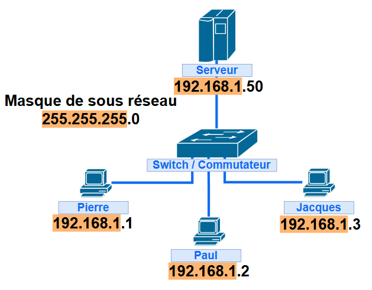

[NOTE]
====
Sans dispositif particulier, seuls les postes faisant partie du même réseau IP pourront communiquer entre eux.
====

IP est un protocole utilisé aussi bien pour les communications sur Internet, qui est une interconnexion mondiale de réseaux, que pour les échanges au sein d’un réseau local.

Contrairement à l’adressage physique basé sur les adresses MAC, l’adressage IP permet d’identifier un réseau et d’attribuer un poste à celui-ci grâce à une adresse IP, introduisant ainsi la notion de réseau et d’appartenance à un sous-réseau.

== Adresse d'hôte et adresse de réseau

Une adresse IPv4  (IP dans la version 4)  est une suite de *32* *bits* (_4 octets_), en séparant chacun des octets par un point.

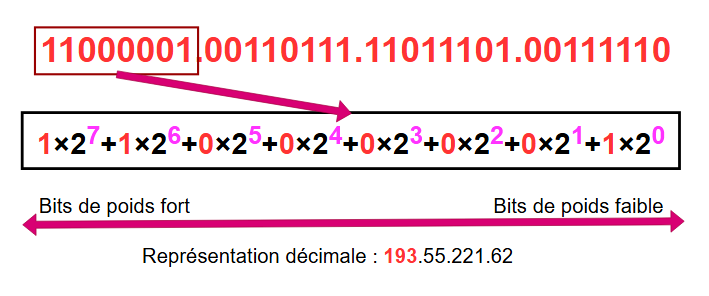

L’adresse IP d’une machine permet de définir précisément :

* Le réseau sur lequel est connectée la machine,
* L’adresse de la machine sur ce réseau.

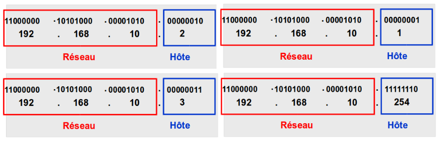

Pour chaque adresse, une partie des bits représente l’adresse réseau et l’autre partie identifie l’hôte dans le réseau.

Le premier hôte du réseau est l'IP : `192.168.10.1` et le dernier `192.168.10.254`.

Quel est le mécanisme qui situe la limite entre les deux champs ? autrement dit, comment déterminer l’adresse réseau et l’adresse de l’hôte ?

=== Le masque de sous-réseau

C'est une suite de *32 bits* dont la partie des bits qui fixent *l'adresse de réseau est une série continue de 1* (_partie gauche_) et la partie qui correspond aux hôtes est *une série continue de 0* (_partie droite_).

Le masque est aussi exprimé en notation décimale pointée.

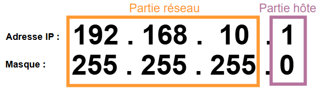

Un réseau se définit par un groupe d’hôtes dont la partie réseau de l’adresse contient la même configuration binaire et/ou décimale, c'est-à-dire que d**ans cet exemple les 24 premiers bits de l’adresse d’un hôte dans le réseau sont FIXÉS**. Ils valent ici :

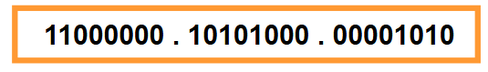

=== Calcul de l'adresse du réseau

Pour déterminer l’adresse réseau, on effectue un *ET logique* entre l’adresse IP de l’hôte et le masque de sous-réseau.

[options="header"]
|===
| Opérande 1 | Opérande 2 | Résultat (ET logique)
| 0          | 0          | 0
| 0          | 1          | 0
| 1          | 0          | 0
| 1          | 1          | 1
|===

[NOTE]
====
On constate que tous les bits de la partie hôte sont à zéro.

Donc au lieu de faire un ET Logique, on peut directement mettre tous les bits de la partie hôte à zéro.

====

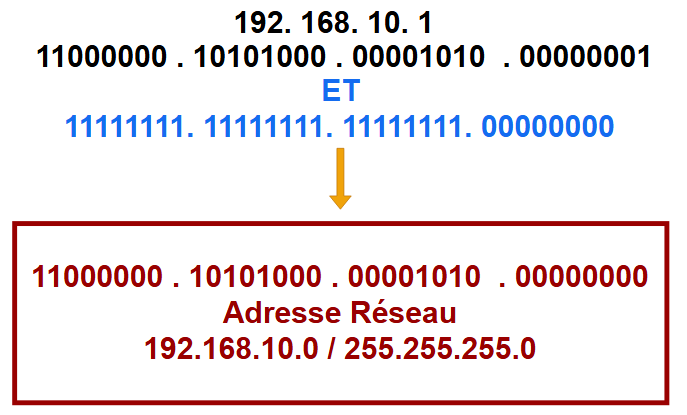

=== Calcul de l'adresse de diffusion

L’adresse de diffusion est une adresse spéciale qui permet d’envoyer un message à tous les hôtes d’un réseau.

Il s'agit de l'adresse où tous les bits de la partie hôte sont à 1. C'est la dernière adresse du réseau.

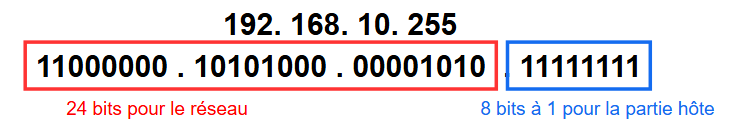

=== Calcul de la plage d'adresses utilisables

La plage adressable est l'ensemble des adresses que peut prendre un hôte sur le réseau.

La *première adresse* de la plage est donc celle qui suit l'adresse réseau et la *dernière adresse* est celle qui précède l'adresse de diffusion.

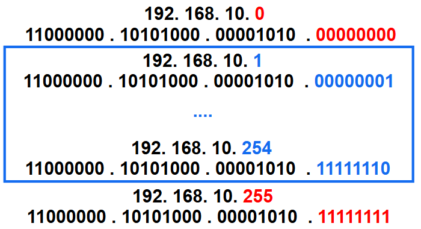

=== Nombre d'hôtes possibles dans un réseau

*Le nombre d’hôtes possibles dans un réseau est égal à 2^(nombre de bits de la partie hôte) - 2.*

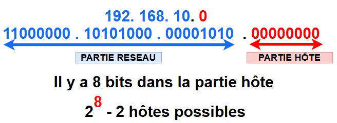

*Pourquoi soustraire 2 ?*

Parce que deux adresses sont réservées et ne peuvent être affectées à un hôte :

* La première adresse (`192.168.10.0`) représente l’*adresse du réseau*.
* La dernière adresse (`192.168.10.255`) représente l’*adresse de diffusion du réseau*.

=== La notation CIDR (Classless Inter-Domain Routing) du masque de sous-réseau

Le masque est constitué d’une suite contiguë de 1 suivie d’une suite de 0 ; *l’information utile est le nombre de 1 dans le masque*.

Une autre notation (la plus utilisée actuellement) consiste à faire suivre une adresse donnée par le nombre de bits égaux à 1 dans le masque.

*Exemple :* `192.168.10.0` avec le masque `255.255.255.0` correspond à `192.168.10.0/24`

== Adresses publiques, privées et classes d’adresses

=== Adresses publiques

Les adresses IP publiques sont essentielles pour la connexion à Internet. Leur attribution suit une hiérarchie précise :

Au sommet, l'IANA (Internet Assigned Numbers Authority), qui fait partie de l'ICANN, gère la distribution globale des adresses IP. Elle les attribue aux Registres Internet Régionaux (RIR) - par exemple, le RIPE-NCC qui couvre l'Europe et le Moyen-Orient.

Ces RIR redistribuent ensuite les blocs d'adresses aux Registres Internet Locaux (RIL), généralement des fournisseurs d'accès à Internet (FAI). Les FAI peuvent alors les attribuer à leurs clients, qu'ils soient des organisations ou des particuliers.

[IMPORTANT]
====
Ces adresses IP publiques sont uniques au niveau mondial, garantissant ainsi qu'il n'existe pas deux équipements avec la même adresse sur Internet.
====

Pour connaître votre adresse IP publique (celle qui vous identifie sur Internet), vous pouvez visiter le site monip.com. Cette adresse est celle qui permet aux autres équipements sur Internet de communiquer avec vous.

=== Les classes d'adresses

L'IPv4 utilisait initialement un système de classification des adresses appelé "adressage par classe". Parmi les cinq classes existantes, trois étaient principalement utilisées (A, B et C).

*Caractéristiques principales :*

* Le masque réseau était déterminé automatiquement par l'adresse IP elle-même
* Ce masque était fixe et ne pouvait pas être modifié
* Les routeurs utilisaient ce masque par défaut

Les classes d’adresse** A, B et C **définissaient des réseaux d’une certaine taille, ainsi que des blocs d’adresses particuliers pour ces réseaux, comme indiqué ci-dessous. Une entreprise ou une administration se voyait attribuer un bloc d’adresses entier de classe A, B ou C selon la taille du réseau de l'organisation.

La classe d’une adresse IP était fixée en fonction des** bits de poids forts** (_les bits les plus à gauche_) du premier octet de l’adresse avec un *masque par défaut*.

.Source : cours CCNA Discovery de Cisco.
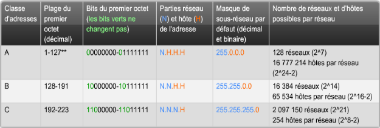

[IMPORTANT]
====
La notion de classe est obsolète depuis le milieu des années 1990. La détermination du masque ne tient plus compte de la classe d'adresse. . *N’importe quelle adresse IP peut ainsi actuellement être associée à n’importe quel masque, c’est ce que l’on appelle l’adressage sans classe (classless).*
====

=== Adresses privées

Les adresses privées sont celles qui sont utilisées en interne dans une organisation ou chez un particulier.

Par exemple, l'adresse de votre poste : *192.168.0.1*. Elles permettent de créer des réseaux locaux sans aucun risque « d’*_interférences_* ».

*Voici les adresses non routables sur Internet* dont tout le monde peut se servir pour son entreprise ou pour chez soi. *Elles ne seront jamais attribuées par l'IANA*.

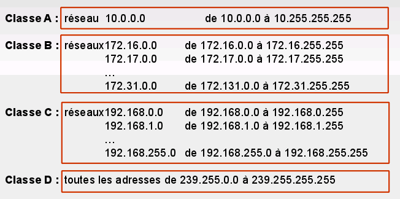

[NOTE]
====
À noter que les plages d’adresses privées ont été définies dans chaque classe (car définies dès le début) mais qu’il est actuellement possible d’associer par exemple l’adresse de réseau 10.221.0.0 (classe A) au masque 255.255.0.0 (caractéristique de l’ancienne  classe B).
====

=== Adresses spéciales

Les adresses de `127.0.0.0` à `127.255.255.255` sont utilisées pour tester la boucle locale, c’est-à-dire la machine elle-même.

On utilise en règle générale l'adresse de bouclage `127.0.0.1`:

* Elle désigne l’équipement local 
* Elle existe toujours
* Elle simule un accès réseau (même sans réseau)
* On l'utilise lors des communications locales ou les tests.

Les adresses de *169.254.0.0* à *169.254.255.255* sont utilisées pour l'auto-configuration dans les environnements où aucune configuration IP automatique n’est disponible.

*L'adresse de réseau* qui identifie le réseau. Dans la plage d’adresses IPv4 d’un réseau, c'est la plus petite adresse par exemple *192.168.10.0/24*

*L'adresse de diffusion* qui est la dernière adresse disponible du réseau. Elle permet de transmettre des données à l’ensemble des hôtes d’un réseau. Pour cela, un hôte peut envoyer un seul paquet adressé à l’adresse de diffusion du réseau, par exemple *192.168.10.255*.

*L'adresse de diffusion générale* : *255.255.255.255*; pour diffuser sur un réseau dont on ne connaît pas l’identifiant.

== La configuration IP d’un poste

Pour vous faire une petite idée de comment est configuré votre ordinateur personnel lorsque vous êtes dans votre environnement familial, écoutez dans l’ordre les 4 (très courtes) vidéos présentes dans le dossier « vidéos » (source : https://videos.u-cergy.fr/[https://videotheque.u-cergy.fr/]) et répondez à la question suivante.

[.question]
****
*Q{counter:_question})*
Quels sont les rôles respectifs d’un serveur DHCP et d’un serveur DNS ?
//end question
****

// ---------- answer
ifeval::[{_show_correction} == 1]
[.answer]
****
_Correction de Q{_question}_

Un serveur DNS est un serveur qui permet de faire la traduction entre les noms de domaines et les adresses IP : par exemple la traduction de www.google.fr en `173.194.66.94`.

Un serveur DHCP est un serveur chargé d’attribuer, de manière automatique à un hôte du réseau une configuration IP complète (on parle d’adressage dynamique).
****
endif::[]
ifeval::[{_show_correction} == 0]
[.discreet]#_réponse *{_question}* disponible._#
endif::[]
//  end answer ----------

[.question]
****
*Q{counter:_question})*
À partir du schéma réseau ci-dessous, donnez un exemple de paramètres IP possibles d’un des hôtes du réseau sachant que le poste utilise aussi un serveur DNS secondaire d’adresse IP `31.3.135.232`

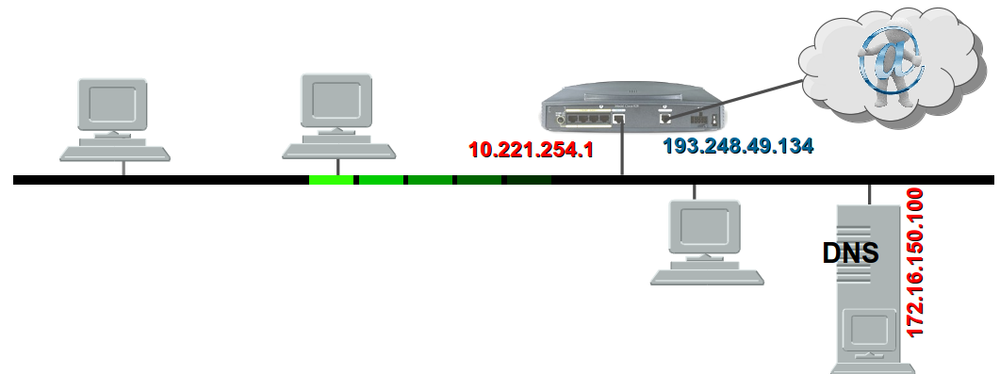

//end question
****

// ---------- answer
ifeval::[{_show_correction} == 1]
[.answer]
****
_Correction de Q{_question}_

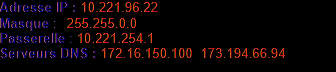
****
endif::[]
ifeval::[{_show_correction} == 0]
[.discreet]#_réponse *{_question}* disponible._#
endif::[]
//  end answer ----------

