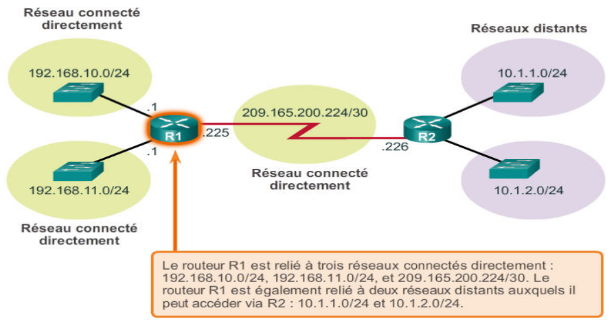

:_exercise:
[[exercice_table_routage]]
= Table de routage
include::../../../../../run_app.adoc[]

.Schéma issu du cours Cisco Discovery

[.question]
****
*Q{counter:_question})*
Complétez la table de routage ci-dessous concernant R1 ainsi que la description correspondante des routes.
//end question
****

|===
|Réseau |Masque |Passerelle |Interface

|192.168.10.0
|255.255.255.0
|192.168.10.1
|192.168.10.1

|192.168.11.0
|255.255.255.0
|
ifeval::[{_show_correction} == 1]
192.168.11.1
endif::[]
|
ifeval::[{_show_correction} == 1]
192.168.11.1
endif::[]

|209.165.200.224
|255.255.255.252
|
ifeval::[{_show_correction} == 1]
209.165.200.225
endif::[]
|
ifeval::[{_show_correction} == 1]
209.165.200.225
endif::[]

|10.1.1.0
|255.255.255.0
|209.165.200.226
|209.165.200.225

|10.1.2.0
|255.255.255.0
|
ifeval::[{_show_correction} == 1]
209.165.200.226
endif::[]
|
ifeval::[{_show_correction} == 1]
209.165.200.225
endif::[]

|===

[NOTE]
====
Pour les routes directement connectées, passerelle et interface se confondent.
====

*Routes connectées (lignes 1, 2 et 3) :*

** Ce sont les adresses des réseaux *directement connectés sur le routeur*.
** La première ligne spécifie que pour joindre le réseau `192.168.10.0/24`, il faut émettre sur l’interface `192.168.10.1` en remise directe

ifeval::[{_show_correction} == 1]
** La deuxième ligne spécifie que pour joindre le réseau `192.168.11.0/24`, il faut passer par l’interface 192.168.11.1 en remise directe.
** La troisième ligne spécifie que pour joindre le réseau `209.165.200.224/30`, il faut passer par l’interface `209.165.200.225`  en remise directe.
endif::[]

*Routes pour les réseaux distants (lignes 4 et 5)*

** La quatrième ligne spécifie que pour joindre le réseau `10.1.1.0/24`, il faut émettre sur l’interface `209.165.200.225` vers la passerelle (_routeur_) d'adresse `209.165.200.226` (_remise indirecte_).

ifeval::[{_show_correction} == 1]
** La cinquième ligne spécifie que pour joindre le réseau `10.1.2.0/24`, il faut émettre sur l’interface `209.165.200.225` vers la passerelle (_routeur_) d'adresse `209.165.200.226` (_remise indirecte_).
endif::[]