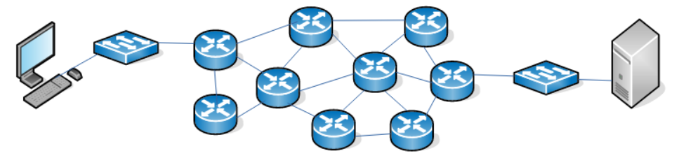
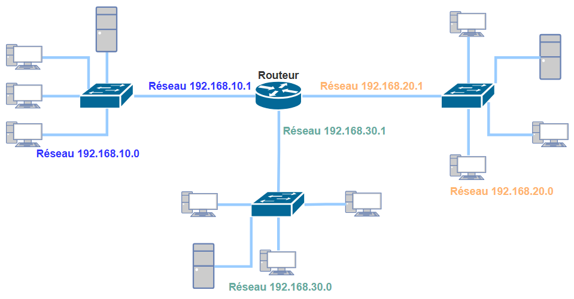
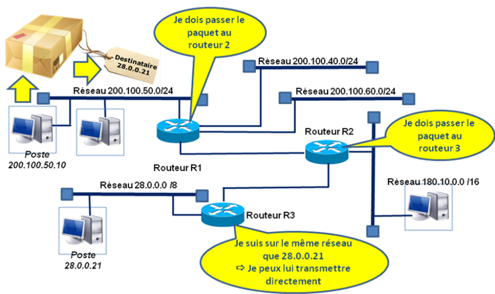
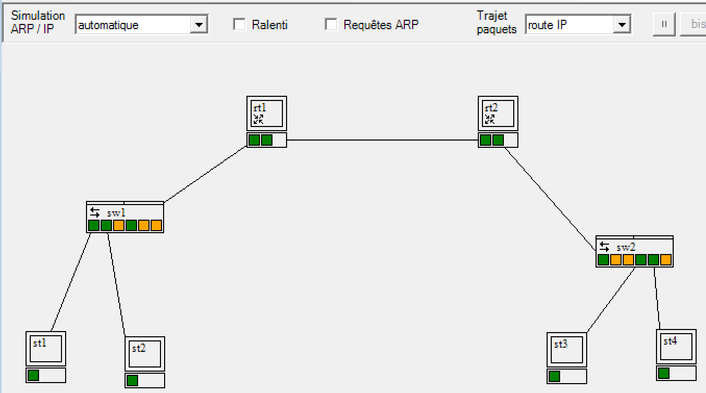
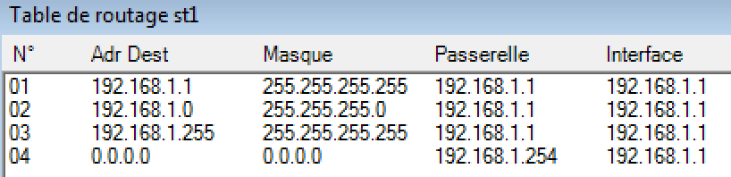
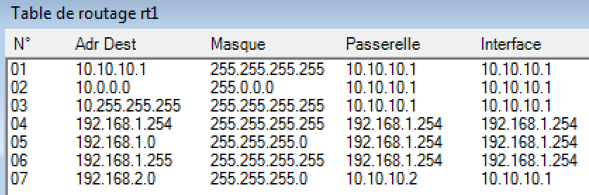
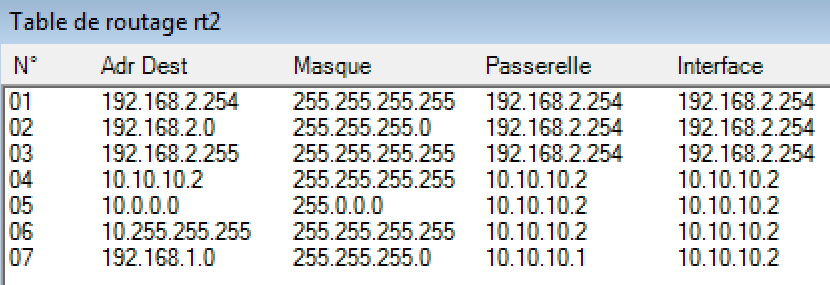
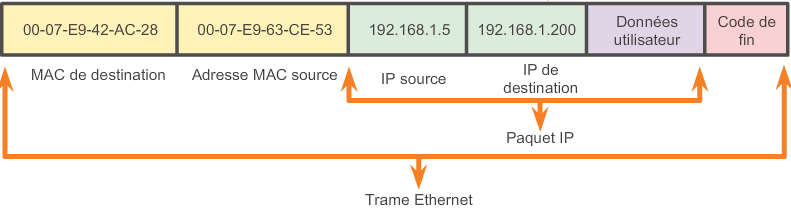

:_chapter:

[[routage]]
= Routage
:_author: Bauer Baptiste
:_duration: 3 heures
:_version_number: 1.0.0
:_version_date: 20/01/2025
include::../../../run_app.adoc[]

== Préambule

En 2024, le nombre d'internautes dans le monde dépassait les 5.3 milliards, soit 66% de la population mondiale. Cette croissance rapide du nombre d'utilisateurs d'Internet a des conséquences sur l'infrastructure des réseaux.

Nous avons déjà constaté qu'il n'est pas envisageable de s'appuyer uniquement sur des commutateurs pour connecter un tel volume d'utilisateurs. En effet, un commutateur conserve *en mémoire les adresses MAC des cartes réseau* qu’il relie, soit directement, soit via d'autres commutateurs. 

[NOTE]
====
Toutefois, cette capacité de mémorisation est limitée et donc incompatible avec un réseau de grande taille comme Internet.
====

Internet est une immense interconnexion de réseaux à l'échelle mondiale, basée sur le *protocole IP* (*Internet Protocol*). Ce protocole constitue un standard essentiel, aussi bien pour relier différents réseaux entre eux que pour gérer la communication au** sein d’un réseau local**.

Le *protocole IP* est indépendant des technologies spécifiques aux réseaux locaux, comme Ethernet. Il met en place un système d’adressage distinct de celui utilisé par les réseaux locaux, à savoir *les adresses MAC*. Grâce à ce système, des notions telles que l’appartenance à un réseau ou la segmentation en sous-réseaux sont introduites, en utilisant les adresses IP et les masques associés.

Chaque réseau peut être connecté à un ou plusieurs autres, formant un ensemble d’interconnexions. C’est cette structure globale qui permet à un réseau de communiquer avec n’importe quel autre réseau, en passant par des réseaux intermédiaires.

[NOTE]
====
L’élément qui permet d’interconnecter tous les réseaux est le *routeur*.
====

Ce chapitre vise à expliquer l’importance des routeurs et le fonctionnement du routage. Plus précisément, il s’agit de comprendre comment un message émis depuis un hôte appartenant à un réseau peut atteindre un autre réseau.

* Comment un poste identifie le routeur auquel il doit transmettre un message pour qu’il soit acheminé vers un réseau différent du sien ;
* Comment un message est transmis de routeur en routeur jusqu’à atteindre sa destination finale ;
* Comment un routeur détermine la destination d’un message afin de l’orienter correctement vers le destinataire final.

== Révisions : Principes de base
=== Comment joindre un réseau différent ?

Dans un *réseau IP*, qu’il soit local ou étendu, *le protocole IP* est toujours utilisé pour permettre la communication entre les postes. Deux postes configurés avec ce protocole ne peuvent échanger directement sans équipement supplémentaire que s’ils appartiennent au même réseau IP.

Pour connecter deux réseaux IP distincts, une machine intermédiaire est nécessaire : *le routeur*. Celui-ci doit disposer d’une interface connectée à chaque réseau, avec une adresse IP attribuée dans chacun des réseaux qu’il relie.

[.question]
****
*Q{counter:_question})*
Un poste détermine pour chaque paquet qu'il émet si celui-ci est émis dans son réseau IP ou vers un autre réseau IP. Comment fait-il ?

//end question
****

// ---------- answer
ifeval::[{_show_correction} == 1]
[.answer]
****
_Correction de Q{_question}_

Pour déterminer si un paquet doit être transmis à un routeur, un poste compare l’adresse IP de destination du paquet à son adresse IP et à son masque de sous-réseau. Si l’adresse IP de destination appartient au même réseau IP que l’adresse IP du poste, le paquet est transmis directement à la carte réseau du poste destinataire. Sinon, le paquet est transmis au routeur configuré comme passerelle par défaut.
****
endif::[]
ifeval::[{_show_correction} == 0]
[.discreet]#_réponse *{_question}* disponible._#
endif::[]
//  end answer ----------

[.question]
****
*Q{counter:_question})*
Si le paquet est destiné à un autre réseau, un hôte transmet le paquet à son routeur par défaut (passerelle). Comment le connaît-il ?

image::images/04.png[]

Pour échanger avec d’autres réseaux, un poste doit disposer d’au moins une adresse de routeur dans sa configuration. Cette adresse correspond à celle de la passerelle (le terme anglais pour routeur est « *gateway* », traduit en français par « *passerelle* »).

Chaque interface réseau d’un routeur est associée à une adresse IP. Sur un poste, l’adresse de la passerelle par défaut correspond à l’adresse de l’interface du routeur qui permet de quitter le réseau local.

//end question
****

[.question]
****
*Q{counter:_question})*
Utilise-t-on encore le protocole ARP si on veut communiquer avec un hôte qui n’est pas dans notre réseau ? Si oui pourquoi faire ?

[TIP]
====
Le protocole ARP (*Address Resolution Protocol*) permet de connaître l’adresse MAC d’un hôte à partir de son adresse IP.
====
//end question
****

// ---------- answer
ifeval::[{_show_correction} == 1]
[.answer]
****
_Correction de Q{_question}_

Oui, il est nécessaire pour déterminer l’adresse matérielle de la carte réseau du routeur (passerelle) pour que le poste puisse lui adresser le paquet destiné à un autre réseau
****
endif::[]
ifeval::[{_show_correction} == 0]
[.discreet]#_réponse *{_question}* disponible._#
endif::[]
//  end answer ----------

=== Séparer les réseaux : les sous-réseaux

Au niveau local, la séparation des réseaux induit une séparation des flux de données.

[.question]
****
*Q{counter:_question})*
En vous basant sur vos connaissances et sur ce que vous rencontrez en entreprise ou en cours, dire quels sont les avantages de cette séparation de flux ?
//end question
****

// ---------- answer
ifeval::[{_show_correction} == 1]
[.answer]
****
_Correction de Q{_question}_

* *Une meilleure sécurité :* lorsque les *STA* communiquent dans leur propre réseau, il leur est impossible de savoir ce qu'il se passe (analyse de trame par exemple) sur un autre réseau, car les trames Ethernet sont toujours arrêtées par les routeurs ;
* *Une meilleure bande passante :* moins de données circulent sur le réseau logique.
****
endif::[]
ifeval::[{_show_correction} == 0]
[.discreet]#_réponse *{_question}* disponible._#
endif::[]
//  end answer ----------

== Faire du routage avec des routeurs

Un routeur constitue un point d'accès et de sortie au sein d'un réseau logique. Il a pour fonction d'établir une liaison entre le Réseau Local d'Entreprise (RLE ou LAN – Local Area Network) et d'autres réseaux locaux ou Internet. Il assure ainsi le transit des flux d'informations entrant dans le RLE et sortant vers l'extérieur.

=== Différents types de routeurs

Un routeur est un boîtier équipé de connecteurs appelés interfaces, dont la nature varie en fonction des types de supports de communication auxquels il se connecte. Chaque interface est associée à une adresse MAC, un identifiant unique de 48 bits, correspondant aux cartes réseau intégrées au routeur.

Un ordinateur muni d'au moins deux cartes réseau peut techniquement remplir le rôle d'un routeur. Toutefois, pour des raisons de performance et de fonctionnalités avancées, l'utilisation d'un équipement dédié et optimisé est généralement préférable.

Par ailleurs, un routeur intégrant une fonction pare-feu (firewall) régule le passage des flux de données en appliquant des règles prédéfinies, analysant le contenu des informations pour autoriser ou bloquer leur transmission.

.Routeur professionnel (par exemple Cisco série 1800)

.Commutateurs intégrant des fonctionnalités de routage (par exemple HP 5500 de niveau 3)

.Routeur ADSL (routeur + modem)

.Routeur WiFi

[IMPORTANT]
====
Il est important de noter que les « box » Internet (comme la Freebox, la Livebox, etc.) remplissent le rôle de routeur WiFi tout en intégrant un modem. Ce dernier permet d'établir la connexion avec les réseaux extérieurs, notamment Internet, via la ligne téléphonique ou la fibre optique. Ainsi, ces équipements assurent à la fois la distribution du réseau local sans fil et l’accès à Internet pour les appareils connectés.
====

=== Fonctionnement d'un routeur

* *Visionnez la vidéo* : _Explication - 1 - Internet ! Comment ça marche ?_ de https://www.youtube.com/watch?v=dCknqcjcItU[Remi Explique].

[.question]
****
*Q{counter:_question})*
Comment est formaté un message (c’est à dire les informations que l’on veut réellement envoyer) sur le réseau ?
//end question
****

// ---------- answer
ifeval::[{_show_correction} == 1]
[.answer]
****
_Correction de Q{_question}_

Un message (les informations que l’on veut réellement envoyer) est encapsulé dans un *paquet* dans lequel on écrit l’adresse IP de destination.

****
endif::[]
ifeval::[{_show_correction} == 0]
[.discreet]#_réponse *{_question}* disponible._#
endif::[]
//  end answer ----------

*Exemple* : le poste d’adresse IP `200.100.50.10` avec un masque en `/24` envoie un message au poste `28.0.0.21` avec un masque en `/8`.

[CAUTION]
====
Un routeur dispose de plusieurs interfaces, une dans chaque réseau auquel il est directement connecté
====

[.question]
****
*Q{counter:_question})*
Comment un routeur choisit-il une route pour envoyer un message ?
//end question
****

// ---------- answer
ifeval::[{_show_correction} == 1]
[.answer]
****
_Correction de Q{_question}_

En analysant l’adresse IP de destination, le routeur sait sur quelle interface il doit envoyer le paquet. Il détermine en fait la route ou le chemin à prendre en consultant *les informations enregistrées dans sa table de routage*.
****
endif::[]
ifeval::[{_show_correction} == 0]
[.discreet]#_réponse *{_question}* disponible._#
endif::[]
//  end answer ----------

[.question]
****
*Q{counter:_question})*
Comment le routeur 2 sait-il qu’il doit passer le paquet au routeur 3 ?
//end question
****

// ---------- answer
ifeval::[{_show_correction} == 1]
[.answer]
****
_Correction de Q{_question}_

Il y a une ligne dans sa table de routage qui lui dit que pour atteindre le réseau 28.0.0.0/8, il doit passer par le routeur 3.
****
endif::[]
ifeval::[{_show_correction} == 0]
[.discreet]#_réponse *{_question}* disponible._#
endif::[]
//  end answer ----------

[NOTE]
====
Lorsqu’un routeur reçoit une trame, il la décode en procédant à une désencapsulation, c’est-à-dire qu’il retire les informations liées aux adresses MAC afin d’extraire l’adresse IP de destination. Il compare ensuite cette adresse IP avec les entrées de sa table de routage afin de déterminer le chemin le plus approprié pour acheminer les données vers leur destination finale.
====

=== Table de routage

Lancez le simulateur réseau *Sopirem* et ouvrez le fichier _deuxswitchdeuxrouteurs.xml_.

* En mode "*IP*", *activez* le type de simulation "*automatique*" et le trajet des paquets "*route IP*".

Les routeurs `rt1` et `rt2` interconnectés simulent une liaison longue distance (comme une entreprise avec son FAI).

La liaison intermédiaire forme un réseau IP (dans cet exemple, `10.0.0.0/8`), où chaque interface réseau possède une adresse spécifique, comme `10.10.10.1` et `10.10.10.2`. Bien que, dans cette maquette, ces adresses appartiennent à un espace privé, il est courant que ces interfaces utilisent des adresses IP publiques lorsqu'elles sont directement accessibles depuis Internet et connues des internautes.

* *Lancez un ping de st1 vers st4.*

La communication transite par les routeurs lorsque le passage d’un réseau IP à un autre est nécessaire. Dans ce cas, le premier routeur n’étant pas directement connecté au réseau de destination, il doit acheminer les données vers un second routeur, qui se chargera ensuite de les diriger vers leur destination finale.

=> On constate que le "chemin IP" emprunté est : *st1 – rt1 – rt2 – st4 puis st4 – rt2 – rt1 – st1*

[CAUTION]
====
Chaque hôte et chaque routeur analysent l’adresse IP de destination incluse dans le message. Ils consultent ensuite leur table de routage afin de déterminer la meilleure action à entreprendre, qu’il s’agisse d’acheminer le paquet vers un autre routeur ou de le délivrer directement à la destination finale.
====

La table de routage du *poste st1* (hé oui ! un poste aussi a une table de routage) est la suivante (les lignes qui nous intéressent sont les lignes 2 et 4) :

La *ligne 02* spécifie que pour joindre le réseau `192.160.1.0/24` (le réseau auquel appartient le poste,) il faut utiliser l’interface d’adresse IP `192.168.1.1` (c’est la carte réseau du poste lui-même).

La *ligne 04* correspond à la *configuration de la passerelle* pour un poste (route par défaut) : si aucune route spécifique ne peut être utilisée, c’est la route par défaut qui s’applique (si aucune route par défaut n'était définie, le paquet ne serait pas émis, faute de route possible pour joindre la destination). 

En l’occurrence, si l’*adresse IP* de destination figurant dans le paquet :

* N’est pas `192.168.1.1` (*ligne 01* qui correspond à un processus local) ;
* N’appartient pas au réseau du poste à savoir `192.168.1.0/24` (*ligne 02*) ;
* N’est pas `192.168.1.255` qui est l’adresse de diffusion (*ligne 03*) ;

=> Le paquet est envoyé à la passerelle et est transmis sur le réseau local via l’interface `192.168.1.1`.

[IMPORTANT]
====
Dans tous les cas le paquet est encapsulé dans une trame qui aura pour *adresse MAC de destination* :

* L’adresse MAC de la passerelle si la trame est destinée à la passerelle ;
* L’adresse MAC de diffusion s’il s’agit d’une trame de *broadcast* ;
* L’adresse MAC d’un hôte en cas de trame *unicast* envoyée sur le même segment.

====

La table de routage du routeur `rt1` (_clic droit sur le routeur pour la consulter_) est la suivante (les lignes utiles ici sont les lignes *02*, *05* et *07* – _à noter que les autres lignes non utiles pour un routeur n’apparaissent plus dans la version 3 de Sopirem_) :

Une route possède quatre composants principaux :

* Le réseau de destination ;
* Le masque de sous-réseau ;
* L’adresse de passerelle ;
* L’adresse d’interface.

Différence entre *passerelle* et *interface* :

*Adresse de passerelle (Gateway)*, C'est l'adresse IP du routeur suivant par lequel les paquets doivent transiter pour atteindre leur destination finale. Elle est nécessaire lorsque le paquet doit être envoyé à un autre réseau.

_Exemple : Si un ordinateur envoie un paquet vers un réseau extérieur, il envoie ce paquet à la passerelle (souvent le routeur local)._

*Adresse d’interface*, C’est l’adresse IP de l’interface du routeur lui-même qui est utilisée pour envoyer le paquet. Si le réseau de destination est directement connecté, l'adresse de passerelle peut être absente et seule l'interface est spécifiée.

Les *lignes 02* *(01 à 03 plus exactement*) et *05* (*04 à 06 plus exactement*) correspondent à *des réseaux directement connectés*. La table de routage est *automatiquement configurée* avec ces adresses dès que les interfaces sont branchées, que les adresses IP des interfaces sont configurées et le routage activé :

* *La ligne 2* spécifie que pour joindre le réseau `10.10.10.0/8`, il faut émettre sur l’interface `10.10.10.1` en *remise directe* (_l'hôte de destination est accessible directement sans passer par un autre routeur : la passerelle a la même adresse que l’interface_).
* *La ligne 5* spécifie que pour joindre le réseau `192.168.1.0/24`, il faut émettre sur l’interface `192.168.1.254` en *remise directe*.

La *ligne 07* correspond à une route pour un réseau distant. Cette ligne n’est pas ajoutée automatiquement, elle doit être configurée par un administrateur réseau : elle spécifie que pour joindre le réseau `192.168.2.0/24`, il faut émettre sur l’interface `10.10.10.1` vers la passerelle (routeur) d'adresse `10.10.10.2` (*remise indirecte*). On remarque que l’adresse de la passerelle est différente de celle de l’interface.

[.question]
****
*Q{counter:_question})*
Quelle est la ligne de la table de routage de rt1 utilisée lors du ping précédent (de st1 vers st4) ?
//end question
****

// ---------- answer
ifeval::[{_show_correction} == 1]
[.answer]
****
_Correction de Q{_question}_

Ligne 07, car on veut atteindre le réseau `192.168.2.0/24`.
****
endif::[]
ifeval::[{_show_correction} == 0]
[.discreet]#_réponse *{_question}* disponible._#
endif::[]
//  end answer ----------

La table de routage du routeur rt2 est la suivante :

[.question]
****
*Q{counter:_question})*
Donnez les lignes correspondantes aux réseaux directement connectés et celles correspondantes aux réseaux distants ?
//end question
****

// ---------- answer
ifeval::[{_show_correction} == 1]
[.answer]
****
_Correction de Q{_question}_

* *Lignes de 01 à 06 *: réseaux directement connectés.

* *Ligne 07 *: réseau distant.
****
endif::[]
ifeval::[{_show_correction} == 0]
[.discreet]#_réponse *{_question}* disponible._#
endif::[]
//  end answer ----------

[NOTE]
====
*Que fait exactement un poste ou un routeur quand il reçoit une trame ?*

. *Désencapsulation et extraction de l'adresse de destination*
+
Lorsqu'un routeur reçoit une trame, il procède à sa désencapsulation afin d'extraire l'adresse IP de destination contenue dans l'en-tête du paquet.
+
. *Consultation de la table de routage*
+
Le routeur analyse sa *table de routage* afin de déterminer l'interface réseau à utiliser pour transmettre le paquet. Ce processus suit les étapes suivantes :
+
* Il applique le *masque de réseau* associé à chaque entrée de la table pour extraire la partie réseau de l'adresse IP de destination.
* Il compare cette adresse avec l'adresse de destination de chaque ligne de la table.
* Si aucune correspondance n'est trouvée, il passe à l'entrée suivante.
* Si aucune route spécifique ne permet d'acheminer le paquet, il est soit transmis via une *route par défaut* (si elle est définie), soit *supprimé*.
+
. *Détermination de l'interface et de la passerelle*
+
Une fois l'adresse réseau correspondante identifiée dans la table de routage, le routeur récupère les informations nécessaires pour l'acheminement du paquet :
+
* Si la destination est un réseau *directement connecté*, le paquet est envoyé directement à l'hôte de destination via l'interface correspondante.
+
* Si la destination est située sur un réseau distant, le paquet est transmis à une *passerelle intermédiaire* (un autre routeur) via l'interface appropriée.
+
. *Résolution de l'adresse MAC et encapsulation du paquet*
* Le routeur consulte son** cache ARP** pour déterminer l'adresse MAC associée à l'adresse IP de destination ou à la passerelle.
* Si cette adresse MAC est absente du cache, il envoie une *requête ARP* pour l'obtenir.
* Une fois l'adresse MAC obtenue, le routeur *réencapsule* le paquet avec une nouvelle trame Ethernet en intégrant la bonne adresse MAC de destination.
* Enfin, il transmet la trame sur le réseau via l'interface sélectionnée.

Ainsi, le rôle du routeur est d'assurer l'acheminement optimal des paquets en fonction des informations contenues dans sa table de routage, tout en garantissant la bonne correspondance entre les adresses IP et MAC pour la transmission des données sur le réseau.

====

[.question]
****
*Q{counter:_question})*
Quelles sont les lignes des tables de routage (pour st1 et rt2) utilisées lors du ping précédent (de st1 vers st4). Justifiez vos réponses.
//end question
****

// ---------- answer
ifeval::[{_show_correction} == 1]
[.answer]
****
_Correction de Q{_question}_

À partir de st1, on veut atteindre st4. L’adresse IP de destination est donc `192.168.2.2` : en appliquant aux lignes de la table de routage de st1 successivement les masques `255.255.255.255` puis ``255.255.255.0`` puis`` 255.255.255.255``, on ne trouve aucune adresse réseau correspondante, on utilise ainsi la route par défaut.
La ligne utile pour st1 est donc la ligne 04 (on envoie le paquet sur la passerelle).

La ligne utilisée sur rt2 est la ligne 2 (`192.168.2.2` ET `255.255.255.0` donne bien le réseau `192.168.2.0/24`) ==> le routeur envoie donc directement le paquet à st4 via son l’interface `192.168.2.254`.

****
endif::[]
ifeval::[{_show_correction} == 0]
[.discreet]#_réponse *{_question}* disponible._#
endif::[]
//  end answer ----------

[.question]
****
*Q{counter:_question})*
Quelles sont les lignes des tables de routage utilisées (pour st4, rt2, rt1 et st1) lors du retour du ping précédent. Justifiez vos réponses.
//end question
****

// ---------- answer
ifeval::[{_show_correction} == 1]
[.answer]
****
_Correction de Q{_question}_

Lors du retour de ping, l’adresse IP de destination est `192.168.1.1` :

* Pour le poste st4 : ligne 04 (route par défaut).
* Pour le routeur rt2 : ligne 07 (réseau distant).
* Pour le routeur rt1 : ligne 05 (réseau directement connectée).
* Pour le poste st1 : ligne 01 (interface elle-même).

****
endif::[]
ifeval::[{_show_correction} == 0]
[.discreet]#_réponse *{_question}* disponible._#
endif::[]
//  end answer ----------

[.question]
****
*Q{counter:_question})*
Lancez un ping de st1 vers st2. Donnez la ou les lignes de la ou des tables de routage utilisée(s) pour le paquet envoyé.

//end question
****

// ---------- answer
ifeval::[{_show_correction} == 1]
[.answer]
****
_Correction de Q{_question}_

L’adresse IP de destination est `192.168.1.2`. La ligne 02 de la table de routage du poste est utilisée. Le routeur n’est donc pas sollicité, ce qui est normal, car les deux postes sont sur le même réseau.

****
endif::[]
ifeval::[{_show_correction} == 0]
[.discreet]#_réponse *{_question}* disponible._#
endif::[]
//  end answer ----------

[.question]
****
*Q{counter:_question})*
Lancez un ping de st3 vers `10.10.10.1`. Donnez la ou les lignes de la ou des tables de routage utilisée(s) pour le paquet envoyé.
//end question
****

// ---------- answer
ifeval::[{_show_correction} == 1]
[.answer]
****
_Correction de Q{_question}_

L’adresse IP de destination est *10.10.10.1* :

* Pour le poste st3 : ligne 04 (route par défaut).
* Pour le routeur rt2 : ligne 05 (réseau directement connecté).
* Pour le routeur rt1 : ligne 01 (interface elle-même).
****
endif::[]
ifeval::[{_show_correction} == 0]
[.discreet]#_réponse *{_question}* disponible._#
endif::[]
//  end answer ----------

=== Récapitulatif et vocabulaire

L’*adresse de destination* d’un paquet détermine l’itinéraire qu’il empruntera à travers les réseaux intermédiaires pour atteindre son destinataire.

En revanche, l’*adresse MAC* de destination d’une *trame* permet d’assurer une liaison physique entre deux équipements qui échangent directement des données.

La trame constitue ainsi l’unité de transmission entre les cartes réseau. Elle est acheminée d’une carte réseau à une autre en s’appuyant sur les adresses MAC source et destination.

Chaque trame encapsule un *paquet IP*, qui représente l’unité de transmission entre réseaux. Ce paquet contient les adresses IP source et destination, ainsi que les données à transmettre.

[.question]
****
*Q{counter:_question})*
Lorsqu'une trame suit un chemin réseau, les adresses IP source et destination ne changent pas, mais que se passe-t-il au niveau des adresses MAC lorsque qu'un hôte adresse un paquet à un autre hôte ne faisant pas partie de son réseau ?
//end question
****

// ---------- answer
ifeval::[{_show_correction} == 1]
[.answer]
****
_Correction de Q{_question}_

L'hôte inclut l'adresse IP de l'hôte de destination dans le paquet. Cependant, lorsqu'il encapsule le paquet dans une trame, il utilise l'adresse MAC du routeur comme destination de la trame. De cette façon, le routeur reçoit et accepte la trame contenant l'adresse MAC.

=> *L'adresse MAC de destination ne correspond donc pas à l'adresse IP de destination incluse dans la trame.*
****
endif::[]
ifeval::[{_show_correction} == 0]
[.discreet]#_réponse *{_question}* disponible._#
endif::[]
//  end answer ----------