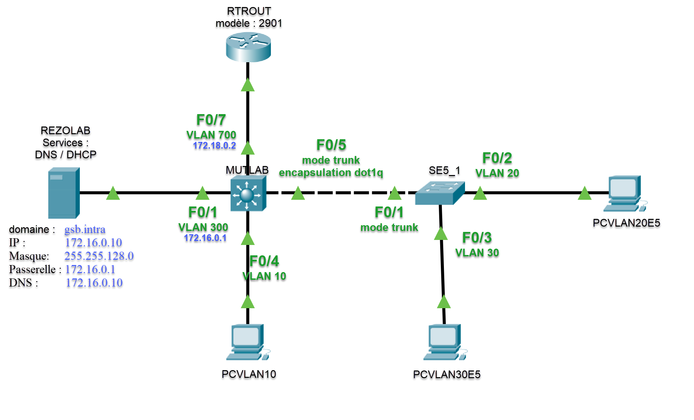
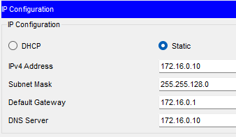
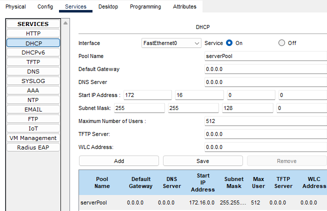
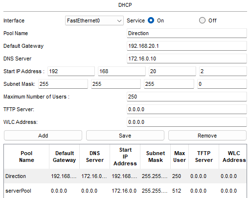
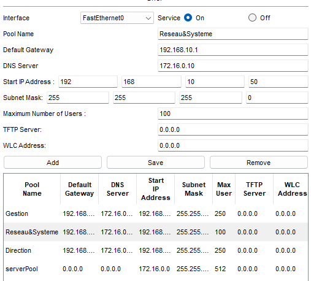
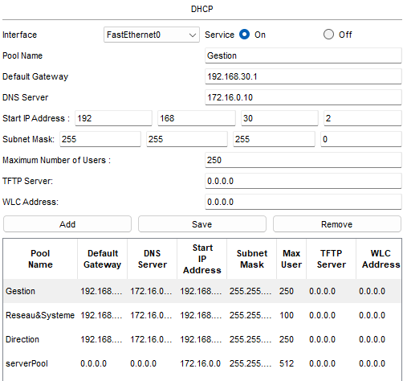
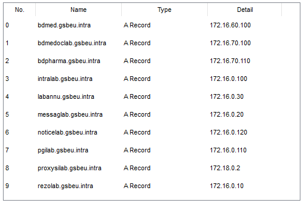

:_book:
[[projet1_remote_admin]]
= Projet1 : Administration à distance et sauvegarde des fichiers de configuration via FTP
include::../../../run_app.adoc[]

== Configuration des équipements du réseau

=== Schéma réseau détaillé

=== Serveur REZOLAB configuration

==== IP

==== Service DHCP sur REZOLAB

==== Service DNS sur REZOLAB

=== Etapes de configuration

==== Etape 1 : Mutlab et Rezolab

* Brancher Rezolab sur l'interface *Fa0/1* du Mutlab

[source,cisco]
.Commandes CISCO à saisir dans le CLI du futur MUTLAB
----
enable
configure terminal
hostname MUTLAB
ip domain-name gsb.intra
----

La commande `ip domain-name gsb.intra` est nécessaire pour plusieurs raisons importantes dans le contexte de ce projet :

1. *Configuration SSH*
* C'est une exigence préalable à la génération des clés RSA pour SSH
* SSH nécessite un nom de domaine pour générer correctement ses clés de chiffrement
2. *Résolution des noms*
* Dans le cahier des charges, il est spécifié que "La connexion SSH sera réalisée avec les noms d'hôtes suivants : `mutlab.gsb.intra` et `se5_1.gsb.intra` "
* Le domaine `gsb.intra` permet de compléter le nom d'hôte (`hostname`) pour former le *FQDN (Fully Qualified Domain Name)*
* Par exemple, si vous avez configuré hostname MUTLAB et ip domain-name gsb.intra, le nom complet sera mutlab.gsb.intra
3. *Intégration avec le DNS*
* Le serveur DNS sur REZOLAB gère la zone gsb.intra (comme indiqué dans le cahier des charges)
* En configurant le même nom de domaine sur les équipements réseau, on assure la cohérence avec l'infrastructure DNS

[CAUTION]
====
Sans cette commande :

* Vous ne pourriez pas configurer SSH correctement
* Les connexions par nom d'hôte ne fonctionneraient pas comme demandé
* L'intégration avec le DNS serait incomplète.
====

La commande `ip domain-name gsb.intra` sur les équipements Cisco est indépendante de la configuration du serveur *DNS* sur *REZOLAB* et ne vous dispense pas de configurer ce dernier.

[source,cisco]
.Créer sur *Mutlab* le *VLAN 300* => *Serveurs*
----
vlan 300
name Serveurs
exi
----

[source,cisco]
.Configurer l'interface VLAN 300 sur *MUTLAB*
----
interface vlan 300
ip address 172.16.0.1 255.255.128.0
no shutdown
exit
----

[source,cisco]
.Configurer le port *fa0/1* du *MUTLAB*
----
interface fa0/1
switchport mode access
switchport access vlan 300
no shutdown
exit
----

==== Etape 2 : Mutlab et PCVLAN10

* Brancher PCVLAN10 sur l'interface *Fa0/4* du Mutlab

[NOTE]
====
Le PCVLAN10 doit être renommé. Et l'attribution de son adresse IP doit être en DHCP.

====

[source,cisco]
.Créer sur *Mutlab* le *VLAN 10* => *Reseau&Systeme*
----
vlan 10
name Reseau&Systeme
exit
----

[source,cisco]
.Configurer l'interface VLAN 10 sur *MUTLAB*
----
interface vlan 10
ip address 192.168.10.1 255.255.255.0
no shutdown
exit
----

[source,cisco]
.Configurer le port *fa0/4* du *MUTLAB*
----
interface fa0/4
switchport mode access
switchport access vlan 10
no shutdown
exit
----

==== Etape 3 : Communication DHCP entre VLAN 300 et VLAN 10

Pour que *PCVlan10* puisse recevoir une IP du serveur *DHCP* _(REZOLAB - 172.16.0.10_), il faut configurer plusieurs éléments :

[source,cisco]
.Sur MUTLAB, configurer l'agent relais DHCP (ip helper-address) sur l'interface VLAN 10 :
----
configure terminal
interface vlan 10
ip helper-address 172.16.0.10
exit
----

Puis sur REZOLAB, il faut configurer l'étendue DHCP pour le VLAN10.
Normalement, cela est déjà effectué.

[source,cisco]
.Sur MUTLAB,  activons le routage IP
----
configure terminal
ip routing
exit
----

Nous devrions être en mesure de tester notre petite configuration :
Sur PCVLAN10  :

[source,cisco]
.Sur PCVLAN10
----
C:\>ipconfig /release

   IP Address......................: 0.0.0.0
   Subnet Mask.....................: 0.0.0.0
   Default Gateway.................: 0.0.0.0
   DNS Server......................: 0.0.0.0
----

[source,cisco]
.Sur PCVLAN10
----
C:\>ipconfig /renew

   IP Address......................: 192.168.10.50
   Subnet Mask.....................: 255.255.255.0
   Default Gateway.................: 192.168.10.1
   DNS Server......................: 172.16.0.10
----

==== Etape 4 : Communication entre MUTLAB et SE5_1

* Nous allons brancher notre commutateur : *2960-24TT* sur l'interface *F0/5* de *MutLab*.

[source,cisco]
.Commandes CISCO à saisir dans le CLI du futur SE5_1
----
enable
configure terminal
hostname SE5_1
ip domain-name gsb.intra
----

* Nous allons ensuite ajouter : *PCVLAN30E5* et *PCVLAN20E5*. En DHCP.

[source,cisco]
.Créer sur *SE5_1* les *VLAN 20* et *VLAN 30*
----
vlan 20
name Direction
exit
vlan 30
name Gestion
exit
----

[source,cisco]
.Créer sur *MUTLAB* les *VLAN 20* et *VLAN 30*
----
vlan 20
name Direction
exit
vlan 30
name Gestion
exit
----

[source,cisco]
.Configuration des interfaces VLAN sur MUTLAB
----
interface vlan 20
ip address 192.168.20.1 255.255.255.0
ip helper-address 172.16.0.10
no shutdown
exit

interface vlan 30
ip address 192.168.30.1 255.255.255.0
ip helper-address 172.16.0.10
no shutdown
exit
----

[source,cisco]
.Configuration des ports du commutateur SE5_1
----
interface fa0/2
switchport mode access
switchport access vlan 20
no shutdown
exit

interface fa0/3
switchport mode access
switchport access vlan 30
no shutdown
exit
----

[source,cisco]
.Sur SE5_1, il faut configurer l'interface FA0/1 en mode trunk vers MUTLAB
----
interface fa0/1
switchport mode trunk
switchport trunk native vlan 1
switchport trunk allowed vlan 10,20,30,300
exit
----
* Ce port connecte le commutateur *SE5_1*
* Mode "_trunk_" car il doit transporter plusieurs VLANs
* Seuls les VLANs nécessaires sont autorisés :
** VLAN 10 : Reseau&Systeme
** VLAN 20 : Direction (pour PCVlan20E5)
** VLAN 30 : Gestion (pour PCVlan30E5)
** VLAN 300 : Serveurs
** VLAN 400 : Sortie

[source,cisco]
.Côté MUTLAB, il faut configurer le port fa0/5 qui va recevoir la connexion trunk de SE5_1
----
interface fa0/5
switchport trunk encapsulation dot1q
switchport mode trunk
switchport trunk native vlan 1
switchport trunk allowed vlan 10,20,30,300
exit
----

[source,cisco]
.Côté MUTLAB, Vérifier que le trunk est bien établi :
----
show interface trunk
----

[source,cisco]
.Vérifier que le CDP ne signale pas d'erreur de VLAN natif :
----
show cdp neighbors
----

Testons maintenant la communication entre PCVLAN30E5, PCVLAN20E5 et le serveur DHCP :

[source,cisco]
.PCVLAN30E5
----
C:\>ipconfig /release

   IP Address......................: 0.0.0.0
   Subnet Mask.....................: 0.0.0.0
   Default Gateway.................: 0.0.0.0
   DNS Server......................: 0.0.0.0

C:\>ipconfig /renew

   IP Address......................: 192.168.30.3
   Subnet Mask.....................: 255.255.255.0
   Default Gateway.................: 192.168.30.1
   DNS Server......................: 172.16.0.10
----

[source,cisco]
.PCVLAN20E5
----
C:\>ipconfig /release

   IP Address......................: 0.0.0.0
   Subnet Mask.....................: 0.0.0.0
   Default Gateway.................: 0.0.0.0
   DNS Server......................: 0.0.0.0

C:\>ipconfig /renew

   IP Address......................: 192.168.20.3
   Subnet Mask.....................: 255.255.255.0
   Default Gateway.................: 192.168.20.1
   DNS Server......................: 172.16.0.10
----

==== Etape 5 : RTROUT(routeur 2901)

Selon l'audit, il doit être connecté au port *fa0/7* de *MUTLAB* et avoir l'adresse *172.18.0.1* sur cette interface et être dans un *VLAN 400*.

[source,cisco]
.Configuration de RTROUT
----
enable
configure terminal
hostname RTROUT
ip domain-name gsb.intra
----

[source,cisco]
.Création du VLAN400 sur MUTLAB
----
vlan 400
name Sortie
exit
----

[source,cisco]
.Configuration de l'interface 400 sur MUTLAB
----
interface vlan 400
ip address 172.18.0.1 255.255.255.252
no shutdown
exit
----

[source,cisco]
.Configuration du port Fa0/7 sur MUTLAB
----
interface fa0/7
switchport mode access
switchport access vlan 400
no shutdown
exit
----

[source,cisco]
.Sur RTROUT Configuration de l'interface vers MUTLAB (VLAN 400)
----
interface gigabitEthernet 0/0
ip address 172.18.0.2 255.255.255.252
no shutdown
exit
----
[source,cisco]
.Sur RTROUT, Configuration des routes statiques. Route vers le VLAN Serveurs (300) et vers le VLAN Reseau&Systeme (10)
----
ip route 172.16.0.0 255.255.128.0 172.18.0.1
ip route 192.168.10.0 255.255.255.0 172.18.0.1
exit
----

[source,cisco]
.Sur MUTLAB, La route par défaut vers RTROUT
----
ip route 0.0.0.0 0.0.0.0 172.18.0.2
----

Vérifications :

[source,cisco]
.Sur RTROUT :
----
show ip interface brief
show ip route
ping 172.18.0.1
----

[source,cisco]
.Sur MUTLAB  :
----
show ip interface brief
show vlan brief
show ip route
ping 172.18.0.2
----

== Mise en place de l'administration à distance

=== Telnet

Configuration des lignes VTY pour Telnet.
Mot de passe : `gsb`

[source,cisco]
.Sur MUTLAB  :
----
line vty 0 4
password gsb
login
transport input telnet
exit
----

[source,cisco]
.Sur SE5_1   :
----
line vty 0 4
password gsb
login
transport input telnet
exit
----

Actuellement, SE5_1 n'a pas d'adresse IP car c'est un commutateur de niveau 2 (2960). Pour pouvoir l'administrer à distance, il faut lui configurer une adresse IP via une interface VLAN.
Puisque le cahier des charges précise que l'administration doit se faire depuis le VLAN 10 (Reseau&Systeme), configurons une interface VLAN 10 sur SE5_1 :
[source,cisco]
.Sur SE5_1   :
----
vlan 10
name Reseau_Systeme
exit

interface vlan 10
ip address 192.168.10.2 255.255.255.0
no shutdown
exit
! Définir la passerelle par défaut (qui est MUTLAB)
ip default-gateway 192.168.10.1
----

Pour tester :

* Depuis *PCVlan10*, essayez de vous connecter en Telnet
** À *MUTLAB* : `telnet 192.168.10.1`

=== SSH

L'étape suivante est la configuration de SSH (qui doit remplacer Telnet selon le cahier des charges). Cette configuration doit se faire sur MUTLAB et SE5_1.

[source,cisco]
.Sur MUTLAB  :
----
enable
configure terminal
! Configuration du nom de domaine (si pas déjà fait)
ip domain-name gsb.intra

! Génération des clés RSA (pour SSH)
crypto key generate rsa
! Quand demandé, spécifier 1024 bits

! Création de l'utilisateur
username admin privilege 15 secret gsb

! Configuration des lignes VTY
line vty 0 4
! Désactiver telnet
transport input ssh
! Utiliser l'authentification locale
login local
exit
----

[source,cisco]
.Sur SE5_1  :
----
enable
configure terminal
! Configuration du nom de domaine (si pas déjà fait)
ip domain-name gsb.intra

! Génération des clés RSA (pour SSH)
crypto key generate rsa
! Quand demandé, spécifier 1024 bits

! Création de l'utilisateur
username admin privilege 15 secret gsb

! Configuration des lignes VTY
line vty 0 4
! Désactiver telnet
transport input ssh
! Utiliser l'authentification locale
login local
exit
----

[source,cisco]
.Sur SE5_1 ajoutons l'interface VLAN10 :
----
enable
configure terminal
! Supprimer l'interface VLAN 10 existante
no interface vlan 10

! Supprimer et recréer le VLAN 10
no vlan 10
vlan 10
name Reseau_Systeme
exit

! Reconfigurer le trunk sur fa0/1
interface fa0/1
switchport trunk allowed vlan add 10
exit

! Recréer l'interface VLAN 10
interface vlan 10
ip address 192.168.10.2 255.255.255.0
no shutdown
exit

! Configurer la passerelle par défaut
ip default-gateway 192.168.10.1
----

Pour tester connectons-nous en SSH depuis PCVLAN10 sur MUTLAB et SE5_1.

* s**e5_1.gsb.intra** et *mutlab.gsb.intra*
* login : admin
* password: gsb

=== Sauvegarde FTP depuis MUTLAB et SE5_1

Il faut créer le service FTP dans REZOLAB.

[source,cisco]
.Sur MUTLAB :
----
en
conf t
ip ftp username cisco
ip ftp password cisco
exit
copy running-config ftp

! Maintenant on peut faire la copie
MUTLAB#copy running-config ftp
Address or name of remote host []? 172.16.0.10
Destination filename []? mutlab-confg
----

Et  faire la meme manipulation sur SE5_1

