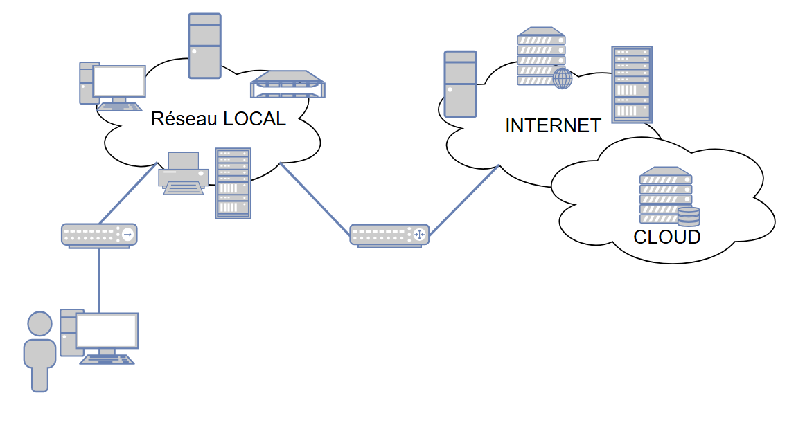
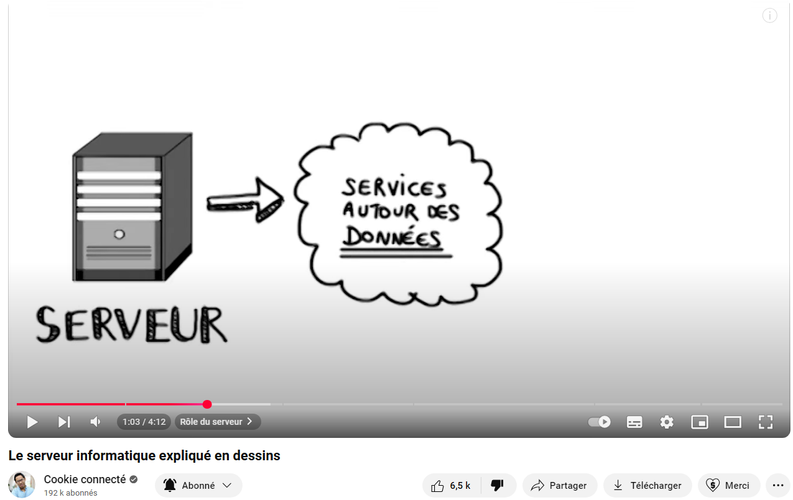
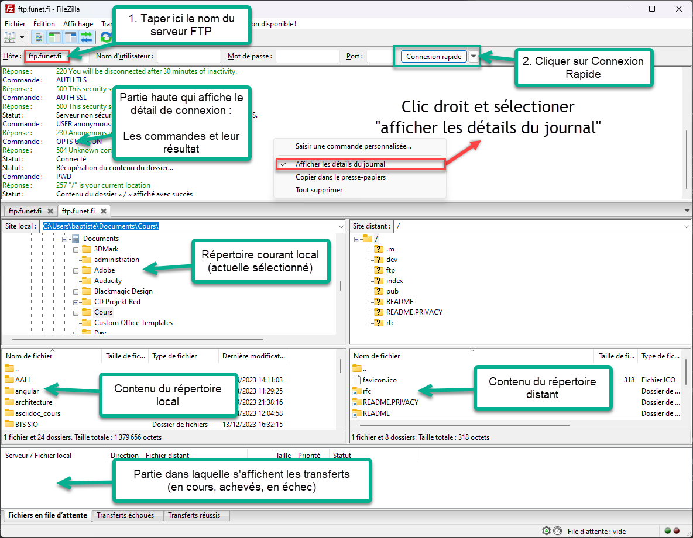
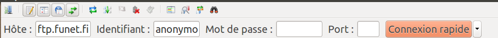
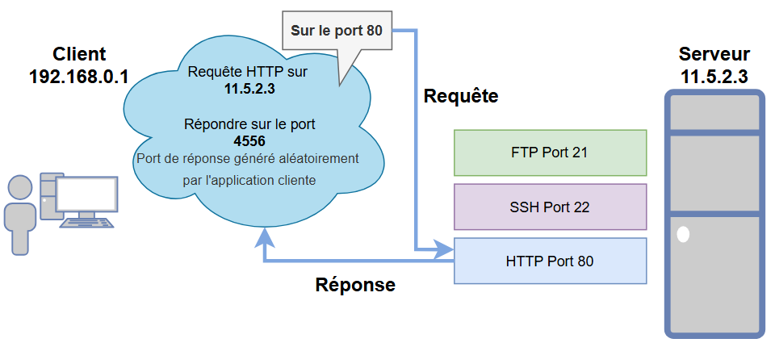
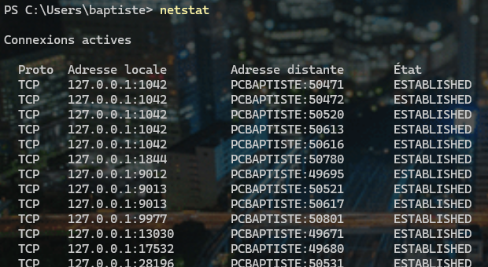

:_chapter:

[[protocoles-reseau-local]]
= Protocoles mise en œuvre dans un réseau local
:_author: Bauer Baptiste
:_duration: 3 heures
:_version_number: 1.0.0
:_version_date: 20/01/2025
:_show_correction: 0
:_show_teacher: 1
include::../../../run_app.adoc[]

== Préambule

Les réseaux informatiques modernes reposent sur une architecture multicouche permettant l'acheminement des données.

*La couche liaison*, via notamment le protocole Ethernet et le mécanisme de résolution d'adresses ARP, assure la communication locale.

*La couche réseau*, grâce au protocole IP et aux algorithmes de routage, étend cette communication à l'échelle globale en permettant l'interconnexion de réseaux distants.

Cette infrastructure constitue le socle sur lequel s'appuient les applications réparties. Ces dernières exploitent les services de communication fournis par les couches sous-jacentes afin de proposer des fonctionnalités avancées aux utilisateurs finaux, formant ainsi la couche applicative du modèle.

[.skill]
****

pass:q[*Objectifs*]

* [x] Appréhender la notion de service, de port d’écoute, de connexion client/serveur.
* [x] Connaître les principaux services ainsi que les protocoles associés.
* [x] Paramétrer l'accès à un service et savoir exploiter un service de base.

//end skill
****

Nous examinerons en détail les protocoles et services de la couche application, qui constituent l'interface entre l'infrastructure réseau et les besoins utilisateurs.

Les architectures de référence, tant le modèle *TCP/IP* que l'approche *OSI*, feront l'objet d'une analyse approfondie lors de la prochaine séance pédagogique, permettant ainsi d'appréhender le cadre conceptuel global des communications réseau.

== Serveurs et Services en ligne

L'Internet relie des millions de serveurs fournissant différents services aux utilisateurs. Dans chaque organisation, les centres informatiques hébergent plusieurs applications web accessibles à distance depuis les postes de travail.

*Le cloud computing* (ou l’informatique en nuage) est un ensemble de services hébergés en ligne, accessibles via un navigateur web. Ces solutions se déclinent en plusieurs catégories :

* Les espaces de stockage distant (type OneDrive ou Box).
* Les ressources de calcul à la demande pour applications complexes (Azure).
* Les logiciels de gestion d'entreprise en mode SaaS pour la dématérialisation des processus.

On distingue deux modèles de déploiement *cloud* : le *cloud public*, accessible à tous via des services comme *iCloud* ou *AWS*, et le cloud privé où l'infrastructure est maintenue dans les datacenters internes d'une organisation qui en assure la gestion exclusive.

* *Visionnez la vidéo* : _Le serveur informatique expliqué en dessins_ de https://youtu.be/CIhalbnBgA4[Cookie Connecté].
+

+
[.question]
****
*Q{counter:_question})*
Quel est le rôle d’un serveur informatique (vous fournirez un exemple bien connu) ?
//end question
****
+
ifeval::[{_show_correction} == 1]
[.answer]
****
_Correction de Q{_question}_

Un serveur de données offre des informations à la demande des clients qui y accèdent. Le serveur web illustre parfaitement ce modèle client-serveur en transmettant des pages web aux navigateurs qui les sollicitent.

****
endif::[]
ifeval::[{_show_correction} == 0]
[.discreet]#_réponse *{_question}* disponible._#
endif::[]
//  end answer ----------
+

[.question]
****
*Q{counter:_question})*
Citez des services connus offerts sur Internet et dans les organisations.
//end question
****
+

ifeval::[{_show_correction} == 1]
[.answer]
****
_Correction de Q{_question}_

Internet propose divers services spécialisés : le Web, qui est le plus répandu, la messagerie électronique, l'accès aux bases de données, les serveurs applicatifs, la messagerie instantanée, ainsi que les protocoles de transfert de fichiers comme FTP.

****
endif::[]
ifeval::[{_show_correction} == 0]
[.discreet]#_réponse *{_question}* disponible._#
endif::[]
+
[.question]
****
*Q{counter:_question})*
Quelles sont les principales différences entre un ordinateur client et un ordinateur serveur ?
//end question
****
+

ifeval::[{_show_correction} == 1]
[.answer]
****
_Correction de Q{_question}_

Un serveur se distingue d'un ordinateur standard par sa conception orientée haute disponibilité :

* Une architecture spécifique en format rack ou lame, permettant leur intégration dans des baies au sein des datacenters.

* Des composants haute performance avec redondance intégrée : alimentation double, systèmes RAID pour les disques, mémoire ECC et processeurs serveur optimisés pour le traitement continu.

****
endif::[]
ifeval::[{_show_correction} == 0]
[.discreet]#_réponse *{_question}* disponible._#
endif::[]
//  end answer ----------

== La notion de client/serveur

* *Visionnez la vidéo* : _Comprendre le serveur web en 2 minutes_ de https://www.youtube.com/watch?v=msB9AvJ4bTM[Cookie Connecté].

[.question]
****
*Q{counter:_question})*
Qu’appelle-t-on « logiciel serveur » ?
//end question
****

ifeval::[{_show_correction} == 1]
[.answer]
****
_Correction de Q{_question}_

Un *logiciel serveur* désigne une application réseau qui fournit des services, comme le serveur Apache. Il fonctionne selon un modèle de traitement des requêtes : réception, traitement et réponse.

*_Le terme "serveur" fait référence à la fois au logiciel et à la machine physique qui l'héberge._*
****
endif::[]
ifeval::[{_show_correction} == 0]
[.discreet]#_réponse *{_question}* disponible._#
endif::[]

[.question]
****
*Q{counter:_question})*
Qu’appelle-t-on « logiciel client » ?
//end question
****

ifeval::[{_show_correction} == 1]
[.answer]
****
_Correction de Q{_question}_

Un *logiciel client* est un programme qui consomme des services réseau, comme Firefox pour le web. Il émet des requêtes au serveur et traite les réponses reçues.

*_Le mot "client" désigne également l'ordinateur qui exécute ce logiciel._*

****
endif::[]
ifeval::[{_show_correction} == 0]
[.discreet]#_réponse *{_question}* disponible._#
endif::[]
//  end answer ----------

== Services et protocoles de communication

* *Visionnez la vidéo* : _Comprendre le Web Les protocoles_ de https://youtu.be/Ds7TvEvM9z4?list=PLtY_3d8bxqAodgaDtIHr7DY3My7tZx9o1[albidaya ville].

[.question]
****
*Q{counter:_question})*
Qu’est-ce qu’un protocole de communication et quelle est son utilité ?

//end question
****

// ---------- answer
ifeval::[{_show_correction} == 1]
[.answer]
****
_Correction de Q{_question}_

Un *protocole* réseau définit un ensemble standardisé de règles permettant la communication entre différents systèmes informatiques.** Il spécifie le format et l'ordre des messages échangés**, ainsi que les actions à entreprendre lors de la transmission ou réception de ces messages.

Par exemple, le protocole *HTTP* régit les échanges web, tandis que FTP gère le transfert de fichiers, chacun ayant ses propres conventions tout en s'appuyant sur les protocoles de couche inférieure.
****
endif::[]
ifeval::[{_show_correction} == 0]
[.discreet]#_réponse *{_question}* disponible._#
endif::[]
//  end answer ----------

[.question]
****
*Q{counter:_question})*
Qu’est-ce qu’un protocole de bas niveau ? Donnez quelques exemples.
//end question
****

// ---------- answer
ifeval::[{_show_correction} == 1]
[.answer]
****
_Correction de Q{_question}_

Un *protocole de bas* niveau est un protocole commun à toutes les machines, qui gère les échanges entre elles. Par exemple TCP, UDP, IP, ARP, etc.

****
endif::[]
ifeval::[{_show_correction} == 0]
[.discreet]#_réponse *{_question}* disponible._#
endif::[]
//  end answer -----

[.question]
****
*Q{counter:_question})*
Qu’est-ce qu’un protocole de haut niveau ou protocole applicatif ? Donnez 4 exemples.
//end question
****

// ---------- answer
ifeval::[{_show_correction} == 1]
[.answer]
****
_Correction de Q{_question}_

Un *protocole de haut* niveau est un protocole *applicatif*, destiné à permettre le dialogue entre une application serveur et une application cliente spécifique, par exemple :

* HTTP est un protocole qui définit comment un serveur Web et un client Web (le navigateur) vont communiquer entre eux ;
* HTTPS définit la même chose mais la communication va être cryptée ;
* FTP est un protocole qui définit comment un serveur stockant des fichiers permet à un client de les télécharger ;
* SMTP est un protocole qui définit comment un courriel est envoyé.

****
endif::[]
ifeval::[{_show_correction} == 0]
[.discreet]#_réponse *{_question}* disponible._#
endif::[]
//  end answer ----------

[TIP]
====
Un** protocole de haut niveau** concerne les règles structurant l’organisation de l’information.

Dans l’exercice qui suit, nous analyserons la manière dont une requête cliente est structurée afin d’être acceptée et interprétée correctement par le serveur, ainsi que les informations présentes dans la réponse, entre autres.
====

=== Etude du protocole FTP (File Transfert Protocol)

Le *protocole FTP* est conçu pour permettre le dépôt et le transfert de fichiers depuis ou vers un serveur. Pour cela, on peut recourir à un client FTP doté d’une interface graphique, comme Filezilla.

Voici un exemple de connexion au serveur FTP `ftp.funet.fi` (que vous pouvez essayer), accompagné d’une description de certaines commandes transmises par le logiciel client conformément au protocole FTP.

Les codes de réponse des serveurs FTP peuvent être consultés via le lien suivant : https://fr.wikipedia.org/wiki/Liste_des_codes_des_r%C3%A9ponses_d%27un_serveur_FTP.

* Lancez un client *FTP* ( comme _FileZilla_).
* Tapez le nom de l’*hôte distant*, c’est-à-dire celui du serveur *FTP*.
* Un clic sur « *Connexion rapide* » choisit automatiquement « *anonymous* » comme identifiant par défaut, *sans mot de passe*, et le port *21* comme port par défaut.

* Analysez attentivement les différentes actions réalisées et répertoriées dans la section supérieure de l'interface du logiciel, en utilisant la barre de défilement verticale pour remonter l'historique.

* Procédez au téléchargement d’un fichier depuis le serveur FTP, comme le fichier « README » situé à la racine de l’arborescence.

Un exemple des commandes affichées est proposé sur la page suivante. Votre affichage peut différer quelque peu en fonction de la version de votre outil client.

[source,php]
----
Statut :	Résolution de l’adresse de ftp.funet.fi
Statut :	Connexion à [2001:708:10:8::2]:21…
Statut :	Connexion établie, attente du message d’accueil…
Statut :	Serveur non sécurisé, celui‐ci ne prend pas en charge FTP sur TLS.
Statut :	Connecté
Statut :	Récupération du contenu du dossier…
Statut :	Contenu du dossier « / » affiché avec succès
Statut :	Résolution de l’adresse de ftp.funet.fi
Statut :	Connexion à [2001:708:10:8::2]:21…
Statut :	Connexion établie, attente du message d’accueil…
Réponse :	220---------- Welcome to Pure-FTPd [privsep] [TLS] ----------
Réponse :	220-You are user number 4 of 1000 allowed.
Réponse :	220-Local time is now 18:11. Server port: 21.
Réponse :	220-Only anonymous FTP is allowed here
Réponse :	331 Any password will work
Commande :	PASS **************
Réponse :	230 Any password will work
Commande :	SYST
Réponse :	215 UNIX Type: L8
Réponse :	220 You will be disconnected after 30 minutes of inactivity.
Commande :	AUTH TLS
Réponse :	500 This security scheme is not implemented
Commande :	AUTH SSL
Réponse :	500 This security scheme is not implemented
Statut :	Serveur non sécurisé, celui‐ci ne prend pas en charge FTP sur TLS.
Commande :	USER anonymous
Réponse :	230 Anonymous user logged in
Commande :	OPTS UTF8 ON
Réponse :	504 Unknown command
Statut :	Connecté
Statut :	Récupération du contenu du dossier…
Commande :	PWD
Réponse :	257 "/" is your current location
Statut :	Contenu du dossier « / » affiché avec succès
Réponse :	421 Timeout - try typing a little faster next time
Statut :	Connexion interrompue par le serveur
Réponse :	421 Timeout - try typing a little faster next time
Statut :	Connexion interrompue par le serveur
----

.Lors du téléchargement :
[source,php]
----

Commande :	RETR README
Réponse :	150-Accepted data connection
Réponse :	150 16.6 kbytes to download
Réponse :	226-File successfully transferred
Réponse :	226 0.013 seconds (measured here), 1.27 Mbytes per second
Statut :	Transfert de fichier réussi, 17,4 Ko transférés en 1 seconde
----

[.question]
****
*Q{counter:_question})*
Dites en justifiant si la connexion a été correctement établie.
//end question
****

// ---------- answer
ifeval::[{_show_correction} == 1]
[.answer]
****
_Correction de Q{_question}_

La connexion a été établie ⇒ On a des codes réponses d’achèvement positif de type 2XX. On peut même voir (entre autre) qu’on est le 4 ième utilisateur sur les 1000 utilisateurs autorisés à se connecter simultanément.

****
endif::[]
ifeval::[{_show_correction} == 0]
[.discreet]#_réponse *{_question}* disponible._#
endif::[]
//  end answer ----------

[.question]
****
*Q{counter:_question})* Dites en justifiant si la connexion a nécessité l’envoi d’un nom d’utilisateur et d’un mot de passe.

//end question
****

// ---------- answer
ifeval::[{_show_correction} == 1]
[.answer]
****
_Correction de Q{_question}_

Non. On est sur un FTP acceptant les connexions *anonymes*, c'est-à-dire sans besoin d’authentification. Le protocole FTP exige un nom d’utilisateur et un mot de passe. Le nom d’utilisateur « anonymous » est alors donné automatiquement, mais aucun mot de passe n’est requis.
ou plutôt n’importe quel mot de passe est accepté pour un compte « anonymous », comme l’indique le message « Any password will work »

****
endif::[]
ifeval::[{_show_correction} == 0]
[.discreet]#_réponse *{_question}* disponible._#
endif::[]
//  end answer ----------

[.question]
****
*Q{counter:_question})*
Expliquez le rôle des commandes `SYST`, `PWD` et `RETR`
//end question
****

// ---------- answer
ifeval::[{_show_correction} == 1]
[.answer]
****
_Correction de Q{_question}_

|===
|Commande |Rôle

|SYST
|Permet de connaître le système sur lequel le serveur FTP est installé.

|PWD
|Permet de connaître la position dans l’arborescence : on est ici à la racine du serveur FTP.
Ce n’est pas forcément la racine réelle de l’arborescence complète du système de fichiers du serveur, mais la racine de l’arborescence présentée (accessible) à l’utilisateur.

|RETR
|Permet de télécharger un fichier.
|===

****
endif::[]
ifeval::[{_show_correction} == 0]
[.discreet]#_réponse *{_question}* disponible._#
endif::[]
//  end answer ----------

== Logiciels clients et serveurs

[.question]
****
*Q{counter:_question})* Complétez le tableau suivant qui donne un ou des exemples de *logiciels client* et de *logiciels serveur* couramment utilisés dans le cadre des services définis.

|===
|Service |Serveur |Applications clients |Applications serveur

|Transfert d'une page en HTML correspondant à une URL
|Serveur Web
|
ifeval::[{_show_correction} == 1]
Firefox
Chrome
endif::[]
|
ifeval::[{_show_correction} == 1]
Apache
IIS
endif::[]

|Envoi et réception de mél
|Serveur de messagerie
|
ifeval::[{_show_correction} == 1]
Evolution
Thunderbird
endif::[]
|
ifeval::[{_show_correction} == 1]
Postfix
endif::[]

|Transfert d'un fichier
|Serveur FTP
|
ifeval::[{_show_correction} == 1]
Filezilla
endif::[]
|
ifeval::[{_show_correction} == 1]
ProFTPD
endif::[]

|Administration distante sécurisée d'un serveur
|Serveur SSH
|
ifeval::[{_show_correction} == 1]
Client SSH
Putty
endif::[]
|
ifeval::[{_show_correction} == 1]
SSHD
endif::[]

|Administration distante non sécurisée d'un serveur
|Serveur Telnet
|
ifeval::[{_show_correction} == 1]
Client Telnet
(Putty)
endif::[]
|
ifeval::[{_show_correction} == 1]
Telnetd
endif::[]

|Fourniture d'une adresse IP correspondant à un nom de domaine
|Serveur DNS
|Resolver client
|Bind

|Attribution d'une configuration réseau (adresse IP, masque, DNS, etc.)
|Serveur DHCP
|Processus
|Client DHCP, DHCPD
|===

//end question
****

== Les ports

Sur un serveur disposant d'une adresse IP, plusieurs services (HTTP, FTP, etc.) peuvent cohabiter, mais :

* Comment le serveur « sait-il » à quel service est destinée une requête ?
* Comment un client peut-il recevoir d'un serveur plusieurs réponses à ses requêtes sans que tout se mélange ?

. Le serveur écoute sur un numéro de *port bien défini*.
. Le client envoie sa requête (selon le protocole) sur ce *port* et génère pour lui-même un numéro de *port aléatoire* sur lequel le serveur pourra lui répondre.
. Le serveur renvoie la réponse sur le *port aléatoire défini par le client*.

[TIP]
====
Les ports sont des identifiants numériques utilisés pour spécifier le service concerné. Ces numéros sont codés sur 2 octets, permettant ainsi un total de *65 535* ports possibles (le port 0 étant généralement non utilisé).
L'association entre une *adresse IP* et un *numéro de port* forme ce qu'on appelle un *socket* (_terme signifiant "connecteur" en anglais_), qui permet d'identifier précisément le service actif sur une machine donnée.
====

[.question]
****
*Q{counter:_question})* Complétez le tableau ci-dessous illustrant les ports par défaut des services connus

|===
|Service |Serveur |Protocole |Port

|Transfert d'une page en HTML correspondante à une URL
|Serveur WEB
|HTTP
|
ifeval::[{_show_correction} == 1]
80
endif::[]

|Envoi de mél
|Serveur de messagerie
|SMTP
|
ifeval::[{_show_correction} == 1]
25
endif::[]

|Réception de mél
|Serveur de messagerie
|POP/IMAP
|
ifeval::[{_show_correction} == 1]
110/143
endif::[]

|Transfert d'un fichier
|Serveur FTP
|FTP
|
ifeval::[{_show_correction} == 1]
21
endif::[]

|Administration distante sécurisée d'un serveur
|Serveur SSH
|SSH
|
ifeval::[{_show_correction} == 1]
22
endif::[]

|Administration distante non sécurisée d'un serveur
|Serveur Telnet
|TELNET
|
ifeval::[{_show_correction} == 1]
23
endif::[]

|Fourniture d'une adresse IP correspondant à un nom de domaine
|Serveur DNS
|DNS
|
ifeval::[{_show_correction} == 1]
53
endif::[]

|Attribution d'une configuration réseau (adresse IP, masque, DNS, etc)
|Serveur DHCP
|DHCP
|
ifeval::[{_show_correction} == 1]
67
endif::[]
|===

//end question
****

Les numéros de port entre 0 et 1023 sont réservés aux applications standards et sont généralement appelés les Well-Known ports. Ces numéros sont attribués par l'IANA (Internet Assigned Numbers Authority).

Les ports compris entre *1024* et *49151* sont des ports inscrits (ou enregistrés). Ils sont réservés à des applications largement utilisées, comme le port 3306 qui est dédié au serveur MySQL.

Sous Linux, la liste des Well-Known ports ainsi que certains ports inscrits, accompagnés des noms des services correspondants, est accessible dans le fichier `/etc/services`.

Sous Windows, ce fichier est situé par défaut à l’emplacement : `C:\Windows\System32\drivers\etc\services`.

Enfin, les numéros de port allant de *49151* à *65535* sont désignés comme ports dynamiques (ou privés). Ces derniers sont généralement utilisés comme ports source par les applications clientes lorsqu'elles établissent une connexion avec un serveur.

[TIP]
====
Les protocoles applicatifs ont généralement leur équivalent sécurisé (notamment transfert des données chiffrées et authentification du destinataire et/ou de l’émetteur) :

Port 443 pour le protocole HTTPS, ports 587, 465, 587 pour SMTP, 995 pour POP, etc.
====

La commande `netstat` (sur Linux et sur Windows) permet de visualiser l’état des connexions :

Sur les distributions Linux récentes, la commande est : `ss`

[.question]
****
*Q{counter:_question})*
Quels sont les services en écoute sur la machine "servDebian" (state LISTEN) ?

[source,bash]
----
root@servDebian:~# netstat -taun
Proto Recv-Q Send-Q    Local Address       Foreign Address        State
tcp      0     0          0.0.0.0:22           0.0.0.0:*          LISTEN
tcp      0     0        127.0.0.1:25           0.0.0.0:*          LISTEN
tcp      0     0        127.0.0.1:3306         0.0.0.0:*          LISTEN
tcp      0     0     10.22.60.100:22    172.16.160.100:52987      ESTABLISHED
----
//end question
****

// ---------- answer
ifeval::[{_show_correction} == 1]
[.answer]
****
_Correction de Q{_question}_

3 services en écoute (state LISTEN) :

* service SSH : port 22
* service de messagerie : port 25
* service de base de données avec MySQL : port 3306
****
endif::[]
ifeval::[{_show_correction} == 0]
[.discreet]#_réponse *{_question}* disponible._#
endif::[]
//  end answer ----------

[.question]
****
*Q{counter:_question})*
Quelle est la connexion établie sur la machine "servDebian" (state ESTABLISHED) ? Vous préciserez l’adresse IP et le port du client ainsi que l’adresse IP et le port du serveur.
//end question
****

// ---------- answer
ifeval::[{_show_correction} == 1]
[.answer]
****
_Correction de Q{_question}_

Une connexion établie (state ESTABLISHED) :
adresse IP : port du serveur ==> 10.22.60.100:22
adresse IP : port du client ==> 172.16.160.100:52987

Le poste d’adresse IP 172.16.160.100 est connecté au serveur SSH de la machine.

****
endif::[]
ifeval::[{_show_correction} == 0]
[.discreet]#_réponse *{_question}* disponible._#
endif::[]
//  end answer ----------