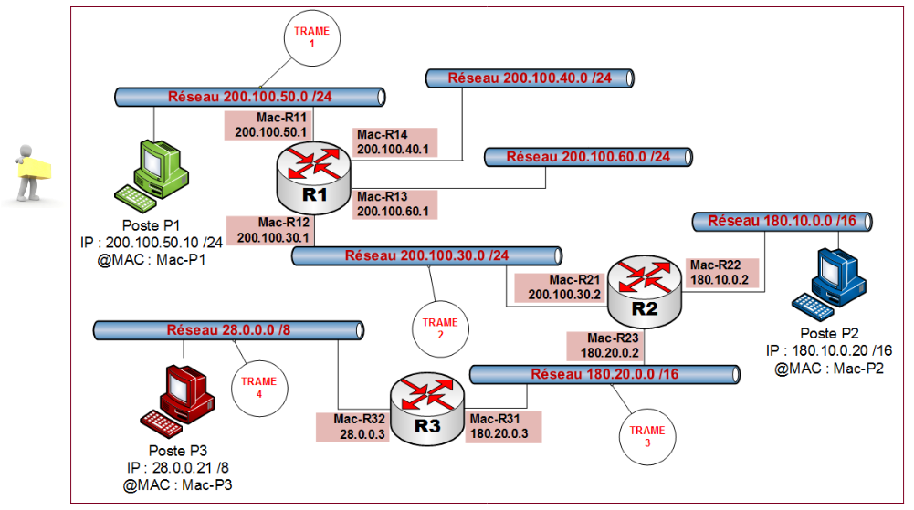

:_exercise:
[[exercice_reencapsulation]]
= Réencapsulation
include::../../../../../run_app.adoc[]

Le poste P1 (`200.100.50.10`) souhaite envoyer un paquet à P3 (`28.0.0.21`) D'après le schéma ci-dessous, le paquet va traverser successivement 4 réseaux et donc être encapsulé dans 4 trames successives.

[.question]
****
*Q{counter:_question})*
Q1. Retrouver le format (en-têtes) de chacune des trames, circulant successivement sur chacun des 4 réseaux traversés.

//end question
****

.TRAME 1 (Entre P1 et R1)
|===
|MAC Destinataire |Mac source |IP Source |IP Destinataire |TTL |Données

|
ifeval::[{_show_correction} == 1]
Mac-R11
endif::[]
|
ifeval::[{_show_correction} == 1]
Mac-P1
endif::[]
|
ifeval::[{_show_correction} == 1]
200.100.50.10
endif::[]
|
ifeval::[{_show_correction} == 1]
28.0.0.21
endif::[]
|128
|« Blablabla »

|===

.TRAME 2 (Entre R1 et R2)
|===
|MAC Destinataire |Mac source |IP Source |IP Destinataire |TTL |Données

|
ifeval::[{_show_correction} == 1]
Mac-R21
endif::[]
|
ifeval::[{_show_correction} == 1]
Mac-R12
endif::[]
|
ifeval::[{_show_correction} == 1]
200.100.50.10
endif::[]
|
ifeval::[{_show_correction} == 1]
28.0.0.21
endif::[]
|
ifeval::[{_show_correction} == 1]
127
endif::[]
|« Blablabla »

|===

.TRAME 3 (Entre R2 et R3)
|===
|MAC Destinataire |Mac source |IP Source |IP Destinataire |TTL |Données

|
ifeval::[{_show_correction} == 1]
Mac-R31
endif::[]
|
ifeval::[{_show_correction} == 1]
Mac-R23
endif::[]
|
ifeval::[{_show_correction} == 1]
200.100.50.10
endif::[]
|
ifeval::[{_show_correction} == 1]
28.0.0.21
endif::[]
|
ifeval::[{_show_correction} == 1]
126
endif::[]
|« Blablabla »

|===

.TRAME 4 (Entre R3 et P3)
|===
|MAC Destinataire |Mac source |IP Source |IP Destinataire |TTL |Données

|
ifeval::[{_show_correction} == 1]
Mac-P3
endif::[]
|
ifeval::[{_show_correction} == 1]
Mac-R32
endif::[]
|
ifeval::[{_show_correction} == 1]
200.100.50.10
endif::[]
|
ifeval::[{_show_correction} == 1]
28.0.0.21
endif::[]
|
ifeval::[{_show_correction} == 1]
125
endif::[]
|« Blablabla »

|===

[.question]
****
*Q{counter:_question})*
Résumez le travail du routeur pour la ré-encapsulation des paquets.
//end question
****

// ---------- answer
ifeval::[{_show_correction} == 1]
[.answer]
****
_Correction de Q{_question}_

* Lorsque le routeur reçoit une trame, il supprime les adresses MAC pour connaître l’adresse IP de destination et repérer sur quelle interface il doit envoyer le paquet qui sera ré-encapsulé ;
* Il Identifie la nouvelle adresse MAC de destination et ré-encapsule le paquet dans un nouvel entête.
* Il décrémente Le TTL de 1.
****
endif::[]
ifeval::[{_show_correction} == 0]
[.discreet]#_réponse *{_question}* disponible._#
endif::[]
//  end answer ----------