:_chapter:

[[client-server]]
= TD : Modèle client-serveur et architectures n-tiers
:_author: Bauer Baptiste
:_duration: 3 heures
:_version_number: 1.0.0
:_version_date: 20/01/2025
:_show_correction: 1
:_show_teacher: 1
include::../../../run_app.adoc[]

== Préambule

Ce cours a pour objectif de *mettre en place et d’observer le fonctionnement d’une architecture client-serveur* dans un environnement réseau. Il s'appuie sur des concepts théoriques et pratiques pour fournir une compréhension complète des mécanismes impliqués.

[.skill]
****

pass:q[*Objectifs*]

* [x] Comprendre le fonctionnement du client/serveur (à l'aide du simulateur)
* [x] Mettre en place une architecture client / serveur 3 tiers
Objectifs intermédiaires :
** [x] Configurer un réseau local comportant 2 sous-réseaux (Couche 3 - Réseau)
** [x] Comprendre la notion de port d'écoute (Couche 4 - Transport)
*** [x] Notion de port TCP
*** [x] Notion de service associé à un port
*** [x] Notion de port par défaut (port bien connu)
** [x] Comprendre la notion de serveur d'application (Couche 7 - Application)
*** [x] Notion de service : installé / démarré / configuré
*** [x] Notion d'applicatif client (navigateur, requêteur SQL)
** [x] Mettre en place une architecture client/serveur 3 tiers de type "universel" (simulation)
*** [x] Installation / Configuration d'un serveur WEB
*** [x] Installation / Configuration d'un serveur de bases de données
*** [x] Mise en place d'un mini-site web avec accès à une base de données pour simuler une architecture 3 tiers.

//end skill
****

[.resourcesstudent]
****
{_bloc_resources_student_label}

* Simulateur réseau de *Sopireminfo version 3.0*

//end resourcesstudent
****

=== Partie 1 : Mise en place du réseau local

La société *Skynet* possède un *service Marketing* et un *service Comptabilité* et souhaite mettre en place un réseau local pour ses employés.
Elle dispose d'un réseau local structuré en deux sous-réseaux distincts, chacun dédié à un service. Afin de simplifier la simulation, nous travaillerons avec une dizaine de postes au total.

|===
2+|*Le réseau du service Comptabilité*

|*Composition*
|4 postes, C1, C2, C3, C4

|*Équipement réseau*
|Un commutateur doté de 9 ports

|*Adressage IP*
|192.168.100.0/24

|*Adresses attribuées*
|192.168.100.11 à 192.168.100.14

|===

|===
2+|*Le réseau du service Marketing*

|*Composition*
|6 postes, M1, M2, M3, M4, M5, M6

|*Équipement réseau*
|Un commutateur doté de 15 ports

|*Adressage IP*
|192.168.200.0/24

|*Adresses attribuées*
|192.168.200.15 à 192.168.100.20

|===

Un autre équipement, un routeur, assure la connexion entre les deux réseaux. Les interfaces du routeur seront configurées avec l’adresse IP la plus élevée de chaque sous-réseau.

Pour tester votre configuration, réalisez les simulations en mode « sans démonstration », puis en mode « pas à pas » afin de bien analyser et comprendre les mécanismes en jeu.

* Mise en place de l'infrastructure physique (Couche 1 et 2) et réseau (Couche 3)

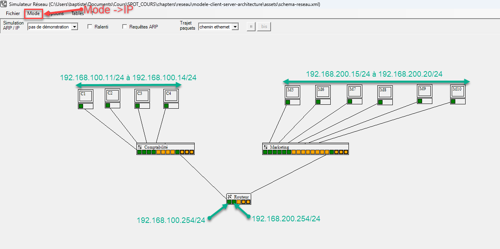

[IMPORTANT]
====
Ne pas oublier d'affecter la passerelle par défaut à chaque station
====

[.question]
****
*En Pratique {counter:_question} :*
Effectuons quelques tests pour vérifier la configuration du réseau.

* Faire une commande `Ping` :
** Depuis le poste *C1* vers le poste *M2*
** Depuis le poste *C2* vers le poste *M4*

Constatez que l'aller-retour se fasse correctement.
//end question
****

[.question]
****
*En Pratique {counter:_question} :*
Ajouter deux postes sur le réseau marketing.

* Un serveur d'application WEB :

|===
2+|Configuration du nom : SRVWEB

|Configuration IP :
|192.168.200.1/24

|===

* Un serveur de base de données :

|===
2+|Configuration du nom : SRVDB

|Configuration IP :
|192.168.200.2/24

|===

Le réseau  obtenu est schématisé ci-dessous :

image::images/schema2.png[]

//end question
****

=== Partie 2 : serveur WEB

Un serveur web est un ordinateur qui exécute un service HTTP, chargé de répondre aux requêtes HTTP provenant du réseau. L'application cliente associée à un serveur HTTP est généralement un navigateur web. Lorsque l'utilisateur entre une URL dans la barre d'adresse, une requête est envoyée au service HTTP actif sur le serveur.

Par défaut, le service HTTP utilise le port 80. Cependant, un autre port peut être utilisé, soit pour renforcer la sécurité, soit pour permettre à un serveur d'héberger plusieurs sites web ou services distincts.

Nous allons effectuer les opérations suivantes :

* Mettre en place le service *HTTP* sur "*SRVWEB*"
* Installer un navigateur sur le poste M2 pour tester le bon fonctionnement du serveur WEB.

[.question]
****
*En Pratique {counter:_question} :* Mise en place du serveur WEB

* En mode *Transport*, vérifier la liste des ports écoutés sur *SRVWEB*.
(Clic droit sur *SRVWEB*, menu *Tables*, sous-menu *Ports écoutés*)
+
[TIP]
====
Cette liste devrait être vide.
====

* En mode *Application*, installer le service WEB sur *SRVWEB* en procédant de la manière suivante :
** Clic droit / Logiciels installes sur *SRVWEB*.
** Sélectionner *Serveur http* dans la liste des logiciels serveurs.
** Cliquer sur *installer*.
** Cliquer ensuite sur *administrer* pour vérifier le paramétrage par défaut du service.

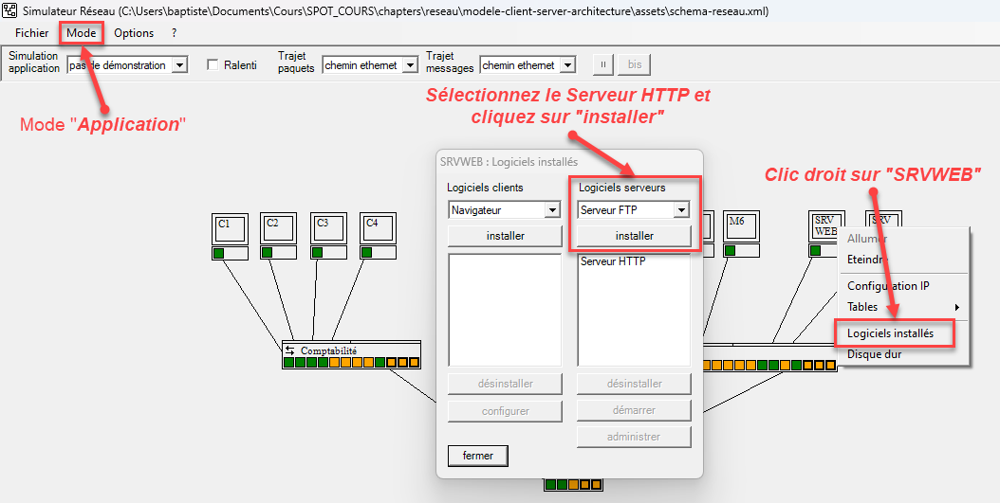

Vérifiez la configuration du serveur WEB :

* Par défaut, le serveur WEB est configuré pour écouter sur le port 80. Vérifiez que le port 80 est bien écouté.
* Le service démarre automatiquement au démarrage de la machine.

Pour personnaliser *SRVWEB*, nous allons écrire nos propres pages web, ou plutôt modifier les pages WEB déjà présentes sur le serveur.
Les pages sont stockés sur le disque dur du serveur, dans le dossier `c:\www`.

En mode *Application* :

* Clic droit / Disque dur sur *SRVWEB*.
* Sélectionner le répertoire `c:\www` puis le fichier `f001.html`.
* Modifier la partie variable, par exemple comme suit pour la page f001.html :

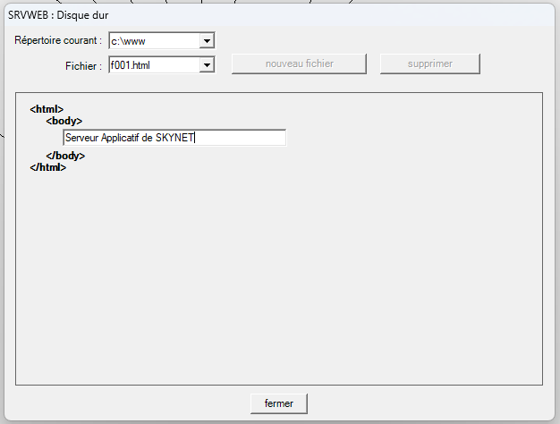

Modifiez d'autres pages pour personnaliser le site.

|===
|Fichier |Modification proposée

|f001.html
|Serveur Applicatif de SKYNET

|f002.html
|Vous êtes sur la page f002

|f003.html
|*alert('* Bienvenue sur le site de SKYNET**');**

|f004.php
|*echo('* Application PHP *');*

|f005.html
|<a href='f002.html'> Click here</a>
|===

//end adquestion
****

[.question]
****
*En Pratique {counter:_question} :* Installation du navigateur sur le poste C1

En mode *Application*, installer le navigateur WEB sur le poste C1 en procédant de la manière suivante :

* Clic droit / Logiciels installes sur *C1*.
* Sélectionner *Navigateur* dans la liste des logiciels clients.
* Cliquer sur *installer*.

[NOTE]
====
Il n'y a pas de paramètre supplémentaire à configurer pour ce logiciel.
====

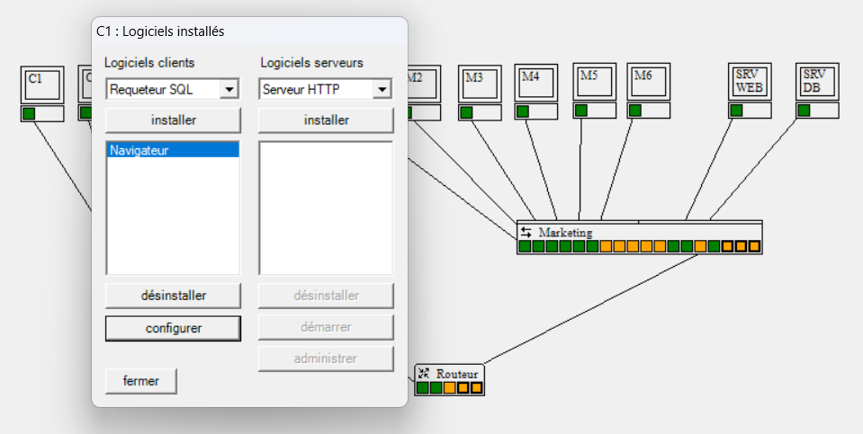

Tester le bon fonctionnement du  navigateur WEB :

* Clic droit / Navigateur sur *C1*.
* Taper les URLs des pages HTML que vous avez modifiées dans l'étape précédente.

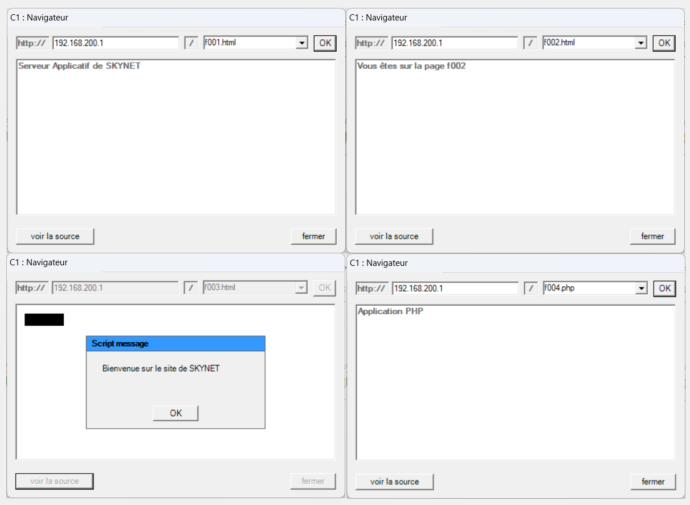

//end question
****

[.question]
****
*En Pratique {counter:_question} :* Modification du port d'écoute pour le service HTTP

Nous avons constaté que :

. Par défaut, le service *HTTP* écoute les requêtes sur le port 80.
. De même, le navigateur envoie ses requêtes au serveur web sur ce même port par défaut, sans qu'il soit nécessaire de le spécifier, car il s'agit du port standard pour les communications *HTTP*.

Configurer le serveur pour qu'il n'écoute plus sur le port `80` mais le port `8080` par exemple :

* Clic droit / Logiciels installés  sur *SRVWEB*.
* Sélectionner *Serveur HTTP* et cliquer sur *Administrer*.
* Modifier le n° de port d'écoute et valider
* Vérifier en mode transport les ports écoutés sur *SRVWEB*.

image::images/screen5.png[]

Vous devriez voir le port `8080` dans la liste des ports écoutés.

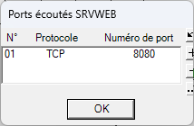

//end question
****

[.question]
****
*En Pratique {counter:_question} :* Accès au serveur WEB sur le port `8080`

* Vérifier que le serveur ne répond plus sur le port par défaut (80) en utilisant le navigateur du poste C1.

Si on ne spécifie pas le port par défaut, c'est alors le port 80 qui est utilisé. Pour accéder à un serveur sur un autre port, il faut spécifier ce port dans l'URL.

Exemple :

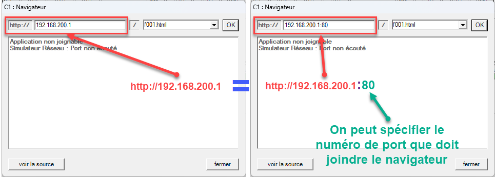

//end question
Modifier donc l'URL afin de joindre le port 8080 du serveur WEB.

[NOTE]
====
Le poste qui tente de joindre le serveur WEB n'a pas besoin d'appartenir au même réseau que le serveur.

====

****

=== Partie 3: Serveur de base de données (SGBDR)

Un *serveur de base de données* est une machine hébergeant un *Système de Gestion de Bases de Données Relationnelles (SGBDR)*. Ce dernier est configuré pour écouter et répondre aux requêtes SQL provenant d'applications clientes. Les clients d'un *SGBDR* peuvent être divers outils ou logiciels, tels qu'un requêteur SQL.

Le simulateur utilisé dans cette activité intègre un requêteur SQL permettant de tester des requêtes simples et d'observer leur fonctionnement.

Par défaut, le *SGBDR* fourni par le simulateur est configuré pour utiliser le port 1403, bien qu'il soit possible de spécifier un autre port si nécessaire.

Nous allons effectuer les étapes suivantes :

* Configurer le service *SGBDR* sur le serveur nommé "*SRVDB*".
* Installer un outil de requête SQL sur le poste C2 pour tester et valider le bon fonctionnement du *SGBDR*.

[.question]
****
*En Pratique {counter:_question} :* Mise en place du *SGBDR* sur *SRVDB*

* En mode *Transport*, vérifier la liste des ports écoutés sur *SRVDB*.
+
(_clic droit sur SrvWeb, menu Tables, sous-menu Ports écoutés_)

* Installer le SGBDR sur *SRVDB*.

[NOTE]
====
L'installation et la configuration du *SGBDR* est similaire à celle du serveur WEB.
====

En cliquant sur "administrer", vous pourrez visualiser les paramètres de configuration du *SGBDR*.

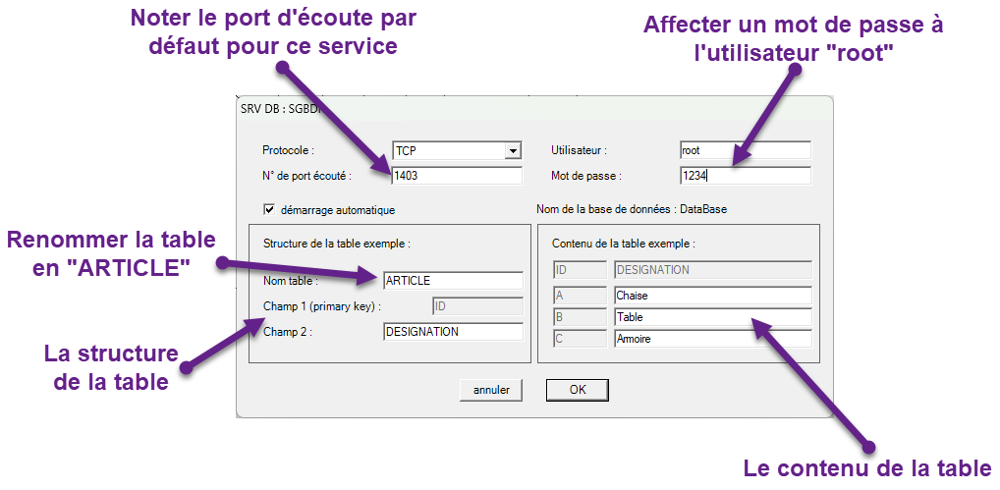
//end question
****

[.question]
****
*En Pratique {counter:_question} :* Installation du requêteur SQL sur le poste C2

* En mode *Application*, installer le requêteur SQL sur le poste C2 en procédant de la manière suivante :
** Clic droit / Logiciels installés sur *C2*.
** Sélectionner *Requêteur SQL* dans la liste des logiciels clients.
** Cliquer sur *installer*.
** Cliquer ensuite sur configurer pour vérifier qu'il est bien configuré pour se connecter sur le port 1403

[NOTE]
====
Noter qu'il est possible de définir la connexion par défaut, pour éviter de saisir les paramètres lors de l'utilisation du requêteur.

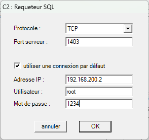
====

//end question
****

[.question]
****
*En Pratique {counter:_question} :* utilisation du requêteur SQL

* En mode *Application*, lancer le requêteur SQL sur le poste C2.
* Clic droit / Requêteur SQL sur *C2*.
* Saisir les paramètres de connexion au serveur de base de données *SRVDB*. (Si nécessaire)
* Tester la connexion en exécutant une requête SQL simple, par exemple :

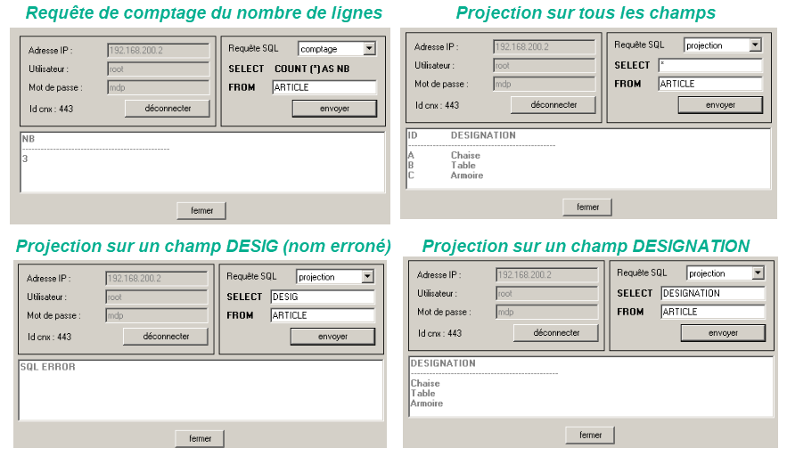

[NOTE]
====
Vous remarquez divers allers-retours pour montrer qu'un jeu d'enregistrements peut nécessiter plusieurs trames (même si – dans la réalité – ce n'est pas forcément une par ligne).
====
//end question
****

=== Partie 4 : Architecture 3 tiers

Une architecture *client/serveur N-tiers* désigne un système dans lequel plusieurs applications collaborent en communiquant pour répondre aux besoins des utilisateurs. Dans ce modèle :

* Une application qui *offre un service* est appelée *serveur*.
* Une application qui *sollicite un service* est appelée *cliente*.

L'application cliente envoie une requête au serveur, qui répond en fournissant un résultat.

En général, une architecture logicielle N-tiers correspond également à une architecture matérielle N-tiers, c’est-à-dire répartie sur *N machines distinctes*.

*Exemple d'une architecture classique client/serveur web (client/serveur universel)*

Pour ce cas concret, nous allons mettre en œuvre une infrastructure classique illustrant une architecture client/serveur web :

* *Navigateur web* :
+
Le navigateur joue le rôle de client HTTP en envoyant des requêtes au service HTTP hébergé sur un serveur web, afin de demander et recevoir des ressources, telles que des pages web ou des fichiers.

* *Serveur web* :
+
Le serveur web ne se contente pas de fournir des pages statiques. Il est capable de traiter des requêtes complexes, d'exécuter des programmes écrits dans des langages tels que PHP ou ASP, et de générer des pages dynamiques en fonction des besoins. Par conséquent, il peut être considéré comme un serveur d'applications, car il intègre des fonctions de traitement et de logique applicative en plus de la simple gestion des ressources web.

* *Interaction avec un SGBDR* :
+
Le serveur web, pour générer des pages dynamiques, peut nécessiter des données spécifiques. Dans cette situation, il adopte le rôle de client d’un Système de Gestion de Bases de Données Relationnelles (SGBDR). Il envoie des requêtes SQL à ce dernier, qui les exécute et renvoie les résultats nécessaires au serveur web. Ces données permettent au serveur de finaliser la génération des pages dynamiques demandées par le client HTTP.

* *Le SGBDR comme fournisseur de service* :
+
Le Système de Gestion de Bases de Données Relationnelles (SGBDR) joue le rôle de fournisseur de service en traitant les requêtes SQL envoyées par le serveur web. Il exécute ces requêtes, extrait les données demandées ou effectue les opérations nécessaires, puis retourne les résultats au serveur web pour qu’ils soient utilisés dans la génération des pages dynamiques.

Le simulateur permet de mettre en place une architecture de ce type :

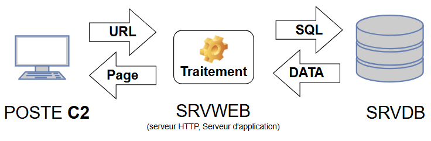

Nous allons réaliser plusieurs étapes pour mettre en place et tester l’interaction entre le serveur web et le serveur de bases de données. Tout d'abord, le serveur web sera configuré pour agir comme client du serveur de bases de données. Cette configuration permettra au serveur web d'envoyer des requêtes SQL et de récupérer les données nécessaires depuis la base de données.

Ensuite, l'"*application web*" sera modifiée afin d'accéder à la base de données contenant la table *ARTICLE*. Cela impliquera d’adapter le code des pages PHP pour inclure les connexions et les requêtes nécessaires à l'interrogation de la base de données.

Enfin, le bon fonctionnement de l’ensemble du système sera testé. Pour ce faire, nous appellerons une page PHP depuis le poste *C1*, ce qui permettra de vérifier l’enchaînement des requêtes *HTTP* envoyées au serveur web, et des requêtes SQL exécutées sur le serveur de bases de données. Cette validation garantira que le flux de communication entre les différents éléments est opérationnel.

[.question]
****
*En Pratique {counter:_question} :* Configurer *SRVWEB* comme client du service BD de *SRVDB*

* En mode Application, vérifier la configuration du serveur HTTP :
** Spécifier sur quel port le serveur de Base de données sera contacté.
Nous utilisons le port `1403` .

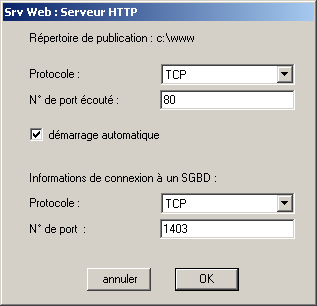

//end question
****

[.question]
****
*En Pratique {counter:_question} :* Modifier la page PHP accédant à la base de données.

* Il faut modifier la page PHP pour indiquer :
** L'adresse IP du serveur de base de données auquel on veut se connecter (`192.168.200.2`),
** Le login et le mot de passe de l'utilisateur accédant à la base de données (root / 1234),
** Le nom de la table à laquelle on souhaite accéder (ARTICLE).

* En mode *Application*, accéder au disque dur du serveur WEB (*SRVWEB*) et modifier la page `f008.php` comme suit :

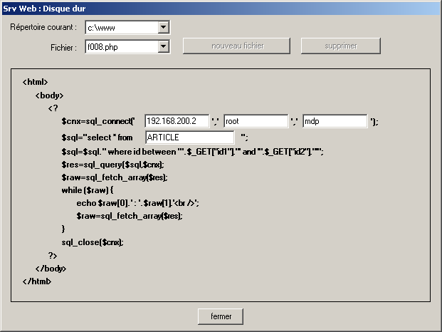

Cette page permet de renvoyer les articles dont le code est situé entre deux valeurs.

La page`` f007.html`` est un formulaire permettant précisément :

* De saisir la plage de codes souhaitée.
* De lancer ensuite la page `f008.php`.

Pour tester la page PHP accédant à la base de données :

* Lancer le navigateur sur le poste C1
* Appeler la page `f007.html`
* Saisir les codes voulus et cliquer sur *submit* pour obtenir le résultat de l'appel de la page `f008.php`.

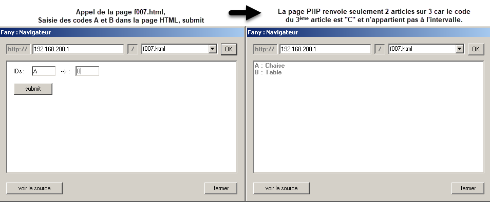

[NOTE]
====
Le fonctionnement des échanges peut être décrit comme suit : la machine C1 effectue une requête initiale pour obtenir une page HTML depuis le serveur web, *SRVWEB*.

Cette page est ensuite renvoyée à la machine cliente et affichée dans le navigateur. Lorsque l'utilisateur clique sur le bouton "Submit", une nouvelle requête est déclenchée pour accéder à une page PHP sur le serveur *SRVWEB*. Cette page PHP nécessite d'interagir avec le *SGBDR* hébergé sur SrvBD afin d'exécuter des traitements ou récupérer des données.

Ces interactions impliquent plusieurs allers-retours entre le serveur web et le serveur de base de données pour traiter les requêtes SQL. Une fois ces opérations effectuées, *SRVWEB* génère une page web dynamique en fonction des données obtenues et la retourne à la machine cliente.

Cette séquence illustre la coopération entre les différentes couches de l’architecture client/serveur pour fournir un résultat final à l'utilisateur.
====
//end question
****