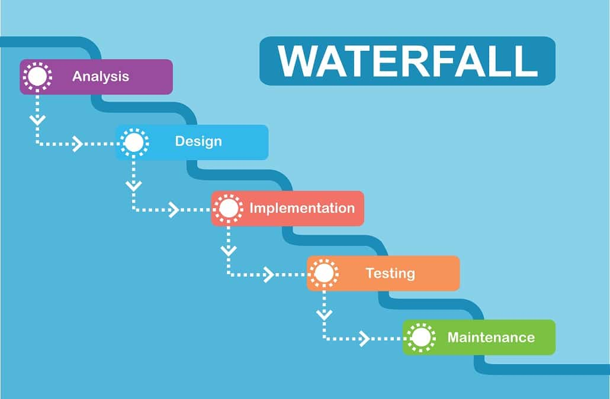
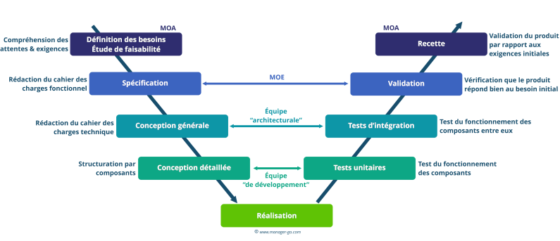
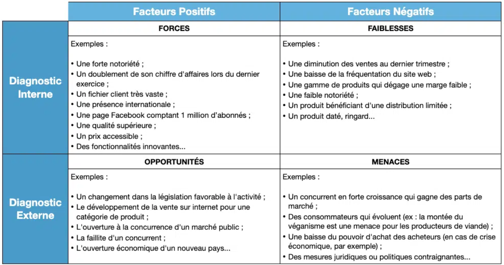
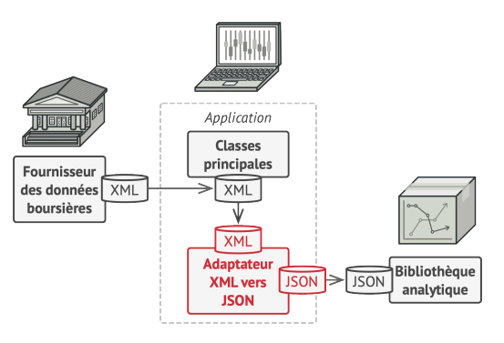
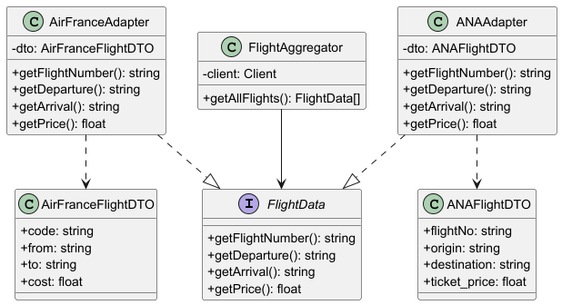
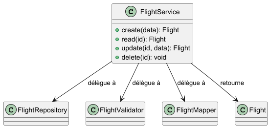

:_chapter:
:_author: Bauer Baptiste
:_duration: 3 heures
:_version_number: 1.0.1
:_version_date: 20/01/2025
:icons: font
:icon-set: fas

[[memo-dsi]]
=  Aide mémoire DSI
include::../../../run_app.adoc[]
:_show_changelog: 1
:_show_correction: 1
:_show_teacher: 1

== Contenu de l'introduction

Il faut introduire le cas étudié en présentant le contexte, les enjeux et les objectifs de l'étude. Il est important de donner une vue d'ensemble du système d'information de l'entreprise et de son rôle dans la stratégie globale.

[IMPORTANT]
====
Il faut lire l'intégralité des questions avant d'entamer la lecture du sujet afin d'avoir une vision d'ensemble des attentes et de pouvoir isoler efficacement les parties du sujet qui nous intéressent.
====

== Composante du SI

[cols="^1,^3", frame=all, grid=all]
|===
| Composante | Description

| Ressources humaines
| Acteurs impliqués dans l’utilisation, le développement et la gouvernance du SI

| Ressources techniques
| Matériel et logiciels permettant de stocker, traiter et transmettre l’information

| Ressources informationnelles
| Données et informations servant à la gestion, à la décision et à l’optimisation des processus
|===

== Projet :
=== Faisabilité d'un projet
* Un projet doit s'intégrer dans la stratégie de l'entreprise.

Une étude de faisabilité permet de vérifier si le projet est viable et s'il répond aux besoins de l'entreprise.

* Définir le projet et ses objectifs ( budgets complets, délais, performance technique)
* Vérifier si le projet est techniquement possible
* Prévoir les scénarios
* Définir les risques principaux (voir matrice SWOT)
* Préciser les contraintes ( normes, réglementations, législation)
* Impact sur l'entreprise

Différence entre réglementation et législation :

* La réglementation est un ensemble de règles édictées par une autorité administrative (ex : normes de sécurité).
* La législation est un ensemble de lois votées par le Parlement (ex : loi sur la protection des données personnelles).

[cols="^1,^1,^1,^1", frame=all, grid=all]
|===
| Non-alignement sur la stratégie de l'entreprise
| Culture de résistance au changement
| Manque d'adhésion de la hiérarchie
| Attentes irréalistes sur les délais, la qualité ou le budget

| Objectif final ambigu et imprécis
| Manque d'implication et de confiance des équipes
| Manque de confiance dans les équipes
| Manque de communication dans les équipes

|===

=== Les méthodes traditionnelles de gestion de projet

==== Méthode en cascade

* Chacun attend la fin de la phase précédente pour commencer la sienne
* Tout retard bloque le projet
* On peut s'éloigner au fur et à mesure du projet initial puisque l'on se focalise sur l'étape précédente.

==== Cycle en V

|===
|Avantages |Inconvénients

a|
* Méthodes adaptées à la plupart des projets
* Formalisation des fonctionnalités
* Projet bien réfléchi et défini dès le début
* Simplicité (absence de cadre strict)

a|
* Dépassement délais/budget
* Effet tunnel
* Recherche de boucs émissaires
* Planification trop stricte
* Cloisonnement des équipes
* Evolution des besoins non prise en compte

|===

==== Agile

===== Valeurs et principes du Manifeste Agile
.Les 4 valeurs des méthodes agiles
[cols="^1,", frame=all, grid=all]
|===
| Les individus et leurs interactions **plus que** les processus et les outils
| Des logiciels opérationnels **plus que** de la documentation exhaustive
| La collaboration avec les clients **plus que** la négociation contractuelle
| L’adaptation au changement **plus que** le suivi d’un plan

|===

.Les 12 principes des méthodes agiles
[cols="^1,^3", frame=all, grid=all]
|===
| *Principe (mot-clé)* | *Description synthétique*

| Satisfaction client
| Livrer tôt et régulièrement de la valeur pour satisfaire le client en continu

| Acceptation du changement
| Accueillir les changements, même tard dans le projet, pour offrir un avantage concurrentiel

| Livraison fréquente
| Fournir des versions utilisables toutes les semaines ou toutes les quelques semaines

| Collaboration quotidienne
| Impliquer quotidiennement les utilisateurs métier et l’équipe technique

| Soutien et confiance avec des équipes motivées
| S'appuyer sur des personnes motivées, leur faire confiance et leur donner l’environnement nécessaire

| Dialoguer en face-à-face
| Privilégier la communication en face à face comme mode de transmission d’information

| Logiciel fonctionnel
| Mesurer l’avancement du projet principalement par le logiciel opérationnel livré

| Rythme soutenable et constant
| Maintenir un rythme de travail soutenable sur le long terme

| Excellence technique
| Accorder de l’attention à la qualité du code et du design pour renforcer l’agilité

| Minimiser le travail inutile
| Ne faire que le nécessaire

| Auto-organisation
| Laisser émerger les meilleures solutions d’équipes auto-organisées

| Réfléchir et s'adapter régulièrement
| Réfléchir régulièrement à l’efficacité collective et adapter le comportement en conséquence
|===

|===
|Avantages |Inconvénients

a|
* Délais mieux respectés
* Meilleure gestion du changement
* Meilleure satisfaction client
* Meilleure qualité
* Alignement Business/IT
* Meilleure productivité
* Baisse des budgets

a|
* Résistance au changement
* Difficile à respecter (cadre strict et vitesse de livraison trop soutenue)
* MOA ( Maitrise d'ouvrage, client ou représentant) difficile à convaincre (doit apprendre à expliquer son besoin)
* Utilisées actuellement pour pressurer les équipes

|===

== Gestion des risques
=== Qu'est-ce qu'un risque ?

[NOTE]
====
Un *risque* peut être entendu comme un effet de l'incertitude sur l'atteinte des objectifs. Il peut être positif (_opportunité_) ou négatif (_menace_).

Les *objectifs* peuvent avoir différents aspects ( ex: buts financiers, de santé et de sécurité, ou environnementaux) et peuvent concerner différents niveaux (niveau stratégique, niveau d'un projet, d'un produit, d'un processus ou d'un organisme tout entier). Un risque est souvent caractérisé en référence à des événements et des conséquences potentielles ou à une combinaison des deux.

====

[TIP]
====
*Incertitude* :  L'état , même partiel, de défaut d'information concernant la compréhension ou la connaissance d'un événement, de ses conséquences ou de sa vraisemblance.
====

[TIP]
====
*Risques résiduels* recouvrent les risques non maîtrisés ou non identifiés ainsi que ceux qui demeurent malgré les mesures mises en place.
====

.Matrice SWOT
[cols="^1,^1", frame=all, grid=all]
|===
| *FORCES (S)*
| *FAIBLESSES (W)*

a|
* Procédures de gestion des risques établies
* Dispositifs de veille internes
* Culture sécurité dans certains services

a|
* Faible culture du risque dans l'encadrement
* Réactivité insuffisante face aux crises
* Formation inégale des équipes

| *OPPORTUNITÉS (O)*
| *MENACES (T)*

a|
* Nouvelles réglementations incitatives
* Opportunités d'intégrer le risk management dans la stratégie
* Émergence d'outils numériques de détection

a|
* Risques systémiques (cyber, climat, géopolitique)
* Perte de confiance des parties prenantes
* Réputation mise en danger par la mauvaise gestion d’un incident
|===

.Matrice SWOT – Analyse stratégique du projet
[cols="^1,^1", frame=all, grid=all]
|===
| *FORCES (interne, positif)*
| *FAIBLESSES (interne, négatif)*

a|
* Ex. : Équipe expérimentée
* Ex. : Bonne connaissance du marché
* Ex. : Forte culture d’innovation
*

a|
* Ex. : Budget limité
* Ex. : Infrastructure technique vieillissante
* Ex. : Manque de compétences sur certains outils
*

| *OPPORTUNITÉS (externe, positif)*
| *MENACES (externe, négatif)*

a|
* Ex. : Nouvelles tendances favorables
* Ex. : Subventions disponibles
* Ex. : Faible concurrence sur un segment
*

a|
* Ex. : Arrivée de nouveaux concurrents
* Ex. : Incertitude réglementaire
* Ex. : Volatilité des prix ou des ressources
*
|===

Selon Barry Boehm, spécialiste dans le risque de projet logiciel, la nature des domaines du projet apporte déja parfois un haut niveau de risque :

* Défense militaire
* SI Civils
* Développement de SI pour des usines sensibles ou sécurisées pour des banques
* Projet de R&D

Les risques principaux ( les plus fréquents) sont par ordre décroissant :

* Le manque de personnel compétent ou bien formé
* les échéances, jalons et budgets irréalistes
* les fonctionnalités mal développées ou ne répondant pas aux besoins
* une mauvaise interface développée
* le gold plating ( ajout de plus de fonctionnalités qu'il n'en faudrait)
* les demandes de changement continuelles
* la pénurie ou les défaillances de composantes externes
* les tâches externalisées, sous-traitées
* la performance en temps réel
* des capacités informatiques et technologiques limitées

=== Typologies de risques

.Typologie des risques – Description, exemples, impacts

[cols="^1,^2,^2,^2", frame=all, grid=all]
|===
| *Type de risque*
| *Description*
| *Exemples*
| *Impacts potentiels*

| Risque stratégique
| Décisions mal alignées avec le marché ou les capacités internes
| Lancement sur un marché inadapté, choix technologique non rentable
| Perte de compétitivité, coût d'opportunité, image de direction affaiblie

| Risque opérationnel
| Défaillances internes humaines, techniques ou procédurales
| Erreur de commande, panne serveur, non-respect des délais
| Retards, surcoûts, insatisfaction client

| Risque financier
| Déséquilibres ou événements affectant la stabilité financière
| Défaillance de paiement, taux d'intérêt élevé, volatilité boursière
| Perte de liquidité, dégradation de la solvabilité, baisse de valeur

| Risque juridique et réglementaire
| Non-conformité avec les lois, règlements ou contrats
| Violation du RGPD, erreur dans un contrat, litige client
| Sanctions, amendes, atteinte à la réputation

| Risque informatique (cyber)
| Atteinte à la sécurité ou à la disponibilité des systèmes
| Ransomware, piratage, perte de données sensibles
| Paralysie des opérations, perte de données, crise médiatique

| Risque environnemental
| Risques liés à l’environnement naturel ou réglementaire
| Inondation, pollution accidentelle, violation de normes ESG
| Dommages matériels, amendes, atteinte à l’image RSE

| Risque humain / social
| Dysfonctionnements liés aux ressources humaines
| Grève, burnout, pénurie de talents, démotivation
| Baisse de productivité, turn-over, climat social dégradé

| Risque d’image / réputation
| Atteinte à la crédibilité ou à l’image publique
| Scandale sur les réseaux, produit défectueux médiatisé
| Perte de clients, défiance des partenaires, baisse en bourse

| Risque géopolitique
| Conflits, décisions politiques ou instabilités internationales
| Guerre, embargo, rupture diplomatique, sanctions
| Arrêt d’activité sur une zone, hausse des coûts, réorganisation

| Risque d’innovation
| Échec ou mauvaise réception d’une innovation
| Produit non accepté par les clients, retard de mise sur le marché
| Perte d’investissement, désalignement stratégique
|===

.Typologie des risques : origine, exemples et niveau d’impact

[cols="^1,^3,^3,^1", frame=all, grid=all]
|===
| *Origine du risque*
| *Description*
| *Exemples concrets*
| *Impact potentiel*

| Risques humains
| Liés aux comportements, compétences, état psychologique ou relations sociales des individus
| Erreur de saisie critique, burn-out d’un cadre, grève d’un service, conflit interpersonnel
| Élevé

| Risques techniques
| Liés aux défaillances matérielles, logicielles ou à l’infrastructure IT
| Panne serveur, cyberattaque (ransomware), perte de données, incompatibilité entre systèmes
| Élevé

| Risques organisationnels
| Liés à la structure, aux processus internes, à la répartition des responsabilités
| Double traitement d’une tâche, procédure mal définie, mauvaise coordination entre services
| Moyen

| Risques de planification
| Liés à la mauvaise estimation des charges, délais ou ressources dans les projets
| Retard de livraison, dépassement budgétaire, surcharge d'équipe
| Moyen

| Risques juridiques / contractuels
| Liés aux obligations légales, réglementaires ou contractuelles
| Violation RGPD, oubli de clause de résiliation, litige client, non-respect d’un appel d’offre
| Élevé

| Risques managériaux
| Liés au style de leadership, à la gouvernance ou à la prise de décision stratégique
| Stratégie floue, autoritarisme, absence d’écoute, choix irréaliste de transformation
| Élevé

| Risques financiers
| Liés aux flux de trésorerie, aux budgets, aux ratios ou à la stabilité économique
| Difficulté à payer les fournisseurs, dépassement de budget, baisse brutale de chiffre d'affaires
| Élevé

| Risques liés aux partenaires
| Liés aux relations avec des tiers (fournisseurs, sous-traitants, co-contractants)
| Fournisseur défaillant, sous-traitance non conforme, non-livraison critique
| Moyen à élevé

| Risques liés au marché
| Liés à l’environnement concurrentiel, aux tendances économiques ou aux comportements d’achat
| Nouvelle concurrence disruptive, perte de part de marché, déclin d’un secteur
| Élevé

| Risques liés aux produits ou services
| Liés à la qualité, à la pertinence ou à la fiabilité de l’offre proposée
| Produit non conforme, erreur de conception, taux de retour élevé, insatisfaction client
| Moyen à élevé
|===

=== Prévention et correction des risques
==== La prévention des risques

[TIP]
====
La *prévention des risques* consiste à agir sur les causes inhérentes à ces risques en réduisant la probabilité de survenance de la cause et donc du risque.
====

[IMPORTANT]
====
Il est préférable de réduire et circonscrire les risques en amont plutôt que de les traiter. 
Le but est de diminuer la probabilité que le risque arrive, et si son évitement n'est pas totalement possible, d'en atténuer les impacts.
====

.Stratégie à adopter selon le risque
[cols="1,3", frame=all, grid=all]
|===

|*Acceptation du risque*
a|
* Passive ( risque très peu important ou source externe au projet) ou active ( on ne peut rien faire pour limiter ou enrayer, on va donc prévoir une mesure corrective pour ce risque).
* Prévision d'un budget.

|*Elimination du risque*
a| Suppression de la cause du risque ( ex: Augmentation des ressources, embauche de spécialistes)

|*Transfert du risque*
a| Déplacement de la responsabilité du risque à un tier (ex:Cyberassurances, outsourcing, sous-traitance).

|*Réduction du risque*
a| Limitation du risque (ex: restriction du périmètre du projet, formation des équipes)

|*Gestion ou ségrégation du risque*
a| * Identification des ressources critiques et hautement critiques.
* Répartition des risques ou duplication des ressources
|===

== La donnée

.Les 4 dimensions et 15 sous-dimensions de la qualité des données (Wang & Strong, 1996)

[cols="^1,^2,^4", frame=all, grid=all]
|===
| *N°* | *Dimension principale* | *Sous-dimensions*

| 1 | Qualité intrinsèque
a|
- Exactitude (accuracy) : les données reflètent fidèlement la réalité
- Crédibilité (believability) : les données sont dignes de confiance
- Objectivité (objectivity) : les données sont exemptes de biais
- Réputation (reputation) : la source des données est réputée fiable

| 2 | Qualité contextuelle
a|
- Pertinence (relevancy) : les données sont adaptées à la tâche
- Complétude (completeness) : toutes les données nécessaires sont présentes
- Actualité (timeliness) : les données sont à jour
- Valeur ajoutée (value-added) : les données apportent une utilité réelle
- Adéquation à la quantité (appropriate amount of data) : ni trop peu, ni trop de données

| 3 | Qualité de représentation
a|
- Compréhensibilité (understandability) : les données sont faciles à comprendre
- Interprétabilité (interpretability) : les données sont faciles à interpréter dans un contexte donné
- Cohérence (consistency) : pas de contradiction entre les données

| 4 | Accessibilité
a|
- Accessibilité (accessibility) : les données sont disponibles pour les utilisateurs autorisés
- Sécurité (access security) : les données sont protégées contre les accès non autorisés
|===

.Grille d’audit de la qualité des données (Basée sur les 15 sous-dimensions de Wang & Strong (1996))
[cols="^1,^2,^4,^1", frame=all, grid=all]
|===
| *N°* | *Sous-dimension* | *Critère d’évaluation* | *Score (1-5)*

| 1 | Exactitude
| Les données sont conformes à la réalité et sans erreurs factuelles
|

| 2 | Crédibilité
| La source des données est fiable et reconnue par les utilisateurs
|

| 3 | Objectivité
| Les données sont neutres et sans biais subjectifs
|

| 4 | Réputation
| La source des données est perçue comme experte ou institutionnelle
|

| 5 | Pertinence
| Les données sont adaptées au besoin métier ou décisionnel
|

| 6 | Complétude
| L’ensemble des données nécessaires est présent et accessible
|

| 7 | Actualité
| Les données sont à jour par rapport au contexte d’utilisation
|

| 8 | Valeur ajoutée
| Les données apportent une réelle utilité dans la prise de décision
|

| 9 | Adéquation à la quantité
| Les données sont suffisantes, mais pas surabondantes
|

|10 | Compréhensibilité
| Les données sont claires, bien formatées et faciles à lire
|

|11 | Interprétabilité
| Les utilisateurs comprennent aisément la signification des données
|

|12 | Cohérence
| Les données ne se contredisent pas entre elles ou entre sources
|

|13 | Accessibilité
| Les utilisateurs autorisés accèdent facilement aux données
|

|14 | Sécurité
| Les accès sont contrôlés, les données sensibles sont protégées
|

|15 | Disponibilité (optionnelle)
| Les données sont disponibles quand on en a besoin (temps réel ou planifié)
|
|===

.Grille d’audit de la qualité des données (Basée sur Wang & Strong, 1996)

[cols="2,^2,^2,^3,^3", options="header", frame=all, grid=all]
|===
| Sous-dimension
| Dimension
| Score (1–5)
| Critères d’évaluation
| Commentaires / Actions

| Exactitude
| Intrinsèque
|
| Les données sont-elles factuellement correctes et sans erreur ?
|

| Crédibilité
| Intrinsèque
|
| La source est-elle fiable ? Les données sont-elles validées ?
|

| Objectivité
| Intrinsèque
|
| Les données sont-elles neutres, sans biais ni manipulation ?
|

| Réputation
| Intrinsèque
|
| La source ou l’auteur des données est-il reconnu et fiable ?
|

| Pertinence
| Contextuelle
|
| Les données sont-elles adaptées aux besoins décisionnels ?
|

| Complétude
| Contextuelle
|
| Toutes les données nécessaires sont-elles présentes ?
|

| Actualité
| Contextuelle
|
| Les données sont-elles récentes et à jour ?
|

| Valeur ajoutée
| Contextuelle
|
| Les données apportent-elles une information utile ?
|

| Quantité adéquate
| Contextuelle
|
| Y a-t-il trop, trop peu ou juste ce qu’il faut de données ?
|

| Compréhensibilité
| Représentation
|
| Les données sont-elles claires, lisibles, bien formatées ?
|

| Interprétabilité
| Représentation
|
| Les utilisateurs comprennent-ils la signification des données ?
|

| Cohérence
| Représentation
|
| Y a-t-il des contradictions entre les données ou les sources ?
|

| Accessibilité
| Accessibilité
|
| Les utilisateurs autorisés peuvent-ils accéder facilement aux données ?
|

| Sécurité
| Accessibilité
|
| Les données sont-elles protégées contre les accès non autorisés ?
|
|===

== Architecture du SI

=== Typologie des architectures SI

.Typologie des architectures SI (répartition, organisation)
[cols="^1,^2,^2,^2,^2", frame=all, grid=all, options="header"]
|===
| *Type d’architecture*
| *Définition*
| *Exemples*
| *Avantages*
| *Inconvénients*

| Centralisée
| Tous les traitements et les données sont concentrés sur un serveur ou un datacenter unique
| SI d’une PME hébergé en local ; serveur client-épais
| - Gestion centralisée
- Sécurité simplifiée
- Coûts d’infrastructure réduits
| - Faible résilience (point de défaillance unique)
- Performances dégradées à distance
- Évolutivité limitée

| Décentralisée
| Chaque site ou unité a son propre système indépendant
| Réseau de filiales utilisant des outils distincts
| - Autonomie locale
- Adaptation aux besoins spécifiques
| - Difficulté de consolidation des données
- Redondance des outils
- Faible interopérabilité

| Distribuée
| Traitements et données répartis entre plusieurs nœuds connectés
| Système bancaire ou applications cloud multi-sites
| - Résilience accrue
- Répartition de la charge
- Haute disponibilité
| - Complexité technique
- Synchronisation et cohérence difficiles
- Coûts de maintenance

| Intégrée (ERP)
| Toutes les fonctions de l’entreprise sont gérées par un système unique cohérent
| ERP type SAP, Oracle, Odoo
| - Cohérence des données
- Vue transverse de l’activité
- Moins de redondance
| - Dépendance à l’éditeur
- Projets d’implémentation longs et coûteux
- Faible souplesse

| Orientée services (SOA)
| Le SI est organisé autour de services métiers exposés via des interfaces (API)
| Architecture microservices, middleware
| - Modularité
- Réutilisabilité
- Agilité dans l’évolution du SI
| - Complexité d’orchestration
- Surcoût en développement et test
- Besoin de gouvernance forte

| Cloud / Hybride
| Les composants du SI sont (en tout ou partie) hébergés dans le cloud
| Infrastructure AWS + stockage local
| - Évolutivité rapide
- Coût à l’usage (OPEX)
- Accès depuis n’importe où
| - Dépendance à un prestataire externe
- Risques de souveraineté des données
- Nécessité de connexion fiable

| Peer-to-peer (P2P)
| Les postes sont à la fois clients et serveurs (réseau décentralisé)
| Réseaux torrent, blockchain, certaines messageries
| - Pas de point central
- Robustesse au défaillances
- Répartition naturelle de la charge
| - Contrôle difficile
- Risques de sécurité accrus
- Coordination complexe
|===

== Rappels UML
Les associations en UML décrivent les liens structurels entre les classes. Voici les types d’associations les plus courants :

=== 1. Association simple

- *Définition* : lien logique entre deux classes.
- *Symbole* : trait plein.
- *Nom* : optionnel (ex : `possède`, `connaît`).
- *Multiplicité* : possible (ex : `1..*`, `0..1`).
- *Direction* : bidirectionnelle ou unidirectionnelle.

[source,plantuml]
----
Client --> Commande : passe
----

=== 2. Association bidirectionnelle

- Les deux classes se connaissent mutuellement.
- *Symbole* : trait plein sans flèche.

[source,plantuml]
----
A -- B
----

=== 3. Association unidirectionnelle

- Une seule classe connaît l’autre.
- *Symbole* : trait plein avec flèche simple.

[source,plantuml]
----
Utilisateur --> Session : initie
----

=== 4. Agrégation (`has-a`, `part-of`)

- Une classe contient des instances d’une autre.
- La *vie* de la partie n’est *pas liée* au tout.
- *Symbole* : losange blanc du côté du conteneur.

[source,plantuml]
----
Bibliothèque o-- Livre
----

=== 5. Composition (`is-composed-of`)

- La classe composite *possède* les instances contenues.
- Si le tout disparaît, les parties aussi.
- *Symbole* : losange noir.

[source,plantuml]
----
Maison *-- Pièce
----

=== 6. Dépendance

- Lien faible, temporaire.
- Utilisation d’un paramètre, service ou méthode.
- *Symbole* : flèche en pointillés.

[source,plantuml]
----
Client ..> Service : utilise
----

=== 7. Héritage (généralisation/spécialisation)

- Une classe hérite des attributs et comportements d’une autre.
- *Symbole* : flèche pleine avec triangle vide.

[source,plantuml]
----
AirFranceAdapter --|> FlightData
----

=== 📘 Récapitulatif

[options="header"]
|===
| Type d'association | Symbole UML | Exemple | Description

| Association simple a| `A --> B` | Client → Commande | Lien logique avec nom possible
| Agrégation         a| `A o-- B` | Bibliothèque o-- Livre | Contient sans posséder (cycle de vie indépendant)
| Composition        a| `A *-- B` | Maison *-- Pièce | Contient et possède (cycle de vie lié)
| Dépendance         a| `A ..> B` | Service ..> Logger | Dépendance temporaire, usage ponctuel
| Héritage           a| `A --/> B` | AirFranceAdapter --/> FlightData | Héritage, polymorphisme

|===

== Fiche de synthèse RGPD
_Essentiel à connaître pour l’entreprise ou l’examen_

=== 📌 Définition

Le RGPD (Règlement Général sur la Protection des Données) est un règlement européen, entré en vigueur le 25 mai 2018, qui encadre le traitement des données personnelles pour garantir la transparence, la sécurité, et les droits des personnes.

Il s’applique à toute organisation traitant les données de **citoyens de l’Union européenne**, même si elle est basée en dehors de l’UE.

=== 🔍 Données concernées

Toute donnée permettant d’identifier **directement ou indirectement** une personne :
- Nom, prénom, e-mail, IP, localisation, identifiant client
- Données sensibles : santé, opinions politiques, origine ethnique...

=== 📜 Les 7 principes fondamentaux du RGPD

[cols="1,3", options="header", frame=all, grid=all]
|===
| Principe                         | Définition

| Licéité, loyauté, transparence   | Informer clairement les personnes concernées du traitement
| Limitation des finalités         | Ne collecter que pour des objectifs définis et légitimes
| Minimisation des données         | Ne collecter que ce qui est strictement nécessaire
| Exactitude                       | Garder les données exactes et à jour
| Limitation de conservation       | Ne pas conserver les données plus longtemps que nécessaire
| Intégrité et confidentialité     | Assurer la sécurité et la confidentialité des données
| Responsabilité (accountability) | Être capable de démontrer la conformité au RGPD
|===

=== 👤 Les droits des personnes concernées

[cols="1,3", options="header", frame=all, grid=all]
|===
| Droit                        | Description

| Droit d’accès                | Consulter les données détenues sur soi
| Droit de rectification       | Corriger une donnée inexacte
| Droit à l’effacement         | Demander la suppression de ses données (droit à l’oubli)
| Droit à la portabilité       | Récupérer et transférer ses données vers un autre service
| Droit d’opposition           | Refuser certains traitements (ex : marketing)
| Droit à la limitation        | Suspendre temporairement un traitement
| Droit à l’information        | Être informé en cas de faille de sécurité
|===

=== 🏢 Obligations des entreprises

- Informer clairement les personnes concernées
- Tenir un **registre des traitements**
- Mettre en place des mesures de **sécurité** (chiffrement, mots de passe, accès restreint…)
- Réaliser des **analyses d’impact** (DPIA) pour les traitements à risques
- Désigner un **DPO** (Délégué à la Protection des Données), si nécessaire
- Fournir des **preuves** de conformité à la CNIL (accountability)

=== ⚖️ Sanctions possibles

[cols="1,3", options="header", frame=all, grid=all]
|===
| Type de sanction             | Description

| Amende administrative        | Jusqu’à 20 millions d’euros ou 4 % du CA mondial
| Mise en demeure / injonction | Obligation de mise en conformité immédiate
| Dommages réputationnels      | Perte de confiance, retrait d’un contrat, médiatisation
| Suspension de traitement     | Interdiction temporaire de traitement des données
|===

=== 📚 Référence utile

Site de la CNIL : https://www.cnil.fr
Texte officiel RGPD : https://eur-lex.europa.eu/legal-content/FR/TXT/?uri=CELEX:32016R0679

== Design Pattern

=== Adaptator

==== Exemple Agrégateur de vols

[source,json]
.Format des données attendues par l'API de l'application
----
{
  "flight_number": "AF123",
  "departure": "CDG",
  "arrival": "NRT",
  "price": 850.00
}

----

[source,json]
.Format des données ANA
----
{
  "flightNo": "NH204",
  "origin": "CDG",
  "destination": "HND",
  "ticket_price": "980.5"
}

----

[source,json]
.Format des données Air France(AF) : http://api.airfrance.com/flights
----
{
  "code": "AF123",
  "from": "CDG",
  "to": "NRT",
  "cost": 850.00
}
----

[source,json]
.Format des données Air China
----
{
  "numero": "CA934",
  "depart": "CDG",
  "arrivee": "PEK",
  "prix": 775
}

----

==== Structure du parttern Adapter

* *Target* (Cible) : l'interface que ton application attend (User).

* *Adaptee* (Adapté) : le format de données venant de l'API externe.

* *Adapter* : une classe qui transforme le format API → format application.

[source,php]
.Interface cible
----
interface FlightData
{
    public function getFlightNumber(): string;
    public function getDeparture(): string;
    public function getArrival(): string;
    public function getPrice(): float;
}

----

====  Les Adaptateurs

===== Air France

[source,php]
.DTO
----
class AirFranceFlightDTO
{
    public function __construct(
        public string $code,
        public string $from,
        public string $to,
        public float $cost
    ) {}
}
----

[source,php]
.Adaptateur pour Air France
----
class AirFranceAdapter implements FlightData
{
    // Injection de dépendance
    public function __construct(private AirFranceFlightDTO $dto)
    {

    }

    public function getFlightNumber(): string
    {
        return $this->dto->code;
    }

    public function getDeparture(): string
    {
        return $this->dto->from;
    }

    public function getArrival(): string
    {
        return $this->dto->to;
    }

    public function getPrice(): float
    {
        return $this->dto->cost;
    }
}
----

===== ANA

[source,php]
.DTO
----
class ANAFlightDTO
{
    public function __construct(
        public string $flightNo,
        public string $origin,
        public string $destination,
        public float $ticket_price
    ) {}
}

----

[source,php]
.Adapter pour ANA
----
class ANAAdapter implements FlightData
{
    public function __construct(private ANAFlightDTO $dto) {}

    public function getFlightNumber(): string
    {
        return $this->dto->flightNo;
    }

    public function getDeparture(): string
    {
        return $this->dto->origin;
    }

    public function getArrival(): string
    {
        return $this->dto->destination;
    }

    public function getPrice(): float
    {
        return $this->dto->ticket_price;
    }
}
----

===== Agrégateur

[source,php]
.Agrégateur de vols
----
use GuzzleHttp\Client;

class FlightAggregator
{
    private Client $client;

    public function __construct()
    {
        $this->client = new Client();
    }

    /**
     * @return FlightData[]
     */
    public function getAllFlights(): array
    {
        $flights = [];

        // Air France
        $resAF = $this->client->get('http://api.airfrance.com/flights/AF123');
        $dataAF = json_decode($resAF->getBody()->getContents(), true);
        $dtoAF = new AirFranceFlightDTO($dataAF['code'], $dataAF['from'], $dataAF['to'], $dataAF['cost']);
        $flights[] = new AirFranceAdapter($dtoAF);

        // ANA
        $resANA = $this->client->get('http://api.ana.com/flights/NH204');
        $dataANA = json_decode($resANA->getBody()->getContents(), true);
        $dtoANA = new ANAFlightDTO($dataANA['flightNo'], $dataANA['origin'], $dataANA['destination'], (float) $dataANA['ticket_price']);
        $flights[] = new ANAAdapter($dtoANA);

        return $flights;
    }
}

----

===== Utilisation

[source, compose]
----
composer require guzzlehttp/guzzle
----

[source,php]
.Utilisation de l'agrégateur
----
$aggregator = new FlightAggregator();

$flights = $aggregator->getAllFlights();

foreach ($flights as $flight) {
    echo "Vol {$flight->getFlightNumber()} de {$flight->getDeparture()} à {$flight->getArrival()} pour {$flight->getPrice()} €\n";
}

----

=== Façade

* Une méthode unique simplifiée pour un ensemble de services internes (AirFranceAdapter, ANAAdapter, AirChinaAdapter, etc.)
* Création d'une classe façade qui regroupe et masque cette complexité.

==== Objectif

Créer une façade qui centralise les opérations CRUD sur une entité, en masquant les couches techniques : Repository, Mapper, Validator, etc.

* Lire un vol (`read`)
* Ajouter un vol (`create`)
* Supprimer un vol (`delete`)
* Mettre à jour un vol (`update`)

[source,php]
.Façade
----
class FlightInput
{
    public function __construct(
        public string $flightNumber,
        public string $departure,
        public string $arrival,
        public float $price
    ) {}
}

class FlightService
{
    public function __construct(
        private FlightRepository $repository,
        private FlightValidator $validator,
        private FlightMapper $mapper
    ) {}

    public function create(FlightInput $input): Flight
    {
        $this->validator->validate($input); // ou valide ses propriétés
        $flight = $this->mapper->fromInput($input);
        return $this->repository->save($flight);
    }

    public function read(int $id): ?Flight
    {
        return $this->repository->find($id);
    }

    public function update(int $id, FlightInput $input): ?Flight
    {
        $existing = $this->repository->find($id);
        if (!$existing) return null;

        $this->validator->validate($input);
        $updated = $this->mapper->updateFromInput($existing, $input);
        return $this->repository->save($updated);
    }

    public function delete(int $id): void
    {
        $this->repository->delete($id);
    }
}

----

==== Utilisation de la façade

[source,php]
.Utilisation
----
$service = new FlightService(
    new FlightRepository(),
    new FlightValidator(),
    new FlightMapper()
);

try {
    $input = new FlightInput('AF123', 'CDG', 'NRT', 850.0);
    $flight = $flightService->create($input);

    echo "Vol créé : " . $flight->getNumber();
} catch (InvalidArgumentException $e) {
    echo "Erreur de validation : " . $e->getMessage();
}

----

[NOTE]
====
Le pattern *Adapter* permet d’intégrer des API tierces en uniformisant leur format.
Le pattern *Façade*, lui, masque la complexité d’un sous-système interne (ex: logique métier CRUD).
====

[IMPORTANT]
====
Dans une architecture complète, on peut :
- utiliser des *adaptateurs* pour consommer des données externes (ex: recherche de vols),
- et une *façade* pour exposer une interface unique côté métier (ex: création/modification de vols internes).
====

==== Comment améliorer un SI

Détaille la solution fonctionnelle et/ou technique envisagée :

|===
|Type de solution |Exemples

|Fonctionnelle
|Ajouter une interface de recherche, améliorer un formulaire

|Technique
|Mise en place d’une API REST, refonte base SQL, ajout cache

|Organisationnelle
|Former les utilisateurs, clarifier les droits d'accès

|===

=== Modification de BDD

==== Modéliser une hiérarchie Salarié / Prestataire en base de données

Lorsqu’une entité métier comme `Paiement` doit référencer soit un `Salarie`, soit un `Prestataire`, on doit choisir une stratégie de modélisation relationnelle cohérente avec le comportement polymorphe des objets.

==== Objectif

Permettre à un `Paiement` d'être lié à une personne payée, qui peut être :
- un **Salarié** (ayant un poste et une grille salariale),
- ou un **Prestataire** (facturant une prestation).

==== Stratégies possibles

===== 🅰️ Stratégie 1 : Table commune (Single Table Inheritance)

Une seule table pour toutes les personnes payées, avec un champ `type` et des colonnes nullables :

[source,sql]
----
CREATE TABLE PersonnePayee (
  id INT PRIMARY KEY,
  nom VARCHAR(100),
  email VARCHAR(100),
  type ENUM('salarie', 'prestataire'),
  poste_id INT NULL,
  salaire_id INT NULL,
  siret VARCHAR(14) NULL,
  type_structure VARCHAR(50) NULL
);
----

La table `Paiement` contient une seule FK :

[source,sql]
----
CREATE TABLE Paiement (
  id INT PRIMARY KEY,
  payee_id INT,
  date_versement DATE,
  montant NUMERIC,
  FOREIGN KEY (payee_id) REFERENCES PersonnePayee(id)
);
----

====== ✅ Avantages
- Simplicité d’écriture SQL
- Bonne performance en lecture

====== ❌ Inconvénients
- Beaucoup de colonnes nulles
- Contraintes métier à vérifier manuellement

===== 🅱️ Stratégie 2 : Table parent + tables enfants (Class Table Inheritance)

On factorise les champs communs dans une table `PersonnePayee` puis spécialise :

[source,sql]
----
CREATE TABLE PersonnePayee (
  id INT PRIMARY KEY,
  nom VARCHAR(100),
  email VARCHAR(100),
  type ENUM('salarie', 'prestataire')
);

CREATE TABLE Salarie (
  id INT PRIMARY KEY REFERENCES PersonnePayee(id),
  poste_id INT,
  salaire_id INT
);

CREATE TABLE Prestataire (
  id INT PRIMARY KEY REFERENCES PersonnePayee(id),
  siret VARCHAR(14),
  type_structure VARCHAR(50)
);
----

====== ✅ Avantages
- Structure propre, normalisée
- Aucune colonne inutile

====== ❌ Inconvénients
- Requêtes SQL plus complexes (jointures nécessaires)
- Moins intuitif si pas d’ORM

===== 🆎 Stratégie 3 : Deux colonnes FK dans Paiement

[source,sql]
----
CREATE TABLE Paiement (
  id INT PRIMARY KEY,
  salarie_id INT NULL,
  prestataire_id INT NULL,
  date_versement DATE,
  montant NUMERIC,
  FOREIGN KEY (salarie_id) REFERENCES Salarie(id),
  FOREIGN KEY (prestataire_id) REFERENCES Prestataire(id)
);
----

===== ✅ Avantages
- Lecture simple
- SQL explicite

===== ❌ Inconvénients
- Risque d’incohérence (deux FK non-null)
- Pas de contrainte d’exclusivité en SQL standard

==== Recommandations

[cols="2,3",options="header"]
|===
| Contexte | Stratégie recommandée

| Projet SQL pur simple
| Stratégie 1 : table unique + champ `type`

| Projet avec ORM (Doctrine, Eloquent…)
| Stratégie 2 : tables parent/enfant (`JOINED` inheritance)

| Projet rapide sans évolutions prévues
| Stratégie 3 : deux colonnes FK
|===

==== Exemple de jointure dynamique (stratégie 1)

[source,sql]
----
SELECT p.id, p.date_versement, p.montant, pp.nom, pp.type
FROM Paiement p
JOIN PersonnePayee pp ON p.payee_id = pp.id
WHERE pp.type = 'prestataire';
----

==== Exemple de code PHP

[source,php]
----
if ($personne->type === 'salarie') {
    $details = Salarie::find($personne->id);
} else {
    $details = Prestataire::find($personne->id);
}
----

==== Conclusion

Choisir une bonne stratégie de modélisation est essentiel pour maintenir la cohérence métier, la performance SQL et la lisibilité du code métier.

== Gouvernance du SI

=== Objectifs
- Aligner le SI avec la stratégie de l’organisation
- Garantir la performance, la sécurité et la conformité
- Optimiser les ressources IT

=== Outils et cadres
- *COBIT* : cadre de gouvernance IT basé sur la valeur, les risques, la conformité
- *ITIL* : bonnes pratiques de gestion des services IT (support, incident, etc.)
- *Urbanisation* : structuration du SI en couches (métier, applicatif, technique)
- *Schéma directeur* : plan stratégique pluriannuel du SI

== Enjeux éthiques et managériaux du numérique

[cols="^1,^3", frame=all, grid=all]
|===
| Enjeu | Illustration

| Automatisation vs emploi
| Externalisation du savoir-faire → perte de compétences internes

| Éthique de l’IA
| Biais algorithmiques, opacité des décisions (ex: recrutement, crédit)

| QVT et numérique
| Télétravail, hyperconnexion, charge mentale numérique

| Leadership digital
| Nécessité d’un leadership transformationnel + participatif pour accompagner
|===

== Sécurité des systèmes d'information

=== Principes clés
- Confidentialité
- Intégrité
- Disponibilité (modèle *CID*)

=== Outils / normes
- ISO 27001 (SMSI)
- PCA / PRA (plan de continuité / reprise d’activité)
- Authentification forte, journalisation, chiffrement

=== Exemples de menaces
- Ransomware
- Phishing
- Perte de données / panne matérielle

== Transformation numérique

- Décloisonne les fonctions
- Accélère les processus
- Modifie le rôle des managers (leadership numérique, innovation frugale)
- Rend nécessaire une acculturation numérique de l’ensemble des collaborateurs

== Réponses aux questions types du jury

=== En quoi le SI est-il stratégique pour une PME ?

Le SI permet à une PME :

d’automatiser ses processus (facturation, stock, RH…),

d’améliorer la réactivité face aux clients ou concurrents,

de piloter l’activité avec des données fiables,

et de soutenir sa croissance (ex : e-commerce, CRM…).

C’est un levier de performance, pas seulement un outil technique.

=== Comment justifier l’investissement dans un ERP ?

Un ERP centralise les données et les processus dans un système unique.
On peut le justifier par :

des gains de productivité (moins de saisie redondante),

une meilleure traçabilité et conformité (ex : comptabilité),

une vision globale de l’entreprise,

et une réduction des erreurs humaines.

L’investissement est rentable s’il s’accompagne d’un vrai projet de transformation.

=== Quels sont les risques d’un mauvais alignement stratégique du SI ?

Dépenses inutiles sur des outils inadaptés.

Résistances au changement si les utilisateurs ne sont pas impliqués.

Perte de compétitivité (ex : SI obsolète, lenteur des processus).

Manque de cohérence entre outils et objectifs métiers.

Un SI non aligné, c’est comme un GPS mal programmé : il fonctionne, mais il n’emmène pas où il faut.

=== Différence entre urbanisation du SI et architecture applicative ?

L’urbanisation est une vision globale et stratégique : elle cartographie le SI par briques (métier, applicative, technique), avec des zones, flux, règles de cohérence.

L’architecture applicative est plus technique et concrète : elle décrit comment les applications interagissent (monolithe, microservices, client-serveur…).

👉 L’urbanisation définit où on construit, l’architecture applicative comment on construit.

=== Donnez un exemple de gouvernance éthique des données

Par exemple, une entreprise qui :

applique le principe de minimisation des données (RGPD),

garantit la transparence sur les finalités de traitement,

et donne aux utilisateurs un contrôle effectif (accès, rectification, suppression).

C’est aussi avoir une charte d’usage des données, un DPO en interne, ou l’application d’ISO 27701 (privacy).

=== Pourquoi la méthode agile peut échouer ?

Si les équipes ne sont pas formées à l’agilité (Scrum ≠ improvisation).

Si le client n’est pas réellement impliqué (Product Owner absent).

Si l’entreprise conserve une culture hiérarchique rigide.

Ou encore si le projet nécessite une planification stricte (ex : domaine médical ou bancaire).

L’agilité, ça s’apprend, ça se vit, et ça ne s’improvise pas.